# Objective

I will be using the Liver hepatocellular carcinoma (LIHC) RNA-seq
dataset from the The Cancer Genome Atlas (TCGA). This is stored in the
RTCGA.clinical and RTCGA.rnaseq libraries from Biocondcutor

# Method

The following tools will be utilized in this analysis - Bioconductor -
Data from The Cancer Genome Atlas (TCGA) - Significance Analysis of
Microarrays (samr) - WGCNA - enrichR

## Load data

    set.seed(1234)

    library(RTCGA.clinical)

    ## Loading required package: RTCGA

    ## Welcome to the RTCGA (version: 1.34.0). Read more about the project under https://rtcga.github.io/RTCGA/

    library(RTCGA.rnaseq)

    data("LIHC.clinical")
    data("LIHC.rnaseq")

    dim(LIHC.clinical)

    ## [1]  377 1587

    dim(LIHC.rnaseq)

    ## [1]   423 20532

We can see by the dimensions, the clinical dataframe contains 377
patients and 1,587 categories while the rnaseq dataframe contains 423
patients and 20,532 genes. The differing number of patients is likely
due to some patients having multiple samples that were sequenced, which
will be accounted for in future analyses.

## Pathological Stages

Liver cancers are categorized into four different stages based on
factors like tumor size, spread to lymph nodes, and metastasis to
different sites
(<https://www.cancer.org/cancer/types/liver-cancer/detection-diagnosis-staging/staging.html>).

    table(LIHC.clinical$patient.stage_event.pathologic_stage)

    ## 
    ##    stage i   stage ii  stage iii stage iiia stage iiib stage iiic   stage iv 
    ##        175         88          3         65          9          9          3 
    ##  stage iva  stage ivb 
    ##          1          2

For the analysis, I will be combining the a,b,c stages into one to
better classify the groups for analysis.

    #Create new df that only includes patient barcode and pathological stage
    LIHC.clinical.path_stage <- LIHC.clinical[, c("patient.bcr_patient_barcode", "patient.stage_event.pathologic_stage")]
    #Rename columns
    colnames(LIHC.clinical.path_stage) <- c("barcode", "stage")
    #Replace names in stage to be only Stage I, II, III, and IV
    LIHC.clinical.path_stage$stage <- gsub('a', '',
                                      gsub('b', '',
                                      gsub('c', '',LIHC.clinical.path_stage$stage)))
    LIHC.clinical.path_stage$stage <- gsub('stge', 'stage', LIHC.clinical.path_stage$stage)

    table(LIHC.clinical.path_stage$stage)

    ## 
    ##   stage i  stage ii stage iii  stage iv 
    ##       175        88        86         6

    pie(table(LIHC.clinical.path_stage$stage))

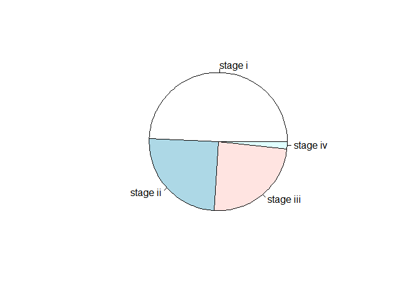

    #Only keep rows that do not include NA
    LIHC.clinical.path_stage <- LIHC.clinical.path_stage[complete.cases(LIHC.clinical.path_stage),]
    dim(LIHC.clinical.path_stage)

    ## [1] 355   2

We can see that about half of the patients are Stage I, the other half
comprising of Stage II and III, and a small number of Stage IV. There
are 355 patients with known pathological stages, which means 22 patients
will be excluded due to not having a stage associated.

## Aligning Dataframes

The barcode naming in the RNA-seq dataframe slightly differs from the
clinical dataframe, so steps must be taken to align them and ensure
there is only one sample per patient and that both dataframes contain
the same patients.

    # Example
    LIHC.rnaseq[1,'bcr_patient_barcode']

    ## [1] TCGA-2V-A95S-01A-11R-A37K-07
    ## 423 Levels: TCGA-2V-A95S-01A-11R-A37K-07 ... TCGA-ZS-A9CG-01A-11R-A37K-07

    # Rename patient barcodes to the same format as the clinical dataframe
    LIHC.rnaseq[,'bcr_patient_barcode'] <- sapply(LIHC.rnaseq[,'bcr_patient_barcode'], function(x) paste(strsplit(tolower(LIHC.rnaseq$bcr_patient_barcode[x]), "-")[[1]][1:3],collapse="-"))
    # Renamed example
    LIHC.rnaseq[1,'bcr_patient_barcode']

    ## [1] "tcga-2v-a95s"

    # Keep only rows where barcode matches between clinical and rnaseq
    LIHC.rnaseq <- LIHC.rnaseq[LIHC.rnaseq$bcr_patient_barcode %in% LIHC.clinical.path_stage$barcode, ]
    LIHC.rnaseq <- LIHC.rnaseq[!duplicated(LIHC.rnaseq['bcr_patient_barcode']),]

    LIHC.clinical.path_stage <- LIHC.clinical.path_stage[LIHC.clinical.path_stage$barcode %in% LIHC.rnaseq$bcr_patient_barcode, ]

    dim(LIHC.clinical.path_stage)

    ## [1] 349   2

    dim(LIHC.rnaseq)

    ## [1]   349 20532

    sum(LIHC.clinical.path_stage$barcode %in% LIHC.rnaseq$bcr_patient_barcode, na.rm = TRUE)

    ## [1] 349

After aligning the two dataframes, we will be analyzing 349 patients in
total, with the following breakdown for distribution of pathological
stages.

    table(LIHC.clinical.path_stage$stage)

    ## 
    ##   stage i  stage ii stage iii  stage iv 
    ##       171        87        85         6

    pie(table(LIHC.clinical.path_stage$stage))

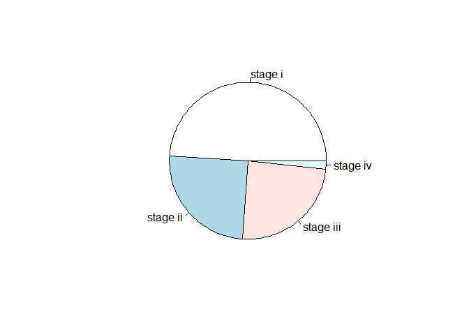

    # Renaming rows to be barcode name and removing barcode columns
    rownames(LIHC.rnaseq) <- LIHC.rnaseq$bcr_patient_barcode
    LIHC.rnaseq <- LIHC.rnaseq[,-1]
    # Adjusting LIHC.rnaseq so rows are genes and columns are patients
    LIHC.rnaseq <- t(LIHC.rnaseq)

## RNAseq Filtering

There are a total of 20,532 genes that are included in the data, but not
all of the genes will be informative for analysis. The data provided by
the RTCGA.rnaseq library is normalized, but it may still include genes
with low expression. To account for this, we will be filtering to only
include 10,000 genes with the most variance. While this may introduce
bias in the analyses, it with reduce the computational burden by
reducing the total number of genes as well as focusing on the genes that
may be more interesting or significant.

    ## Filtering genes
    # Use Median Absolute Deviation to calculate variance
    LIHC.rnaseq.mad <- apply(LIHC.rnaseq, 1,mad)
    # Identify the 10,000 genes with the most variance
    LIHC.rnaseq.mad_10000 <- order(-LIHC.rnaseq.mad)[1:10000]
    # Filter LIHC.rnaseq to only include these genes
    LIHC.rnaseq <- LIHC.rnaseq[LIHC.rnaseq.mad_10000,]
    dim(LIHC.rnaseq)

    ## [1] 10000   349

## T-test

The following t-test compares patients with Stage I and II.

    stagei <- LIHC.clinical.path_stage$stage=="stage i"
    stageii <- LIHC.clinical.path_stage$stage=="stage ii"

    #Calculate p-values using t-test
    stageivii_pvals <- apply(LIHC.rnaseq,1,function(x)t.test(x[stagei],x[stageii])$p.value)
    hist(stageivii_pvals)

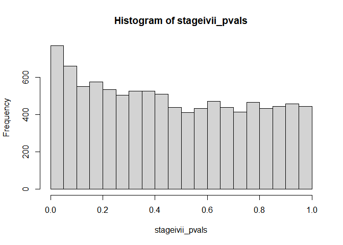

    stageivii_pvals_df <- data.frame(stageivii_pvals[stageivii_pvals<0.05])
    #Remove NA values
    stageivii_pvals_df <- data.frame(stageivii_pvals_df[complete.cases(stageivii_pvals_df),])
    dim(stageivii_pvals_df)

    ## [1] 768   1

Out of the 10,000 genes, only 768 have a p-value under 0.05 using a
t-test. When looking at the histogram, we see that there is a decently
equal distribution of p-values throughout all of the genes.

## Benjamini-Hochberg

    #Perform Benjamini-Hochberg
    stageivii_pvals_fdrs <- p.adjust(stageivii_pvals, method="BH")
    hist(stageivii_pvals_fdrs)

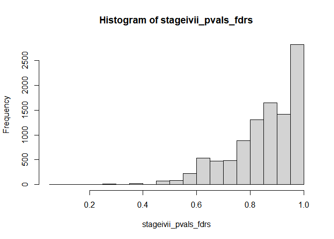

    stageivii_pvals_fdrs_sig <- data.frame(stageivii_pvals_fdrs[stageivii_pvals_fdrs<0.05])
    #Remove NA values
    stageivii_pvals_fdrs_sig <- data.frame(stageivii_pvals_fdrs_sig[complete.cases(stageivii_pvals_fdrs_sig),])
    dim(stageivii_pvals_fdrs_sig)

    ## [1] 0 1

Using the Benjamini-Hochberg and adjusting for the false-discovery rate,
we see that there are no genes with a significant result. The histogram
also shows that many of the genes have very high p-values after the
adjustment.

    library(DT)
    stageivii_pvals_tbl <- data.frame(stageivii_pvals, stageivii_pvals_fdrs)
    DT::datatable(stageivii_pvals_tbl)

    ## Warning in instance$preRenderHook(instance): It seems your data is too big for
    ## client-side DataTables. You may consider server-side processing:
    ## https://rstudio.github.io/DT/server.html

<div class="datatables html-widget html-fill-item" id="htmlwidget-1b4ff99564eb6e8884a5" style="width:100%;height:auto;"></div>
<script type="application/json" data-for="htmlwidget-1b4ff99564eb6e8884a5">{"x":{"filter":"none","vertical":false,"data":[["ALB|213","SERPINA1|5265","HP|3240","FGA|2243","C3|718","APOA2|336","APOA1|335","FGB|2244","FTL|2512","FGG|2266","TF|7018","VTN|7448","AMBP|259","RBP4|5950","ORM1|5004","C4A|720","ALDOB|229","APOE|348","APOC3|345","APOH|350","APOC1|341","CFB|629","HRG|3273","CLU|1191","SERPINA3|12","APOB|338","AHSG|197","SERPINC1|462","A2M|2","FN1|2335","HPX|3263","CES1|1066","TTR|7276","CYP2E1|1571","EPHX1|2052","ITIH4|3700","GC|2638","ADH1B|125","SERPING1|710","CPS1|1373","APOC2|344","SEPP1|6414","KNG1|3827","C1S|716","A1BG|1","ITIH2|3698","SCD|6319","AGT|183","ITIH1|3697","HPD|3242","AGXT|189","CP|1356","CFH|3075","FGL1|2267","B2M|567","ITIH3|3699","FABP1|2168","TPT1|7178","PLG|5340","GAPDH|2597","C4BPA|722","ORM2|5005","HMGCS2|3158","F2|2147","HLA-B|3106","C1R|715","P4HB|5034","SERPINF2|5345","EEF1A1|1915","APCS|325","FTH1|2495","CD74|972","CTSD|1509","ACTB|60","GSTA1|2938","ALDH1A1|216","GATM|2628","AZGP1|563","PEBP1|5037","PCK1|5105","MAT1A|4143","ALDH2|217","AOX1|316","RPL8|6132","TMEM176B|28959","ADH4|127","DHCR24|1718","ACTG1|71","HLA-A|3105","SQSTM1|8878","IGFBP4|3487","IGFBP1|3484","BAAT|570","CFHR1|3078","TAT|6898","CRP|1401","HLA-C|3107","UGT2B4|7363","CALR|811","TMBIM6|7009","ADH1C|126","SERPIND1|3053","IFITM3|10410","CTSB|1508","PAH|5053","AKR1C1|1645","TFR2|7036","COL18A1|80781","DCXR|51181","LBP|3929","EEF2|1938","CES2|8824","ADH1A|124","ATF5|22809","SULT2A1|6822","RPL3|6122","GPX3|2878","CYP27A1|1593","SERPINF1|5176","ALDH1L1|10840","GLUL|2752","SLC27A5|10998","HSP90AB1|3326","RARRES2|5919","UBC|7316","C2|717","UBB|7314","AQP9|366","HSD17B6|8630","SLC38A3|10991","ASS1|445","INSIG1|3638","HSP90B1|7184","MGST1|4257","CYP2C9|1559","ASGR2|433","RPLP0|6175","TMEM176A|55365","SOD2|6648","G6PC|2538","RPL30|6156","CYP2A6|1548","ST6GAL1|6480","FASN|2194","ANG|283","HSPA1A|3303","PRAP1|118471","RPLP1|6176","SERPINA5|5104","KRT8|3856","F12|2161","ACSL1|2180","CYP4A11|1579","SERPINA6|866","SOD1|6647","SDC1|6382","RPS18|6222","RPS6|6194","PCK2|5106","PSAP|5660","IL32|9235","ANPEP|290","PABPC1|26986","ENO1|2023","CPB2|1361","HSPA5|3309","LRG1|116844","RPS20|6224","HPR|3250","UGT1A6|54578","IGFBP2|3485","UBD|10537","LGALS3BP|3959","POR|5447","RHOB|388","CD14|929","UGT2B15|7366","ARG1|383","NNMT|4837","ECHS1|1892","SLC2A2|6514","FMO3|2328","TMSL3|7117","RPS4X|6191","HABP2|3026","CFHR2|3080","RPL13|6137","METTL7A|25840","CYB5A|1528","SCP2|6342","PTMS|5763","C5|727","GLUD1|2746","HSPB1|3315","TM4SF4|7104","CYP8B1|1582","KRT18|3875","ASGR1|432","ADI1|55256","HSPA8|3312","CD81|975","RPL4|6124","RPL19|6143","PPIB|5479","PON1|5444","CFI|3426","LASS2|29956","C8B|732","AKR1C2|1646","HGD|3081","ALDH4A1|8659","SLC22A7|10864","CYP2C8|1558","FURIN|5045","CYP2D6|1565","AKR1C3|8644","GNB2L1|10399","RPS11|6205","HSP90AA1|3320","FTCD|10841","ABAT|18","LDHA|3939","SLC13A5|284111","RPS19|6223","BHMT|635","GPC3|2719","ACSM2B|348158","RPL37|6167","MT2A|4502","RPL32|6161","PTP4A1|7803","F5|2153","LRP1|4035","CANX|821","C6|729","RPS24|6229","ACADVL|37","LGALS4|3960","PRDX6|9588","ACSM2A|123876","RPL28|6158","PIPOX|51268","GPX2|2877","RPS9|6203","MYH9|4627","PGRMC1|10857","UGT2B7|7364","REEP6|92840","RPL37A|6168","SAA4|6291","ANGPTL3|27329","RPS14|6208","GNAS|2778","RPS16|6217","CAT|847","APP|351","HRSP12|10247","HSD11B1|3290","RPS8|6202","GOT1|2805","APOM|55937","HPN|3249","TDO2|6999","TST|7263","ERRFI1|54206","TMSB10|9168","SLC38A4|55089","TIMP1|7076","FBP1|2203","DPYS|1807","RRBP1|6238","TUBB|203068","PRG4|10216","UGT2B10|7365","RPS12|6206","RPS17|6218","GRHPR|9380","F9|2158","EEF1D|1936","RPS3|6188","TSKU|25987","APLP2|334","ACAA2|10449","RPL18|6141","APOA5|116519","RPL13A|23521","SHMT1|6470","AKR1C4|1109","RPL5|6125","H19|283120","RPL10|6134","APOC4|346","SLC39A14|23516","ACAT1|38","XBP1|7494","CEBPA|1050","BGN|633","STOM|2040","ETFB|2109","RPL11|6135","PLIN2|123","SERPINA4|5267","SLC22A3|6581","AADAC|13","SERPINA7|6906","SDS|10993","PHYH|5264","SEPHS2|22928","PROC|5624","C8A|731","CD63|967","HLA-DRA|3122","GAMT|2593","EHHADH|1962","SERF2|10169","SDC4|6385","RPL31|6160","PDIA3|2923","BHMT2|23743","RPS23|6228","ALAS1|211","SPARC|6678","MST1|4485","PTGR1|22949","SAA1|6288","TAGLN2|8407","NUCB1|4924","ATP1A1|476","UGP2|7360","ACSL4|2182","KHK|3795","COL1A1|1277","RPL7A|6130","STARD10|10809","TUBA1B|10376","GJB1|2705","RPL41|6171","RPL23|9349","RPL15|6138","UGT1A1|54658","ADH6|130","RPS5|6193","CREB3L3|84699","AHNAK|79026","EEF1G|1937","RPL27|6155","MTHFD1|4522","CDHR5|53841","RPL27A|6157","PRDX1|5052","CPN2|1370","SORD|6652","ABHD2|11057","TGM2|7052","ANXA2|302","TXNIP|10628","CLDN1|9076","ECH1|1891","CBS|875","CYP3A4|1576","SPTBN1|6711","NEAT1|283131","RPLP2|6181","SLCO2B1|11309","ALDH3A2|224","ATP5B|506","EFNA1|1942","GRINA|2907","DUSP1|1843","CFL1|1072","CBR1|873","GOT2|2806","HSPD1|3329","ITM2B|9445","ACAA1|30","HAO1|54363","HSD17B4|3295","BSG|682","SDC2|6383","ACADSB|36","C20orf3|57136","RPL29|6159","FADS2|9415","PFN1|5216","CTSZ|1522","LAMP1|3916","GPT2|84706","LYZ|4069","CCT3|7203","EIF1|10209","YWHAZ|7534","C8G|733","PDIA4|9601","CHI3L1|1116","COL3A1|1281","AKR1B10|57016","C4BPB|725","NACA|4666","RDH16|8608","TMPRSS6|164656","MASP2|10747","ALDOA|226","GPAM|57678","IDH1|3417","SC4MOL|6307","IFITM2|10581","RPS2|6187","UGT1A4|54657","LMNA|4000","NUPR1|26471","CTSA|5476","OSGIN1|29948","PC|5091","MYL6|4637","UGT1A9|54600","HLA-E|3133","UPB1|51733","CST3|1471","RPL35|11224","ARF1|375","SELENBP1|8991","C9|735","SAT1|6303","CDO1|1036","SCARB1|949","MYO1B|4430","RPL26|6154","FMO5|2330","MPST|4357","SERPINA10|51156","ETNK2|55224","PTMA|5757","SEC14L2|23541","DGAT2|84649","GPX1|2876","IDH2|3418","FDPS|2224","LAMP2|3920","COX4I1|1327","DHRS3|9249","RPL14|9045","ASL|435","ATP5A1|498","HFE2|148738","TMEM123|114908","RNASE4|6038","MIF|4282","TXN|7295","EIF3CL|728689","SLC27A2|11001","PTPRF|5792","RPL24|6152","F10|2159","UBA52|7311","ADAM6|8755","PCSK6|5046","VIM|7431","TFPI|7035","AFM|173","GPI|2821","CREG1|8804","FCGRT|2217","HDLBP|3069","RPL10A|4736","BCAP31|10134","MLXIPL|51085","ACY1|95","EBP|10682","SLC10A1|6554","TKT|7086","OS9|10956","GSTO1|9446","HSPA9|3313","RPL12|6136","MTTP|4547","HMGCS1|3157","ITGB1|3688","MAOB|4129","SSR2|6746","BST2|684","SEC61A1|29927","CMBL|134147","SLCO1B1|10599","UQCRQ|27089","H1F0|3005","SLC7A2|6542","PGLYRP2|114770","MCL1|4170","OAZ1|4946","PKLR|5313","SLC38A2|54407","ACOX1|51","EIF4A1|1973","CDH1|999","SERPINA11|256394","APOL1|8542","RPS15A|6210","COL4A2|1284","RPL34|6164","RPS10|6204","GRN|2896","DDT|1652","ORMDL3|94103","NME2|4831","EIF4G2|1982","LEPR|3953","IGFBP3|3486","CFHR5|81494","SERINC2|347735","C5orf33|133686","BDH1|622","LPIN2|9663","C10orf10|11067","ATP1B1|481","DECR1|1666","GLYCTK|132158","RPS21|6227","RPL36|25873","VNN1|8876","PSMD4|5710","IGF2|3481","NAMPT|10135","PLXNB2|23654","OAF|220323","NCOA4|8031","PLGLB2|5342","SLC22A1|6580","PSMB4|5692","COL4A1|1282","ANXA6|309","ALAD|210","EIF5A|1984","PROS1|5627","CD151|977","ERGIC1|57222","TGFBI|7045","HINT1|3094","GPX4|2879","PDIA6|10130","SLC9A3R2|9351","NIPSNAP1|8508","RPL38|6169","H6PD|9563","HMGCL|3155","RGN|9104","FAU|2197","F11R|50848","SLC40A1|30061","HDGF|3068","GSTK1|373156","COL1A2|1278","CD59|966","TGOLN2|10618","MLEC|9761","TAPBP|6892","SLC39A5|283375","FAH|2184","HAGH|3029","ETS2|2114","SPON2|10417","DHCR7|1717","IGFBP7|3490","HULC|728655","NFE2L1|4779","RPS25|6230","RPL35A|6165","ABCB4|5244","RPS4Y1|6192","LY6E|4061","RPL6|6128","ARL6IP1|23204","DSP|1832","CYP3A5|1577","NDRG2|57447","EIF4G1|1981","CIDEB|27141","SREBF1|6720","METTL7B|196410","DIO1|1733","ZFAND5|7763","MYL12B|103910","ATF4|468","NDUFB9|4715","LSR|51599","LMAN2|10960","RPN2|6185","RPSAP58|388524","ID2|3398","MGAT4B|11282","HAAO|23498","OTC|5009","SLC37A4|2542","DHTKD1|55526","CALD1|800","ANGPTL4|51129","RPS27A|6233","HNRNPA2B1|3181","UQCRB|7381","CSDE1|7812","F7|2155","PLEC|5339","CYP4F2|8529","PCBP2|5094","PON3|5446","PRDX3|10935","SLC25A5|292","SERPINE1|5054","AKR1A1|10327","SURF4|6836","KIAA0664|23277","KDELR2|11014","ZFP36L1|677","TM7SF2|7108","EDF1|8721","SPP1|6696","UQCRC1|7384","STAT1|6772","PECI|10455","PDK4|5166","RTN4|57142","HNF4A|3172","PGM1|5236","CHP|11261","AHCY|191","COX6C|1345","CD24|100133941","SLC25A3|5250","NPM1|4869","SCCPDH|51097","CRYL1|51084","RXRA|6256","RPS7|6201","ALDH7A1|501","MSN|4478","H3F3B|3021","SDHA|6389","TPI1|7167","SULT1A1|6817","EIF3E|3646","MVP|9961","AGPAT2|10555","CYB5R3|1727","MAOA|4128","HYOU1|10525","MDK|4192","GHITM|27069","GPAA1|8733","GSN|2934","NUCKS1|64710","GANAB|23193","LASP1|3927","HADHA|3030","CYP51A1|1595","FETUB|26998","ECHDC2|55268","PLOD1|5351","CDKN1A|1026","ST3GAL1|6482","ACSL5|51703","TMED9|54732","TP53INP1|94241","IVD|3712","HSD17B2|3294","OGDHL|55753","GADD45B|4616","PRKCSH|5589","TM4SF5|9032","FH|2271","EPAS1|2034","BCAM|4059","SLPI|6590","PGK1|5230","STEAP3|55240","MGLL|11343","TTC38|55020","BLVRB|645","ADAR|103","COL6A2|1292","SLC43A3|29015","NDRG1|10397","CLTC|1213","LMAN1|3998","GABARAP|11337","BRP44|25874","SLC6A1|6529","SAA2|6289","AKR7A3|22977","IFI30|10437","ANXA5|308","RORC|6097","RPS13|6207","GSTT1|2952","TMEM66|51669","FGFR4|2264","LPGAT1|9926","BHLHE40|8553","SRRM2|23524","YWHAE|7531","ATP2A2|488","IQGAP2|10788","MYL12A|10627","DDX5|1655","SLC25A6|293","DBI|1622","ABCC2|1244","PIGR|5284","GLTSCR2|29997","SERINC1|57515","HTRA1|5654","RETSAT|54884","DAK|26007","PLS3|5358","ACTN4|81","ATP5E|514","SLC9A3R1|9368","SLC25A25|114789","MDH2|4191","CPT1A|1374","HSD17B11|51170","ABCC3|8714","BOK|666","COX6B1|1340","GSTA2|2939","QPRT|23475","PBLD|64081","ABHD14B|84836","TXNDC5|81567","PNPO|55163","TRAM1|23471","DCAF11|80344","PCBD1|5092","CLIC1|1192","NID1|4811","RPSA|3921","KLF9|687","RPS29|6235","ATP5G3|518","GPT|2875","HAL|3034","QDPR|5860","UGDH|7358","CRYZ|1429","CNDP2|55748","GLYATL1|92292","CYP4F3|4051","F13B|2165","PUF60|22827","EIF4EBP2|1979","EPHX2|2053","HNRNPU|3192","EIF4B|1975","NNT|23530","PQLC1|80148","SCARB2|950","S100A10|6281","TMEM59|9528","NCL|4691","ALDH8A1|64577","ALDH1B1|219","FLNA|2316","TUBB2C|10383","AES|166","C20orf56|140828","RPN1|6184","PVRL2|5819","LEAP2|116842","LAMB2|3913","CPD|1362","ACO1|48","ACSM5|54988","SIK1|150094","ETFA|2108","HADH|3033","LECT2|3950","C10orf58|84293","ALDH5A1|7915","LIPC|3990","CAPNS1|826","SC5DL|6309","HYAL1|3373","GALNT2|2590","SHMT2|6472","ATRN|8455","SUN2|25777","BTF3|689","ACOX2|8309","BTG1|694","RHOC|389","TALDO1|6888","PEPD|5184","SNTB1|6641","GGH|8836","NCRNA00188|125144","GUK1|2987","ARHGDIA|396","C1QA|712","CD164|8763","CTNNA1|1495","HLA-DPA1|3113","RNF213|57674","TUFM|7284","HADHB|3032","MAGED1|9500","TMEM56|148534","JUN|3725","TPP1|1200","HSPE1|3336","SAT2|112483","SLC38A10|124565","ARHGEF12|23365","C2orf72|257407","NONO|4841","FKBP8|23770","HLA-DRB1|3123","RBP5|83758","LDHD|197257","C1orf43|25912","ABCC6|368","COMT|1312","SEPT9|10801","ZFP36|7538","COL6A1|1291","FAT1|2195","SLC25A15|10166","ELF3|1999","DMGDH|29958","SPP2|6694","EGR1|1958","COX7C|1350","HSPG2|3339","ADH5|128","DIAPH1|1729","TOMM20|9804","TMED10|10972","TIMP3|7078","CNBP|7555","TPM3|7170","CD302|9936","ANXA4|307","NDUFA4|4697","PNKD|25953","SLC39A7|7922","CCND1|595","CYP4F11|57834","RPL17|6139","VKORC1|79001","ERP29|10961","GLYAT|10249","C1QB|713","PARK7|11315","CDC42EP1|11135","SRPR|6734","EEF1A1P9|441032","PERP|64065","STAT3|6774","CCL16|6360","SREBF2|6721","LAPTM4A|9741","IRF2BP2|359948","MBL2|4153","CUTA|51596","MLF2|8079","ASPH|444","SPTAN1|6709","RPS15|6209","C21orf33|8209","C22orf13|83606","ITPR2|3709","AGRN|375790","FKBP5|2289","C3P1|388503","INHBE|83729","LIME1|54923","SLC25A10|1468","HM13|81502","TMED2|10959","ATP5G2|517","C1RL|51279","CTSF|8722","KLF6|1316","ERBB3|2065","SLC25A1|6576","CYC1|1537","SUCLG2|8801","PPIA|5478","AMFR|267","CD46|4179","LAMC1|3915","JUND|3727","TMEM205|374882","YBX1|4904","TLN1|7094","VDAC1|7416","HLF|3131","OSTalpha|200931","TNIP1|10318","TTC39C|125488","NDUFV1|4723","SNRPB|6628","AMACR|23600","LAP3|51056","PCYT2|5833","CSRP1|1465","MT1X|4501","C6orf106|64771","PTGES3|10728","PRDX5|25824","PSME1|5720","FLNB|2317","SLC43A1|8501","PPDPF|79144","SLC35C1|55343","PYGL|5836","EIF3L|51386","SIGMAR1|10280","HPGD|3248","CTSL1|1514","SQLE|6713","C1orf85|112770","LAPTM4B|55353","ACADM|34","PSME2|5721","THBS1|7057","ACTA2|59","JUNB|3726","TOB1|10140","ALDH9A1|223","GTF2IP1|2970","PINK1|65018","B4GALT1|2683","KRTCAP2|200185","STBD1|8987","CYP2B6|1555","C1orf115|79762","PCBP1|5093","GAA|2548","APOL6|80830","CRAT|1384","CTSH|1512","SHC1|6464","TM9SF2|9375","CHCHD10|400916","PRDX2|7001","HNRNPA1|3178","HSD17B10|3028","ATP6V0E2|155066","CYP2C18|1562","EIF5|1983","ARSE|415","SARDH|1757","EIF4A2|1974","FADS1|3992","PHGDH|26227","IL13RA1|3597","APH1A|51107","HLA-F|3134","SORL1|6653","LRP5|4041","DDOST|1650","COPA|1314","HNRNPK|3190","PON2|5445","KLKB1|3818","TXNRD1|7296","IDI1|3422","SLC47A1|55244","GALK1|2584","ELOVL2|54898","SLC25A39|51629","PSAT1|29968","SMG5|23381","EIF3A|8661","GOLM1|51280","DNAJA1|3301","RGS5|8490","C14orf68|283600","BAT3|7917","PDLIM1|9124","SLC22A18|5002","DEFB1|1672","PRODH2|58510","CD68|968","NAPRT1|93100","EIF6|3692","POLD4|57804","H3F3A|3020","RHOA|387","CALM2|805","HIGD1A|25994","CALM3|808","CEBPD|1052","HNRNPC|3183","ATOX1|475","CMPK1|51727","PPAP2B|8613","HERPUD1|9709","PECR|55825","MAN1A1|4121","CD99|4267","EEF1B2|1933","HSDL2|84263","GABARAPL1|23710","ATP13A3|79572","ISOC2|79763","TCEA3|6920","POLDIP2|26073","VCP|7415","HMGN2|3151","KIF1C|10749","IGF2R|3482","HLA-H|3136","GGCX|2677","PRKAR1A|5573","LOC96610|96610","PCYOX1|51449","CYP3A7|1551","CEBPB|1051","CTNND1|1500","RAMP1|10267","IRS2|8660","ZYX|7791","LITAF|9516","PPP1R3B|79660","NR1I3|9970","DAP|1611","GPRC5C|55890","CSTB|1476","JTB|10899","SSR4|6748","SEPX1|51734","SDHB|6390","PDXDC1|23042","ICAM1|3383","PPP1R1A|5502","SDCBP|6386","ERBB2|2064","TPM1|7168","HIST1H1C|3006","CGN|57530","DDX17|10521","RAD23B|5887","COX6A1|1337","ALDH6A1|4329","SLC25A13|10165","NDUFA13|51079","PIK3AP1|118788","PFKL|5211","MTDH|92140","SLC2A4RG|56731","EIF3B|8662","TYMP|1890","PCCB|5096","MTSS1|9788","ABCA6|23460","ATP5H|10476","RANGAP1|5905","RNF187|149603","PRDX4|10549","MUT|4594","NAP1L1|4673","VPS28|51160","MYH14|79784","GUSB|2990","RPL22|6146","SEL1L|6400","SLC39A1|27173","CALM1|801","ENG|2022","UQCRC2|7385","CTNNB1|1499","TM4SF1|4071","CTSS|1520","NDUFV2|4729","SND1|27044","GPD1|2819","AK3|50808","HLA-DPB1|3115","PPP2R1A|5518","TPM4|7171","ADIPOR2|79602","EI24|9538","VAT1|10493","PTPLAD1|51495","LOC647979|647979","TIMP2|7077","TAGLN|6876","RDH11|51109","GLDC|2731","RPL23A|6147","ATP5C1|509","CFHR3|10878","MIA3|375056","ENSA|2029","IFI6|2537","MCCC2|64087","ARPC1B|10095","AKR1D1|6718","NDUFS2|4720","NAPA|8775","AIG1|51390","S100A16|140576","SLC31A1|1317","PKM2|5315","F11|2160","MAZ|4150","JUP|3728","GNAI2|2771","CABC1|56997","SLC29A1|2030","ST13|6767","TNFSF10|8743","ITGB5|3693","TUBB2A|7280","ATP5J|522","EIF3H|8667","ACACB|32","RAD21|5885","PLVAP|83483","SRP9|6726","TMEM45B|120224","BNIP3|664","CYP2J2|1573","LARP1|23367","ECHDC3|79746","MGAT1|4245","AIFM1|9131","ZNHIT1|10467","TRIB1|10221","NDST1|3340","RPL36AL|6166","TSC22D1|8848","EPN1|29924","PXMP2|5827","TMBIM1|64114","PPIF|10105","PARP1|142","C1QC|714","GBA|2629","TMEM97|27346","TNS3|64759","MRFAP1|93621","C5orf4|10826","NDUFC2|4718","DECR2|26063","CYP4V2|285440","ALDOC|230","TSC22D3|1831","DST|667","SLC16A2|6567","GSDMD|79792","ACTN1|87","NDFIP1|80762","ACADS|35","TRIM28|10155","SRXN1|140809","LPCAT3|10162","MTHFS|10588","AARS|16","SLC4A2|6522","FGFR2|2263","WBP2|23558","DDAH1|23576","RBM3|5935","GCLC|2729","PIK3R1|5295","SPINK1|6690","NGFRAP1|27018","SSR1|6745","VEGFA|7422","C19orf63|284361","TMCO1|54499","HSD3B7|80270","KLF15|28999","ARPC5|10092","CGNL1|84952","SDF4|51150","LSS|4047","FLOT1|10211","DAZAP2|9802","CSNK2B|1460","HNMT|3176","COX5B|1329","WWP1|11059","DHRS7|51635","COPE|11316","ARL6IP4|51329","CKAP4|10970","DCI|1632","HEXB|3074","FKBP4|2288","MDH1|4190","GGT1|2678","DDIT4|54541","NRBP2|340371","TSPAN8|7103","INSR|3643","PTTG1IP|754","MYLK|4638","COX7B|1349","IRAK1|3654","ANXA2P2|304","LOC55908|55908","PFDN5|5204","ESPN|83715","SYNPO|11346","APOF|319","SORBS2|8470","LDLR|3949","PKN1|5585","C6orf145|221749","STAU1|6780","HIBADH|11112","PSMB1|5689","SDHC|6391","XRCC6|2547","DPP7|29952","WDR1|9948","FUS|2521","CCT5|22948","CPT2|1376","ATP6V0B|533","CNN3|1266","SYT7|9066","FAM83H|286077","SDHD|6392","PHB|5245","PSMB3|5691","PDZK1|5174","BAT2|7916","MT1E|4493","PPP2R1B|5519","MFN2|9927","MET|4233","AZIN1|51582","FAM8A1|51439","ATP5O|539","EIF3D|8664","ERGIC3|51614","ATP6V0E1|8992","DDX3X|1654","BRI3|25798","TRAP1|10131","DAG1|1605","ARPC3|10094","DYNLL1|8655","NFKBIA|4792","VWA1|64856","MAT2A|4144","TMEM2|23670","LCP1|3936","MGST2|4258","UBA1|7317","ITGA5|3678","MRPL24|79590","SEC11C|90701","LAPTM5|7805","DPP4|1803","CMTM6|54918","PHB2|11331","GNS|2799","EIF3I|8668","GNB1|2782","HNRNPA3|220988","LONP2|83752","RER1|11079","NQO2|4835","XDH|7498","AEBP1|165","CLPTM1|1209","SUB1|10923","ELL2|22936","GBP2|2634","NEU1|4758","IGSF8|93185","ILF2|3608","SYVN1|84447","PLXNB1|5364","ATP5J2|9551","FBXW5|54461","GDF15|9518","ANO1|55107","PTBP1|5725","AGPAT3|56894","ARF4|378","SLC16A1|6566","TOMM6|100188893","PPARA|5465","PSMB8|5696","SHISA5|51246","PLOD3|8985","APOA1BP|128240","FLOT2|2319","IFI27|3429","REEP5|7905","HIST1H2AC|8334","MASP1|5648","UBE2D3|7323","LGALS1|3956","NDUFA1|4694","GNMT|27232","SERBP1|26135","SNRNP200|23020","SERP1|27230","UGT3A1|133688","EZR|7430","STIP1|10963","HSD17B13|345275","POLR2E|5434","AURKAIP1|54998","H2AFZ|3015","AQP3|360","OLFM2|93145","TPRG1L|127262","DAO|1610","OPTN|10133","MCFD2|90411","AGXT2L1|64850","CHCHD2|51142","CHPF|79586","SH3BGRL3|83442","PLD3|23646","AMDHD1|144193","IGFBP5|3488","GOLT1A|127845","SRP14|6727","SHFM1|7979","NBR1|4077","MTSS1L|92154","MAP4|4134","HTATIP2|10553","GNE|10020","RPL9|6133","DUSP6|1848","SCAMP3|10067","CRLS1|54675","DDTL|100037417","TMEM9|252839","GADD45G|10912","SLC12A7|10723","LRRC59|55379","ACMSD|130013","CDK5RAP3|80279","FGGY|55277","SLC6A12|6539","SLC25A18|83733","MANF|7873","CCT6A|908","MMP15|4324","NUDC|10726","TCEB2|6923","LTBP3|4054","QSOX1|5768","DYNC1H1|1778","FST|10468","C19orf10|56005","SEC61B|10952","KANK1|23189","ILF3|3609","MARCKS|4082","TUBA1C|84790","XRCC5|7520","BCL2L1|598","MTCH2|23788","TNFRSF1A|7132","P4HA1|5033","GOLPH3|64083","PPP2R4|5524","ACSS2|55902","C20orf24|55969","PEA15|8682","ZFP36L2|678","SLC25A42|284439","PEX19|5824","CARHSP1|23589","CYCS|54205","RNF130|55819","ROBO1|6091","BRD2|6046","GDI2|2665","CCT7|10574","BRP44L|51660","USP22|23326","KLC4|89953","RNF128|79589","STT3A|3703","SMOC1|64093","CAPN5|726","EXT1|2131","BZW1|9689","ELOVL5|60481","ATP6V0C|527","SAPS2|9701","C11orf54|28970","SEPW1|6415","VWF|7450","SLC46A3|283537","MYO18A|399687","ATP5D|513","PARP10|84875","PDIA3P|171423","MAGED2|10916","LGMN|5641","DHRS1|115817","PAPSS2|9060","FXYD1|5348","DCN|1634","SGK1|6446","CIRBP|1153","ANO6|196527","GADD45A|1647","NDUFA11|126328","FKBP1A|2280","GYS2|2998","MAPKAPK2|9261","PRPF8|10594","IL1R1|3554","SF3B1|23451","RAB17|64284","PER1|5187","NR0B2|8431","COX8A|1351","C20orf108|116151","KTN1|3895","TOLLIP|54472","CTGF|1490","ATPIF1|93974","GPR126|57211","DUS1L|64118","PGD|5226","IARS2|55699","FAM107B|83641","LIPA|3988","G0S2|50486","ATP2B2|491","LRPAP1|4043","NUMA1|4926","SIL1|64374","JAK1|3716","ATP6AP1|537","NPC1L1|29881","ABCB1|5243","DNAJB11|51726","ATP5I|521","HSPA1B|3304","AQP1|358","ANXA11|311","TNS1|7145","NCSTN|23385","SLC23A2|9962","TCP1|6950","USP9X|8239","ECE1|1889","SPATS2L|26010","SEC62|7095","RBCK1|10616","CAPN2|824","PSMA7|5688","BAT1|7919","ESYT1|23344","KLHDC3|116138","MOSC2|54996","EPS8L2|64787","COBLL1|22837","AP3D1|8943","TSPAN6|7105","AUP1|550","EIF3K|27335","SERPINH1|871","UBE2L6|9246","SKP1|6500","LAD1|3898","GAS6|2621","QARS|5859","SLC1A2|6506","WDR13|64743","DAP3|7818","CLTA|1211","SNRNP70|6625","MORF4L2|9643","MAL2|114569","ABLIM3|22885","EIF2S3|1968","PPA1|5464","GCDH|2639","IMPAD1|54928","SEC31A|22872","C19orf66|55337","PGAM1|5223","PIGT|51604","ITPK1|3705","RAN|5901","LGR4|55366","TMED5|50999","SSFA2|6744","NDUFB8|4714","IQSEC1|9922","CA2|760","TGFBR2|7048","SUCLG1|8802","OGDH|4967","CADM1|23705","SFXN1|94081","FIS1|51024","POLD2|5425","PPP1CA|5499","C19orf6|91304","GNB2|2783","TFRC|7037","PPP1R16A|84988","C10orf125|282969","FDFT1|2222","MYO1C|4641","SCRIB|23513","PSMD2|5708","DSTN|11034","SNRPN|6638","FBXO7|25793","CRTAP|10491","DDB1|1642","HIST1H2BK|85236","RPS6KA3|6197","REPIN1|29803","DHRS4|10901","NPLOC4|55666","FAM162A|26355","AP2M1|1173","RAC1|5879","OBSL1|23363","PRKDC|5591","CHMP2A|27243","FOS|2353","SDSL|113675","AFMID|125061","NDUFS5|4725","PBXIP1|57326","ACO2|50","SUMF2|25870","CTDSP2|10106","STAT6|6778","MYC|4609","ABCD3|5825","LTBR|4055","KDELR1|10945","PHLDA1|22822","NME4|4833","ADAM15|8751","HECTD1|25831","SLC35D1|23169","CTH|1491","ATP5L|10632","DNAJB9|4189","MCM7|4176","KIAA1522|57648","COX7A2|1347","TENC1|23371","TMEM30A|55754","SEMA4G|57715","SLC3A2|6520","CAST|831","FOXA3|3171","GAS5|60674","ACLY|47","PSMB7|5695","SYNGR2|9144","UBL5|59286","SLC17A9|63910","LRP10|26020","HMOX1|3162","MAP2K2|5605","CLPTM1L|81037","LRP3|4037","CDIPT|10423","SEC16B|89866","AHR|196","PRELID1|27166","GLO1|2739","ADIPOR1|51094","C16orf58|64755","UQCR11|10975","NOMO1|23420","ACAT2|39","CLCN7|1186","HAX1|10456","AKT1|207","NRP1|8829","RPS3A|6189","PPP2R5A|5525","PPARGC1A|10891","AK2|204","ARHGEF10L|55160","SNRPD2|6633","COPG|22820","PSMC3|5702","ANAPC11|51529","CDH2|1000","HGFAC|3083","ACAD11|84129","RHOU|58480","TCIRG1|10312","PLA2G16|11145","ABCA1|19","DNAJB1|3337","MAP3K11|4296","ENAH|55740","HDAC6|10013","HNRNPF|3185","NR2F6|2063","NME1|4830","PRPF6|24148","PCOLCE|5118","ACTR2|10097","ACOT1|641371","SET|6418","MID1IP1|58526","FNDC3A|22862","CRY2|1408","CCNG1|900","CHPT1|56994","GDA|9615","TMEM37|140738","C4orf3|401152","CAP1|10487","STMN1|3925","ARSD|414","MPDU1|9526","UBAP2L|9898","EIF3G|8666","GTF3A|2971","PNRC1|10957","PDLIM5|10611","TSPAN9|10867","MTUS1|57509","WNK1|65125","RAPH1|65059","AGFG2|3268","MRPL12|6182","RCN1|5954","C8orf55|51337","KCTD3|51133","BAT2L2|23215","HNRNPAB|3182","SFRS5|6430","CYP7A1|1581","HEXA|3073","BAIAP2|10458","DUSP23|54935","RAG1AP1|55974","PMVK|10654","PCSK9|255738","CD99L2|83692","SSR3|6747","RAB7A|7879","CCDC47|57003","NPC2|10577","TM7SF3|51768","INF2|64423","MMAB|326625","DUSP16|80824","IER2|9592","HMGB1|3146","GHR|2690","PPAP2A|8611","CTAGE5|4253","MAGT1|84061","SNX3|8724","PLOD2|5352","SETD7|80854","CXCL12|6387","NDUFB7|4713","PSMC5|5705","HNRNPH1|3187","HS6ST1|9394","COX5A|9377","CTSO|1519","SCAP|22937","KLB|152831","BCKDHA|593","SYBU|55638","LONP1|9361","RNASEK|440400","MACF1|23499","VARS|7407","RTN3|10313","C20orf30|29058","SEPT2|4735","LSM4|25804","TNFRSF12A|51330","NT5E|4907","MTCH1|23787","SNHG5|387066","KIAA2013|90231","C19orf43|79002","GALM|130589","TMEM219|124446","ESD|2098","TRIB3|57761","EIF2AK1|27102","YWHAQ|10971","MGMT|4255","CHD4|1108","RDX|5962","SPCS1|28972","CEACAM1|634","LAMB1|3912","TRIM55|84675","MST1P2|11209","SORBS3|10174","NFE2L2|4780","BSDC1|55108","SHC2|25759","CTSC|1075","ASPDH|554235","SIRPA|140885","EPB41L4B|54566","RMND5A|64795","RELN|5649","PDE4DIP|9659","BPHL|670","ADRM1|11047","PRKACA|5566","CTDSP1|58190","PA2G4|5036","PNPLA2|57104","HMGA1|3159","SEC16A|9919","ATP5G1|516","MCM3|4172","AS3MT|57412","CXCL16|58191","PEMT|10400","GPS1|2873","C14orf147|171546","SON|6651","UBR4|23352","DUSP3|1845","MAN2B1|4125","PLA2G2A|5320","DNAJC3|5611","KIAA0100|9703","DGAT1|8694","EMP2|2013","C14orf1|11161","TSTA3|7264","TNRC18|84629","AASS|10157","TMED7|51014","YIPF3|25844","RNH1|6050","CDC42|998","GCKR|2646","C6orf62|81688","SARS|6301","RAD23A|5886","PSMF1|9491","EPHB4|2050","ENPP2|5168","CAPN1|823","PMPCA|23203","IL1RN|3557","NDUFB11|54539","TBC1D9B|23061","IMPDH2|3615","HUWE1|10075","APRT|353","FAM50A|9130","GBE1|2632","CCT4|10575","YWHAG|7532","RDBP|7936","AGXT2|64902","TTYH3|80727","FUCA1|2517","EDEM1|9695","MAP4K4|9448","HNRNPUL1|11100","HMGCR|3156","FKBP2|2286","APEH|327","C9orf5|23731","RNPEPL1|57140","EML4|27436","POLR2L|5441","ACSS3|79611","PTPN11|5781","PJA2|9867","SH3BGRL2|83699","PTOV1|53635","ZC3H11A|9877","PSMA2|5683","THY1|7070","HSD17B12|51144","CLN3|1201","SMARCA1|6594","COL5A3|50509","ERLIN1|10613","BANF1|8815","NAT8|9027","TAP1|6890","PTRF|284119","GPC1|2817","DLST|1743","AKT2|208","ENTPD5|957","SIK2|23235","YWHAB|7529","UAP1|6675","SLC1A1|6505","CAV2|858","INHBC|3626","CPN1|1369","CEBPG|1054","VAMP8|8673","FBL|2091","PAICS|10606","CD36|948","LASS4|79603","OSBPL9|114883","FARP1|10160","FAM20C|56975","CD4|920","SPARCL1|8404","DCAF8|50717","CLDN2|9075","RALY|22913","FN3K|64122","CISD3|284106","C7|730","TNKS1BP1|85456","INTS1|26173","ODC1|4953","MPDZ|8777","SULF2|55959","ALCAM|214","PRCP|5547","ALPL|249","PSMC4|5704","FAM195B|348262","CNPY2|10330","H2AFY|9555","PLXND1|23129","MOSC1|64757","KPNB1|3837","UFC1|51506","DAD1|1603","PHC2|1912","OST4|100128731","ABCG8|64241","PSMB6|5694","MLLT4|4301","NDUFA2|4695","MMP14|4323","LOC255167|255167","CHDH|55349","FAM176A|84141","ONECUT2|9480","COPZ1|22818","FGFR3|2261","ITM2C|81618","TMEM106C|79022","GLS2|27165","PDXK|8566","AKAP1|8165","HNRNPL|3191","RND1|27289","MKNK2|2872","GALT|2592","C4orf34|201895","UBXN4|23190","PGRMC2|10424","LCAT|3931","MAF1|84232","MRPL41|64975","ROBLD3|28956","CDC37|11140","SLC28A1|9154","MRPL37|51253","IFITM1|8519","FUCA2|2519","SLC25A20|788","LRPPRC|10128","POLR2A|5430","ACSL3|2181","ENPEP|2028","CCPG1|9236","FNDC4|64838","ISG15|9636","DCAF6|55827","FAM120A|23196","PCTP|58488","KLF13|51621","FAM20A|54757","ERAP2|64167","HSF1|3297","NOTCH2|4853","ANP32B|10541","ENPP1|5167","CIB1|10519","RDH10|157506","PICALM|8301","DERL1|79139","TP53INP2|58476","TMEM120A|83862","PABPC4|8761","RHBDD2|57414","VIL1|7429","UBE2Q1|55585","FSTL1|11167","CCNL2|81669","CS|1431","KIAA1671|85379","CFL2|1073","SMPD1|6609","ENTPD6|955","MRPS21|54460","UQCR10|29796","HIPK2|28996","ATP5F1|515","TUBA4A|7277","ACOT13|55856","ARCN1|372","SIAH2|6478","RAB1A|5861","MYL9|10398","COL6A3|1293","IL4R|3566","CAMK2N1|55450","TM9SF3|56889","APOL2|23780","ATP6V1C1|528","SFRS3|6428","KCNJ8|3764","S100A6|6277","FAM128B|80097","YIF1A|10897","RPS27L|51065","UQCRFS1|7386","SHROOM1|134549","PSMB2|5690","SEC63|11231","TRMT112|51504","OCIAD1|54940","DGCR6L|85359","UROD|7389","PALLD|23022","HMGN1|3150","GFRA1|2674","STAB1|23166","STAT2|6773","DDC|1644","ACBD4|79777","HSPA4|3308","SLC27A3|11000","UQCRH|7388","LENG8|114823","ANKH|56172","NAGLU|4669","SH3BP4|23677","PRKAB2|5565","GLUD2|2747","ILVBL|10994","ZC3H7B|23264","GCAT|23464","BLOC1S1|2647","CNIH|10175","EPRS|2058","SMO|6608","TSPAN3|10099","OGFR|11054","IL6R|3570","AHCYL1|10768","STAP2|55620","SORT1|6272","PYGB|5834","SEC23A|10484","CAPZB|832","CCNI|10983","KARS|3735","RNF167|26001","NDUFB10|4716","BCL3|602","COMMD4|54939","GRLF1|2909","MPZL1|9019","ETFDH|2110","GOLGA4|2803","CAPRIN1|4076","GNPTG|84572","MYOM1|8736","CNPY3|10695","SF3B4|10262","KPNA2|3838","RBP1|5947","HMGB3|3149","CDK2AP2|10263","LMO7|4008","CLIC4|25932","NENF|29937","PREB|10113","EGLN1|54583","KANK2|25959","CLINT1|9685","NEU4|129807","SPRYD4|283377","AGPAT1|10554","AP2A1|160","COQ9|57017","TOM1|10043","FAM96A|84191","PDGFRB|5159","ACP2|53","SNRPC|6631","SIGIRR|59307","RCL1|10171","ANXA7|310","TMEM98|26022","CNN2|1265","MBD3|53615","ABCB6|10058","HNRNPM|4670","SHARPIN|81858","SELO|83642","ZBTB7B|51043","SLC17A2|10246","TPR|7175","ITGAV|3685","CTTN|2017","NDUFS6|4726","GLRX|2745","MATR3|9782","PSMD3|5709","BAIAP2L1|55971","SFPQ|6421","OCIAD2|132299","CDV3|55573","BLCAP|10904","SF3B2|10992","POFUT1|23509","LYNX1|66004","UROC1|131669","MBNL2|10150","IFNGR1|3459","TMEM195|392636","MGST3|4259","MYADM|91663","RAB14|51552","SF3B5|83443","HINT2|84681","EID1|23741","APOL3|80833","SIAE|54414","NDUFS1|4719","LBR|3930","OXA1L|5018","NDUFS7|374291","YARS|8565","NDUFS8|4728","RNF181|51255","SSU72|29101","SMARCA2|6595","AGPAT6|137964","CES4|51716","FAM129B|64855","OPLAH|26873","CDC42BPB|9578","ITGA1|3672","NR1I2|8856","CPSF1|29894","RFNG|5986","CALU|813","IRS1|3667","MVD|4597","COTL1|23406","ASAH1|427","CPEB4|80315","ADD1|118","BCHE|590","FASTK|10922","SLC46A1|113235","LHPP|64077","NFIA|4774","GTF2I|2969","ZGPAT|84619","ARPC1A|10552","BAT2L1|84726","TLE1|7088","PRNP|5621","SLC5A6|8884","TRIM8|81603","LTBP4|8425","ARHGDIB|397","GLRX5|51218","SH3D19|152503","SUMO2|6613","FLJ10357|55701","RARRES3|5920","HGS|9146","TXN2|25828","KLF10|7071","AGMAT|79814","FAM134A|79137","PSMA6|5687","C1orf198|84886","AFF4|27125","ACSF2|80221","DYNLRB1|83658","CUX2|23316","CCDC56|28958","MARCKSL1|65108","SEC13|6396","PSMD8|5714","RTKN|6242","FAHD1|81889","PCM1|5108","CHMP4B|128866","ARPC2|10109","RAB6A|5870","DGCR2|9993","GCHFR|2644","NIT2|56954","C5orf32|84418","TXNDC11|51061","SAP18|10284","GLTPD1|80772","ARPC4|10093","CSNK1D|1453","UGGT1|56886","ERLIN2|11160","TBCA|6902","ARF5|381","RASD1|51655","VAV2|7410","RBL2|5934","IPO5|3843","SPR|6697","RNF5|6048","MCM5|4174","TPMT|7172","RCAN1|1827","FOXN3|1112","EIF4H|7458","CFHR4|10877","SEPT6|23157","SLC17A4|10050","TTC3|7267","USF2|7392","ESRP2|80004","MRPS18B|28973","OSBP|5007","TPST2|8459","MRPL55|128308","GCH1|2643","C8orf4|56892","LARP4|113251","ACBD5|91452","ZBED1|9189","PARP14|54625","IBTK|25998","CYR61|3491","ST14|6768","ITGA6|3655","FNDC3B|64778","PHPT1|29085","SAPS1|22870","FAM102A|399665","ACP5|54","HAO2|51179","GARS|2617","GIPC1|10755","TRAF7|84231","COLEC11|78989","ALKBH5|54890","CCT8|10694","LAMA5|3911","TFG|10342","MTMR4|9110","HKDC1|80201","PSMB5|5693","PTDSS1|9791","KMO|8564","CD9|928","CYB5R1|51706","GPBP1L1|60313","TNFAIP2|7127","EBPL|84650","PANK1|53354","TXNRD2|10587","TOMM7|54543","NRD1|4898","RBM39|9584","TJP2|9414","GALE|2582","SAR1B|51128","RTP3|83597","PARP9|83666","DDRGK1|65992","ARRDC3|57561","DNAJB2|3300","TOP2A|7153","MAVS|57506","ROMO1|140823","RSL1D1|26156","PPM1G|5496","CXCL2|2920","PSMA5|5686","FAM171A1|221061","EWSR1|2130","TMEM63A|9725","HIF1A|3091","CRIP2|1397","IFNAR1|3454","WDR26|80232","GNG5|2787","TUG1|55000","GNPNAT1|64841","NOMO2|283820","TNFRSF1B|7133","RAB13|5872","ZDHHC9|51114","LMF2|91289","NCLN|56926","AKAP13|11214","ABHD12|26090","PPP1CB|5500","RAF1|5894","TSPAN33|340348","TAX1BP1|8887","PPP4C|5531","BTD|686","LRRFIP1|9208","CBARA1|10367","FAM38A|9780","NCOR2|9612","TRIP6|7205","APEX1|328","IPO7|10527","ATP6V0D1|9114","CPM|1368","TACC1|6867","CLDN7|1366","DLD|1738","RASSF4|83937","TIMM17A|10440","ABCA2|20","H1FX|8971","C1QBP|708","MRPL51|51258","FKBP11|51303","FAM195A|84331","OAT|4942","ARRDC2|27106","NARS|4677","TMEM140|55281","PLIN5|440503","RABEPK|10244","PAPOLA|10914","GBP1|2633","NDUFB2|4708","NADK|65220","CALCOCO2|10241","PSMA4|5685","MDM2|4193","MX1|4599","ERAP1|51752","PRCC|5546","ATP2B4|493","GBP7|388646","MRPL34|64981","ABCG5|64240","TBX3|6926","TSPYL1|7259","ATXN2L|11273","AMN|81693","PDK2|5164","PPP1R15B|84919","PGCP|10404","GLG1|2734","DRAP1|10589","SLC20A2|6575","PCCA|5095","NINJ1|4814","CD44|960","MAN2B2|23324","FAM168B|130074","NOP56|10528","HDHD3|81932","RAB1B|81876","GNPAT|8443","SPCS3|60559","SEC24D|9871","CHID1|66005","ERP44|23071","UBQLN4|56893","COPS6|10980","DDX3Y|8653","MRPS15|64960","PMF1|11243","PPP1R10|5514","FERMT2|10979","ZNF664|144348","SLC39A9|55334","IER3|8870","USMG5|84833","STIM1|6786","CPNE3|8895","GDI1|2664","HEBP1|50865","EFR3A|23167","VEGFB|7423","EIF3F|8665","PLEKHA6|22874","C19orf53|28974","CES3|23491","DHX9|1660","TAF15|8148","NOC2L|26155","NCKAP1|10787","SRPRB|58477","NFIL3|4783","AGTR1|185","FBXO31|79791","ADAMTSL4|54507","USO1|8615","DPYD|1806","C22orf9|23313","CORO1B|57175","LGALS3|3958","CLDN15|24146","FBXL5|26234","TMEM49|81671","ATP6V0A1|535","H2AFV|94239","PSMD13|5719","C6orf108|10591","RBM42|79171","RPL18A|6142","GPR125|166647","ATP6V1G1|9550","MMADHC|27249","BCKDK|10295","CPPED1|55313","ACOT12|134526","HIGD2A|192286","TAF7|6879","EIF3M|10480","FDX1|2230","CNP|1267","ATAD2|29028","CPE|1363","CYFIP2|26999","C8orf47|203111","INTS3|65123","UBXN6|80700","ALG3|10195","COASY|80347","TSPAN4|7106","HMOX2|3163","COL5A1|1289","MAN2A2|4122","NFKB2|4791","DDAH2|23564","CPNE1|8904","CASC4|113201","ASB13|79754","NDUFA6|4700","MRPL20|55052","ARSA|410","PDIA5|10954","ESRRA|2101","A1CF|29974","CLIP1|6249","SLC4A4|8671","IL6ST|3572","PVR|5817","SERINC3|10955","S100A11|6282","ARFGEF2|10564","NOTCH3|4854","MYO1E|4643","PABPN1|8106","CNOT1|23019","TMEM8A|58986","SNX9|51429","XPO1|7514","NDUFA10|4705","SLC25A30|253512","NHP2|55651","UBQLN1|29979","PSMC2|5701","LIPG|9388","RAB11B|9230","SDC3|9672","ZNF706|51123","TRIM26|7726","KIAA1191|57179","CACYBP|27101","PIK3R2|5296","C6orf48|50854","MGC70857|414919","MVK|4598","SCPEP1|59342","TAP2|6891","ARAP1|116985","LUM|4060","ST6GALNAC6|30815","GPNMB|10457","CDK4|1019","SLC2A10|81031","KIAA1161|57462","MRPL14|64928","SUPT5H|6829","MICAL3|57553","YWHAH|7533","TP53BP2|7159","SORBS1|10580","VAMP5|10791","TECR|9524","RAB5C|5878","PCNA|5111","SNRPD3|6634","IRF1|3659","POMP|51371","S100A13|6284","HLA-DMA|3108","IL17RB|55540","TMEM14C|51522","AKAP9|10142","LYPLA2|11313","H2AFJ|55766","OGT|8473","SMC1A|8243","C10orf32|119032","CORO1C|23603","FOXP4|116113","STUB1|10273","RFTN1|23180","NEDD8|4738","ATP6V1E1|529","AP2S1|1175","NAV2|89797","DNM2|1785","RHOBTB3|22836","SLC22A23|63027","RBM47|54502","GSTZ1|2954","TBC1D2B|23102","CBX3|11335","ATXN7L3B|552889","GFPT1|2673","CDC34|997","NDUFB4|4710","MYO1D|4642","C9orf7|11094","RNASE1|6035","C2orf18|54978","CCM2|83605","DEK|7913","COPB2|9276","C12orf57|113246","TOM1L1|10040","SPTBN2|6712","QKI|9444","GPC6|10082","WASF2|10163","SMARCA4|6597","ALKBH7|84266","PTPRK|5796","GOLIM4|27333","SDF2L1|23753","TSPO|706","U2AF2|11338","EXOC7|23265","C15orf63|25764","PFDN2|5202","ARAF|369","DNAJA3|9093","AP2B1|163","AP1B1|162","SLC22A9|114571","TCF25|22980","SLC25A23|79085","C11orf2|738","NMT1|4836","CCDC72|51372","MAPK1|5594","MYH10|4628","HLA-DQB1|3119","YY1AP1|55249","SAE1|10055","SFRS6|6431","TMEM33|55161","CLSTN3|9746","OSTC|58505","SRM|6723","CLMN|79789","RBBP4|5928","CCT2|10576","HN1L|90861","MCAM|4162","PSMB10|5699","CSNK1A1|1452","COPB1|1315","ISOC1|51015","ZNF358|140467","PTK2|5747","HP1BP3|50809","NFIC|4782","TWF2|11344","PALMD|54873","MIDN|90007","NUCB2|4925","TMEM220|388335","SFXN5|94097","IFIT1|3434","DDX39|10212","WDR6|11180","TPD52L2|7165","GOLGB1|2804","CENPB|1059","RREB1|6239","DAPK1|1612","PPT1|5538","KIAA1598|57698","CTPS|1503","HNRNPA0|10949","INHBB|3625","PHF3|23469","TMEM208|29100","NHP2L1|4809","EGLN2|112398","ANP32A|8125","SEP15|9403","SURF1|6834","ATP6AP2|10159","FLII|2314","C8orf33|65265","KAT2A|2648","MAP2K3|5606","KIF5B|3799","TARS|6897","CCS|9973","RAB5B|5869","PCDHGC3|5098","RUVBL2|10856","LOC100129034|100129034","SPG21|51324","TPD52|7163","HGSNAT|138050","UPF1|5976","HNRPDL|9987","PPP1R3C|5507","YME1L1|10730","PID1|55022","KYNU|8942","HEBP2|23593","IVNS1ABP|10625","AP1M1|8907","LCN2|3934","MYO15B|80022","CD34|947","HNRNPD|3184","MATN2|4147","SMAP2|64744","TIMM13|26517","SCRN2|90507","SLC25A44|9673","FGFRL1|53834","RPS27|6232","ELOVL6|79071","STARD7|56910","MGRN1|23295","STT3B|201595","SPSB1|80176","PSD4|23550","RNF19A|25897","ZFAND3|60685","PRR13|54458","CARKD|55739","TEX264|51368","DTX3L|151636","MTOR|2475","MARS|4141","PPP1CC|5501","ETS1|2113","SALL1|6299","ITGB2|3689","SYNE2|23224","AMT|275","PRPF19|27339","HOMER2|9455","ITFG3|83986","VDAC3|7419","GM2A|2760","PPP2CB|5516","MEA1|4201","EHBP1|23301","SEC24C|9632","NEK6|10783","ATIC|471","BOLA2|552900","FAM134C|162427","AP1G1|164","TMEM214|54867","CD97|976","TRIM27|5987","LPHN2|23266","MEGF9|1955","IRF3|3661","SUN1|23353","SUMO1|7341","PIM3|415116","C19orf56|51398","MAPK6|5597","TAB2|23118","MRPS24|64951","NRBP1|29959","CREBL2|1389","RPL7|6129","CTBP1|1487","TMEM141|85014","NUP210|23225","RAB8A|4218","YAP1|10413","SYPL1|6856","EGFR|1956","SMARCE1|6605","NR5A2|2494","CHD1L|9557","SCAND1|51282","IPO9|55705","THOP1|7064","RABAC1|10567","NEDD4L|23327","RGS3|5998","PYCR2|29920","DCTN1|1639","KDM2A|22992","ATPAF1|64756","NAA20|51126","TMEM147|10430","COL5A2|1290","MOCS1|4337","MRPS34|65993","RASSF7|8045","ARMCX3|51566","ASPSCR1|79058","SMG7|9887","DDX24|57062","NEDD4|4734","ZBTB38|253461","GBAP1|2630","MORF4L1|10933","GNG12|55970","ARF6|382","DNASE2|1777","SLC38A1|81539","KLF3|51274","GRB2|2885","NDUFS3|4722","SBF1|6305","RGS14|10636","KIAA0319L|79932","PLIN4|729359","ABCF1|23","ADHFE1|137872","STOML2|30968","AHSA1|10598","SBDS|51119","SLC44A1|23446","CYBA|1535","CDC25B|994","PES1|23481","C19orf48|84798","ABCA8|10351","SFRS2|6427","HIBCH|26275","C5orf13|9315","CDC42BPA|8476","KIAA0494|9813","PODXL|5420","ABCB11|8647","TMBIM4|51643","TMED3|23423","PUM2|23369","CLDN12|9069","DAB2|1601","KLHL21|9903","RNPEP|6051","RBBP7|5931","TMEM45A|55076","DPP9|91039","RNF11|26994","UBXN1|51035","EHMT2|10919","FCGR3A|2214","NAT15|79903","MBTPS1|8720","EPHA1|2041","SSRP1|6749","BIRC3|330","NR4A1|3164","SNX1|6642","MAN2A1|4124","TNFRSF14|8764","RAP1GAP|5909","C18orf32|497661","GCN1L1|10985","C3orf10|55845","GLT25D1|79709","SF1|7536","PSMA3|5684","ARPP19|10776","CD276|80381","LLGL2|3993","PEX6|5190","DVL1|1855","SEC24A|10802","TMEM63B|55362","IFRD2|7866","C11orf9|745","LMBRD1|55788","SMG1|23049","EP300|2033","NUTF2|10204","EIF5B|9669","SFRS1|6426","IDS|3423","C1orf144|26099","PACSIN3|29763","EIF5AL1|143244","GLYR1|84656","NR1H4|9971","RNF10|9921","PROSC|11212","HLA-DRB5|3127","ACTR3|10096","DYSF|8291","SYNCRIP|10492","LRIG1|26018","PGPEP1|54858","RB1CC1|9821","GALNT1|2589","KHSRP|8570","PDHA1|5160","RNF103|7844","PI4K2B|55300","SYMPK|8189","C6orf89|221477","CLSTN1|22883","MAN1B1|11253","NOMO3|408050","ARF3|377","MRPL28|10573","AKR7A2|8574","EMILIN1|11117","SFRS11|9295","LRRC8A|56262","MRPS16|51021","POM121|9883","FPGS|2356","G3BP2|9908","RAB11FIP4|84440","MXRA7|439921","FAM127A|8933","SERPINB1|1992","SUOX|6821","SCYL1|57410","CYP4F12|66002","C11orf10|746","FZD5|7855","C11orf24|53838","MCCC1|56922","VASP|7408","SLC41A2|84102","C9orf150|286343","C7orf50|84310","NDUFA3|4696","VAPA|9218","SRD5A1|6715","THBS2|7058","SLC13A3|64849","ATG9A|79065","ARHGEF11|9826","PSMD1|5707","MT1G|4495","HDAC1|3065","SEC11A|23478","MKI67|4288","JUB|84962","NR1H3|10062","KDM5C|8242","RPS19BP1|91582","TMPRSS2|7113","GRAMD4|23151","DHODH|1723","ARNT|405","GRAMD1A|57655","KCTD20|222658","TMPO|7112","MARCH6|10299","SNX17|9784","HSPH1|10808","NMRAL1|57407","NFIX|4784","PRPSAP1|5635","ILK|3611","NR3C1|2908","HBP1|26959","BIN1|274","TOMM40|10452","NASP|4678","RBM8A|9939","MGEA5|10724","HSD17B8|7923","PTPRH|5794","PDS5A|23244","THNSL2|55258","ATP6V1F|9296","C8orf30A|51236","SOX9|6662","ZHX1|11244","FAHD2A|51011","PPM1A|5494","SLC35B2|347734","CHKA|1119","HIST2H2AA3|8337","ANKRD17|26057","RBMX|27316","LRRC20|55222","UBE2V1|7335","FBLN1|2192","USP5|8078","ECHDC1|55862","SF3B3|23450","VCAM1|7412","GLB1|2720","TXLNA|200081","PLA1A|51365","PFDN6|10471","PDAP1|11333","STRA13|201254","POLR2F|5435","TNFRSF10B|8795","ACSM3|6296","ATP6V1B2|526","ABHD6|57406","MKKS|8195","CNNM3|26505","MYRIP|25924","ATF6B|1388","FBXO2|26232","EPB41|2035","RPS28|6234","NCOR1|9611","M6PR|4074","ATP9A|10079","PAK2|5062","SOCS3|9021","CHST13|166012","SNX10|29887","PDCD6IP|10015","DSG2|1829","MPND|84954","ARFGAP2|84364","PI4KB|5298","CCNY|219771","TMEM111|55831","C14orf2|9556","SLC25A11|8402","PSMD7|5713","SPG7|6687","CAPZA1|829","TMEM50A|23585","TPCN1|53373","INPPL1|3636","CYP2D7P1|1564","ANAPC16|119504","TAX1BP3|30851","ALDH18A1|5832","NAGA|4668","C14orf166|51637","FAM96B|51647","ZNF207|7756","IL17RC|84818","NGRN|51335","PI4KA|5297","NDUFA9|4704","XPNPEP2|7512","PLTP|5360","SLC39A11|201266","SGPL1|8879","FOXRED1|55572","PCDH1|5097","HMGB2|3148","SNRPE|6635","GJB2|2706","C11orf58|10944","GBA3|57733","TEX2|55852","PMM1|5372","MCM2|4171","C8orf40|114926","RAB10|10890","CITED2|10370","CERK|64781","RIOK3|8780","MALAT1|378938","NCOA7|135112","LYPLA1|10434","ABCC9|10060","DYNLL2|140735","TJP1|7082","UFD1L|7353","IARS|3376","EFHD2|79180","DNAJC5|80331","MOV10|4343","CYB561|1534","CYFIP1|23191","UTRN|7402","TMEM129|92305","TSPAN13|27075","SMARCD2|6603","LIMS2|55679","RRM2|6241","PRKAA1|5562","KIF22|3835","GADD45GIP1|90480","PYGO2|90780","EVL|51466","DMD|1756","ABLIM1|3983","C6orf125|84300","WASL|8976","DLGAP4|22839","PGAP3|93210","SEPN1|57190","SMPDL3A|10924","EIF2S2|8894","SERPINB6|5269","SEC61G|23480","KIAA1949|170954","AFF1|4299","AK3L1|205","YTHDF3|253943","LUZP6|767558","MEST|4232","CRIM1|51232","CSE1L|1434","CISH|1154","ACACA|31","SF3A1|10291","NAGS|162417","NDUFB1|4707","ANKHD1|54882","MYD88|4615","CLDN3|1365","C16orf70|80262","CLTB|1212","FAM91A1|157769","POLR2K|5440","UBE2Z|65264","TMEM57|55219","DDX41|51428","IFNGR2|3460","SFRS2IP|9169","IRF9|10379","PHKA2|5256","ARID1A|8289","CRELD2|79174","PMPCB|9512","RCC2|55920","STK40|83931","POGZ|23126","SUPT6H|6830","CRKL|1399","SUMO3|6612","TIAF1|9220","C19orf24|55009","NDUFA5|4698","FAM3A|60343","SMEK2|57223","SQRDL|58472","PSMA1|5682","C7orf59|389541","DNAJA2|10294","TBCD|6904","ACVR1B|91","SPATA20|64847","TMEM109|79073","PDXP|57026","TRPM8|79054","CDK10|8558","CELF1|10658","TRIM24|8805","B3GAT3|26229","MEF2D|4209","GNA13|10672","EFTUD2|9343","SHB|6461","GPLD1|2822","SNHG6|641638","ANAPC5|51433","ITCH|83737","C11orf59|55004","COX7A2L|9167","SPPL2A|84888","SART1|9092","AGAP3|116988","C5orf15|56951","VASN|114990","KLHDC2|23588","MRPL38|64978","SRCAP|10847","NR1D1|9572","GSTM4|2948","CREBBP|1387","AAMP|14","RNF40|9810","WSB2|55884","ENY2|56943","ZKSCAN1|7586","RDH5|5959","UBL3|5412","PITRM1|10531","NEDD9|4739","DCTN2|10540","TACO1|51204","LRP6|4040","PPP1R14B|26472","ATN1|1822","SLC25A4|291","AIFM2|84883","PCGF5|84333","FOXA2|3170","ATF3|467","TMEM86B|255043","NSFL1C|55968","TPM2|7169","POMGNT1|55624","UBE2K|3093","CDK6|1021","WARS|7453","SGTA|6449","IGF1|3479","CCL15|6359","TOP1MT|116447","THRAP3|9967","NET1|10276","ARFGAP1|55738","GMNN|51053","TNFAIP1|7126","ERBB2IP|55914","CREB3L2|64764","ASMTL|8623","FGF21|26291","KDSR|2531","ARL6IP5|10550","CHMP1A|5119","SLC35B1|10237","BSCL2|26580","DHDPSL|112817","RBM4|5936","TH1L|51497","SF3A2|8175","MAF|4094","DVL3|1857","TMX2|51075","RHOD|29984","ZMAT2|153527","DGCR6|8214","ULK1|8408","MLL2|8085","HDAC5|10014","ACOT2|10965","PQBP1|10084","KIFC3|3801","PNN|5411","TOMM70A|9868","MRPL23|6150","C1orf77|26097","ZMIZ2|83637","MRPL15|29088","C22orf28|51493","CDC42SE1|56882","CBX5|23468","PAFAH1B1|5048","MRP63|78988","MRPL40|64976","MBNL1|4154","MLLT6|4302","HDGFRP2|84717","MOCS2|4338","LOC285733|285733","JMJD8|339123","NUDT5|11164","WLS|79971","CCDC50|152137","HIP1R|9026","SIVA1|10572","CDC14B|8555","POLR2C|5432","SCAF1|58506","TNFAIP3|7128","NSDHL|50814","AP3S2|10239","CHCHD8|51287","SMYD2|56950","EDEM3|80267","GK|2710","KHDRBS1|10657","XYLB|9942","RORA|6095","ARL4D|379","TMUB1|83590","KIAA0564|23078","PARP12|64761","ZMIZ1|57178","NHSL1|57224","OAZ2|4947","BCLAF1|9774","NDUFAB1|4706","HLA-DQA1|3117","KLHL5|51088","SEPT11|55752","IL1RAP|3556","C17orf62|79415","ATXN10|25814","SCLY|51540","CDK16|5127","FLAD1|80308","CUL1|8454","CYP2B7P1|1556","ERF|2077","CHTF8|54921","C2orf28|51374","DERA|51071","CECR1|51816","ITFG1|81533","TCEAL4|79921","BMI1|648","EBNA1BP2|10969","C7orf42|55069","GPR107|57720","GET4|51608","WBP1|23559","GIYD2|79008","HSD17B14|51171","ISCU|23479","C14orf73|91828","PTEN|5728","LARS|51520","XPOT|11260","MED13|9969","RFFL|117584","ATF6|22926","GGT5|2687","IDH3B|3420","BDH2|56898","CAPG|822","DDX21|9188","GFM1|85476","SRC|6714","CKAP5|9793","INSIG2|51141","KAT2B|8850","POLRMT|5442","MRPL13|28998","CCDC107|203260","SRGN|5552","ARL8A|127829","ESYT2|57488","ZCCHC24|219654","GNL3|26354","FBXO17|115290","SHBG|6462","RNF185|91445","GMPPA|29926","TMEM64|169200","UBTF|7343","YES1|7525","MAP1LC3B|81631","SLC39A8|64116","BAMBI|25805","MXD4|10608","RARA|5914","BAG1|573","C19orf70|125988","RND3|390","HBXIP|10542","HN1|51155","WWC1|23286","TRAPPC1|58485","SPNS1|83985","BIRC6|57448","MAT2B|27430","FMR1|2332","PHYHD1|254295","TMEM106B|54664","XAF1|54739","TCEB3|6924","DCTD|1635","GLT8D1|55830","CROT|54677","KLF11|8462","WDR81|124997","CAPZA2|830","BTG2|7832","RERE|473","SLC35D2|11046","PDCD5|9141","FAM20B|9917","ANKRD57|65124","DAZAP1|26528","OLA1|29789","UBR5|51366","PSME3|10197","PTP4A2|8073","KIAA0913|23053","ACAD10|80724","UNC13B|10497","FZD4|8322","TSC2|7249","MGP|4256","AKT1S1|84335","PLD1|5337","CDC42EP4|23580","EGFL7|51162","RBPMS|11030","SEPSECS|51091","FBLN5|10516","TRIOBP|11078","SPAG7|9552","STK24|8428","TOR3A|64222","ZAK|51776","BAX|581","KIAA0368|23392","CX3CL1|6376","NAA10|8260","AFG3L2|10939","TTC37|9652","TPX2|22974","ETF1|2107","IMP3|55272","NAA50|80218","ARHGAP1|392","PNP|4860","PDHB|5162","SMARCC1|6599","ATHL1|80162","DUSP10|11221","TAF9|6880","ATP13A1|57130","RING1|6015","ELAC2|60528","KEAP1|9817","GLT1D1|144423","DEPDC7|91614","RAPGEF1|2889","OAS1|4938","TMCO3|55002","SLC35E2|728661","DBNDD1|79007","POLR2J|5439","BAP1|8314","C10orf26|54838","CLCN5|1184","ZCCHC6|79670","PBX2|5089","NUBP2|10101","PALM2-AKAP2|445815","DCPS|28960","CSF1R|1436","FMO4|2329","CYP4A22|284541","SH3BGRL|6451","SLC30A10|55532","TK1|7083","CLNS1A|1207","C19orf12|83636","SPSB3|90864","HNRNPUL2|221092","PEX5|5830","STK25|10494","AGL|178","ZC3H13|23091","PIM1|5292","TOMM40L|84134","NAP1L4|4676","UBE3C|9690","YIF1B|90522","PDCD4|27250","UGT2A3|79799","U2AF1|7307","MRPL27|51264","PIGY|84992","NCOA2|10499","GSR|2936","STAG2|10735","IQGAP1|8826","DOK4|55715","TTC17|55761","C15orf24|56851","AP1S1|1174","LGTN|1939","SPAG9|9043","MRPL9|65005","COBL|23242","PTGFRN|5738","GORASP2|26003","FXR1|8087","ADAMTSL2|9719","PDE3B|5140","ITGAL|3683","TEF|7008","MRPS2|51116","ASCC2|84164","BACE1|23621","KDR|3791","DEXI|28955","TRIM47|91107","DPYSL2|1808","PTPN3|5774","ANXA9|8416","IYD|389434","SEMA4B|10509","SEL1L3|23231","CCDC69|26112","PPP1R15A|23645","PPP2CA|5515","ABCB8|11194","MCM4|4173","GSPT1|2935","TCEA1|6917","ZNF444|55311","HHEX|3087","DHRS4L2|317749","ASXL1|171023","CCNC|892","SHROOM3|57619","PARP4|143","SNF8|11267","TYROBP|7305","HTT|3064","TBL1XR1|79718","DDX54|79039","NOP58|51602","CYHR1|50626","HES1|3280","ARHGAP29|9411","CASC3|22794","P4HA2|8974","FES|2242","DDX56|54606","CDK18|5129","PEF1|553115","BTN3A2|11118","C1orf21|81563","FOXP1|27086","CUX1|1523","SEC24B|10427","CD163|9332","GRPEL1|80273","TRAF4|9618","TNPO1|3842","SLC20A1|6574","ATP1B3|483","DCAF7|10238","UFM1|51569","PTGES2|80142","MRPL2|51069","KHNYN|23351","SMAD3|4088","GBF1|8729","LOC653566|653566","ARRDC4|91947","FAM54B|56181","RAP2C|57826","BMPR2|659","C11orf31|280636","PNMA6A|84968","DDX6|1656","PRMT1|3276","C17orf61|254863","COQ4|51117","CLPX|10845","JMJD1C|221037","CHRD|8646","COPS5|10987","ADK|132","MMP2|4313","RNPS1|10921","PHLPP1|23239","CTNNBL1|56259","B4GALT5|9334","MYO5B|4645","SYAP1|94056","TRIP12|9320","HNRNPR|10236","PPP1R11|6992","SEC22B|9554","IFI35|3430","PLP2|5355","NOP10|55505","ORAI3|93129","GRB10|2887","TMEM14A|28978","TOB2|10766","TEX261|113419","TEAD1|7003","NIT1|4817","TK2|7084","BRPF3|27154","UBA7|7318","EPT1|85465","DNMT1|1786","PRPF31|26121","ASPG|374569","SFRS9|8683","TCTA|6988","HNRNPH2|3188","MOGS|7841","CPSF3L|54973","MRPS26|64949","CD82|3732","BCAR1|9564","GAK|2580","SKIV2L|6499","GLS|2744","PROX1|5629","SLC27A4|10999","MTX1|4580","CTR9|9646","PPL|5493","VPS26B|112936","TAF10|6881","CDH5|1003","MFSD3|113655","RFC1|5981","TNFRSF21|27242","ATG2A|23130","NPTN|27020","AMOTL1|154810","OAS3|4940","IRF7|3665","NECAB3|63941","EIF1AX|1964","CD2BP2|10421","PLA2G12B|84647","CBR4|84869","SOX4|6659","SYT12|91683","C16orf5|29965","RANBP2|5903","C10orf57|80195","HMGN3|9324","RAB4A|5867","SPEN|23013","SSB|6741","CLN6|54982","EIF1AY|9086","NRIP1|8204","WASH7P|653635","TADA3|10474","NDUFB5|4711","SLC35A4|113829","UNC45A|55898","RRAGA|10670","ADAM10|102","EIF4A3|9775","GLOD4|51031","FUNDC2|65991","ACIN1|22985","MYO9B|4650","MLPH|79083","PACSIN2|11252","PALM3|342979","DBNL|28988","TOP2B|7155","ABCG2|9429","KIAA0195|9772","NOLC1|9221","HOOK1|51361","BAZ2A|11176","SEPT4|5414","CHN2|1124","PDCD6|10016","CCDC85C|317762","ACTR1A|10121","PHF8|23133","ZFP91|80829","SAMM50|25813","MCM6|4175","COG3|83548","MAPRE2|10982","MRPL4|51073","NFIB|4781","RALGPS2|55103","CAPN12|147968","UBE2M|9040","LUC7L3|51747","PTPRU|10076","CDK5RAP2|55755","EPS8|2059","UBAC2|337867","CUL4A|8451","MLYCD|23417","C5orf24|134553","PACS1|55690","BTBD2|55643","ATP11C|286410","WDR34|89891","IMPA2|3613","APLNR|187","STRAP|11171","FAAH|2166","SEPT10|151011","BID|637","BCKDHB|594","DLC1|10395","SELS|55829","NMD3|51068","TCEAL8|90843","CD93|22918","USF1|7391","ASNA1|439","ACP1|52","ARMC6|93436","EHD2|30846","ELOVL1|64834","NUDT16|131870","NES|10763","NDUFAF3|25915","MAPK14|1432","GCLM|2730","TMEM192|201931","DNAJC7|7266","AATF|26574","KIAA1147|57189","CKS1B|1163","TOP1|7150","MAPRE1|22919","ECSIT|51295","NUFIP2|57532","AMPD2|271","MAN2C1|4123","PSMB9|5698","CCL14|6358","PSME4|23198","CENPF|1063","IKBKG|8517","HNRNPA1L2|144983","G3BP1|10146","SPAG5|10615","PHKB|5257","RFWD2|64326","RHOT2|89941","KIAA1429|25962","NUP98|4928","GSS|2937","ATP6V1A|523","SAR1A|56681","PSD3|23362","DPM3|54344","TMEM161A|54929","DDR1|780","C3orf23|285343","TMEM14B|81853","BCL6|604","C19orf42|79086","TTLL12|23170","ATP8B1|5205","ADNP|23394","CYBRD1|79901","ADCY9|115","JAGN1|84522","MKLN1|4289","SCAMP2|10066","C20orf199|441951","PHLDB2|90102","SLC16A13|201232","RPL22L1|200916","LYRM1|57149","BRD4|23476","AK1|203","DAXX|1616","HAUS4|54930","FAM100B|283991","NEK9|91754","HPS1|3257","LGALS9|3965","KDM5D|8284","PCNXL3|399909","CCNB1IP1|57820","PCOLCE2|26577","MYO6|4646","SMAD5|4090","MSRB2|22921","PCMTD2|55251","ZNF512B|57473","SRP72|6731","CDA|978","TMEM183A|92703","MAFB|9935","ZNF787|126208","SLC17A5|26503","PRIC285|85441","SH3BP2|6452","PSMD14|10213","LPIN1|23175","ROD1|9991","ZNF238|10472","CXCR4|7852","SNX14|57231","PILRB|29990","LPCAT1|79888","KIAA0652|9776","DDX23|9416","TGFB1|7040","ZNF687|57592","BCL9L|283149","URM1|81605","IMMT|10989","WAC|51322","TRIM25|7706","WBSCR22|114049","TMEM53|79639","ATP11A|23250","SMPD4|55627","RRAGD|58528","STXBP2|6813","TRIM22|10346","PAF1|54623","DBT|1629","C7orf27|221927","PROZ|8858","TMEM167A|153339","MFAP3L|9848","VAMP7|6845","PKP4|8502","NSMCE1|197370","API5|8539","PRKCA|5578","NACC1|112939","CSAD|51380","SRP68|6730","GCGR|2642","IK|3550","PPA2|27068","CPSF7|79869","COMMD6|170622","RIC8A|60626","TCEB1|6921","ECM2|1842","PSENEN|55851","TMEM115|11070","CCL20|6364","TM9SF1|10548","TYK2|7297","MARCH2|51257","C20orf11|54994","MLX|6945","HCFC1|3054","YPEL5|51646","GABARAPL2|11345","BMP1|649","HS1BP3|64342","CAND1|55832","SEC23B|10483","C7orf11|136647","SKI|6497","XRN2|22803","ARHGEF1|9138","SRRT|51593","PGLS|25796","MPP1|4354","SHANK3|85358","UBE2L3|7332","TRPM7|54822","KIAA0196|9897","RABGGTB|5876","SMC4|10051","PIH1D1|55011","DICER1|23405","TUBG1|7283","WIPI2|26100","TM9SF4|9777","SH3GL1|6455","MED24|9862","MYO7A|4647","PKD1|5310","C11orf75|56935","LSM14A|26065","DTX4|23220","MRPS7|51081","VPS72|6944","OAS2|4939","TARDBP|23435","MRPL54|116541","SLC1A4|6509","ABHD3|171586","RAB11FIP1|80223","KIF1B|23095","MARK4|57787","DDX49|54555","SOX13|9580","GOLGA5|9950","NSA2|10412","CUL7|9820","C1QTNF1|114897","VPS25|84313","ZRANB1|54764","PFKFB3|5209","IRF6|3664","ELN|2006","SNX19|399979","OCEL1|79629","PECAM1|5175","ASH1L|55870","C17orf49|124944","EIF4EBP1|1978","ANTXR2|118429","LOXL4|84171","EHD4|30844","ZC3H3|23144","TXNDC17|84817","ID1|3397","SSNA1|8636","KIAA0141|9812","LIMK2|3985","CKB|1152","WEE1|7465","ADD3|120","VCL|7414","ST5|6764","DNPEP|23549","MICAL2|9645","CANT1|124583","C17orf37|84299","MRPL18|29074","RAB20|55647","SP100|6672","EXOSC4|54512","EFEMP1|2202","HNF1A|6927","TRPC4AP|26133","ZYG11B|79699","TXNDC12|51060","C16orf42|115939","MXI1|4601","VAMP3|9341","RSAD1|55316","WBP5|51186","TMEM127|55654","C9orf78|51759","NCAPH2|29781","ADRBK1|156","PNPLA6|10908","CNIH4|29097","TXNL1|9352","SLC30A1|7779","BCR|613","OPA1|4976","ARHGAP5|394","BAT5|7920","SH2B3|10019","PARVB|29780","KPNA1|3836","TMEM85|51234","TOMM22|56993","ZSCAN18|65982","TSN|7247","SBNO2|22904","KIAA0174|9798","TACC3|10460","RNASET2|8635","ERH|2079","FKBP3|2287","CEP57|9702","TAB3|257397","DNAJC10|54431","NUDCD3|23386","WDR45L|56270","CCNB1|891","PRRC1|133619","CLDN14|23562","HSBP1|3281","MYH11|4629","AKAP12|9590","EIF4G3|8672","NDUFA7|4701","TOMM5|401505","POLR1D|51082","MRPL46|26589","C19orf28|126321","CIC|23152","DHX15|1665","CCDC124|115098","CAP2|10486","ASCC3|10973","CYB5B|80777","PAIP2|51247","DAB2IP|153090","SULT1A2|6799","C12orf35|55196","KIAA1543|57662","SLC44A2|57153","PRLR|5618","FAM82B|51115","WDTC1|23038","EPHA2|1969","CNOT7|29883","POGK|57645","GOLGA7|51125","CLPP|8192","BET1L|51272","RAPGEF2|9693","WDR46|9277","STRADB|55437","CRTC2|200186","KIAA0232|9778","TSPAN14|81619","RBM9|23543","ZFAND2A|90637","ERO1LB|56605","FAM189B|10712","FEN1|2237","TRIM14|9830","BAZ1B|9031","MRPS35|60488","KIF3B|9371","GBP3|2635","SUPT16H|11198","DPM2|8818","ZFR|51663","RABEP1|9135","GNA12|2768","MFSD1|64747","CXXC5|51523","USP7|7874","ZMPSTE24|10269","PMM2|5373","VWCE|220001","MRPS12|6183","FAM32A|26017","LIMD1|8994","NR2F2|7026","TBL1X|6907","AHCTF1|25909","TIMM50|92609","ABHD15|116236","IFIT3|3437","IFI16|3428","USP47|55031","C17orf79|55352","ENC1|8507","EMD|2010","TBC1D17|79735","SMARCC2|6601","SH3GLB1|51100","GOLGA3|2802","FOXRED2|80020","BRMS1|25855","HYAL2|8692","PELP1|27043","GNL1|2794","TMOD3|29766","FOXA1|3169","CPVL|54504","AUTS2|26053","AP2A2|161","NUB1|51667","MSTO1|55154","MPEG1|219972","BNIP3L|665","NUP153|9972","SEPT7|989","LOC651250|651250","AMOTL2|51421","HIST1H2BD|3017","CLK1|1195","FAM36A|116228","SLC15A1|6564","C8orf59|401466","MED16|10025","UBE2B|7320","CSRNP1|64651","TMCC1|23023","THRSP|7069","LGALS8|3964","WBSCR16|81554","MINK1|50488","TERF2IP|54386","PLSCR1|5359","FAM21C|253725","OTUB1|55611","NUMB|8650","TMEM189|387521","PDPK1|5170","NELF|26012","C10orf116|10974","GATA4|2626","NRAS|4893","CHD3|1107","TTPA|7274","NARF|26502","PXN|5829","ZDHHC5|25921","C2orf24|27013","LACTB2|51110","BAD|572","TOR1AIP1|26092","ZNF217|7764","SR140|23350","MRPS25|64432","UBA2|10054","GPR108|56927","ADAMTS1|9510","WSB1|26118","CCDC117|150275","TGIF1|7050","FAM84B|157638","SLC25A22|79751","AMD1|262","SSBP1|6742","FEM1B|10116","TNXB|7148","SRPK1|6732","NISCH|11188","MAFK|7975","ETNK1|55500","TBC1D1|23216","UBL4A|8266","MBD6|114785","MEGF8|1954","NT5DC1|221294","LRRC45|201255","NR1H2|7376","TPD52L1|7164","SVIL|6840","HACL1|26061","PKP2|5318","KIAA1217|56243","PITPNA|5306","RSL24D1|51187","SEC14L1|6397","RAI14|26064","PTPRM|5797","C22orf32|91689","TMEM184A|202915","PTPN23|25930","MEPCE|56257","USP34|9736","KLHL24|54800","MPRIP|23164","PITPNB|23760","CDK9|1025","SMARCB1|6598","NDUFB6|4712","UBE2R2|54926","VDAC2|7417","CD47|961","PLEKHJ1|55111","FN3KRP|79672","PREX1|57580","TAPT1|202018","FTSJ3|117246","ZBTB33|10009","RAP1A|5906","GOLGA2|2801","TPRN|286262","TMEM70|54968","ENPP7|339221","PLEKHA4|57664","MRPS5|64969","EIF4E2|9470","ZNF24|7572","KIAA0284|283638","HNRNPH3|3189","TCEA2|6919","CORO1A|11151","KRT7|3855","ZCCHC14|23174","MRPL43|84545","RHEB|6009","MEAF6|64769","IDH3G|3421","TARS2|80222","TSTD1|100131187","PPFIBP2|8495","GRSF1|2926","CITED4|163732","VPS35|55737","ARFGAP3|26286","PLIN3|10226","XPO6|23214","ACSM1|116285","XAB2|56949","KIF13B|23303","ME1|4199","WHSC1|7468","JMJD4|65094","TRA2B|6434","TBC1D14|57533","THOC4|10189","UNC5CL|222643","KIAA1012|22878","ALG8|79053","KIAA1033|23325","GPHN|10243","C1orf9|51430","EDNRB|1910","NDUFV3|4731","WDR72|256764","WDR45|11152","TYMS|7298","DENND4B|9909","C12orf23|90488","BACH1|571","RPRD1B|58490","AGXT2L2|85007","SNRPF|6636","TXNL4A|10907","GBA2|57704","IER3IP1|51124","ACY3|91703","TNRC6A|27327","DIDO1|11083","MFSD2A|84879","ITPA|3704","MTFR1|9650","HIPK1|204851","METAP2|10988","CHERP|10523","C19orf22|91300","PPARD|5467","SLC19A2|10560","SUPT4H1|6827","SLC35C2|51006","UBR3|130507","COX17|10063","COL15A1|1306","WDR5|11091","MED15|51586","RRS1|23212","ASPM|259266","COG4|25839","SNX27|81609","LOC151534|151534","TMX4|56255","UBE2J1|51465","XPC|7508","LZTS2|84445","BUB3|9184","SH3PXD2A|9644","SNX5|27131","ABHD4|63874","PCMT1|5110","SHF|90525","ITSN1|6453","ACBD3|64746","AKIRIN1|79647","SETDB1|9869","GLTPD2|388323","UBE2I|7329","KIAA0427|9811","AGFG1|3267","YKT6|10652","FXYD5|53827","DNAJC1|64215","LRRC47|57470","SETD2|29072","SETX|23064","MLL3|58508","ANKRD10|55608","C8orf83|286144","RGS12|6002","DNAJB6|10049","NUSAP1|51203","FAM13A|10144","PLEKHA1|59338","GIGYF1|64599","MAFF|23764","C12orf62|84987","TAPBPL|55080","FBXO9|26268","MAP2K1|5604","ROCK2|9475","VPS13D|55187","SIDT2|51092","CARD10|29775","CUL4B|8450","RFX5|5993","INTS10|55174","MTMR10|54893","SP3|6670","ALDH16A1|126133","TRUB2|26995","MGAT2|4247","HCLS1|3059","SNRPA|6626","TUBGCP2|10844","CLYBL|171425","DDX1|1653","CCDC25|55246","ZNF638|27332","CSNK1E|1454","FBXW2|26190","DOPEY2|9980","DNAJC15|29103","NDUFA8|4702","KIDINS220|57498","CCHCR1|54535","SS18|6760","MRPS18A|55168","C19orf62|29086","FAM82A2|55177","TSPAN31|6302","CAV1|857","MRPL49|740","FSCN1|6624","CALCOCO1|57658","KIAA0182|23199","NUDT9|53343","CYTSA|23384","DHX30|22907","MCM3AP|8888","WDR82|80335","NDFIP2|54602","CHD2|1106","ZHX2|22882","ARHGAP21|57584","LANCL1|10314","PAN2|9924","DHRSX|207063","COL27A1|85301","GPBP1|65056","PPP2R5D|5528","SMN2|6607","EIF2A|83939","SF3B14|51639","RAB18|22931","FLT1|2321","PATL1|219988","ARL1|400","DDX42|11325","BLMH|642","ADAM9|8754","CHMP4A|29082","G6PD|2539","PCNP|57092","P2RX4|5025","GBP4|115361","STAT5B|6777","LTBP1|4052","TAOK2|9344","BAG3|9531","BCAT2|587","CHMP1B|57132","TTPAL|79183","ICMT|23463","DCAF13|25879","LEMD2|221496","PPP1R12C|54776","SGK2|10110","HLTF|6596","ABCA5|23461","FBLIM1|54751","WFS1|7466","PLCG1|5335","BUD31|8896","SELM|140606","FOXM1|2305","UBE4A|9354","FBXO25|26260","PRSS23|11098","NEK7|140609","SFRS18|25957","ARRB2|409","STX16|8675","TCOF1|6949","CASP4|837","SLC11A2|4891","ANKRD52|283373","STRN4|29888","PLCG2|5336","PIR|8544","SMAD4|4089","CCDC152|100129792","HEG1|57493","RAB11A|8766","MS4A6A|64231","ANP32E|81611","C19orf50|79036","TIMM17B|10245","FUBP3|8939","ANKRD11|29123","NKTR|4820","MAP1LC3A|84557","LTBP2|4053","FXYD6|53826","KIAA0114|57291","PLK2|10769","ZNF672|79894","ANKFY1|51479","DEGS1|8560","GOLGA8A|23015","SRA1|10011","IP6K1|9807","MLLT1|4298","NHEDC2|133308","PRPF40A|55660","DARS|1615","SP1|6667","DDIT3|1649","PDGFA|5154","SAMD4B|55095","LDHB|3945","R3HDM2|22864","APBB1IP|54518","KIAA1109|84162","KDM3B|51780","NDUFS4|4724","CYTH2|9266","GGA2|23062","ADCY6|112","SRI|6717","LMNB1|4001","GSTP1|2950","COBRA1|25920","SLC22A10|387775","SPG11|80208","RANBP10|57610","DOT1L|84444","FSTL3|10272","SS18L1|26039","TRANK1|9881","CSDA|8531","SIRT5|23408","ATP2C1|27032","CYBASC3|220002","AIP|9049","NPR2|4882","CMAS|55907","SYNJ2BP|55333","FECH|2235","TLE3|7090","TWF1|5756","ZNF768|79724","MIB1|57534","VPS29|51699","ERCC5|2073","SLC26A1|10861","SAFB|6294","TMEM47|83604","TBCE|6905","SHKBP1|92799","CD2AP|23607","CC2D1A|54862","C2orf7|84279","MANBAL|63905","HTATSF1|27336","RAP2A|5911","CSK|1445","TGFBR3|7049","RALBP1|10928","FARSA|2193","RPS26|6231","LIG1|3978","MBOAT7|79143","PPP1R9B|84687","C4orf19|55286","AVPI1|60370","C14orf156|81892","CAMKK2|10645","ANXA13|312","RNF13|11342","MUC13|56667","C1orf212|113444","MEF2A|4205","HYI|81888","PDDC1|347862","TRABD|80305","C19orf60|55049","CYTH1|9267","SLCO1B3|28234","TIMELESS|8914","RRM1|6240","RALGAPA2|57186","CBX4|8535","SECISBP2L|9728","PL-5283|647087","RPS6KB2|6199","VAMP2|6844","GMFB|2764","TP53I3|9540","CNKSR3|154043","B4GALT3|8703","NUS1|116150","PTPN12|5782","MOCOS|55034","TBRG4|9238","ANKRD46|157567","NUP62|23636","NR1D2|9975","UXT|8409","DUT|1854","CDK2AP1|8099","SPIN1|10927","ABCD1|215","RRP7A|27341","FOXO1|2308","C20orf43|51507","GSTA4|2941","OPN3|23596","OXER1|165140","TARBP1|6894","TMEM184B|25829","JAG1|182","RAB2A|5862","EIF2AK4|440275","H2AFX|3014","YPEL3|83719","VTI1B|10490","SH3BP5L|80851","PAK1|5058","UBE3A|7337","AIDA|64853","HIP1|3092","FKBP9|11328","SETD5|55209","C9orf69|90120","VNN3|55350","MSRA|4482","NTHL1|4913","MKRN1|23608","WDR59|79726","TP53|7157","DKC1|1736","TBCB|1155","UBP1|7342","UGT1A3|54659","MTG1|92170","HLA-DMB|3109","TNK2|10188","ATP7B|540","RPRD2|23248","MDN1|23195","COL14A1|7373","ST3GAL6|10402","LRRC14|9684","SIPA1|6494","TUBA1A|7846","POLDIP3|84271","NCALD|83988","RARS|5917","DOCK1|1793","ABCE1|6059","UCP2|7351","PTGDS|5730","ATXN7L3|56970","SIPA1L2|57568","N4BP2L1|90634","GTPBP2|54676","C9orf16|79095","GTF3C6|112495","GOLGA8B|440270","MFGE8|4240","PXDN|7837","NT5C3L|115024","EHD1|10938","RBMS1|5937","RNF123|63891","TRIO|7204","ABL1|25","PML|5371","BCL2L13|23786","TCF3|6929","NOTCH2NL|388677","ICAM3|3385","B4GALT2|8704","ENOSF1|55556","LSP1|4046","SMARCA5|8467","ERLEC1|27248","TP53I13|90313","SFRS7|6432","CCNL1|57018","PPP2R5C|5527","TM6SF2|53345","NANS|54187","SNX4|8723","VPS4A|27183","MRPL53|116540","RNF26|79102","ARHGEF18|23370","HEXIM1|10614","SGEF|26084","CAD|790","FBN1|2200","PFKFB1|5207","TM2D2|83877","PTPRJ|5795","CDKN1B|1027","WBP11|51729","CIAO1|9391","SULT1A3|6818","PEX16|9409","MED13L|23389","TBL3|10607","CSRP2|1466","FAM46A|55603","MCC|4163","DYNLT1|6993","PHF10|55274","GYG2|8908","GPATCH4|54865","MED29|55588","MRPS27|23107","NDUFC1|4717","VPS52|6293","FNTA|2339","ANXA10|11199","PNRC2|55629","HSD17B7|51478","USP10|9100","LEPRE1|64175","DULLARD|23399","UBE4B|10277","PATZ1|23598","SELT|51714","C1orf122|127687","ZNFX1|57169","MSL1|339287","GPR37|2861","LETM1|3954","PIP4K2B|8396","ALS2CL|259173","PPP1R7|5510","PHF1|5252","NOB1|28987","KLF12|11278","C1orf151|440574","USP14|9097","UBE2H|7328","ARGLU1|55082","C18orf10|25941","MAD2L2|10459","NF1|4763","CHST15|51363","RELA|5970","TDP2|51567","GNAI3|2773","SFRS4|6429","UROS|7390","FAM128A|653784","SGCE|8910","DNAJC8|22826","RNF114|55905","DHRS2|10202","FAM49B|51571","PER3|8863","KIAA1967|57805","RAB7L1|8934","MAPK1IP1L|93487","SOX12|6666","EPB41L2|2037","COPS7A|50813","SLK|9748","CDHR2|54825","GPER|2852","TRIM44|54765","GFOD2|81577","VPS13C|54832","LRRC41|10489","TMEM41B|440026","VAC14|55697","BRWD1|54014","SCAMP4|113178","ZMYND11|10771","CECR5|27440","MYCL1|4610","CD40|958","MPG|4350","RRN3|54700","ROCK1|6093","GNL2|29889","UBAP1|51271","SRP54|6729","PRPS1|5631","PPM1B|5495","DDX18|8886","VARS2|57176","RHPN2|85415","PRPF4B|8899","NPC1|4864","IREB2|3658","NOTCH1|4851","GPR172A|79581","KDELR3|11015","ORMDL2|29095","WWC2|80014","ATG4B|23192","XPO5|57510","S1PR1|1901","RBBP9|10741","ZNF395|55893","COMMD5|28991","ASPN|54829","PIGQ|9091","UBXN2B|137886","HSPBP1|23640","RELB|5971","ARHGAP4|393","LPPR2|64748","SEPT8|23176","KCTD12|115207","TOR1AIP2|163590","SNRK|54861","OXR1|55074","ZFAND6|54469","DNAJC4|3338","DPP3|10072","DYNC1LI2|1783","ELFN1|392617","C1orf27|54953","CD55|1604","DCTN4|51164","PRC1|9055","PUM1|9698","PTPRB|5787","LRRC32|2615","GRTP1|79774","FNIP2|57600","IPO4|79711","NQO1|1728","HERC2P2|400322","UBE2D2|7322","RNF43|54894","ZDHHC12|84885","NUP50|10762","TMEM101|84336","IRF2BP1|26145","ATL2|64225","CIZ1|25792","SLC7A5|8140","AP3S1|1176","TBC1D13|54662","GATAD2A|54815","SLC23A1|9963","RGL2|5863","IKBKAP|8518","BTN3A1|11119","LDLRAP1|26119","BECN1|8678","ARHGEF2|9181","EPB49|2039","TRRAP|8295","RBM34|23029","AKAP8L|26993","NSUN2|54888","JOSD1|9929","B3GNT1|11041","DRG1|4733","ALG12|79087","CGGBP1|8545","ERAL1|26284","MAP3K5|4217","ELP2|55250","KIF13A|63971","CTDSPL|10217","MRPL16|54948","CSNK1G2|1455","KIAA0922|23240","RRP12|23223","FOXO3|2309","YIPF2|78992","PANX2|56666","F2R|2149","SLC19A1|6573","TMEM179B|374395","C1orf31|388753","STEAP1|26872","PLEKHM2|23207","PRELP|5549","TBC1D9|23158","FBXW4|6468","RAP1B|5908","HECTD3|79654","POLE|5426","EPB41L5|57669","MINPP1|9562","UBE2G1|7326","ARFRP1|10139","GPS2|2874","LYN|4067","BTBD6|90135","SLC12A9|56996","HERC1|8925","RBM15B|29890","C7orf55|154791","HEATR1|55127","BIRC2|329","LRRC8D|55144","TICAM1|148022","PTCD3|55037","EIF2S1|1965","HIPK3|10114","DCAF5|8816","NFKB1|4790","STX5|6811","TMOD1|7111","HCP5|10866","ZNF770|54989","PPP3R1|5534","POLR3GL|84265","PIP5K1A|8394","TSC22D4|81628","LBH|81606","CHMP5|51510","UCK1|83549","ABCD4|5826","DTNA|1837","GTF2F1|2962","BCL2L11|10018","FTSJD2|23070","LAMA4|3910","SPRED2|200734","ANKS4B|257629","PHLDA3|23612","GNAQ|2776","PRSS8|5652","PLEKHB2|55041","NSUN6|221078","DTX1|1840","SNAP47|116841","MLL4|9757","KDM5B|10765","KIAA0776|23376","PITPNM2|57605","HPRT1|3251","BLVRA|644","MAPKAP1|79109","DLG5|9231","MAP7D1|55700","NSD1|64324","PAK4|10298","ERO1L|30001","FDXR|2232","FZR1|51343","SRF|6722","FAM3C|10447","MESDC2|23184","MBP|4155","TNKS2|80351","KPNA6|23633","CDC42SE2|56990","FBLN2|2199","DHPS|1725","HEATR7A|727957","PDE8A|5151","STX4|6810","CBX7|23492","OCLN|4950","PPIL2|23759","GTF3C5|9328","SNHG8|100093630","TFE3|7030","MANEAL|149175","POLR2B|5431","SH3BP5|9467","MRPL32|64983","HERC2|8924","MST1P9|11223","OASL|8638","CLEC3B|7123","LTA4H|4048","MAP7|9053","MAST3|23031","PIGC|5279","C2orf54|79919","SNAP29|9342","DAPK3|1613","TMEM181|57583","SYNE1|23345","SLC25A38|54977","MRPL52|122704","PLSCR4|57088","TSPAN17|26262","SNHG7|84973","ZNF275|10838","PEX14|5195","PLCXD1|55344","HPS5|11234","C12orf44|60673","C16orf53|79447","MACROD1|28992","FNBP1|23048","SIPA1L3|23094","CPEB2|132864","F2RL1|2150","MRPS33|51650","NBN|4683","C2orf29|55571","IP6K2|51447","ZFAND2B|130617","SIRT2|22933","AGPS|8540","SNTA1|6640","DUSP5|1847","CARS|833","TRAPPC6A|79090","CYP4F22|126410","E2F1|1869","HMG20B|10362","ELOF1|84337","C1orf57|84284","PRKAG2|51422","DENND5A|23258","WTAP|9589","LRP11|84918","FBXL6|26233","ELF1|1997","RIN3|79890","RHOG|391","ADSL|158","CRELD1|78987","BPTF|2186","KIAA0907|22889","TIA1|7072","TFIP11|24144","TRIB2|28951","MCRS1|10445","NDUFA12|55967","SPRYD3|84926","EIF4EBP3|8637","VOPP1|81552","EMP1|2012","SF3A3|10946","EPDR1|54749","TRAM2|9697","KIAA2018|205717","FOXK2|3607","TACC2|10579","SAP30BP|29115","CDC37L1|55664","SOCS2|8835","SMURF1|57154","SMCR7L|54471","HDAC2|3066","LYPLAL1|127018","LYRM5|144363","CXCL10|3627","CLCN3|1182","POLR2J3|548644","MRFAP1L1|114932","RBM10|8241","ID3|3399","NCRNA00201|284702","APOLD1|81575","MTR|4548","VPS36|51028","IQGAP3|128239","ANAPC7|51434","RUFY1|80230","THRB|7068","RANBP1|5902","FBXO21|23014","SMEK1|55671","PLEKHG3|26030","FOLH1|2346","AKIRIN2|55122","CAMK2D|817","GLCE|26035","LRBA|987","GFM2|84340","PYCRL|65263","RAD50|10111","MAST2|23139","PPIC|5480","C14orf167|55449","ZNF331|55422","TUBB6|84617","FHL1|2273","YPEL2|388403","GNB5|10681","HPCAL1|3241","MAP3K14|9020","ZDHHC4|55146","TP53I11|9537","RIPK4|54101","NCBP2|22916","GTF2H5|404672","HARS|3035","KDM4A|9682","ZNF593|51042","RAB27A|5873","RNF149|284996","C10orf54|64115","FAM113A|64773","SIK3|23387","RBM25|58517","NXF1|10482","?|653553","C1orf93|127281","SGSM3|27352","SMC3|9126","SLC2A9|56606","SAPS3|55291","GSTM3|2947","UBE2A|7319","AGPAT5|55326","MYBBP1A|10514","KALRN|8997","?|8225","HDAC7|51564","C6orf120|387263","FOSL2|2355","TMEM82|388595","LUC7L2|51631","CISD2|493856","NOSIP|51070","SLC12A4|6560","CYB5D2|124936","CBX1|10951","GNAI1|2770","TIMM10|26519","LOC283070|283070","TMEM30B|161291","UXS1|80146","DPAGT1|1798","D2HGDH|728294","AIM1|202","LETMD1|25875","NME3|4832","MRPL19|9801","ZBTB44|29068","MMP11|4320","CHPF2|54480","SOCS6|9306","NUDT7|283927","PPCS|79717","DCDC2|51473","USP36|57602","DARS2|55157","NFYC|4802","ST7|7982","APBA1|320","LAGE3|8270","COX16|51241","TRAPPC5|126003","CASK|8573","FIBP|9158","MYO19|80179","MAP2|4133","FYCO1|79443","ITPKC|80271","TTC7A|57217","USP11|8237","HELZ|9931","TTC1|7265","RNF7|9616","CHAD|1101","PLS1|5357","KIAA0430|9665","ARFIP2|23647","TFDP1|7027","DHX38|9785","C10orf47|254427","CGREF1|10669","PIK3C2A|5286","CXCL9|4283","MSH6|2956","BCCIP|56647","ZXDB|158586","STK11|6794","HDAC11|79885","TLK1|9874","PPPDE1|51029","USP32|84669","RFXANK|8625","ELAVL1|1994","AP1G2|8906","RRM2B|50484","MUM1|84939","XRN1|54464","PLEKHO2|80301","TMEM222|84065","CEP350|9857","SNX33|257364","APOC1P1|342","PCNX|22990","CTBS|1486","MANEA|79694","PRPF3|9129","CCL5|6352","GRB14|2888","EIF3J|8669","SFRS14|10147","SPPL2B|56928","VCAN|1462","NCAPD2|9918","TMEM150A|129303","DRG2|1819","GDE1|51573","SFXN2|118980","ARFGEF1|10565","YTHDF2|51441","GTF3C1|2975","MTP18|51537","SERPINE2|5270","COX11|1353","PAQR9|344838","ATRX|546","EDEM2|55741","PCMTD1|115294","HBS1L|10767","RPS6KA1|6195","PEG10|23089","RPA1|6117","CABIN1|23523","NAB1|4664","SLC5A9|200010","NPEPPS|9520","LOC388789|388789","USP19|10869","RAB11FIP3|9727","CDC5L|988","MPZL2|10205","POLR3H|171568","POLR2H|5437","SSBP3|23648","DNAJC11|55735","ATP2B1|490","HMHA1|23526","C14orf4|64207","STARD3|10948","ERI3|79033","ALG5|29880","USP24|23358","LPA|4018","PRKD2|25865","MRPS28|28957","UNG|7374","TAF6|6878","NFS1|9054","SHANK2|22941","ZNRF3|84133","KIAA1310|55683","SLTM|79811","ARL2BP|23568","MAPK8IP3|23162","POLE3|54107","FAM177A1|283635","VSNL1|7447","ZNF219|51222","DIP2C|22982","EPS15|2060","SNRPG|6637","PIGV|55650","PPFIA1|8500","SNX2|6643","DEDD|9191","ARL8B|55207","TIPRL|261726","SCYL2|55681","RNF44|22838","SAMHD1|25939","TTC35|9694","RBM5|10181","RNF14|9604","PPPDE2|27351","C9orf123|90871","SETD3|84193","NOP14|8602","RECQL4|9401","DTYMK|1841","NFKBIB|4793","RAB32|10981","AURKA|6790","SRRM1|10250","MORC4|79710","SCOC|60592","IMP4|92856","MRPL21|219927","CYP21A2|1589","KIAA0040|9674","GMPS|8833","SLC26A6|65010","LRRFIP2|9209","KLHDC10|23008","?|10431","TP53TG1|11257","HPS3|84343","NPAS2|4862","C8orf80|389643","TSG101|7251","TTC19|54902","XIAP|331","CNST|163882","C16orf45|89927","LSMD1|84316","XPO7|23039","PDCD11|22984","LAS1L|81887","CPSF6|11052","TRMT2A|27037","ERMP1|79956","CFDP1|10428","MPI|4351","DIP2B|57609","TSPAN12|23554","ADAMTSL3|57188","B4GALT7|11285","C16orf13|84326","QTRT1|81890","NT5DC2|64943","STS|412","INADL|10207","DDX27|55661","SFRS2B|10929","LRRC61|65999","TUBGCP6|85378","EDC4|23644","PPP4R1|9989","PLA2G4C|8605","FLJ36031|168455","TMEM104|54868","DDX19B|11269","NOL7|51406","MLL5|55904","TPST1|8460","PARVA|55742","FGD4|121512","TM2D3|80213","NIPBL|25836","PSMC6|5706","NT5C2|22978","TMEM131|23505","ABCF2|10061","MDC1|9656","FAM65A|79567","FBXL3|26224","ATOH8|84913","MAN1C1|57134","SLC41A3|54946","SAFB2|9667","PSIP1|11168","WDR74|54663","PYCR1|5831","ENDOG|2021","RNF220|55182","AIMP1|9255","LAMC3|10319","DLG1|1739","WDR18|57418","KLHL12|59349","TRMT1|55621","TBC1D8|11138","PLXNA1|5361","DNAJC12|56521","DOCK6|57572","TIE1|7075","SDPR|8436","OSGIN2|734","MDFIC|29969","PARD3|56288","NOL6|65083","GHDC|84514","C3orf63|23272","CAB39|51719","OTUD4|54726","TRAPPC9|83696","FRY|10129","NUP88|4927","TOR1A|1861","DPY19L1|23333","NDUFB3|4709","BZW2|28969","RXRB|6257","SESTD1|91404","SH2D4A|63898","COX15|1355","CDK12|51755","SLC25A33|84275","GGCT|79017","LIMA1|51474","ICA1|3382","KIAA0415|9907","SLC2A8|29988","KIFC2|90990","WAPAL|23063","EEPD1|80820","ARL4C|10123","HMGXB3|22993","VPS16|64601","SFRS17A|8227","ACOT7|11332","APBB2|323","MCTS1|28985","DSCR3|10311","CARM1|10498","NOP2|4839","SEMA4C|54910","SLC1A5|6510","ARIH2|10425","RRP1|8568","MRPL17|63875","RGS1|5996","ADM2|79924","MFF|56947","SESN2|83667","GOLT1B|51026","RAPGEF5|9771","HOOK3|84376","NPEPL1|79716","C14orf159|80017","ATP6V1H|51606","SH3KBP1|30011","ASAP1|50807","VGLL4|9686","PSEN1|5663","OTUD5|55593","PDLIM2|64236","OBFC2B|79035","SEPHS1|22929","NCOA6|23054","LRRC28|123355","PHRF1|57661","HBA2|3040","UBFD1|56061","TCF12|6938","CARS2|79587","SCARA3|51435","ATG2B|55102","PSKH1|5681","ARID5A|10865","SENP6|26054","IGSF9|57549","KIAA1370|56204","C22orf45|646023","DCUN1D4|23142","C20orf27|54976","TNPO3|23534","COQ5|84274","NMT2|9397","WWP2|11060","ANXA1|301","ZNF146|7705","MOGAT3|346606","NECAP2|55707","PHACTR4|65979","SLC19A3|80704","WDR11|55717","RBM17|84991","UBN1|29855","ALG2|85365","COMMD7|149951","ETHE1|23474","USP40|55230","CHURC1|91612","SPTLC3|55304","ACTR1B|10120","METTL13|51603","ARIH1|25820","TBX15|6913","TUT1|64852","TINAGL1|64129","PIK3IP1|113791","KIAA0090|23065","SYS1|90196","DIABLO|56616","MRPL11|65003","NAAA|27163","ARID1B|57492","ATP11B|23200","KPNA3|3839","MMRN2|79812","YIPF1|54432","TRAPPC3|27095","FAM100A|124402","C3orf37|56941","LRRC58|116064","SCNM1|79005","POLR2G|5436","POLD1|5424","TMED1|11018","DBP|1628","SLC30A9|10463","LARP1B|55132","EHBP1L1|254102","PTAR1|375743","MLL|4297","CYLD|1540","GPR124|25960","UBE2G2|7327","ATAD3A|55210","RBX1|9978","MINA|84864","MYBL2|4605","FAM136A|84908","AEN|64782","VPS24|51652","GSK3A|2931","UTP14C|9724","C10orf114|399726","GLRX3|10539","SH2B1|25970","TMEM43|79188","ANKRD28|23243","SLC15A3|51296","SFXN4|119559","NPIPL3|23117","CASKIN2|57513","PLA2G12A|81579","NFKBIE|4794","TSFM|10102","LZTR1|8216","MAPK3|5595","GIT1|28964","SLC25A28|81894","GTPBP5|26164","NUP214|8021","RAB15|376267","ASAP3|55616","C16orf57|79650","UACA|55075","CLASP1|23332","EPB41L1|2036","PLEKHO1|51177","CDC123|8872","LEPROTL1|23484","ALKBH2|121642","DNALI1|7802","PTTG1|9232","NFAT5|10725","FAM114A1|92689","CROCCL1|84809","DLAT|1737","PRMT5|10419","PSMD11|5717","OSBPL8|114882","NKIRAS2|28511","LACTB|114294","SDCCAG3|10807","NCOA3|8202","SIRT3|23410","MLST8|64223","MRC2|9902","MFAP4|4239","DKK3|27122","GGA1|26088","AOC3|8639","TNFAIP8L1|126282","FAM127B|26071","PRPS2|5634","C7orf58|79974","LMNB2|84823","SOLH|6650","CRCP|27297","GGNBP2|79893","TBC1D4|9882","TIMM8B|26521","TSNAX|7257","TIGD2|166815","C5orf43|643155","RNASEH2A|10535","HS2ST1|9653","LSM7|51690","DDB2|1643","GOSR2|9570","C1orf66|51093","EXOC3|11336","TSEN34|79042","FARSB|10056","RNF126|55658","WIZ|58525","PTPN6|5777","TGFBR1|7046","TANK|10010","KIF21A|55605","SNRPD1|6632","PAG1|55824","WIPF1|7456","IFIT2|3433","ATP6V1D|51382","FAM35A|54537","NUDT12|83594","WRNIP1|56897","ZCCHC2|54877","ZHX3|23051","P4HTM|54681","FBXO44|93611","RAB24|53917","SAP30L|79685","MAGI1|9223","RNASEH2C|84153","C16orf62|57020","NOTUM|147111","UNC119|9094","DCTN3|11258","THAP4|51078","SSX2IP|117178","GPR89A|653519","CCND3|896","PLEKHF1|79156","MRPL3|11222","KIF12|113220","MTA2|9219","PCBP4|57060","PSMD9|5715","C15orf39|56905","CCDC28A|25901","C6orf47|57827","NSUN5|55695","DENND5B|160518","CCAR1|55749","DNAJC25|548645","EXT2|2132","FAM192A|80011","THOC2|57187","SMARCD1|6602","FYTTD1|84248","CLK2|1196","C12orf52|84934","C9orf23|138716","DENR|8562","HSPB6|126393","KIFC1|3833","IGFALS|3483","NIPSNAP3A|25934","RRAS|6237","RBM6|10180","TEAD2|8463","ELMO1|9844","TES|26136","BAT4|7918","VRK3|51231","SBF2|81846","ACADL|33","FBRS|64319","ARMC5|79798","SIN3A|25942","ADCK2|90956","SCO2|9997","CHST9|83539","TBC1D5|9779","SFN|2810","DPY19L4|286148","RWDD1|51389","NGEF|25791","TRAF2|7186","UHRF1BP1L|23074","PANK3|79646","VSIG10|54621","STK38|11329","NEO1|4756","RUSC1|23623","SUMF1|285362","CRYAA|1409","CAMK1|8536","IL10RB|3588","KPNA4|3840","LSM3|27258","SH3TC1|54436","DCAF12|25853","CENPV|201161","SYTL4|94121","ARL2|402","AIMP2|7965","TMEM135|65084","DYRK1A|1859","VKORC1L1|154807","IMPA1|3612","THOC7|80145","ZFYVE19|84936","CD320|51293","MYCBP2|23077","CHCHD1|118487","AKAP2|11217","RYBP|23429","FAF1|11124","PHF17|79960","SLC33A1|9197","PAM|5066","CDC20|991","JAZF1|221895","OCRL|4952","ALG1|56052","ZC3H14|79882","CDK1|983","POLG|5428","SLMO2|51012","PREPL|9581","TJP3|27134","NOL3|8996","SERTAD2|9792","UBE2N|7334","TPP2|7174","RNF216|54476","TSR2|90121","DUSP22|56940","LIX1L|128077","ZNF652|22834","RBM23|55147","TCF20|6942","NUDT21|11051","NF2|4771","TRIM2|23321","PIGU|128869","PDZD8|118987","CRK|1398","SNRNP25|79622","C3orf58|205428","KLHL2|11275","USP8|9101","DNAJC13|23317","OTUD7B|56957","IL22RA1|58985","FAM149A|25854","PSMD12|5718","VPS39|23339","SNRPB2|6629","MAFG|4097","ARHGAP12|94134","DNM1L|10059","DERL2|51009","TRAPPC2L|51693","PXMP4|11264","ZNF281|23528","CREBZF|58487","KIAA1462|57608","ASH2L|9070","CYBB|1536","ARPC5L|81873","ANAPC2|29882","THOC3|84321","TRAK2|66008","LEPROT|54741","EHMT1|79813","SMS|6611","S100A4|6275","PDSS2|57107","EBAG9|9166","MRC1|4360","E2F4|1874","AFTPH|54812","MED8|112950","MARCH7|64844","TAOK3|51347","IGBP1|3476","ITSN2|50618","MDM4|4194","PPAPDC2|403313","PSEN2|5664","SLC39A6|25800","FRMD4A|55691","CDS2|8760","FANCI|55215","ZADH2|284273","MRPS11|64963","GIMAP4|55303","LNX2|222484","PNPLA8|50640","FLVCR2|55640","ACSF3|197322","SH3GLB2|56904","UBE2V2|7336","SLC24A6|80024","TTC9|23508","MON2|23041","SIPA1L1|26037","TROVE2|6738","PPM1F|9647","OSBPL1A|114876","PYCARD|29108","ZWINT|11130","CLDN5|7122","NAT9|26151","POLR2I|5438","CDC27|996","ZMYM3|9203","CCL21|6366","PIGO|84720","CRISPLD2|83716","TTC31|64427","SGMS1|259230","NADSYN1|55191","ATMIN|23300","NUDT16L1|84309","PTP4A3|11156","CUEDC2|79004","C9orf86|55684","RNF4|6047","SYF2|25949","FBXW11|23291","RALGDS|5900","PAIP2B|400961","SWAP70|23075","C8orf76|84933","SNAP23|8773","CXXC1|30827","HIRA|7290","ADSS|159","SKAP2|8935","ANAPC13|25847","KDM6B|23135","HMGN4|10473","S1PR2|9294","RAPGEF4|11069","TYSND1|219743","BBX|56987","DNASE1L3|1776","UNC93B1|81622","TCF19|6941","ZNF609|23060","PLBD2|196463","BCL7C|9274","CA5A|763","EARS2|124454","ZNF598|90850","LSM2|57819","C6orf211|79624","RILP|83547","DHX16|8449","WDR3|10885","NLRC5|84166","ERCC1|2067","SNW1|22938","ZNRF2|223082","ULK3|25989","C10orf18|54906","UBQLN2|29978","TFB2M|64216","HINT3|135114","FAM193B|54540","NDUFA4L2|56901","C6orf129|154467","LIMD2|80774","RFK|55312","LSM14B|149986","RBM12|10137","USP4|7375","SLBP|7884","RALB|5899","FLCN|201163","C11orf48|79081","ZNF259|8882","PLXNA2|5362","BCL7B|9275","CDC16|8881","GART|2618","AKR1B1|231","UBR2|23304","PPP5C|5536","COMMD9|29099","PIK3C2B|5287","CETN2|1069","FAM160A2|84067","NCK2|8440","SAMD4A|23034","FEM1C|56929","FUBP1|8880","ALS2|57679","GTPBP4|23560","UBL7|84993","MMAA|166785","ST3GAL4|6484","RNF170|81790","PARP6|56965","IGF2BP2|10644","NEURL1B|54492","RPTOR|57521","CUL3|8452","MTMR14|64419","SMAD2|4087","MYEOV2|150678","ACOX3|8310","SHPK|23729","SCML1|6322","SLC12A2|6558","ACSS1|84532","GPR137|56834","NCOA1|8648","RSU1|6251","PBRM1|55193","ABHD10|55347","NLN|57486","RGNEF|64283","KIAA1430|57587","CXADR|1525","FNBP1L|54874","C17orf89|284184","TELO2|9894","ABCF3|55324","PDZK1IP1|10158","IPO8|10526","TBL2|26608","SGCB|6443","PACS2|23241","TCN2|6948","RANBP9|10048","MUL1|79594","DNAJC19|131118","KCNK1|3775","DDX60|55601","ESAM|90952","RAB3GAP2|25782","MTIF3|219402","EXTL3|2137","XPR1|9213","SEMA5A|9037","AKAP11|11215","COL4A3BP|10087","SSH1|54434","NTAN1|123803","C18orf1|753","CCDC3|83643","PEX11B|8799","ACBD6|84320","UBE2Q2|92912","CTNNAL1|8727","CHD8|57680","HNF1B|6928","IPO13|9670","EXOC4|60412","SMTN|6525","USP38|84640","MED12|9968","SLC25A29|123096","TNPO2|30000","ANKZF1|55139","GRWD1|83743","NFKBIL1|4795","ABCB10|23456","PEX2|5828","GLA|2717","CIAPIN1|57019","NFX1|4799","ABTB2|25841","TMEM175|84286","PRUNE|58497","CCDC92|80212","RHOQ|23433","EEF1A2|1917","CMIP|80790","C1orf128|57095","TNC|3371","MRPS23|51649","IER5|51278","MGAT4A|11320","ITPRIPL2|162073","ANGPTL2|23452","PUS1|80324","PET112L|5188","LRRC42|115353","CYP39A1|51302","KRCC1|51315","C10orf46|143384","DENND4A|10260","ZNF22|7570","RAMP3|10268","RB1|5925","MRTO4|51154","DENND4C|55667","RGS2|5997","ACAP3|116983","FAF2|23197","SPCS2|9789","C2orf68|388969","PABPC1L|80336","TMEM165|55858","SGPP1|81537","CHCHD7|79145","ZMYM2|7750","LARP4B|23185","MFSD10|10227","STK35|140901","RNF139|11236","GRK6|2870","TSEN54|283989","RPL39|6170","SPRY4|81848","FTHL3|2498","STK16|8576","COQ10B|80219","H2AFY2|55506","BTBD1|53339","BOD1L|259282","DNAJC22|79962","ANKRD13A|88455","NOL11|25926","CHD6|84181","SESN1|27244","DOCK9|23348","NIN|51199","RECQL5|9400","ZNF428|126299","TIPARP|25976","ZNF622|90441","FAM69B|138311","PDGFRA|5156","CYGB|114757","WIPI1|55062","CREB3|10488","CDK14|5218","DHX34|9704","PIK3R4|30849","SNAPIN|23557","ACVR1|90","ABI1|10006","XYLT2|64132","DNMBP|23268","NUDT4|11163","MEGF6|1953","BTAF1|9044","ITGB1BP1|9270","CCDC88A|55704","TMEM203|94107","COPS2|9318","MED14|9282","LIN7C|55327","POP7|10248","FOXN2|3344","VPS37A|137492","HCFC1R1|54985","EFHD1|80303","GPR98|84059","R3HCC1|203069","CDKN2A|1029","SLC30A7|148867","AXIN1|8312","C12orf51|283450","RAP1GDS1|5910","CLN5|1203","AARSD1|80755","PDLIM7|9260","MYL6B|140465","BRD3|8019","SLC39A13|91252","LMO4|8543","RUNX1|861","TRIAP1|51499","HRAS|3265","KIAA0247|9766","IL2RG|3561","AKNA|80709","TPRA1|131601","C12orf10|60314","ELP3|55140","LAMB3|3914","ZRANB2|9406","FBXO8|26269","KLF16|83855","ANTXR1|84168","SLC6A8|6535","TSPAN7|7102","TSSC4|10078","BCOR|54880","STYXL1|51657","PITPNM1|9600","YTHDF1|54915","TATDN2|9797","FYN|2534","SLC39A3|29985","VPS45|11311","CWC15|51503","NSF|4905","TOM1L2|146691","PPRC1|23082","RACGAP1|29127","DBN1|1627","EIF2B4|8890","ZC3H15|55854","DYNLT3|6990","VTA1|51534","GIMAP5|55340","EXOSC5|56915","MAPKAPK3|7867","EXOSC10|5394","PRKAB1|5564","PGP|283871","JMJD5|79831","RALGAPB|57148","YTHDC1|91746","DNAJB12|54788","SCAMP5|192683","URB1|9875","INTS8|55656","C22orf36|388886","RASSF5|83593","CEP250|11190","PLEKHA5|54477","PDZD11|51248","DEPDC6|64798","C10orf119|79892","KIFAP3|22920","TMEM149|79713","NUP85|79902","PSPH|5723","MCOLN1|57192","C17orf81|23587","NUDT14|256281","GMPR2|51292","PPIL1|51645","EEA1|8411","GGTLC2|91227","INTS6|26512","N4BP2L2|10443","DHRS7B|25979","ZNF692|55657","C6orf153|88745","EP400|57634","TJAP1|93643","IL10RA|3587","FAM134B|54463","IRF8|3394","COQ10A|93058","CHD9|80205","FRMD4B|23150","PSMG3|84262","VPS11|55823","GPR116|221395","TIAL1|7073","MMS19|64210","TNIP2|79155","URGCP|55665","MBNL3|55796","GALNTL4|374378","TMEM134|80194","PVRL1|5818","INO80E|283899","ZFP106|64397","C10orf72|196740","IDH3A|3419","FOLR2|2350","FOXK1|221937","STYX|6815","ZNF592|9640","BTN3A3|10384","SDR39U1|56948","LOC339047|339047","ZDHHC18|84243","PPP4R2|151987","SPHK2|56848","ROGDI|79641","COPZ2|51226","PKN2|5586","STX7|8417","PTRH2|51651","NUP133|55746","CLDN4|1364","TIMM44|10469","FANCC|2176","MAMDC4|158056","EAF1|85403","PAFAH2|5051","DNTTIP2|30836","NFKBIZ|64332","CXCR7|57007","ARID4B|51742","TRAPPC10|7109","RBKS|64080","HDAC10|83933","DDX46|9879","NDUFAF1|51103","MORC2|22880","MPPE1|65258","ATM|472","RRAS2|22800","FAM125A|93343","OSMR|9180","NHLRC3|387921","MAN1A2|10905","STX17|55014","C3orf1|51300","CNOT3|4849","PEX13|5194","SMU1|55234","C7orf28A|51622","CALCRL|10203","TCF7L1|83439","MRPL10|124995","SFRS12|140890","PKDCC|91461","SNX18|112574","C9orf103|414328","C17orf70|80233","KDM4B|23030","OVCA2|124641","COPS3|8533","GNG11|2791","EFNB1|1947","RNF157|114804","ABT1|29777","USP16|10600","NUP205|23165","CD53|963","CLEC14A|161198","SMCHD1|23347","ZFPL1|7542","ZER1|10444","RIPK1|8737","CCDC12|151903","ZDHHC8|29801","YLPM1|56252","GIGYF2|26058","LAMA3|3909","RHBDF2|79651","FAM160B1|57700","POLE4|56655","UCKL1|54963","VPS4B|9525","C1orf86|199990","CSF1|1435","CNOT6L|246175","RNF31|55072","REXO4|57109","CHMP6|79643","NCAPG|64151","TMEM167B|56900","VAPB|9217","BOP1|23246","EPR1|8475","MRPL45|84311","IRAK2|3656","FAM63A|55793","ZZEF1|23140","VEZT|55591","LOC151162|151162","MBD2|8932","ANKLE2|23141","MIER1|57708","PTPRC|5788","LOC200030|200030","MYST3|7994","PTPN18|26469","ZNF655|79027","ACAD8|27034","DGUOK|1716","TRIM4|89122","FNDC5|252995","TMEM170B|100113407","CSTA|1475","ARHGAP17|55114","MRPL47|57129","PAFAH1B3|5050","C1orf226|400793","RPL7L1|285855","AIF1|199","TNKS|8658","TADA1|117143","C12orf34|84915","C1orf107|27042","EIF2B1|1967","DHFR|1719","PKIG|11142","RANBP3|8498","FAM38B|63895","PHF23|79142","DNAJC14|85406","PURB|5814","BLNK|29760","REPS2|9185","EXOC5|10640","VPS41|27072","SLAIN2|57606","FAM69A|388650","GREM2|64388","CC2D1B|200014","FNBP4|23360","TRAPPC4|51399","PTPRA|5786","WDFY1|57590","SOS1|6654","ZNF252|286101","ZNF318|24149","FRMD8|83786","CHRAC1|54108","UBE2C|11065","CFLAR|8837","CISD1|55847","TRIM11|81559","CEBPZ|10153","PLDN|26258","KDELC2|143888","C9orf3|84909","KDM5A|5927","UNC119B|84747","GCNT2|2651","CYP1B1|1545","SELK|58515","DCAF10|79269","SNHG1|23642","ARL5A|26225","NFYA|4800","PSMD5|5711","TTLL4|9654","GPSM1|26086","C7orf29|113763","CHCHD3|54927","MFSD5|84975","RNF144B|255488","GNPDA1|10007","UBE2E3|10477","PHF20L1|51105","SEC23IP|11196","FCER1G|2207","YY1|7528","FOSB|2354","MTMR12|54545","PTPN1|5770","ENO3|2027","NSMCE2|286053","UBE2J2|118424","RCC1|1104","KDM3A|55818","APOA4|337","CASP7|840","SMC6|79677","RAB43|339122","BPNT1|10380","ZNF148|7707","AP3M1|26985","RAC2|5880","PPFIBP1|8496","FXR2|9513","ISCA1|81689","FMOD|2331","PGM3|5238","ARHGEF7|8874","PIN1|5300","DENND1A|57706","EEFSEC|60678","CKS2|1164","TMED4|222068","FKBP10|60681","C1orf55|163859","GON4L|54856","RPRD1A|55197","ENTPD8|377841","RHOBTB1|9886","BCAP29|55973","CDKN2C|1031","FGL2|10875","TRIM41|90933","CDK13|8621","RNF20|56254","GATAD1|57798","RFC2|5982","UQCC|55245","APBB3|10307","NTN4|59277","AMZ2|51321","PQLC2|54896","MEN1|4221","RASGEF1B|153020","DNMT3A|1788","SOAT1|6646","THSD4|79875","DOLPP1|57171","RAB37|326624","GALK2|2585","FLJ90757|440465","PELI1|57162","NUDT22|84304","ZNF330|27309","TCERG1|10915","ERC1|23085","PTPRG|5793","IL15RA|3601","FAM111A|63901","PIK3C2G|5288","COMMD3|23412","RBM33|155435","SUSD4|55061","DEF8|54849","CADPS2|93664","MTHFR|4524","ANO10|55129","TRMT61A|115708","S100A14|57402","VPS54|51542","MKI67IP|84365","C19orf25|148223","CEPT1|10390","SNX6|58533","ZC3HAV1|56829","TMEM9B|56674","GABRE|2564","TMCO7|79613","SLC12A8|84561","PPIG|9360","ABTB1|80325","ROBO4|54538","WDR33|55339","CCDC80|151887","USP6NL|9712","MIIP|60672","VPS18|57617","TMCO6|55374","PPAPDC1B|84513","SLC35E1|79939","DNAJC9|23234","FBXO28|23219","NUP160|23279","HMBS|3145","PSMD6|9861","PCSK7|9159","FBXO18|84893","C9orf95|54981","FRRS1|391059","FTO|79068","AG2|387763","UQCRHL|440567","RNF145|153830","GMDS|2762","ABCC6P1|653190","LYSMD3|116068","DPY30|84661","MOSPD3|64598","MS4A7|58475","HMG20A|10363","IGSF3|3321","SECISBP2|79048","TRIM16|10626","LOC388955|388955","PSMG2|56984","OSBPL11|114885","ATXN1|6310","DNAJC16|23341","ANKRD12|23253","RRP1B|23076","C18orf22|79863","MRPS10|55173","UCK2|7371","ZBTB10|65986","RBBP6|5930","KCMF1|56888","LARGE|9215","THNSL1|79896","CBLC|23624","NDRG3|57446","RSRC2|65117","AGTRAP|57085","BCL9|607","EPM2AIP1|9852","FBXO6|26270","CHMP2B|25978","ACAD9|28976","STAU2|27067","DHX58|79132","NTN1|9423","REXO2|25996","SRGAP2|23380","EIF4E3|317649","DPH3|285381","BIVM|54841","SEMA6C|10500","ZCCHC9|84240","AKTIP|64400","FADS3|3995","PSMC1|5700","COG2|22796","MBTPS2|51360","PHIP|55023","RAB5A|5868","NPL|80896","OSTM1|28962","SYNGR1|9145","FAM21A|387680","HK1|3098","FAM21B|55747","PBX3|5090","ENHO|375704","GALC|2581","CLIP2|7461","TTL|150465","DCTPP1|79077","MAP1S|55201","NAGK|55577","IRF2|3660","ENPP4|22875","C16orf72|29035","CHMP7|91782","ZDHHC3|51304","LIFR|3977","SGSM2|9905","PPAN|56342","PRPF38B|55119","PSMD10|5716","RCN2|5955","ZXDC|79364","PGM2|55276","PRMT2|3275","CAMTA2|23125","NYNRIN|57523","SRP19|6728","ANKS6|203286","RPUSD3|285367","CDR2|1039","CUL9|23113","AASDHPPT|60496","GIPC2|54810","TSR1|55720","TRIM35|23087","TRPT1|83707","SURF6|6838","MARVELD2|153562","CDCA5|113130","MMD|23531","AP3B1|8546","RUVBL1|8607","ISG20|3669","TRAK1|22906","ENGASE|64772","RHBDD3|25807","PRR5|55615","SMC5|23137","PTDSS2|81490","ANKHD1-EIF4EBP3|404734","NDOR1|27158","RPF2|84154","MERTK|10461","YTHDC2|64848","ARHGEF16|27237","POMT1|10585","FBXL18|80028","DDX19A|55308","TRNP1|388610","NPDC1|56654","ACOT8|10005","IMPACT|55364","TMX1|81542","UPF2|26019","TMC6|11322","SDF2|6388","CABLES1|91768","PLCB1|23236","TOR1B|27348","PRKCD|5580","USE1|55850","STAG1|10274","NFYB|4801","SARNP|84324","GRIPAP1|56850","RMND1|55005","DNAJC21|134218","ZNF282|8427","UBE2E1|7324","GATAD2B|57459","TRIM5|85363","MAEA|10296","SFRS8|6433","KIAA1267|284058","EIF2B5|8893","VPS26A|9559","TAZ|6901","EMG1|10436","SLC7A9|11136","PARL|55486","SOD3|6649","POP5|51367","ZNF511|118472","NAB2|4665","UBE2O|63893","RNMTL1|55178","RAC3|5881","SCAMP1|9522","METTL11A|28989","GCC2|9648","NARFL|64428","ITPRIP|85450","LOC339290|339290","GSK3B|2932","DMXL1|1657","IAH1|285148","SUSD3|203328","TMEM110|375346","IFI44|10561","QRICH1|54870","MRPS6|64968","RAB11FIP5|26056","ATXN1L|342371","BOD1|91272","GPR137B|7107","SPINT2|10653","EVC|2121","GATA6|2627","MPP5|64398","OSTF1|26578","TCF7|6932","CLRN3|119467","TAF11|6882","HIF1AN|55662","HBB|3043","TBC1D20|128637","NR2C2|7182","SPOCK2|9806","DMAP1|55929","USP39|10713","PLAA|9373","UMPS|7372","THYN1|29087","SLC16A11|162515","VBP1|7411","LOC401397|401397","SUZ12|23512","NUP188|23511","RBM38|55544","PIP5K1C|23396","CCDC137|339230","ZCCHC11|23318","HDAC3|8841","EPS8L3|79574","PIP4K2C|79837","C17orf106|100134934","SMAD1|4086","TUSC2|11334","MAPK9|5601","UBE3B|89910","FAS|355","SYNM|23336","GALNT11|63917","PI4K2A|55361","GIT2|9815","FAM83D|81610","CDC6|990","BRD8|10902","SLC45A3|85414","MAP2K4|6416","MED25|81857","ALPK3|57538","EML3|256364","PDGFC|56034","ANGEL1|23357","DOCK4|9732","C4orf52|389203","METTL9|51108","SRD5A2|6716","TMEM19|55266","AGPAT9|84803","LRSAM1|90678","HIAT1|64645","F8|2157","KDM6A|7403","ZBTB4|57659","CASP3|836","ARL16|339231","CLEC16A|23274","NRBF2|29982","PDHX|8050","GOLPH3L|55204","USP33|23032","NECAB2|54550","RTF1|23168","PPID|5481","NAT10|55226","PPP6C|5537","GPR56|9289","C1orf123|54987","C19orf61|56006","IRGQ|126298","CCDC86|79080","ZNF32|7580","ADAMTS4|9507","DNAJC2|27000","HIVEP1|3096","SIX5|147912","DYNC1I2|1781","IWS1|55677","CCDC64|92558","DCAKD|79877","RNASEN|29102","DHRS12|79758","PLEKHH3|79990","FUT6|2528","NINL|22981","DCBLD2|131566","PPIP5K2|23262","MRPL44|65080","KCTD21|283219","GTPBP1|9567","CDK11B|984","TLN2|83660","GPATCH8|23131","PPTC7|160760","MARCH5|54708","MIB2|142678","PHLDB1|23187","PPP1R12B|4660","LRCH4|4034","ARMC1|55156","LRRC1|55227","ZFYVE27|118813","NBPF10|100132406","ZNRF1|84937","GLIS2|84662","PIN4|5303","ST3GAL2|6483","PIKFYVE|200576","HLX|3142","SSBP4|170463","CCDC97|90324","FAM50B|26240","SLC35B4|84912","USP25|29761","DOCK7|85440","METRN|79006","ADSSL1|122622","ALPK2|115701","INTS7|25896","SLC35F5|80255","NAGPA|51172","FCGR2A|2212","ETV4|2118","XPNPEP1|7511","HECA|51696","STX6|10228","PLXNA3|55558","USP30|84749","ADM|133","CNGA1|1259","IKBKB|3551","MED4|29079","CCDC106|29903","ANKRD40|91369","SLCO2A1|6578","FNIP1|96459","SERTAD1|29950","SKIV2L2|23517","CYB561D2|11068","C2orf47|79568","KIAA0562|9731","CDT1|81620","CCL2|6347","WIPF2|147179","TRPM4|54795","PELO|53918","GOPC|57120","CCDC6|8030","CNTNAP2|26047","DDA1|79016","FEZ2|9637","PIP4K2A|5305","RNF125|54941","ZDHHC16|84287","TRIM33|51592","C11orf71|54494","STK10|6793","C1orf35|79169","C9orf119|375757","SLC30A5|64924","NUP107|57122","SLC17A3|10786","SMUG1|23583","SPATA13|221178","TMEM139|135932","FAM105B|90268","RPS6KA2|6196","RAB26|25837","FBXO38|81545","DRAM2|128338","GSPT2|23708","MID1|4281","SLC9A8|23315","PAQR4|124222","PLRG1|5356","KIAA0892|23383","SUGT1|10910","C16orf61|56942","IFIH1|64135","C14orf43|91748","INPP1|3628","JMJD6|23210","SACM1L|22908","ABHD8|79575","PIGK|10026","SFRS13A|10772","TNRC6B|23112","ABL2|27","WIBG|84305","GUCY1A3|2982","FCHO2|115548","KIAA0317|9870","CRYM|1428","RAP2B|5912","RAB35|11021","NPIP|9284","CLCC1|23155","AQP11|282679","GOSR1|9527","PCGF3|10336","TGIF2|60436","ZNF189|7743","C16orf80|29105","GFER|2671","CMTM8|152189","ANKRD43|134548","ProSAPiP1|9762","USP15|9958","RFC4|5984","DUSP8|1850","MRPL22|29093","FAM190B|54462","C21orf2|755","MXD3|83463","KIAA0467|23334","SFRS15|57466","FAM198B|51313","ICT1|3396","YEATS2|55689","SUV420H1|51111","PGAP2|27315","PPP1R3G|648791","PRKACB|5567","NCKIPSD|51517","ANKRD56|345079","HPS4|89781","ADCK4|79934","WDFY3|23001","PSTPIP2|9050","TMF1|7110","TXNDC15|79770","C9orf142|286257","MBD4|8930","DIS3|22894","SLC48A1|55652","HERC4|26091","DHX29|54505","KCNK5|8645","KLHDC8B|200942","NDEL1|81565","FILIP1L|11259","UBA6|55236","PPM1H|57460","SKA2|348235","AGA|175","REPS1|85021","LEO1|123169","ICK|22858","MBOAT1|154141","PHC3|80012","FAM89B|23625","NUDT2|318","TNFSF12|8742","KDM1A|23028","WDR43|23160","ARID4A|5926","C11orf68|83638","CAMLG|819","HEYL|26508","LOC148413|148413","PNKP|11284","LSM10|84967","THAP7|80764","C7orf49|78996","THUMPD1|55623","FAM178A|55719","INPP5K|51763","PRKAG1|5571","MPV17|4358","TBC1D23|55773","FBXO3|26273","HDHD2|84064","ISLR|3671","CAMSAP1L1|23271","ENTPD1|953","ZFX|7543","SLC39A4|55630","NFKBIL2|4796","SLC44A3|126969","C14orf129|51527","MTMR3|8897","CTCF|10664","BRD9|65980","C11orf83|790955","ATF7|11016","BAHD1|22893","SCO1|6341","ODF2|4957","NPRL3|8131","TAF2|6873","JHDM1D|80853","FAM18B|51030","PHACTR2|9749","ZNF33A|7581","PLK1|5347","SPOP|8405","ISYNA1|51477","ABR|29","NBAS|51594","C4orf41|60684","KRAS|3845","PCF11|51585","SERINC5|256987","SLC35A2|7355","C7orf30|115416","CACNA1H|8912","CLPB|81570","ARRDC1|92714","GNPTAB|79158","HEATR2|54919","C19orf2|8725","EEF2K|29904","MOBKL2A|126308","RAB22A|57403","RCOR3|55758","MRPL36|64979","NFATC3|4775","GGA3|23163","RAB34|83871","TESK1|7016","BMF|90427","NR2C2AP|126382","E4F1|1877","SATB1|6304","CPSF4|10898","KIF4A|24137","ZBTB41|360023","PTK2B|2185","TCTN3|26123","PTGR2|145482","CORO7|79585","VCPIP1|80124","CHAF1A|10036","FAM109A|144717","TOPBP1|11073","ACP6|51205","APPL1|26060","PDGFB|5155","ITGA7|3679","SETD1B|23067","MADD|8567","UBE2S|27338","EIF1B|10289","GJA4|2701","FERMT3|83706","FLYWCH1|84256","ME2|4200","FBXO11|80204","IER5L|389792","AKR7L|246181","LARP7|51574","HIST2H4A|8370","TAF1|6872","BNIP2|663","RNF38|152006","GAB2|9846","TCF4|6925","SFRS16|11129","ABCG1|9619","AHSA2|130872","CBFA2T2|9139","IDE|3416","CDC73|79577","TEAD3|7005","RAB3GAP1|22930","MAGOH|4116","TOX4|9878","TBC1D15|64786","BOLA1|51027","SPATS2|65244","ACAP2|23527","FBRSL1|57666","RALA|5898","STEAP4|79689","THBD|7056","MTA1|9112","SMYD5|10322","NBEAL2|23218","TTC15|51112","FLRT3|23767","OXSR1|9943","CCBP2|1238","NUAK1|9891","CBWD1|55871","MAGEF1|64110","GGPS1|9453","YIPF5|81555","TRIM15|89870","UTP6|55813","MBD1|4152","RBPMS2|348093","STRN3|29966","PRKAA2|5563","FCHSD2|9873","WDR36|134430","XRCC1|7515","TOMM34|10953","C20orf111|51526","RTEL1|51750","PPIE|10450","WDR24|84219","SETD1A|9739","CHML|1122","CPSF3|51692","ACTL6A|86","DGKZ|8525","SLC43A2|124935","TSHZ1|10194","JOSD2|126119","PREP|5550","AGBL5|60509","C6orf142|90523","ADPRHL2|54936","MTRR|4552","AAAS|8086","C22orf30|253143","MKL1|57591","PWWP2B|170394","LOC100288778|100288778","NR2F1|7025","PHF14|9678","B3GALNT2|148789","NCRNA00152|112597","CRTC3|64784","CLDND1|56650","HEXDC|284004","KRT10|3858","ETV5|2119","ARHGEF17|9828","MRPS36|92259","FHL2|2274","SART3|9733","SLC17A1|6568","SPPL3|121665","RBM16|22828","GABPA|2551","TMUB2|79089","APPBP2|10513","ZEB1|6935","MAP2K7|5609","WASF3|10810","CCDC93|54520","BACE2|25825","REXO1|57455","CELSR1|9620","SNX22|79856","MTMR6|9107","PRODH|5625","RLIM|51132","EFHA1|221154","MAPRE3|22924","DHDDS|79947","GRAMD1C|54762","UGT2B11|10720","NXN|64359","BYSL|705","ATP8B2|57198","HLCS|3141","RBM22|55696","ZNF644|84146","MED1|5469","BRE|9577","PPOX|5498","RRP15|51018","C9orf64|84267","CDC23|8697","HIATL1|84641","EFEMP2|30008","SLC16A3|9123","C17orf95|124512","SYNJ2|8871","MICALL2|79778","SSTR1|6751","CCDC90B|60492","KIAA1715|80856","LATS2|26524","PLEKHA2|59339","ARVCF|421","MAP3K2|10746","B3GNT2|10678","MTCP1NB|100272147","AAK1|22848","FAM46C|54855","SNRPA1|6627","CCNB2|9133","PNPLA7|375775","ZBTB7A|51341","TRIP10|9322","MRS2|57380","MRPS17|51373","UNK|85451","ECT2|1894","PAIP1|10605","MUDENG|55745","SMAP1|60682","HARS2|23438","LSM12|124801","PHF2|5253","C17orf90|339229","CMTM3|123920","LOXL2|4017","UCHL5|51377","SYNRG|11276","ZNRD1|30834","SEMA3F|6405","SPTLC1|10558","RAB3IP|117177","L3MBTL2|83746","PPARG|5468","POLR1A|25885","METTL5|29081","BCAS3|54828","TUFT1|7286","WASH3P|374666","EXOC2|55770","MME|4311","NRP2|8828","C20orf4|25980","SLC15A4|121260","MMP9|4318","USP48|84196","VPS13B|157680","ALG9|79796","PPP1R12A|4659","RWDD2B|10069","FBLN7|129804","NUPL1|9818","UBAC1|10422","RBM19|9904","DCUN1D1|54165","LDB1|8861","PNPLA3|80339","BRD7|29117","DHX32|55760","FKBP15|23307","SLC25A46|91137","PPT2|9374","ELK1|2002","DPH2|1802","ELMO3|79767","SASH1|23328","SENP3|26168","CUL5|8065","CHD7|55636","SEMA6A|57556","GPRC5B|51704","ZNF76|7629","PTCD1|26024","HIRIP3|8479","DVL2|1856","ZMAT5|55954","HSPA13|6782","TAF1D|79101","NCOA5|57727","LTV1|84946","GSDMB|55876","RPS6KA4|8986","NOP16|51491","STX12|23673","SEC14L4|284904","ATP13A2|23400","LMF1|64788","MOAP1|64112","GTF2A2|2958","IFRD1|3475","RRP9|9136","DSN1|79980","VMA21|203547","NIPA2|81614","TCF7L2|6934","TBC1D10B|26000","RNF141|50862","AXL|558","PODN|127435","RPP21|79897","VHL|7428","GPR133|283383","ZC3H18|124245","PAPD4|167153","MAX|4149","GNAZ|2781","DPYSL3|1809","MAGEH1|28986","MAD1L1|8379","SLC27A1|376497","ZNF740|283337","MAML1|9794","PRR12|57479","AFF3|3899","MYO1F|4542","RNF160|26046","POLB|5423","CREM|1390","MTIF2|4528","PCNT|5116","MORC3|23515","C1orf25|81627","TADA2B|93624","DHRS13|147015","AAGAB|79719","ZFYVE16|9765","C6orf115|58527","CLGN|1047","RUSC2|9853","IFIT5|24138","VPS33A|65082","CPOX|1371","KIF20A|10112","JMY|133746","ARID5B|84159","KBTBD2|25948","FGFR1|2260","LPIN3|64900","DOCK8|81704","PHF15|23338","DDX11|1663","RPAIN|84268","SHOC2|8036","VEZF1|7716","YIPF4|84272","SLC5A3|6526","SGK3|23678","UTP18|51096","SH3RF2|153769","CSNK2A1|1457","RBM14|10432","SULT1C2|6819","IFT27|11020","SIN3B|23309","SLC2A12|154091","WDR77|79084","ANKIB1|54467","GYPC|2995","C1QTNF6|114904","POP4|10775","NOTCH4|4855","ATXN2|6311","BFAR|51283","MTO1|25821","ABHD5|51099","ESPL1|9700","TSPYL2|64061","TSC22D2|9819","POM121C|100101267","ARHGEF5|7984","SGSH|6448","SLC25A32|81034","C6orf1|221491","KCTD2|23510","GORASP1|64689","ARL5B|221079","C5orf51|285636","GSTM2|2946","DIS3L|115752","SSH3|54961","CCNT2|905","BCAR3|8412","GXYLT1|283464","PHF12|57649","RGL3|57139","KCTD10|83892","CCNDBP1|23582","C13orf27|93081","ATP5SL|55101","GLTP|51228","ANKRD27|84079","SMCR8|140775","ZNF384|171017","SDHAF2|54949","NUDT8|254552","PRKRIP1|79706","DOM3Z|1797","TRIM16L|147166","TAB1|10454","SPI1|6688","FLJ45340|402483","UBXN8|7993","ATP2A3|489","KLC1|3831","OGG1|4968","FLT4|2324","DTL|51514","SCFD1|23256","DR1|1810","PDRG1|81572","ENDOD1|23052","CPSF2|53981","TLE2|7089","B3GALT6|126792","TOX3|27324","MRPS22|56945","SIKE1|80143","TBRG1|84897","THBS3|7059","AZI1|22994","FXN|2395","ATAD1|84896","STOML1|9399","SLC41A1|254428","CCL14-CCL15|348249","SRD5A3|79644","MXRA8|54587","ZCRB1|85437","TSC1|7248","DTD1|92675","KDM2B|84678","UHMK1|127933","RIPK2|8767","LHFPL2|10184","SPIRE2|84501","C9orf114|51490","LIMK1|3984","CCNA2|890","GTF3C2|2976","RMND5B|64777","CDKN2AIPNL|91368","BCAS4|55653","RAB4B|53916","C14orf105|55195","FAM60A|58516","TRIP11|9321","RPAP1|26015","GAS2L1|10634","MLLT10|8028","COX18|285521","ZFP41|286128","GJA1|2697","HTRA2|27429","UBE2F|140739","MARK3|4140","ERCC2|2068","INO80B|83444","CRNKL1|51340","CSTF2T|23283","ABHD11|83451","UTY|7404","LYRM4|57128","KIAA0947|23379","DEPDC5|9681","ETV6|2120","FAM45A|404636","C11orf52|91894","SUCLA2|8803","FAM53C|51307","USP18|11274","ZFYVE21|79038","PFDN1|5201","WRB|7485","BAK1|578","G6PC3|92579","ZNF83|55769","TAF1C|9013","LASS6|253782","MMACHC|25974","DAAM1|23002","ZC3H7A|29066","BAZ1A|11177","ZFYVE1|53349","DPH1|1801","HOOK2|29911","CIRH1A|84916","CSRP2BP|57325","MSH2|4436","KLHL9|55958","ZC3H12A|80149","PTPN9|5780","EVI5|7813","EML2|24139","RABGAP1|23637","LMBR1|64327","ATF7IP|55729","NAA15|80155","KIAA0146|23514","TMEM41A|90407","RAB12|201475","MRPL35|51318","POLR1E|64425","LUC7L|55692","ARL4A|10124","MPV17L2|84769","SYPL2|284612","THOC5|8563","C6orf130|221443","C1GALT1C1|29071","ZNF517|340385","CLIP4|79745","MAP4K3|8491","DMXL2|23312","PGBD5|79605","FAM53B|9679","MARK2|2011","IL11RA|3590","ZNF544|27300","RAB31|11031","PLAT|5327","MRPL30|51263","UBIAD1|29914","ANKS1A|23294","PION|54103","TMEM93|83460","SLMAP|7871","S1PR3|1903","LYRM2|57226","NSL1|25936","GAPVD1|26130","FBXL17|64839","RICTOR|253260","ING4|51147","ZDHHC14|79683","PPP2R2A|5520","ZNF33B|7582","C14orf119|55017","HABP4|22927","ZNF266|10781","CCDC14|64770","FBXO27|126433","CHD1|1105","SGMS2|166929","STXBP3|6814","BRIX1|55299","ENOPH1|58478","SIGLEC1|6614","ORAI1|84876","CBWD3|445571","C11orf67|28971","ABCC1|4363","SPNS2|124976","TAF5L|27097","MIF4GD|57409","BAG2|9532","SLU7|10569","METAP1|23173","SLC35A5|55032","MIA2|117153","HAMP|57817","ZDHHC6|64429","STARD5|80765","HSPB8|26353","SUV39H1|6839","EDC3|80153","MPV17L|255027","PPP1R2|5504","RPA3|6119","PNPLA4|8228","NARS2|79731","APC|324","PHKG2|5261","C13orf1|57213","NDUFAF4|29078","ZNF280D|54816","COMTD1|118881","DOLK|22845","HIST2H2BE|8349","OLFML2A|169611","SAC3D1|29901","RANBP6|26953","FAM160B2|64760","LYST|1130","STK19|8859","LIMCH1|22998","CINP|51550","ACTR10|55860","EAPP|55837","PARN|5073","AZI2|64343","RECQL|5965","COQ6|51004","MPHOSPH10|10199","FOXJ3|22887","METT11D1|64745","PRKCZ|5590","CRADD|8738","CCDC90A|63933","ANLN|54443","CASP8|841","DPF2|5977","FUK|197258","LMCD1|29995","NCRNA00116|205251","KIAA1632|57724","ZFHX3|463","GBAS|2631","GTF2E2|2961","AACS|65985","MTM1|4534","PPP3CA|5530","GPCPD1|56261","SLC22A25|387601","COG1|9382","CDH23|64072","PER2|8864","ARSB|411","C6orf136|221545","MYST2|11143","CTNNBIP1|56998","ZMYM4|9202","MICAL1|64780","MECP2|4204","TIMM9|26520","PFN2|5217","WHSC1L1|54904","PLA2G15|23659","MPHOSPH8|54737","SNRNP35|11066","ZNF618|114991","TRA2A|29896","STK17A|9263","KIAA0528|9847","RAVER1|125950","ZNF385B|151126","TPCN2|219931","THADA|63892","C6orf72|116254","EFNB2|1948","POLR3C|10623","OPA3|80207","SDAD1|55153","PAPSS1|9061","SIRT1|23411","RUFY3|22902","FZD6|8323","TMEM50B|757","RGL1|23179","VPS13A|23230","RNFT1|51136","UNC5B|219699","ABCC4|10257","MRPL33|9553","ZFAND1|79752","GYG1|2992","MECR|51102","STK4|6789","RAB21|23011","RTN4RL2|349667","C20orf20|55257","UHRF1BP1|54887","SMG6|23293","ADRBK2|157","WWC3|55841","C7orf10|79783","PCIF1|63935","TRAFD1|10906","CNTLN|54875","STK39|27347","AARS2|57505","UPP1|7378","TRADD|8717","C16orf63|123811","MRAS|22808","RPA2|6118","PEX10|5192","PLCL2|23228","UBXN10|127733","RABGEF1|27342","SNED1|25992","STEAP2|261729","SLC35A3|23443","PWP1|11137","SLCO3A1|28232","ZNF542|147947","LRCH1|23143","CBFB|865","PLEKHA7|144100","PICK1|9463","GLE1|2733","IDUA|3425","ZNF295|49854","SENP2|59343","CEP170|9859","CAMTA1|23261","BCL2L12|83596","ORMDL1|94101","SLC35B3|51000","ATG3|64422","NEK4|6787","MFAP3|4238","COPS7B|64708","ZNF513|130557","PANX1|24145","LARS2|23395","APPL2|55198","STX3|6809","FRAT2|23401","MED22|6837","DHX8|1659","MRPL39|54148","BBS2|583","HLA-DOA|3111","MRPS31|10240","MED9|55090","TTC13|79573","NCKAP5L|57701","ABHD14A|25864","MSH5|4439","GAS2|2620","NGFR|4804","KLF4|9314","SLC2A3|6515","ZFYVE26|23503","FEM1A|55527","SERPINB9|5272","FASTKD2|22868","PDLIM3|27295","MAPKSP1|8649","KIAA1432|57589","RARS2|57038","LOC730101|730101","SOS2|6655","SLC7A6|9057","CPNE2|221184","DENND2D|79961","DEDD2|162989","STARD8|9754","ISG20L2|81875","C17orf101|79701","LSM5|23658","SNX13|23161","HSPB11|51668","HEATR5A|25938","C6orf70|55780","KIAA1737|85457","NAE1|8883","ARV1|64801","FANCA|2175","LPPR1|54886","ZG16|653808","USP2|9099","DCP2|167227","DNAJC30|84277","PDE2A|5138","MLF1IP|79682","FAM120AOS|158293","MMP24|10893","TARBP2|6895","MAGIX|79917","PEX1|5189","E2F3|1871","AKAP7|9465","PIK3CB|5291","CSNK1G3|1456","ATF2|1386","HDDC3|374659","ACOT4|122970","TBC1D24|57465","C22orf29|79680","TMEM87A|25963","BAIAP3|8938","NT5C|30833","FAM98A|25940","NSMCE4A|54780","SAP130|79595","PEX3|8504","CHKB-CPT1B|386593","C6orf64|55776","TMEM38B|55151","CRBN|51185","C8orf42|157695","CNOT2|4848","ICAM2|3384","DMTF1|9988","C2orf64|493753","TINF2|26277","SNX8|29886","EIF2B3|8891","IL17RE|132014","UTP3|57050","C9orf82|79886","THPO|7066","PHLDB3|653583","CNOT8|9337","RPUSD4|84881","TATDN1|83940","TNFRSF10D|8793","TTC7B|145567","TMEM55B|90809","POFUT2|23275","CHCHD5|84269","CCDC125|202243","BRD1|23774","QSER1|79832","ZNF7|7553","ATG5|9474","LOC728743|728743","TIMM16|51025","COL12A1|1303","PPHLN1|51535","PLEK2|26499","C17orf56|146705","HERC3|8916","SSSCA1|10534","LASS5|91012","GAS8|2622","SLC29A4|222962","SERPINB8|5271","LOC728855|728855","AMBRA1|55626","CCDC101|112869","PRMT6|55170","CSPG4|1464","SEH1L|81929","BRF1|2972","TMEM200B|399474","LDB2|9079","MANBA|4126","POLR3E|55718","USP31|57478","DGKD|8527","RC3H1|149041","HNF4G|3174","PTPRD|5789","WDR61|80349","GRB7|2886","TMEM177|80775","OSBPL2|9885","PKD2|5311","PBX1|5087","NSUN5P2|260294","KLC2|64837","APIP|51074","TRIM21|6737","LOC145837|145837","NFATC2IP|84901","LOC541471|541471","LSM1|27257","MED11|400569","MLXIP|22877","MON1B|22879","C2orf74|339804","STX10|8677","LMTK2|22853","SUDS3|64426","ZNF277|11179","MYST1|84148","BAZ2B|29994","PTS|5805","PLEKHF2|79666","DHX40|79665","SPRY2|10253","NUDT6|11162","PDE12|201626","AFP|174","C1orf56|54964","TREX1|11277","CHSY1|22856","C1orf63|57035","ADPGK|83440","DUS3L|56931","TPPP|11076","SGK223|157285","PCDH12|51294","IGJ|3512","ARHGEF35|445328","NAPG|8774","C15orf17|57184","GTF2IRD1|9569","DHX37|57647","CASP2|835","MKL2|57496","AMDHD2|51005","CALML4|91860","LAMA2|3908","SHROOM2|357","USP1|7398","METTL3|56339","FAM35B|414241","NMI|9111","RIF1|55183","PPME1|51400","GPR146|115330","CLASP2|23122","CADM4|199731","ABCC5|10057","C11orf95|65998","LSG1|55341","C17orf28|283987","KRI1|65095","CAMK2G|818","INPP5A|3632","ARHGAP30|257106","KLHL29|114818","NBL1|4681","KCNAB2|8514","PDK1|5163","MTA3|57504","LHFP|10186","GIMAP6|474344","RAB40B|10966","ECE2|9718","PSMG1|8624","CDC40|51362","VPRBP|9730","DSC2|1824","PAPD7|11044","LRRC2|79442","UBA5|79876","ASNSD1|54529","SECTM1|6398","FBXO22|26263","MTERFD1|51001","GTF2H4|2968","BLOC1S2|282991","DGKQ|1609","RBP7|116362","HAT1|8520","B3GNT3|10331","SUPV3L1|6832","PLA2G6|8398","SFXN3|81855","PIGG|54872","FRAT1|10023","SULF1|23213","RAI1|10743","PIGS|94005","IL28RA|163702","ASXL2|55252","ATAD3B|83858","CCDC94|55702","DNAH1|25981","UBAP2|55833","CDKN3|1033","KIAA0649|9858","DSEL|92126","SPRY1|10252","NPM3|10360","PDF|64146","ZZZ3|26009","ABCA7|10347","ARRB1|408","CYP11A1|1583","IFFO1|25900","PNMA1|9240","ARFIP1|27236","RCN3|57333","GPSM3|63940","EZH2|2146","GIMAP8|155038","RBBP5|5929","FRG1|2483","AMICA1|120425","UCHL3|7347","ZNF3|7551","TMX3|54495","RASA1|5921","PHF13|148479","WASH2P|375260","PLEK|5341","SYT17|51760","ZNF302|55900","RAB8B|51762","SHE|126669","PTPMT1|114971","CENPT|80152","DDX58|23586","FAM122B|159090","TRMU|55687","SELPLG|6404","ZNF292|23036","SIRT7|51547","RASSF1|11186","ZNF503|84858","NCBP1|4686","PDZK1P1|728939","TBC1D16|125058","THAP5|168451","POLL|27343","LRRC3|81543","RPH3AL|9501","AGGF1|55109","THAP3|90326","ZNHIT3|9326","CDK5|1020","CREB3L4|148327","SEZ6L2|26470","NFRKB|4798","LOC91316|91316","ZDHHC7|55625","POLR1B|84172","OXNAD1|92106","PGAM5|192111","VASH1|22846","SPINT1|6692","STC1|6781","CRIP1|1396","ZNF274|10782","WDR44|54521","ITGAX|3687","IFFO2|126917","PAOX|196743","NRM|11270","SGK269|79834","PDPR|55066","CNOT6|57472","TMEM209|84928","TMEM92|162461","EZH1|2145","THBS4|7060","VPS53|55275","HLA-DRB6|3128","BTF3L4|91408","MRPL1|65008","ZNF512|84450","SPATA2L|124044","BMS1|9790","FADD|8772","DEAF1|10522","DDX47|51202","GALNS|2588","ESM1|11082","PIGM|93183","C11orf51|25906","MOB2|81532","OGFOD1|55239","C17orf63|55731","DOPEY1|23033","C7orf47|221908","SLC31A2|1318","GPKOW|27238","GTF2B|2959","ZEB2|9839","PDCD2|5134","MYO5A|4644","KIAA0355|9710","JKAMP|51528","SMOX|54498","ZNF828|283489","LRIG3|121227","ZMYND8|23613","CLN8|2055","TMEM54|113452","IL18BP|10068","PVRL3|25945","MFRP|83552","GOLGA2B|55592","KLHL15|80311","CUL2|8453","CKLF|51192","FTSJD1|55783","LOC253039|253039","ART4|420","CD248|57124","MBTD1|54799","SPTLC2|9517","N4BP1|9683","MYOF|26509","PPP1R13B|23368","NOC4L|79050","AR|367","MRPS9|64965","PRKD3|23683","KLHL25|64410","SPOPL|339745","SF4|57794","TMEM184C|55751","FAM86A|196483","MAP3K1|4214","SEMA3G|56920","SLC25A43|203427","ZBTB22|9278","COMMD2|51122","HERC5|51191","CCNK|8812","INTS5|80789","METRNL|284207","C14orf179|112752","PPP3CB|5532","OGFOD2|79676","ZCCHC3|85364","DLL4|54567","STAT5A|6776","ASAP2|8853","APEX2|27301","TOPORS|10210","LOC80154|80154","TDRKH|11022","NEK2|4751","CENPN|55839","NUDT19|390916","KIF2C|11004","SHISA4|149345","MCAT|27349","JAG2|3714","SPRED1|161742","ZBTB48|3104","CDK2|1017","LIG3|3980","TRAPPC6B|122553","CEMP1|752014","MRPS14|63931","VNN2|8875","LOC440957|440957","MYO5C|55930","SNX15|29907","DGCR8|54487","AP1AR|55435","ABI2|10152","OLFML3|56944","RAB3IL1|5866","MAP3K3|4215","LOC100130872|100130872","CEP70|80321","ARHGEF3|50650","C1orf38|9473","C21orf59|56683","RNMT|8731","EXOSC7|23016","FRYL|285527","SNN|8303","PEX26|55670","UBE2W|55284","PALM|5064","ZFHX4|79776","DHX36|170506","SLC25A26|115286","BMP2|650","FRS2|10818","NLRX1|79671","REV3L|5980","CYP2C19|1557","SOX6|55553","THOC6|79228","MEX3C|51320","TRPV1|7442","BCAS2|10286","HDHD1A|8226","MSR1|4481","HMMR|3161","INPP5D|3635","RCBTB1|55213","MTHFD1L|25902","DAPK2|23604","PMEPA1|56937","RCOR1|23186","MTMR15|22909","SNAI2|6591","GMPPB|29925","MRPS30|10884","TANC1|85461","SPTY2D1|144108","MTMR11|10903","STARD13|90627","RYK|6259","SLC7A7|9056","CCDC130|81576","CAPN7|23473","BDP1|55814","SLC2A6|11182","TMEM164|84187","GUF1|60558","RAE1|8480","TLCD1|116238","PIM2|11040","CDK11A|728642","TBX2|6909","QPCTL|54814","TMEM25|84866","RNF19B|127544","PHF19|26147","CD52|1043","MCEE|84693","ASF1B|55723","DCTN5|84516","FAM73B|84895","SUPT7L|9913","FAM156A|29057","MT1F|4494","C2CD2|25966","TBCEL|219899","TBC1D7|51256","USP20|10868","PTPN21|11099","TRIM38|10475","SMYD3|64754","C8orf38|137682","FAM83G|644815","C22orf25|128989","ZNF629|23361","CMTM4|146223","FMNL1|752","RNF6|6049","ENTPD7|57089","MICALL1|85377","CYP7B1|9420","SMARCAD1|56916","FHL3|2275","LOC221710|221710","MCF2L|23263","CCDC115|84317","PLCB3|5331","TRAF3IP2|10758","BIRC5|332","THEM4|117145","SH3RF1|57630","MALT1|10892","ATXN7|6314","RABGGTA|5875","PTPN2|5771","ZNF410|57862","ANKRD50|57182","EMP3|2014","CCBL1|883","ERGIC2|51290","PMP22|5376","C1orf168|199920","MTAP|4507","TRIM65|201292","ZC3H4|23211","PTPLB|201562","LOC388796|388796","GTF2H1|2965","STK3|6788","RASAL2|9462","BTBD3|22903","ITGA3|3675","ERCC3|2071","OMA1|115209","SP140L|93349","PITPNC1|26207","TEP1|7011","SFT2D3|84826","ZNF335|63925","PSPC1|55269","SMAD7|4092","?|57714","IFT20|90410","MLH1|4292","SERTAD3|29946","LCP2|3937","AUH|549","HDDC2|51020","TROAP|10024","GREB1|9687","SYNPO2|171024","NRSN2|80023","TC2N|123036","SNX30|401548","MGA|23269","FAM169A|26049","C5orf41|153222","NUP43|348995","C6orf35|729515","RBM27|54439","FAM73A|374986","GTF2H2C|728340","CCNH|902","BCL2L2|599","CIR1|9541","TSEN15|116461","PRKRIR|5612","GCC1|79571","KLHL20|27252","KLHDC4|54758","GOLGA1|2800","IL8|3576","SRCIN1|80725","GMFG|9535","ATPAF2|91647","PFAS|5198","SLC2A13|114134","PHF20|51230","PUS3|83480","C17orf58|284018","GRINL1A|81488","ASB9|140462","NBPF9|400818","KATNB1|10300","BAG5|9529","ATG7|10533","HEATR5B|54497","CPEB3|22849","PRR14|78994","GPR155|151556","QSOX2|169714","FRMD6|122786","DRAM1|55332","SLC25A45|283130","BOLA3|388962","PTER|9317","FTSJ2|29960","PM20D2|135293","WHSC2|7469","RPP14|11102","STAM2|10254","FMNL3|91010","RAMP2|10266","BAHCC1|57597","SC65|10609","NARG2|79664","BLOC1S3|388552","CCDC53|51019","ICOSLG|23308","INO80|54617","KNTC1|9735","PRMT7|54496","PPP2R2D|55844","FAM108A1|81926","NCKAP1L|3071","ZNF445|353274","FGD6|55785","NAA30|122830","CORO2A|7464","C21orf57|54059","RIN2|54453","ZBTB1|22890","ATG4A|115201","SDCBP2|27111","PIAS3|10401","CCNYL1|151195","MYO10|4651","CCDC57|284001","ODF3B|440836","KAT5|10524","CSGALNACT2|55454","FAM149B1|317662","ABCB7|22","RABIF|5877","IMPDH1|3614","SRPK2|6733","WDR55|54853","DDX59|83479","KLF2|10365","PWP2|5822","NIPA1|123606","TRO|7216","ACCS|84680","ZNF451|26036","NIP7|51388","UBE2T|29089","ZNF518A|9849","NUDCD2|134492","INMT|11185","ARNTL|406","EPS15L1|58513","SARS2|54938","C16orf7|9605","FAM125B|89853","ADAMTS10|81794","KCTD5|54442","TXNDC9|10190","VSIG4|11326","PRPF38A|84950","PDS5B|23047","EIF2AK3|9451","AHDC1|27245","BLZF1|8548","TTC36|143941","UTP14A|10813","RBMXL1|494115","C2orf79|391356","SAMD5|389432","CTDP1|9150","WDR7|23335","UBXN11|91544","SH3PXD2B|285590","SAV1|60485","RBBP8|5932","PIGN|23556","STX18|53407","EIF2B2|8892","NUAK2|81788","EXOSC1|51013","LRWD1|222229","IKZF5|64376","MIER3|166968","ING1|3621","MAP1B|4131","ASB8|140461","HKR1|284459","PDE9A|5152","IQCE|23288","LMAN2L|81562","ABCC10|89845","FLYWCH2|114984","ERMAP|114625","RHOT1|55288","ASB6|140459","C5orf27|202299","SLC26A11|284129","SEMA7A|8482","HCK|3055","CYP1A1|1543","LPAR6|10161","ELMO2|63916","MRPL48|51642","IFNAR2|3455","TUSC1|286319","PARP3|10039","OIT3|170392","CSTF1|1477","TMEM62|80021","SDHAF1|644096","NGDN|25983","MRPL50|54534","PRPSAP2|5636","TMEM99|147184","PNPT1|87178","RG9MTD1|54931","CPT1B|1375","BBOX1|8424","CCDC22|28952","C7orf28B|221960","TFEB|7942","PLEKHG2|64857","CDCA8|55143","EIF2C1|26523","AMY2B|280","ZBTB40|9923","TBC1D10A|83874","GNG10|2790","CLK3|1198","SLC38A7|55238","CCDC85B|11007","SNX7|51375","NUDCD1|84955","DDX60L|91351","TMTC4|84899","MTX2|10651","KHDRBS3|10656","UBTD2|92181","DDHD2|23259","DPM1|8813","C11orf1|64776","C14orf135|64430","LOC729082|729082","CHUK|1147","SUSD2|56241","NAT2|10","EPN2|22905","GJA5|2702","DNAJB4|11080","SBNO1|55206","RUNDC3B|154661","PEX11A|8800","MRRF|92399","TWSG1|57045","MFSD6|54842","C18orf8|29919","BCS1L|617","PSMG4|389362","CKAP2|26586","MAP3K7|6885","UFSP2|55325","MT1A|4489","HJURP|55355","CYP2A7|1549","HERPUD2|64224","NFU1|27247","MALL|7851","PRKCI|5584","PHYHIPL|84457","DISP1|84976","BICD2|23299","WDR91|29062","NGLY1|55768","TUBGCP3|10426","UBE2E2|7325","CCNG2|901","FXC1|26515","CRB3|92359","CASP1|834","ZNF263|10127","MARCH8|220972","ACVRL1|94","UBR7|55148","HCCS|3052","HLA-DQA2|3118","XRRA1|143570","SURF2|6835","RNF111|54778","RNF138|51444","EXOC6|54536","CHORDC1|26973","ZNF524|147807","ADCY1|107","SP110|3431","NCAPG2|54892","PRKAR1B|5575","ECM1|1893","RPS6KC1|26750","ALG13|79868","ASF1A|25842","GNA11|2767","HFE|3077","CTNS|1497","RSPRY1|89970","TET3|200424","DFNA5|1687","TMEM69|51249","MKRN2|23609","PISD|23761","RPF1|80135","EMID1|129080","KLHL8|57563","CCDC88B|283234","ABHD13|84945","NBPF1|55672","HOMER3|9454","CBY1|25776","PPM1M|132160","EMCN|51705","RAB33B|83452","LOC728554|728554","KIAA0391|9692","GALNT10|55568","HIVEP2|3097","RPUSD1|113000","SFI1|9814","LOC80054|80054","CUTC|51076","LTB|4050","PPP1R13L|10848","TMEM126B|55863","RBM7|10179","ANGEL2|90806","DDX51|317781","TRIM37|4591","EBF4|57593","TAF4|6874","CDK17|5128","NDC80|10403","ANKRD13D|338692","MSL2|55167","ESF1|51575","FAM117A|81558","CRY1|1407","R3HDM1|23518","RTCD1|8634","TMEM223|79064","POLA2|23649","TMEM138|51524","TNFRSF11B|4982","DCTN6|10671","CD5L|922","BTN2A1|11120","PEX11G|92960","HEMK1|51409","MED10|84246","SPIRE1|56907","MUC20|200958","ARHGEF37|389337","GINS1|9837","TESC|54997","ARMC7|79637","PRPF4|9128","ZNF468|90333","FAM115A|9747","NPRL2|10641","C17orf96|100170841","FOXO3B|2310","MSH3|4437","CNOT10|25904","ZNF362|149076","KCTD15|79047","MID2|11043","DALRD3|55152","XKR8|55113","PPP1R8|5511","TSSC1|7260","SMC2|10592","LANCL2|55915","ATG12|9140","TTC28|23331","GPN3|51184","TMEM199|147007","AQR|9716","NCRNA00094|266655","PLLP|51090","PAPD5|64282","MAP4K5|11183","ZNF696|79943","ZFYVE9|9372","ITGB4|3691","FIP1L1|81608","FAM120B|84498","TAF6L|10629","CCBL2|56267","OLFML1|283298","ADAM19|8728","PAQR7|164091","SEPT5|5413","METTL1|4234","MPPED1|758","TBCC|6903","THUMPD3|25917","SCMH1|22955","ZCCHC8|55596","VWA5A|4013","PALM2|114299","ANKRD39|51239","UNC93A|54346","B4GALT4|8702","MAD2L1BP|9587","POSTN|10631","GLI4|2738","NKAP|79576","POLR1C|9533","GEMIN7|79760","POLR2D|5433","CELSR2|1952","ANKRD54|129138","MED23|9439","SENP5|205564","ORC3L|23595","SLA|6503","GNG7|2788","C14orf153|84334","PHF5A|84844","SLC7A1|6541","KIAA1797|54914","BTG3|10950","KLHDC7A|127707","WDR75|84128","ECD|11319","REEP3|221035","MAGI3|260425","HMCN1|83872","LRRC40|55631","ARHGAP32|9743","SLC38A9|153129","JDP2|122953","TRUB1|142940","COG8|84342","CDK3|1018","KRT23|25984","TMTC3|160418","NECAP1|25977","TTC33|23548","CARD8|22900","TAF9B|51616","TBC1D2|55357","FBXL15|79176","ZNF251|90987","KIAA0240|23506","SLC6A6|6533","WNT5A|7474","ARHGAP27|201176","C12orf32|83695","GPATCH3|63906","CPLX1|10815","NT5DC3|51559","KIF21B|23046","PCID2|55795","CDCA7L|55536","C19orf46|163183","NUDT16P1|152195","RNF146|81847","ZBTB17|7709","RASA3|22821","MRPL42|28977","ALDH3B1|221","PAPLN|89932","GCA|25801","OLFML2B|25903","APBB1|322","ADCK5|203054","NOL10|79954","PLD2|5338","CCDC9|26093","KLRAQ1|129285","TGDS|23483","RP2|6102","CRAMP1L|57585","ST3GAL3|6487","PAN3|255967","COG5|10466","CDK5RAP1|51654","C20orf112|140688","KIAA1143|57456","SATB2|23314","GRAMD3|65983","CCDC109A|90550","IFT122|55764","LRDD|55367","KRR1|11103","NVL|4931","LCMT1|51451","MLH3|27030","S100A9|6280","PHF16|9767","CD109|135228","GCFC1|94104","PHF21A|51317","ELTD1|64123","PIK3R3|8503","RFT1|91869","RNF8|9025","GPN1|11321","ARHGAP11A|9824","DHRS11|79154","TMEM11|8834","TTC23|64927","TAF12|6883","ERI2|112479","NUP93|9688","C7orf26|79034","LCLAT1|253558","ZNF581|51545","MEMO1|51072","CHFR|55743","NOS3|4846","OFD1|8481","MUS81|80198","WDR12|55759","C7orf44|55744","ST3GAL5|8869","GRK5|2869","KLHDC5|57542","PLEKHM1|9842","MYST4|23522","CSTF3|1479","RANGRF|29098","UPF3A|65110","ACOT9|23597","FASTKD5|60493","DIP2A|23181","TXNL4B|54957","KLHL22|84861","SKAP1|8631","TIMM8A|1678","CDK19|23097","ATR|545","AQP7|364","IKBIP|121457","ZFC3H1|196441","SERF1A|8293","TSPAN15|23555","TBC1D22A|25771","PFKFB2|5208","MFAP1|4236","CBWD2|150472","CHTF18|63922","ABCC6P2|730013","TLR4|7099","RNF34|80196","CCDC34|91057","DIXDC1|85458","PRKCH|5583","RTN4R|65078","COPS8|10920","C1orf131|128061","GNB4|59345","RPS6KB1|6198","FMNL2|114793","FAM103A1|83640","FAM126A|84668","ZBED4|9889","PLIN1|5346","LOC147727|147727","GPR180|160897","SETD8|387893","IRF5|3663","SMOC2|64094","BCL7A|605","CXorf26|51260","DDX50|79009","NBPF15|284565","DNTTIP1|116092","DONSON|29980","C13orf15|28984","STK17B|9262","TTC14|151613","DOCK5|80005","TULP3|7289","RABEP2|79874","USP13|8975","BUB1|699","CMTM7|112616","TMEM65|157378","KIAA0020|9933","LIMS3-LOC440895|100271835","CPNE8|144402","PPIP5K1|9677","OSBPL3|26031","TMEM173|340061","GMEB2|26205","SLC35A1|10559","WDR48|57599","USP12|219333","PKN3|29941","TMCC3|57458","ZMYND19|116225","SIRT6|51548","OVGP1|5016","FTSJ1|24140","RPE|6120","FOXO4|4303","GGT7|2686","COPS4|51138","RINL|126432","KIAA0101|9768","MICA|4276","NLE1|54475","PAQR5|54852","KRIT1|889","TULP4|56995","RPL26L1|51121","DKFZp761E198|91056","PPIL4|85313","HSCB|150274","PDE4B|5142","ZBTB16|7704","PTPRS|5802","BPGM|669","VPS37B|79720","GEM|2669","ZNF862|643641","EPC1|80314","FAM104A|84923","BCORL1|63035","CREB1|1385","ING5|84289","KDM4C|23081","RNF25|64320","DYNC1LI1|51143","ZNF680|340252","FAM193A|8603","RGPD1|400966","MEF2C|4208","NCF2|4688","EFNA4|1945","STRADA|92335","MEX3D|399664","NKIRAS1|28512","SNX11|29916","HSPA4L|22824","DUSP14|11072","MTMR1|8776","RAB40C|57799","ZNF385A|25946","ZC3HC1|51530","MMP19|4327","TMEM204|79652","IPW|3653","TMEM168|64418","ZNF746|155061","SNRNP40|9410","DNASE1L1|1774","ETV1|2115","EPSTI1|94240","RSC1A1|6248","MAPK8IP1|9479","NCRNA00219|114915","DDX10|1662","UBR1|197131","KCTD14|65987","PAFAH1B2|5049","TNFSF13|8741","MOBKL3|25843","CASP9|842","BET1|10282","PFDN4|5203","IL16|3603","RNF113A|7737","TERF2|7014","ZNF322A|79692","RBM26|64062","FAM110B|90362","MESDC1|59274","DCAF15|90379","HCFC2|29915","DPH5|51611","MYCBP|26292","ELF2|1998","LZTFL1|54585","FBXO46|23403","TMEM194A|23306","PANK4|55229","EFTUD1|79631","TIGD5|84948","ERN1|2081","TERF1|7013","HSBP1L1|440498","RGMB|285704","PRAF2|11230","ADRB2|154","PHF11|51131","ATL3|25923","MIER2|54531","RHBDF1|64285","NCRNA00181|503538","FCF1|51077","ZCCHC17|51538","STAMBP|10617","TTLL3|26140","LAIR1|3903","NCS1|23413","RNF5P1|286140","TMEM18|129787","SYK|6850","L2HGDH|79944","DGCR5|26220","ZSWIM7|125150","TSPAN18|90139","CBL|867","PYROXD1|79912","DBNDD2|55861","CMKLR1|1240","CTPS2|56474","JRK|8629","DSG1|1828","ZFPM1|161882","PAK1IP1|55003","LRRC8E|80131","C6orf203|51250","TSTD2|158427","DDX28|55794","FAM122A|116224","A2LD1|87769","C1orf106|55765","FGD5|152273","C14orf102|55051","NAPEPLD|222236","C2orf3|6936","REEP4|80346","PRKAR2A|5576","POLK|51426","POLH|5429","DCHS1|8642","PPP2R5E|5529","NOL8|55035","NUBP1|4682","ITPKA|3706","THAP11|57215","NPR1|4881","COX4NB|10328","PCGF2|7703","IL33|90865","IMMP2L|83943","C17orf103|256302","CCDC45|90799","BTN2A2|10385","KIF16B|55614","SS18L2|51188","TBK1|29110","FAT4|79633","PRRG4|79056","PIGP|51227","GNAO1|2775","CYP20A1|57404","C11orf73|51501","AKAP8|10270","SLC37A1|54020","SCHIP1|29970","CYP1A2|1544","APTX|54840","C10orf2|56652","STARD3NL|83930","MOBKL2B|79817","FGFR1OP|11116","EXOSC9|5393","WWOX|51741","PHF6|84295","TFAM|7019","FAM165B|54065","TTC39A|22996","TSPYL4|23270","ARHGAP24|83478","ATG16L1|55054","DUSP9|1852","TMEM143|55260","UNKL|64718","C16orf52|730094","PFKP|5214","TMEM87B|84910","CHEK2|11200","ZNF777|27153","HAUS5|23354","POC1A|25886","CD3E|916","DDX55|57696","C19orf29|58509","UBN2|254048","DMPK|1760","TGFB3|7043","SNAPC4|6621","SNHG11|128439","C5orf22|55322","MXRA5|25878","ITPR1|3708","ZNF28|7576","C20orf72|92667","DGCR14|8220","TMEM150C|441027","SAMD1|90378","TBCK|93627","KIAA0406|9675","C14orf101|54916","STK38L|23012","LYSMD4|145748","TBC1D8B|54885","BCL6B|255877","DAAM2|23500","FAM48A|55578","ZFYVE20|64145","PLEKHG6|55200","C4orf14|84273","GLIPR1|11010","DCK|1633","ZNF160|90338","ZNF507|22847","RPP30|10556","SLC10A3|8273","NUPL2|11097","SLC25A17|10478","TATDN3|128387","WDR90|197335","TMEM120B|144404","NCK1|4690","CHM|1121","KLF5|688","FYB|2533","MS4A4A|51338","DSE|29940","GORAB|92344","CHMP4C|92421","UTP11L|51118","ZDHHC2|51201","KCTD17|79734","SH2D3C|10044","INPP5B|3633","COMMD1|150684","C4orf42|92070","ANAPC1|64682","SLC29A3|55315","MANSC1|54682","MEIS2|4212","HSPC159|29094","ZNF408|79797","PUS7|54517","POLR3A|11128","ILKAP|80895","ZBED5|58486","DTX2|113878","UPK3BL|100134938","TP53BP1|7158","RNF169|254225","FAM40A|85369","SEMA3B|7869","FAM82A1|151393","HHLA3|11147","TMCO4|255104","UTP20|27340","CYTH4|27128","MARCH9|92979","LYRM7|90624","KCNMA1|3778","MOBKL1B|55233","C2orf69|205327","BBS1|582","USP53|54532","AGK|55750","DYRK2|8445","TEK|7010","RHOBTB2|23221","AHCYL2|23382","NCDN|23154","TRIM31|11074","POLM|27434","RIT1|6016","SNTB2|6645","ZDHHC17|23390","MAST4|375449","C15orf23|90417","ZBTB5|9925","NPNT|255743","UBA3|9039","TRMT11|60487","SAMD9L|219285","ZSWIM5|57643","BEND7|222389","TOP3A|7156","CYB5D1|124637","GNRHR2|114814","MMGT1|93380","FLI1|2313","C22orf46|79640","BIN3|55909","ZNF12|7559","NR3C2|4306","CEP192|55125","PRDM2|7799","METT10D|79066","ITGBL1|9358","DHX57|90957","NUP155|9631","TTC4|7268","ADAMTS9|56999","PARP16|54956","COIL|8161","ITGB7|3695","SERGEF|26297","TMEM187|8269","ADAMTS17|170691","MAP3K4|4216","PJA1|64219","TDRD7|23424","ARHGAP26|23092","C3orf17|25871","KIAA1468|57614","FAM108B1|51104","NUP54|53371","ATG4D|84971","SHD|56961","RASIP1|54922","ZNF467|168544","C1orf51|148523","YDJC|150223","TCTN1|79600","MED20|9477","CLEC2D|29121","DIS3L2|129563","FPR3|2359","CBLL1|79872","FAM118A|55007","LOC387647|387647","DOHH|83475","ZNF276|92822","KIAA0556|23247","NSMAF|8439","SKIL|6498","DMRTA1|63951","C12orf49|79794","ZBTB11|27107","CCNF|899","KIAA2026|158358","NCAPD3|23310","ZNF268|10795","ALG1L|200810","CLCN6|1185","CEP120|153241","MOBKL1A|92597","CNTROB|116840","FANCG|2189","UHRF2|115426","CAMSAP1|157922","TMEM39A|55254","GYS1|2997","FAAH2|158584","PGS1|9489","ARHGEF6|9459","NUDT3|11165","LDOC1L|84247","LIG4|3981","SLC39A10|57181","LLPH|84298","CXorf36|79742","RASGRP3|25780","NLK|51701","CLDN23|137075","C18orf19|125228","NEIL2|252969","REV1|51455","TECPR1|25851","GINS2|51659","FZD1|8321","TOP3B|8940","KIF11|3832","GIMAP7|168537","WDR85|92715","ACYP2|98","SLC6A13|6540","LOC285074|285074","STRBP|55342","PHAX|51808","PLEKHG1|57480","CCDC58|131076","TMEM68|137695","PAAF1|80227","LRRC8B|23507","XRCC3|7517","ARL3|403","MBIP|51562","FAM200B|285550","B9D1|27077","SLC2A1|6513","RSF1|51773","PQLC3|130814","INCENP|3619","CA12|771","FANCD2|2177","ITGAM|3684","MRI1|84245","THOC1|9984","RBMX2|51634","C12orf75|387882","C1orf69|200205","DYRK1B|9149","STX2|2054","CASD1|64921","SPSB2|84727","SLC25A16|8034","UGCG|7357","TLR2|7097","IGHMBP2|3508","TMC8|147138","FAM174B|400451","C17orf68|80169","IL2RB|3560","ZNF205|7755","C17orf80|55028","MAP4K2|5871","MELK|9833","ESCO1|114799","LYPD1|116372","SUFU|51684","C4orf32|132720","CWC22|57703","NAA38|51691","MFHAS1|9258","RGPD6|729540","TMEM126A|84233","SCN9A|6335","CSPP1|79848","RFWD3|55159","TAF8|129685","ARHGAP23|57636","MIPEP|4285","ZNF646|9726","FAM173A|65990","CCDC159|126075","SOX18|54345","QRSL1|55278","PARP2|10038","TCEAL1|9338","CD37|951","APBA3|9546","RLF|6018","C7orf43|55262","DSTYK|25778","TP53RK|112858","MST4|51765","C10orf75|90271","CDCA3|83461","C3orf39|84892","PDXDC2|283970","AURKB|9212","LMO2|4005","ASB1|51665","PYROXD2|84795","BAIAP2L2|80115","SP2|6668","MTERFD3|80298","MKNK1|8569","LOC442454|442454","TUBE1|51175","RTP4|64108","IL1R2|7850","RAD1|5810","TMEM42|131616","TYW1|55253","ARMC10|83787","ULK2|9706","ZNF271|10778","RAD9A|5883","ZNF84|7637","CDH13|1012","USP28|57646","ELL|8178","NUF2|83540","TRIM56|81844","PFKM|5213","CEP164|22897","NUDT15|55270","LYSMD2|256586","CCDC82|79780","OSGEP|55644","SMARCAL1|50485","GPD2|2820","FLJ33630|644873","UBTD1|80019","COG7|91949","IFT46|56912","WDR70|55100","SFRS12IP1|285672","FUZ|80199","UTP23|84294","CLTCL1|8218","DERL3|91319","SLC25A37|51312","CHST14|113189","GEMIN4|50628","TRPV4|59341","KCTD6|200845","GTF3C3|9330","MRPS18C|51023","PLSCR3|57048","ZNF264|9422","USP21|27005","VPS37C|55048","COG6|57511","EXOSC2|23404","ZNF621|285268","ZNHIT2|741","C9orf25|203259","MFSD11|79157","DNAJC17|55192","ZNF532|55205","ZNF254|9534","C1orf210|149466","FARP2|9855","SNRNP48|154007","ZNF587|84914","USP35|57558","CCDC55|84081","RIOK1|83732","C11orf57|55216","FAM58A|92002","ATG16L2|89849","GTF2IRD2|84163","NT5C3|51251","POLR3B|55703","FAM98C|147965","RNF121|55298","C15orf52|388115","SETBP1|26040","NXT1|29107","ACTR6|64431","PDCD10|11235","PIGH|5283","EPPK1|83481","CSRNP2|81566","TPRKB|51002","ZBTB42|100128927","RILPL2|196383","GMPR|2766","WDYHV1|55093","SLC9A6|10479","FHOD1|29109","TYRO3|7301","POLR2J2|246721","SBDSP1|155370","USP37|57695","CDC45|8318","RTN2|6253","PKMYT1|9088","PLCB2|5330","MAPK11|5600","PRKRA|8575","BBC3|27113","LUZP1|7798","DAGLB|221955","MTMR2|8898","RNF115|27246","KREMEN1|83999","RCAN2|10231","ARAP2|116984","CMC1|152100","PRKX|5613","DYM|54808","MXD1|4084","DCP1A|55802","RRP8|23378","NEB|4703","NAA40|79829","ASCC1|51008","SNX25|83891","COX19|90639","TMEM170A|124491","PRPF39|55015","CSNK2A2|1459","TOR2A|27433","C3orf75|54859","SLC4A1AP|22950","SPG20|23111","STXBP6|29091","NUBPL|80224","AMOT|154796","ATP10D|57205","PRIM1|5557","RCE1|9986","BTBD7|55727","WDR19|57728","PI4KAP1|728233","CYorf15A|246126","DTNBP1|84062","UNC50|25972","LLGL1|3996","SIAH1|6477","PRKCE|5581","C3orf26|84319","USP3|9960","IFT88|8100","DDX52|11056","SDCCAG1|9147","FAM199X|139231","LRRC16A|55604","GALNT4|8693","C1orf216|127703","C1orf103|55791","CWF19L1|55280","IFT57|55081","SLC22A5|6584","ATF7IP2|80063","ARHGAP18|93663","CYTH3|9265","PCBD2|84105","KDM1B|221656","C13orf23|80209","ZFY|7544","LMOD1|25802","JMJD7-PLA2G4B|8681","SEMA4D|10507","GAB1|2549","HAUS7|55559","FAM158A|51016","SH3BP1|23616","C1orf130|400746","C9orf91|203197","C5orf25|375484","EIF1AD|84285","APLN|8862","RGS16|6004","NID2|22795","C10orf76|79591","MED18|54797","MFN1|55669","PUSL1|126789","CDKN2B|1030","ZNF761|388561","ALMS1|7840","ERG|2078","TMEM185B|79134","ACD|65057","ADNP2|22850","C11orf17|56672","STX8|9482","ZNF192|7745","ZNF367|195828","RBM18|92400","AMMECR1L|83607","AFAP1L1|134265","CTDSPL2|51496","YRDC|79693","MSRB3|253827","CD3EAP|10849","ADCY3|109","HCG18|414777","NOXA1|10811","FBXL4|26235","ANAPC4|29945","GSTT2|2953","FAM111B|374393","DLGAP5|9787","LONRF1|91694","DFFA|1676","KIAA0495|57212","VPS8|23355","SLAMF8|56833","TXNDC16|57544","OXSM|54995","RELL1|768211","FDX1L|112812","C7orf41|222166","FAM43A|131583","KSR1|8844","AVEN|57099","FAM76B|143684","C10orf84|63877","CYP17A1|1586","C9orf72|203228","DOCK2|1794","SASH3|54440","LEMD3|23592","FBXO45|200933","ASNS|440","GPR88|54112","C1orf97|84791","SYDE1|85360","TMEM201|199953","C15orf44|81556","GAL3ST1|9514","PLBD1|79887","B3GNT5|84002","ABCA9|10350","CCDC68|80323","YOD1|55432","CDK7|1022","GLIS3|169792","ZDHHC24|254359","CCDC59|29080","STXBP1|6812","CEP68|23177","CLK4|57396","TUBB4|10382","UGGT2|55757","SLC26A2|1836","ANKS3|124401","F13A1|2162","FXYD2|486","NOL12|79159","STIM2|57620","GEMIN5|25929","LOC113230|113230","CCDC88C|440193","CASP10|843","BBS4|585","ZNF320|162967","AIF1L|83543","CCDC21|64793","CCDC104|112942","USH2A|7399","TIFA|92610","ATE1|11101","ZMAT1|84460","DCAF16|54876","TNRC6C|57690","SPHK1|8877","KLHL7|55975","WNT5B|81029","DFNB31|25861","GMIP|51291","ATF1|466","IFT80|57560","CYP2U1|113612","RNGTT|8732","FAM13B|51306","ATP9B|374868","GLRX2|51022","C18orf55|29090","NDST2|8509","STARD4|134429","ARID2|196528","RASSF2|9770","MX2|4600","HSPA2|3306","TYW3|127253","CDKN2AIP|55602","ANO8|57719","METTL14|57721","POT1|25913","ANO5|203859","ADAP2|55803","CNNM2|54805","FAM126B|285172","LRFN3|79414","DCLRE1A|9937","ADAMTS13|11093","ZNF605|100289635","CENPM|79019","GPRASP2|114928","SCAPER|49855","FAM114A2|10827","DUSP7|1849","RHBG|57127","TMEM8B|51754","LOC100132288|100132288","GRHL1|29841","VIPAR|63894","EVI5L|115704","WWTR1|25937","PPIL3|53938","INPP4A|3631","ARAP3|64411","PIK3CD|5293","RDH13|112724","COL16A1|1307","TLK2|11011","CARD6|84674","CD48|962","GLIPR2|152007","ZNF710|374655","CERCAM|51148","CXorf40B|541578","RFC5|5985","PLAU|5328","RENBP|5973","HSDL1|83693","MAMLD1|10046","CSNK2A1P|283106","ZNF37A|7587","GPX7|2882","NLGN2|57555","C17orf85|55421","GBP5|115362","PRRG1|5638","SULT1E1|6783","KCTD9|54793","C10orf4|118924","ALG14|199857","STK11IP|114790","TRAF1|7185","PDE7A|5150","CXorf40A|91966","C5AR1|728","DIAPH2|1730","FAM89A|375061","JAK3|3718","AEBP2|121536","ARMC8|25852","RABL3|285282","GTPBP3|84705","TMEM60|85025","GTF2F2|2963","DENND1C|79958","PRDM4|11108","TRMT6|51605","PARP8|79668","BBS10|79738","EIF4ENIF1|56478","ZNF579|163033","SLC35E3|55508","ABI3|51225","FANCF|2188","ZNF639|51193","SOBP|55084","TGM3|7053","EXOC1|55763","GDPD5|81544","ARHGAP31|57514","BUB1B|701","COMMD10|51397","UBE2D4|51619","EPC2|26122","THRA|7067","GMCL1|64395","PIPSL|266971","ITPKB|3707","UBE2D1|7321","ISCA2|122961","AADAT|51166","PTK7|5754","MAPK8IP2|23542","FBXL14|144699","C1orf58|148362","CROCC|9696","NINJ2|4815","SOCS5|9655","IFT52|51098","APAF1|317","IKBKE|9641","DDO|8528","C9orf125|84302","ACN9|57001","CBX8|57332","TTC8|123016","EXD2|55218","LOC150776|150776","RNASE6|6039","ZNF558|148156","ZNF326|284695","CHCHD4|131474","ARHGAP10|79658","C12orf11|55726","MIOS|54468","BRCA1|672","ZNF574|64763","ZNF329|79673","TIMM22|29928","MTX3|345778","PRF1|5551","ZNF563|147837","UVRAG|7405","AFAP1|60312","ZNF561|93134","XPO4|64328","EEF1E1|9521","PDE4A|5141","FAM108C1|58489","C1orf162|128346","LOC283314|283314","WDR8|49856","LOC25845|25845","MARVELD3|91862","ZNF623|9831","NUDT1|4521","PNO1|56902","TTC27|55622","MAD2L1|4085","RCCD1|91433","LYSMD1|388695","HAVCR2|84868","FAM10A4|145165","ISY1|57461","TMEM150B|284417","CCDC149|91050","C1orf174|339448","FNTB|2342","INTS12|57117","LOC93622|93622","C14orf104|55172","OTUD6B|51633","ANK3|288","ZFP62|643836","GPR153|387509","ALKBH3|221120","RGS19|10287","FLJ35220|284131","MAPK8|5599","LOC152217|152217","MAK16|84549","KIAA1279|26128","ANKRD13C|81573","BASP1|10409","ZBTB43|23099","PIK3C3|5289","FAM107A|11170","CASP6|839","ZNF747|65988","EXOC8|149371","CDAN1|146059","LOC729991|729991","ZNF684|127396","FAM116A|201627","FARS2|10667","SMNDC1|10285","FAM188A|80013","JARID2|3720","BRCC3|79184","EVI2B|2124","PRKCDBP|112464","SCYL3|57147","ASRGL1|80150","C1GALT1|56913","CAPN10|11132","PRICKLE2|166336","RCSD1|92241","TUBB3|10381","C12orf65|91574","PMS2|5395","CIT|11113","GK5|256356","CCDC71|64925","DENND3|22898","TRIM23|373","SLC37A3|84255","UNC13D|201294","NBPF14|25832","PAXIP1|22976","KIAA1804|84451","DUSP12|11266","STC2|8614","C11orf84|144097","TBC1D3|729873","SNUPN|10073","CHRNB1|1140","DZIP3|9666","YIPF6|286451","FRZB|2487","HSPA14|51182","HBA1|3039","ZNF721|170960","C6orf192|116843","HMGXB4|10042","PLEKHM3|389072","ZSCAN2|54993","CRYAB|1410","WDR37|22884","HPS6|79803","NEURL4|84461","SEMA6B|10501","SPAST|6683","ZSCAN29|146050","AQP7P1|375719","FBXO34|55030","PPP2R5B|5526","MNT|4335","INO80D|54891","CHST7|56548","PBK|55872","MAGOHB|55110","NR2C1|7181","RIC8B|55188","SNX21|90203","LYAR|55646","LOC728875|728875","C22orf39|128977","IFI44L|10964","ZNF323|64288","PLAGL2|5326","TECPR2|9895","KBTBD4|55709","CTSK|1513","DAGLA|747","KIF23|9493","RNF215|200312","C16orf48|84080","RASSF8|11228","C17orf39|79018","STK36|27148","FKBP1B|2281","SLC22A18AS|5003","PHTF2|57157","C5orf44|80006","CHKB|1120","MFSD7|84179","GPD1L|23171","RAB9A|9367","ZFP64|55734","CRTC1|23373","TGS1|96764","NCEH1|57552","CD2|914","FASTKD1|79675","ADRA1B|147","ESR1|2099","WDR41|55255","VAMP4|8674","ARHGAP25|9938","C17orf59|54785","SLFN11|91607","MED28|80306","INO80C|125476","KIF18B|146909","C5orf53|492311","ZBTB47|92999","ALG6|29929","TFPT|29844","MAP3K8|1326","DNLZ|728489","PARVG|64098","BCO2|83875","C18orf18|147525","PHLDA2|7262","ZNF317|57693","KIAA0226|9711","SLC12A6|9990","PMS2L1|5379","ARHGEF15|22899","KBTBD11|9920","MAPKAPK5|8550","C2orf43|60526","ARHGAP42|143872","EXOSC6|118460","THTPA|79178","C1orf112|55732","?|155060","NMNAT1|64802","ADAM17|6868","MON1A|84315","RNF208|727800","RNASEH2B|79621","GTPBP10|85865","MFNG|4242","TSNARE1|203062","APOO|79135","ORC4L|5000","OTUD1|220213","LIMS1|3987","PAWR|5074","FOXQ1|94234","OBFC2A|64859","HSPC157|29092","ZNF516|9658","CUEDC1|404093","EGLN3|112399","PTGIS|5740","TBXAS1|6916","BEX4|56271","SORCS2|57537","NFASC|23114","RDH14|57665","RINT1|60561","DCBLD1|285761","PDCL3|79031","HERC6|55008","C16orf87|388272","TCHP|84260","RAB11FIP2|22841","TMEM180|79847","LDLRAD2|401944","NSUN4|387338","PABPC3|5042","RNLS|55328","BTBD9|114781","IL27|246778","C7orf70|84792","FOXJ2|55810","LOC493754|493754","LMBR1L|55716","C1orf96|126731","METTL2A|339175","ST6GALNAC4|27090","CYYR1|116159","TRAF5|7188","SH3YL1|26751","IHH|3549","PPIH|10465","ZNF800|168850","EIF5A2|56648","SNAPC3|6619","ALKBH6|84964","TRPV2|51393","C8orf73|642475","PDIK1L|149420","ITFG2|55846","DOK2|9046","FBXO42|54455","MYL5|4636","ZIC1|7545","ACE|1636","TMEM132A|54972","ALPK1|80216","COQ2|27235","C20orf194|25943","SPATA2|9825","LPCAT2|54947","CCDC51|79714","FAM102B|284611","TMTC1|83857","SCN1B|6324","PIK3CA|5290","ALDH3A1|218","C2orf67|151050","C12orf29|91298","SEMA4F|10505","CTU2|348180","KIAA0831|22863","RNF41|10193","GUCY1B3|2983","PGF|5228","WDR62|284403","LOC90784|90784","FAM174A|345757","UBLCP1|134510","KATNAL1|84056","SVIP|258010","POMT2|29954","KCNT2|343450","WASF1|8936","NICN1|84276","NAT6|24142","SLC36A1|206358","PTCH1|5727","RBMS2|5939","CLCN4|1183","SPAG16|79582","LOC144438|144438","EXPH5|23086","LOC100130093|100130093","GIMAP2|26157","MPP7|143098","RCHY1|25898","SNRNP27|11017","C21orf56|84221","TMEM80|283232","GRPEL2|134266","ZNF117|51351","TSHZ2|128553","TRIM39|56658","SNAPC2|6618","RGS10|6001","RWDD4A|201965","PARG|8505","FPGT|8790","TTBK1|84630","BTRC|8945","EIF4E|1977","CTAGE9|643854","CCDC99|54908","RIOK2|55781","CCDC127|133957","MUTED|63915","FBXW7|55294","UPF3B|65109","SCRN3|79634","HCN3|57657","ZNF260|339324","PEX12|5193","NUP37|79023","SMAGP|57228","PHLPP2|23035","ZNF337|26152","LST1|7940","RPL39L|116832","FAM184A|79632","HMGN5|79366","CNO|55330","RPAP3|79657","ADCY7|113","CENPW|387103","EXOSC8|11340","SLC25A19|60386","RNF216L|441191","CCDC23|374969","ITPR3|3710","FCGBP|8857","SSH2|85464","OBFC1|79991","DOCK10|55619","CLEC11A|6320","ONECUT1|3175","WHAMM|123720","PRPF40B|25766","MAPK12|6300","RNF135|84282","C3AR1|719","NXT2|55916","ELOVL7|79993","NDUFAF2|91942","URB2|9816","NAA25|80018","RHBDD1|84236","GANC|2595","TFB1M|51106","FAM179B|23116","GEMIN6|79833","PLK1S1|55857","GNL3L|54552","COPG2|26958","MAPK13|5603","FABP4|2167","TRIM66|9866","PPAP2C|8612","MAML3|55534","RTN4RL1|146760","NLRP1|22861","MTPAP|55149","CAPN3|825","BRF2|55290","C17orf71|55181","SCARF1|8578","FAM101B|359845","PGGT1B|5229","LRRC37B2|147172","ZNF580|51157","SLC7A8|23428","TNFAIP8|25816","NOM1|64434","SCRN1|9805","C17orf108|201229","PLCD1|5333","ZNF394|84124","EIF2AK2|5610","PUS10|150962","NCAPH|23397","SOCS4|122809","C9orf6|54942","HEXIM2|124790","ZNF142|7701","SMCR7|125170","C18orf25|147339","PLXDC1|57125","ZNF814|730051","L3MBTL4|91133","RAPGEF6|51735","KTELC1|56983","HDAC4|9759","HNRPLL|92906","ZNF91|7644","TRNAU1AP|54952","FAM45B|55855","CES8|283848","COX10|1352","HES6|55502","CABLES2|81928","GNG2|54331","HEY2|23493","ACVR2A|92","PRMT3|10196","TCP10L|140290","HAUS1|115106","LENG9|94059","P2RY8|286530","CBLB|868","LOC388152|388152","CD1D|912","RBAK|57786","CAMK1D|57118","INTS4|92105","TRIP4|9325","FGFR1OP2|26127","PTPRE|5791","TMEM51|55092","ZDHHC23|254887","RBM28|55131","LEF1|51176","PIGX|54965","HAUS6|54801","RALGAPA1|253959","MAPT|4137","SCNN1A|6337","NRARP|441478","RAD17|5884","USPL1|10208","NIF3L1|60491","BTNL9|153579","ACPL2|92370","ZWILCH|55055","NPW|283869","CRIPT|9419","ZNF131|7690","FUT4|2526","TNNI1|7135","KCTD18|130535","LOC728613|728613","GEN1|348654","TMEM55A|55529","RBM12B|389677","IFT172|26160","SLC1A3|6507","ADARB1|104","CELSR3|1951","DHX33|56919","TMEM198|130612","FAM129A|116496","RECK|8434","FAM123B|139285","ACVR2B|93","APOOL|139322","GGTA1|2681","CDYL|9425","MPHOSPH9|10198","C9orf46|55848","C15orf40|123207","HSF4|3299","MGC2752|65996","FGD1|2245","LOC338799|338799","ARL15|54622","C12orf45|121053","CEP110|11064","LRRK2|120892","NEK3|4752","FADS6|283985","MFSD9|84804","RNF207|388591","IL27RA|9466","CDC25C|995","RBPJ|3516","PLK3|1263","C2CD3|26005","KLHL36|79786","HHAT|55733","BCL10|8915","RFC3|5983","ZBTB9|221504","HRCT1|646962","HSPA6|3310","FLJ10038|55056","LOC100132287|100132287","ZNF212|7988","APOBEC3F|200316","KIAA0513|9764","TFCP2|7024","LNX1|84708","MYCT1|80177","SRRD|402055","ANKRA2|57763","TLE4|7091","MED17|9440","CENPBD1|92806","BMPR1A|657","PANK2|80025","ELK3|2004","FANCL|55120","AMIGO2|347902","LY96|23643","?|553137","GAR1|54433","C11orf46|120534","DMWD|1762","C20orf29|55317","SENP7|57337","NFATC1|4772","KIAA1539|80256","C9orf100|84904","MFSD8|256471","TET2|54790","ANGPT2|285","ASB7|140460","LIN54|132660","SLFN5|162394","BUD13|84811","CEP290|80184","NFE2L3|9603","SLC4A7|9497","MIS12|79003","FKTN|2218","C21orf70|85395","DPP8|54878","UHRF1|29128","PIAS4|51588","FIZ1|84922","AMIGO3|386724","CDKAL1|54901","CTBP2|1488","ELMOD3|84173","LOC642846|642846","NIPAL3|57185","ITM2A|9452","SPHAR|10638","TRIM13|10206","RAPGEFL1|51195","F8A1|8263","RPP25|54913","ZSCAN21|7589","TFAP4|7023","MTERFD2|130916","SKA1|220134","HSD11B2|3291","IGF2BP1|10642","KPTN|11133","N4BP2|55728","INPP5E|56623","SDCCAG8|10806","C15orf41|84529","ZC3H12C|85463","LIAS|11019","NDN|4692","CECR2|27443","C5orf23|79614","RC3H2|54542","TRMT5|57570","ZNF784|147808","S100PBP|64766","C10orf11|83938","RNASEH1|246243","CEP63|80254","H3F3C|440093","CNOT4|4850","C10orf108|414235","C19orf20|91978","PPAT|5471","ZNF688|146542","SNORA8|654320","C21orf91|54149","TGFB1I1|7041","GTF2IRD2P1|401375","TEX10|54881","PTPRCAP|5790","WASH5P|375690","POLR3K|51728","ZBTB8OS|339487","PPFIA3|8541","HOMEZ|57594","C9orf167|54863","FBXO30|84085","KIAA1274|27143","FAM175B|23172","MED30|90390","PDGFD|80310","DACT2|168002","ALKBH4|54784","ITGA2|3673","ZSWIM6|57688","MAP3K6|9064","MOSPD1|56180","GAS7|8522","C22orf40|150383","C17orf91|84981","TTC21B|79809","CASP8AP2|9994","TDG|6996","EED|8726","RFX7|64864","ORC5L|5001","PRRG2|5639","LOC729678|729678","POLA1|5422","TUBGCP5|114791","IFI27L1|122509","FBXL19|54620","ANKMY2|57037","MCPH1|79648","CCDC132|55610","RABL5|64792","PDP1|54704","C11orf49|79096","C19orf54|284325","CASC5|57082","ZIC2|7546","FAM131A|131408","ZFP1|162239","NR4A2|4929","ZNF480|147657","XPA|7507","CD300A|11314","TMEM186|25880","TMLHE|55217","EXOSC3|51010","RWDD3|25950","ADCK1|57143","CCDC120|90060","RNF2|6045","TBKBP1|9755","MARS2|92935","HAUS2|55142","MSL3L2|151507","LZIC|84328","ZNF496|84838","LILRB4|11006","LIN7A|8825","PLAUR|5329","CCND2|894","EHD3|30845","RAVER2|55225","WBP4|11193","FBXO10|26267","YAF2|10138","ADO|84890","NCRNA00081|92482","HYAL3|8372","MSL3|10943","MTHFD2L|441024","DEPDC1|55635","TCFL5|10732","GSTO2|119391","SNIP1|79753","CARD16|114769","SUV420H2|84787","KDELC1|79070","KLHDC9|126823","CMPK2|129607","CSTF2|1478","SRBD1|55133","ORAI2|80228","ZBTB2|57621","RAB3D|9545","CDADC1|81602","C14orf106|55320","GLTSCR1|29998","CCDC61|729440","TRMT2B|79979","LAT2|7462","SNX29|92017","FBXW8|26259","ZNF398|57541","C7orf25|79020","SKP2|6502","CDCA4|55038","C9orf89|84270","BRPF1|7862","KLHL28|54813","KITLG|4254","RSBN1|54665","CIITA|4261","TLR3|7098","NIPAL2|79815","ARHGEF9|23229","TMEM48|55706","PRR3|80742","NAV1|89796","STAM|8027","CD83|9308","LOC92249|92249","ENTPD4|9583","PPCDC|60490","C1D|10438","MAP7D3|79649","BANP|54971","DCUN1D5|84259","DLG3|1741","RHOF|54509","LRRC37A|9884","CCDC91|55297","C14orf80|283643","MED21|9412","FLVCR1|28982","FAM92A1|137392","WARS2|10352","DUS2L|54920","C4orf27|54969","CRIPAK|285464","PDE6D|5147","TOX2|84969","CYTIP|9595","EMILIN2|84034","GLCCI1|113263","EXO1|9156","PAQR3|152559","RAD51C|5889","HDAC8|55869","LOC202781|202781","FAM119A|151194","TTK|7272","SAMD9|54809","WAS|7454","TBC1D22B|55633","IL17RA|23765","DEF6|50619","PTRH1|138428","C12orf5|57103","KIF2A|3796","VANGL1|81839","ARG2|384","NKG7|4818","TMEM128|85013","NHEJ1|79840","ZNF506|440515","NPHP4|261734","C16orf75|116028","C16orf91|283951","C12orf41|54934","FAM115C|285966","RASL11A|387496","SVEP1|79987","TRMT12|55039","PCGF1|84759","IL18R1|8809","UIMC1|51720","FAM99A|387742","ORC2L|4999","ALS2CR4|65062","tAKR|389932","IQCB1|9657","APITD1|378708","SETDB2|83852","TRIP13|9319","MTF2|22823","SCUBE1|80274","TWISTNB|221830","MTF1|4520","GPR39|2863","ANKRD37|353322","ZNF16|7564","EIF3C|8663","C13orf37|440145","C21orf45|54069"],[0.06444682094718088,0.3021497366390284,0.9446018020309758,0.3749215196159198,0.03553008687792833,0.1683090600325064,0.05961268297223839,0.5105892846027695,0.3977889537574001,0.5658762959220354,0.4202371459216424,0.03562992632501721,0.215836957858246,0.5331407094762544,0.4645367257860812,0.9656194131696483,0.2893207551843887,0.516609216103493,0.5111956523656067,0.444677527385264,0.1873370884709288,0.9806918012971362,0.1058064050509614,0.8004181418400103,0.8288934015786361,0.2136570518757348,0.0004897974838210504,0.1794401011019953,0.3207969404303219,0.351432315370977,0.3120863594395155,0.3307009105533499,0.1989734545593478,0.7581779539791851,0.9686130967305376,0.1297530454465041,0.335900956100823,0.4967403292057789,0.6976553305162529,0.3659204362270655,0.5689082050015095,0.2240439678106678,0.1514938285494376,0.5881510434336459,0.0954417209424443,3.150828012487668e-05,0.557538166525245,0.813330703424189,0.01475016264621707,0.8723307616470789,0.1599653299903371,0.9274674861840886,0.4867789264669777,0.6187349835072629,0.7894229420102632,0.1055416500455403,0.04608537629074971,0.3782903088886233,0.2905602007601631,0.1454907762832209,0.8384417168537769,0.3422569243295506,0.07302840416130839,0.02722614826570958,0.7782647404949842,0.7830891192716545,0.0175640690855786,0.02325636649654226,0.4686808719459039,0.7512352786179524,0.3916171271473585,0.7634023740526004,0.5168008413620065,0.3333699942704346,0.1923366934027713,0.9671747032508522,0.09118213905356183,0.3583812635684387,0.1803194830097061,0.7600406362984808,0.9072254255780047,0.488494302423256,0.3836410990957358,0.9193641059034028,0.4344855930975705,0.6306539200423166,0.6475117715886441,0.1886379694249574,0.9537616674343704,0.1077332974916342,0.5276724775319155,0.7695570713797212,0.1621593888030764,0.2914376690753207,0.2335085042320751,0.3790814617717317,0.4527534083002197,0.9226300670482741,0.4860619793747922,0.6067030193235631,0.5498272906370344,0.01410173982782289,0.790548940784792,0.4024607394557997,0.3752765128232946,0.7161331824667898,0.4403577417377539,0.0744418460629087,0.7609913127770591,0.3392504451243239,0.7922756684556809,0.0617826680218859,0.6918069265064166,0.2952200487097834,0.2414792247889521,0.4787566362414192,0.5976649891484138,0.7624484734282209,0.08107813663769665,0.1023504447395889,0.9223282580565759,0.1313061303846856,0.1470641363350098,0.2185759009727167,0.02833980495532924,0.5548621484873033,0.6484843297366385,0.9516974303013985,0.03742880867972374,0.0105851098234306,0.08678472075294412,0.1517060580990932,0.3941770123001107,0.7668210172143574,0.9301540889534607,0.05359517932438203,0.7708309371148009,0.6370206097005127,0.5047501771484315,0.514677546636249,0.7014613103292233,0.6071508987396392,0.924752659330744,0.8327229804944337,0.04878752457150527,0.4574177416087138,0.386570823977195,0.5363653668327312,0.01249109793012249,0.8704028025931163,0.3704440715931795,0.6746854621088878,0.1768516178037726,0.02311123971110538,0.2931831470630785,0.05684870756907595,0.700465749715009,0.8638539991858041,0.4157138557043455,0.6488576749192958,0.9143250361989301,0.1511533212717952,0.8455871124612179,0.0006446142938821759,0.1138581718604247,0.3466396316977942,0.4470662461725384,0.6837074230018592,0.3400847440189608,0.338092648169689,0.9060278549222922,0.1940694897557108,0.4266751210225777,0.8409792615600904,0.8848332949801585,0.9246843742559787,0.3580224049569145,0.07053010773460235,0.7293441360702503,0.5177081723331383,0.1124062051808703,0.5745042672523525,0.2897949076020719,0.7036078993151385,0.5425572278936286,0.3172856393386989,0.5277282652040305,0.3406210250748695,0.4610841820224599,0.8017424905604222,0.1102976336094724,0.03690260672381095,0.07436758913092488,0.33538917561089,0.09643716074686663,0.6631485964900691,0.6819402319604704,0.1263285200976004,0.8275311611117788,0.07201377137656471,0.3993019138706609,0.9375043606406289,0.168696728211372,0.6983490639835017,0.1741894913782265,0.6141421655959596,0.7259591175083386,0.822616457496034,0.3254386498841495,0.4640742416400938,0.6154909327634359,0.222255622384487,0.9336090071542116,0.1584047362121608,0.3221052062944481,0.5216806730277754,0.5609089182575553,0.7410308413851899,0.8908015089857455,0.6202773889459168,0.6648250611236552,0.05599497211816503,0.5279630692924836,0.6212369609247066,0.9524892418785502,0.6252611965994679,0.6142498693849652,0.5533160816813024,0.5711200819344544,0.9684577604810526,0.3157459405347243,0.3953006397503249,0.3832068758102659,0.07248310953594275,0.7387474103967998,0.9225906457534947,0.03419454204316671,0.4546134138726792,0.9269761042917529,0.9613423053664638,0.7420080549891723,0.4920667190224761,0.2545876795957794,0.6943782943506851,0.08935600453305281,0.5006187973972753,0.5869041177779251,0.2316577948532219,0.3942176953307396,0.7723678409610819,0.6727247879952265,0.4967558328187529,0.8052046940091069,0.1934953751215362,0.3396664240053189,0.4137376738375219,0.1649339404770999,0.2835883555838624,0.7747280858899149,0.002909180055454271,0.4502153678042859,0.3778355161417974,0.2928328158450867,0.1245884578957819,0.68705833681817,0.2367820341838182,0.8049753184631646,0.4982375169439428,0.05387654047167725,0.2077717798077379,0.2334016907954441,0.0237274495840708,0.7724298399789915,0.7540179118173063,0.3434438220219473,0.876489331794657,0.4969605442344259,0.4209844122242324,0.7238652765768874,0.6812148199440551,0.5235730276295463,0.8749755594686655,0.2836439044536578,0.4801959600305939,0.2078717470680256,0.7287879646753272,0.1099223050577742,0.5598055387832657,0.912824336630947,0.853894482995129,0.7175307145083782,0.8870721135087303,0.8541922120533572,0.3642485237276146,0.595999730898465,0.4260602595531657,0.2004473218929498,0.9771423693217546,0.457837684547464,0.9425153179755146,0.3556417607899598,0.02518240283812603,0.3295850174161992,0.2483063188571925,0.0705034817635854,0.02732632075241372,0.2207611897330038,0.7557226218850958,0.3927367278978401,0.4049470616856115,0.6109708239626632,0.8672317244953425,0.02437684174905532,0.8475177355973939,0.8550053914909046,0.1693846424238571,0.9631797408740568,0.3604012804982553,0.7643498570798282,0.4210349509665919,0.8133052688274722,0.1885097188515531,0.122793459276251,0.4478010084177378,0.9495214065376874,0.09073986499872568,0.443811202570906,0.9562589187788625,0.03854758066704377,0.3336458512802231,0.3943591248423491,0.8050383536724049,0.8959757479110495,0.5703493988139949,0.007087717099313699,0.1357397451763487,0.9256575362760786,0.1995788124603466,0.5715006272301132,0.8630438826168365,0.8696898476277521,0.2534727787305367,0.100788479469325,0.09472233580424774,0.9931512100433559,0.2070688012859473,0.7138682198759597,0.1207181629583408,0.9258204610592999,0.2116858808264255,0.8156339643548414,0.6388347309032623,0.6493272322977941,0.9996654354489181,0.7466966172676199,0.9568292758822836,0.1035350975881737,0.9741936666120558,0.9836409819671501,0.4890262129214223,0.5575811657619777,0.1849587675944142,0.5400366843668918,0.1016476588962384,0.2552558654019138,0.6033483769849097,0.5369252002896409,0.581929982717912,0.2650291878536666,0.5725992244390601,0.786695421048341,0.05285762180380813,0.0750798444052907,0.6160085776577011,0.439567600260272,0.05716424644558013,0.7585497846587452,0.6870889108503273,0.5314039195346999,0.5594485231513575,0.5632933156569886,0.7881839464927518,0.7404371758717398,0.6389206696531368,0.7636420052263055,0.04292176202263619,0.2232687755969028,0.7140375778767722,0.007715023291815387,0.0409735753046441,0.7054624765753117,0.977226583589434,0.5336659490567082,0.4278631494132192,0.719591534416635,0.6459657200018457,0.5689730891289198,0.6962177145340137,0.4917356144461167,0.002760993178013406,0.6048514696374847,0.01565069018754794,0.7268560561783736,0.2484583986333786,0.0960766798743815,0.7883788471817036,0.7566777596979641,0.4322381492549845,0.4857951366377399,0.4941580011329524,0.2390103878845638,0.6870570878405438,0.9176085930914766,0.6960323612682779,0.3046957863871834,0.8482016427487915,0.02105721476099582,0.8262129192959331,0.8907655029970595,0.6055405115917369,0.6525840816354666,0.7384309379108955,0.01163618974064109,0.175217260481155,0.7172055705270302,0.9727769486383124,0.4786725095961361,0.2391350826845337,0.655018174912819,0.1197020115635132,0.7827387357277495,0.3844125938131462,0.8972383413660178,0.8735461173674408,0.03182726227708093,0.7183941243619623,0.9561651795275223,0.4934779197557929,0.8406823195391746,0.5901647200665225,0.7272446066474942,0.1380620599896572,0.7800170543850004,0.2464326280364669,0.2335688665750087,0.03466398020175895,0.08145774937764726,0.3169546673793279,0.04879918359507347,0.1289785206623164,0.3454873993769209,0.9514409513124309,0.3361992903325536,0.4639591627254769,0.3881779535043616,0.3668935328004408,0.02031728441592223,0.5514319211302758,0.06428094951734188,0.07578663140087027,0.949578650343655,0.06706217386849227,0.3615448024512076,0.6113491444729209,0.7296806781385501,0.2929749305549996,0.5418857722476937,0.1373391584689163,0.9706447785500372,0.1107455777809569,0.8582315812029773,0.5993035378607179,0.8551582779357133,0.8014192480915472,0.7508838167305001,0.05211256040836555,0.7527186846356152,0.1970232744406362,0.2169629821263911,0.001056502743789784,0.1696892124679387,0.6964360038906079,0.2317098788644252,0.2825686038508177,0.1340581183170308,0.3343674061432694,0.005128489914108606,0.846654032383645,0.244228542221584,0.6876944994022771,0.6639233717885968,0.5526424761214898,0.9154439697799345,0.04436968331487959,0.289054143583393,0.3275362407986609,0.2528606145334688,0.283455148931981,0.4926633478926115,0.6484797194549576,0.06141179968196404,0.4548127708893105,0.9546111868789425,0.07450389928419721,0.8281327168367595,0.2115586228822765,0.1023184825358789,0.8458344990237723,0.2491010048652149,0.1790003034822284,0.0190876338168505,0.7350775386513133,0.1991105140005383,0.3214927605001799,0.3904411371251001,0.2257609252887103,0.5731059470181117,0.8049435406826758,0.8349997128386875,0.05700088281753411,0.07891906014462664,0.9341077293405649,0.7577196786818622,0.6753346622017542,0.9217779113621957,0.4040834200331833,0.486898169367364,0.04965989822565324,0.1716582762058951,0.9823207172059691,0.2896611530141919,0.7362241147003117,0.7080923387438486,0.6138594960057296,0.6347750932187844,0.9580796858200956,0.2712622614556511,0.9329957871328235,0.02223236556985501,0.2029658805439314,0.03730724910908241,0.3426931764769896,0.1499912468732036,0.442464502621662,0.01487711436919548,0.9625408687634617,0.02868419929520472,0.8267510943388119,0.5986571701501318,0.8749297697959861,0.8335758272460031,0.7716465810078054,0.3959798084838388,0.04791440114066858,0.4869615404679621,0.1787045422233866,0.4478900958004812,0.9978217663203276,0.6754529153148994,0.6059846477031072,0.02212089910861058,0.01534703451348284,0.5134082216443214,0.3214326247084514,0.9070170326532634,0.490600596527105,0.5977581523842457,0.8387255252053412,0.4362040925137396,0.9197920018863313,0.4196202602645783,0.6143084002787883,0.628420343666918,0.06416914350515943,0.2533408750843052,0.5747132948451504,0.2870641502892684,0.3063261142950561,0.3737620308139958,0.4417144829516685,0.9249439720081731,0.1878860994429761,0.8878200920499595,0.2907013047263463,0.6370143086611872,0.2867447600140088,0.7589970657179363,0.3559063849271594,0.1372163961364282,0.2205539020657839,0.0995133877293365,0.3239555651680427,0.6689921414535608,0.1035439167519119,0.4198695996075259,0.650740177062042,0.19299534941423,0.8194997282419016,0.6614233827362925,0.03799218039641866,0.3787621637515698,0.3284461828488371,0.2880087793535173,0.6127596227712333,0.6219077012457745,0.4363017835089443,0.9164362468174729,0.9874176993053336,0.5185832514498436,0.07173674911583172,0.7140136848847937,0.2587367301042457,0.5177644662728352,0.9406064650353267,0.8214279909275137,0.9331578019456174,0.6423836181035394,0.9906146412518451,0.9521338060001094,0.7341233017655213,0.3725514050146637,0.9844319428458661,0.1602651572944085,0.8996131043915873,0.9765566475646235,0.3540626384343678,0.8093286713174979,0.1452413672174515,0.2627189925981974,0.07834662906831769,0.653293008784787,0.6025540223882015,0.1658805087061555,0.2151922506470421,0.1606946270624708,0.8898682632025132,0.3142215351197389,0.4580493783143084,0.66174889556101,0.02923331030929946,0.150330659050482,0.4156827219180047,0.5518473188304277,0.07671593096300086,0.3374632729386341,0.8720249694686284,0.5743901190321687,0.07697088767461478,0.1745607341345056,0.2421580068330807,0.3772684522412434,0.9409078788250034,0.4495573077223963,0.8426910173669453,0.3900285427613346,0.02403301812227948,0.9849811146292999,0.1191421752608225,0.373149599451343,0.3208329235743419,0.1554732269252104,0.3433385657614136,0.01944020786397157,0.2558403921615274,0.09761868556998142,0.7521987815389239,0.6487865205476899,0.407465273219895,0.06308021047504793,0.4482193827707674,0.2476502501175401,0.0213139842697969,0.6760761986783574,0.7068378138884204,0.2774701881493822,0.9466009428369561,0.5747024686455867,0.8039031610790142,0.5969647302549264,0.05793605992094485,0.009931937586078696,0.06620873760063513,0.6265342437551666,0.7933152705896314,0.05100882856368177,0.8086043777448511,0.4202548246475544,0.3177124137375892,0.3793156957939535,0.9249018331055683,0.5710749552007748,0.6773517966602463,0.9247475975207217,0.6000365019657383,0.3296358809392339,0.0963615601747054,0.7174211453839467,0.239824605486323,0.6399302900465171,0.3428548979096734,0.9662235413774314,0.5458577523111635,0.2566387865849655,0.7420759696397303,0.9358642375031083,0.2836833204351211,0.6121216816469744,0.2796771326505574,0.4288417657204463,0.412356870929721,0.6369232910506988,0.4646159274208315,0.9324464603651206,0.9876556125121172,0.003177846668439175,0.005954618795871359,0.1532689532430372,0.008971857082512079,0.434805211565618,0.9089453408231875,0.06611028080674024,0.2932317519847081,0.2374509194719656,0.8067843256748598,0.7369761930947352,0.4300437724614682,0.08761724012396779,0.768192341657281,0.1245914540817964,0.2009483830647804,0.6926688880946683,0.3580017538218963,0.3343786876959502,0.6956187827168723,0.693202351163297,0.9832218658500603,0.6356845105725504,0.0714388885810278,0.005523955110807508,0.3868011831681616,0.0818061797084268,0.850457897755474,0.6696207350938781,0.3015965142667471,0.3068866818315004,0.7677053913123927,0.5862847379624216,0.9968487341282759,0.3349530479060415,0.1566712246158274,0.7808844580233782,0.5231699897984906,0.7800661213127713,0.5130977565232326,0.3024929094493928,0.6605747334030534,0.1640106685733606,0.06529833441453672,0.05961484242243811,0.2274691764443703,0.08565253974479299,0.9716600267812041,0.2080047134679999,0.1311060665158523,0.4696829937105033,0.8720506599669895,0.05120827945283342,0.5196487707537631,0.4639705002928131,0.9831757718542951,0.02851301104243697,0.3809044656316677,0.7263649170784201,0.9037037424055664,0.5481160336694733,0.1522767351917437,0.3723763633085981,0.3050104017432076,0.6617185344595148,0.07587456275135825,0.8055147736101577,0.4998169149032571,0.9344712935860851,0.2885199048663041,0.5851868700236182,0.08578979547314156,0.4398655318069538,0.5829659893099781,0.411223904218299,0.6366670056406394,0.2874116248117761,0.7948903383987689,0.3945353132496838,0.7154637613846954,0.1555055678319544,0.6017039724611065,0.6012737930506858,0.697041353515276,0.7831946585320256,0.4726995236393761,0.5032310460584046,0.04645908966007807,0.7720969747985795,0.8394546691120939,0.6927551480166267,0.992625631979924,0.1071252650751038,0.6286308954490016,0.25084751981302,0.9538224290945125,0.0122778901550605,0.1461793675895334,0.4856686381015018,0.7841928794977515,0.4385733421738994,0.5362837278177404,0.09843049375968942,0.1780726128183705,0.8917045592657168,0.001267324398232622,0.1524645467363549,0.626038770971638,0.7670748584107422,0.1821733467668986,0.9518820383932483,0.847189675729295,0.0167110852968881,0.9099719206013549,0.3103687025438122,0.01595633206397766,0.9400094669319108,0.7363905960318454,0.5010609324157684,0.6754878682968719,0.06947853621857115,0.757406858317157,0.06967525560745019,0.9113440862123717,0.3365795477417117,0.7584580204378439,0.1776505788369454,0.2126633945158233,0.03107647148373944,0.300926766261287,0.08155118205950812,0.4923462909448537,0.4084483702954518,0.5609837384903473,0.4841848787500327,0.1088034555771701,0.6104340877599265,0.5212864605455862,0.7205919168631532,0.988218693920995,0.2657530237635826,0.4719619036314467,0.4307304312231143,0.8534633070373264,0.9665446161230393,0.6070261159673187,0.171532844639137,0.366800190140906,0.2370172698648541,0.9033933845447745,0.8433996152400415,0.6696271129633419,0.6894599382151442,0.3042283233414811,0.1823269357626333,0.419363493850252,0.8848806357098187,0.6673699167418252,0.3802373138059425,0.5671915705876394,0.9400683278262993,0.93988019356184,0.4973175671054861,0.7518970766909654,0.4919340367405437,0.3643973295743215,0.08444933425122296,0.4074079784982432,0.8890359460725274,0.2277151296759341,0.1795224738261468,0.3909837684681955,0.6919350648128189,0.4549301781271238,0.7031021944668705,0.07380106062771906,0.1254900746053831,0.3849987542485613,0.2967042875195988,0.6461589048600286,0.1967672522657184,0.1611802153283997,0.028531977524543,0.1486965649165772,0.06005002952296064,0.3286026883543576,0.7492113653714716,0.6061484651441297,0.1621035977785388,0.4169172640266031,0.6615081047665635,0.08501876172206127,0.7904261169142776,0.4967740618907673,0.1252475839125063,0.007660421394416205,0.2319787654964421,0.8766175521395562,0.03811811747975669,0.6431248255716087,0.9608477952853568,0.7748366409089126,0.9809896665019141,0.5813005785924403,0.4695926329610266,0.02199691396854963,0.9341619329539789,0.4782033606202096,0.7701184958451484,0.5085600635260386,0.3657287862960896,0.3867469244664667,0.5179342143491259,0.3740884816177706,0.8037086428060666,0.6837986973759921,0.3655294926590295,0.7385111428711912,0.4447665372476564,0.3720349846227116,0.5287526641993828,0.1361121687264878,0.6466245201026101,0.6175686261581632,0.9114720241102476,0.1406311800181592,0.355442758562299,0.9964996826438433,0.3690908195609457,0.2733281199680024,0.6997226767504308,0.921231833318735,0.6562615249298847,0.0535345025077243,0.7204790796691716,0.4038060013367332,0.7369150389447363,0.3442067257488587,0.8859055710822118,0.5032610554480996,0.5634103687407526,0.6962578713607426,0.2877473907320368,0.01818836290214602,0.03852481775697244,0.07876252634041186,0.9672695199980643,0.05572389917963341,0.0764585318366182,0.2016365035345676,0.2336287907059902,0.6226239472021255,0.8128694880595562,0.04691496839686721,0.1560469797893155,0.3915087452759284,0.1102485540455784,0.6727999242872936,0.01470430359928981,0.005363930212654348,0.02520713882205586,0.590645880312604,0.1101845136756311,0.4591718389991307,0.2028488758555698,0.3200764839422759,0.4280072616778391,0.9760688066931733,0.3727682892806854,0.8572850058394427,0.9544019238687794,0.3758360127455928,0.9823371350958374,0.6167228402841067,0.5689480425612496,0.8981450977689331,0.7738179853450972,0.3827976125450121,0.9319553403482121,0.6952671074021674,0.4476164970609219,0.4555239423421019,0.7176297612592506,0.6367267065075333,0.5437381839013542,0.366524128496601,0.8995546421237679,0.3086761911389137,0.2075362328924429,0.6923812629614814,0.7643250483480172,0.3089551875071617,0.03156051979359586,0.1732861430866098,0.0496084409402671,0.9996913022987215,0.6361397536473361,0.6386515957002363,0.09122517061309646,0.1618947979940122,0.2283342951557733,0.02214897960873391,0.5001572316617171,0.02951944334318568,0.5462080543070298,0.2192319815743783,0.9782944210865674,0.6548186124121644,0.3154592657699652,0.1877734962511826,0.8403864566484067,0.39056516620355,0.05515301074399862,0.1093844172552207,0.377865739696909,0.4484359883138271,0.85831165562472,0.5564710927586221,0.2531987545238794,0.1383752050832005,0.7844571194570827,0.02626949195811486,0.2480990330299864,0.7303247893293006,0.824789968081472,0.01912077120633168,0.968189170573589,0.3673454342943575,0.7038497876929974,0.9407365960672982,0.572976259273824,0.5780194054894709,0.1844508509773505,0.7925915514380774,0.3807964686247758,0.04394735846716562,0.7968503594176278,0.2078691757567419,0.6007928355222092,0.4756490646677931,0.09832900849663116,0.5911011974712852,0.8129249934160904,0.6488014306000951,0.258500698896158,0.05719548786557613,0.8489785937878954,0.3767792997294768,0.5110389566050898,0.1171454591965046,0.3197520250833061,0.192090168495975,0.1958863829274595,0.003715322222370333,0.5673910659152236,0.3303630705800865,0.6848401207546411,0.3046231403053752,0.6062744026153163,0.4287235958566123,0.865257604450905,0.8228718565238764,0.6689111938714984,0.7274130133117398,0.5112191544667719,0.9764039272437597,0.3949623561651716,0.7816930671125178,0.02043206510785366,0.6534644342754017,0.3019054423155487,0.6421045057063278,0.1820437229583742,0.1947957966713073,0.2949111708364059,0.3275942486753637,0.3441222980646661,0.6558027304801876,0.1238921106852669,0.1202564705063592,0.2332384019688878,0.0573365217217143,0.9689705112298967,0.5522880210751631,0.9016774906882714,0.3260925404884092,0.307774451111595,0.392337246663365,0.06335383827176179,0.8845910625592819,0.6466787017786173,0.8329626437784479,0.3394353696032957,0.5803444553969073,0.6164334305170041,0.8549434691381819,0.9171812227955285,0.4702223548417038,0.2042996987930024,0.8319453868333556,0.4206689696024337,0.662074790062072,0.8082844016443614,5.88179036278449e-05,0.6050506527471242,0.4024580601845383,0.1013410211517314,0.7119952647676484,0.7494142504579926,0.646387796820435,0.4827312679171452,0.5403596396023642,0.7442138486901269,0.5784640704723476,0.7221226551008069,0.5148693152433431,0.06578860956570666,0.5831512619301134,0.388458194532832,0.1696782684269496,0.6864688646498601,0.1952321384171916,0.5654560754440923,0.03798997848933529,0.4686765775661017,0.1592146353173382,0.6145380318198186,0.09530257482622355,0.3198733342199887,0.9940096152184058,0.3759980805187165,0.2753216334837312,0.1536067917111512,0.1977102091402825,0.2184284826626566,0.6129505672022042,0.3731505045374488,0.8079290357456546,0.8716229128830288,0.1181503045780075,0.1799863377557787,0.3517255592260439,0.7308195764076311,0.8268559157792825,0.1372341530196,0.171285721302189,0.05453458421337537,0.5056611843249685,0.7228901656585054,0.8056148565607117,0.06743198729253025,0.4856137880098969,0.5029046635668,0.02579645880578951,0.5329146898531096,0.8749162333239129,0.9579060872183103,0.9427233610014027,0.980058969430105,0.2010195572012933,0.150683631111818,0.01231522608504826,0.6463374852368493,0.1080152075374376,0.2206044706101559,0.09691047844767356,0.9083690478109305,0.4539607680527997,0.05255096866791286,0.5178620055463188,0.186210733240335,0.9273511504461841,0.2695886412765772,0.7352974612218373,0.08835615885679048,0.1736325874259682,0.9391958102645485,0.2851341849669862,0.5939295758958736,0.759360134598041,0.9858896824825439,0.4256811809926314,0.02711118848917892,0.9602814677445446,0.9422044152360912,0.06699037145357521,0.8627424092117744,0.6877070054954402,0.7891471754655631,0.9004614976960821,0.02352051426963516,0.217037105241485,0.008575900639580311,0.1008545912206659,0.2320990198622863,0.8068184153259215,0.7706444522983175,0.5960785303131617,0.2785370743495962,0.5430347740889246,0.125740258022914,0.8891867995440936,0.5841809006726697,0.3171250946465545,0.06592946031928225,0.9274682824530374,0.3307136028910104,0.8701917116220205,0.6219899698719333,0.6327255833398011,0.4200892568021949,0.1059822142512428,0.1367247547074526,0.02297954795136806,0.4424650486253157,0.525900721885858,0.3348621678666862,0.1563885797653562,0.3938682710033038,0.8647371852254746,0.7757768878473544,0.8877631231511613,0.1190463465826067,0.7310034472774669,0.3295772868346266,0.8101424730371701,0.7937433776978839,0.6785364690272655,0.5907370362212825,0.5205480498518859,0.1940660364035256,0.9861247633173613,0.2249266726089338,0.1730784975618497,0.8766299679006446,0.5074012954474623,0.169411215670563,0.2640964187868205,0.7902963766310312,0.4339152594999264,0.6842148625426273,0.9857873640193662,0.589032822468974,0.3436970691217218,0.9406078459952255,0.1358040408383645,0.543539561153535,0.03360387767492938,0.2385060059390575,0.3857932579751663,0.0734435180125763,0.07286764087478509,0.4014100420974077,0.2244877717090013,0.2970259884408156,0.2802574233478786,0.1643189027695518,0.07921160435431926,0.09860516520367574,0.7005446451170294,0.07511104393176371,0.8041406047768812,0.2952439493596236,0.3478234723131629,0.5981877221627908,0.2630005157760628,0.3877091796423433,0.343531195807744,0.2228484750153071,0.1197957285278684,0.8620044211271609,0.1705173503114129,0.9969387505151769,0.3570615882903942,0.8006253822023444,0.1216674897126158,0.2583555739603917,0.02909793806453461,0.08849516107593057,0.7648337933629822,0.8478722348013609,0.1058578048021199,0.2287731234177913,0.2559273366656891,0.2699132399538137,0.2868766301583521,0.05640787269396672,0.04059706455492657,0.04992567441692402,0.2440296711828923,0.3201246588726196,0.008545365165356611,0.5761034222932567,0.7489492086157338,0.150786769198822,0.03394174636957363,0.9001855402097425,0.6057957425486695,0.1584664784872871,0.9710523323323084,0.6466863669166163,0.8767012306944639,0.232847569633544,0.05580345555156013,0.4449076425569339,0.8253692298381046,0.6309867503305148,0.01162784354430596,0.7174351897036249,0.2039679852059906,0.8603285587987733,0.1582414857223197,0.6422826575071389,0.1805141286462446,0.1104509168010489,0.3630741475934414,0.8206077247676125,0.3308529755421818,0.4728089070480321,0.07167566752973221,0.06219187409155419,0.8371801539105956,0.4935287582865303,0.2740715381765191,0.3288021968004868,0.02806716873621815,0.209438790664828,0.5691251219887055,0.5255483216263618,0.3695187761537784,0.146285454156887,0.2386711304050143,0.02235020264764132,0.2754997162794326,0.181425866845658,0.3550505603121126,0.1655601405616675,0.4916332097310827,0.7379763921867143,0.762429486169263,0.284302880914022,0.7689943887091106,0.2985509206398649,0.4090576604734693,0.3509191794767134,0.004410812560837411,0.03169210811434369,0.5008135565498828,0.5872215468179607,0.4476190396787783,0.6422686800833515,0.9163538142486635,0.4155004309776298,0.1063935674174191,0.1333788053244496,0.6738588646072623,0.2955124902936737,0.277106709932859,0.8289092489590684,0.3009458258785422,0.7897198644223116,0.2095894518000937,0.4382885520652425,0.4910015695776375,0.9794957782981601,0.02732141187688807,0.7949779316706093,0.3265290857388486,0.8825995671512685,0.8210146410114392,0.06153414089000165,0.6925790585453628,0.1119786881276522,0.2932228453964811,0.9245841724153967,0.4413048523548323,0.2930313123573979,0.2646986891799645,0.3581171744890864,0.7128446199148252,0.6800600855566565,0.497579876052531,0.9521679419887998,0.633811652638702,0.8459244018504218,0.5031564329064886,0.4918781854731104,0.3619489261460934,0.0390019292203641,0.08504068069546486,0.04331574388836577,0.3017224648673392,0.07199349786399685,0.0342266601281956,0.6310161515568079,0.3209649433919337,0.7782765409074264,0.5958352870641686,0.9464685834865715,0.1743258576545127,0.5743541824916188,0.6962314972902612,0.843075024771987,0.9182178668242904,0.01994436996301769,0.5084367218102348,0.1367954440863362,0.2009185961187663,0.3264915221793437,0.4775631750622401,0.3286486661207787,0.5299575327875488,0.425404220473846,0.04305829006033629,0.04282856977075969,0.810257325429396,0.6660417612649414,0.07443529816892495,0.4289893315534108,0.1886906576444144,0.06826919991276752,0.8124947892723017,0.6629095244345472,0.7475307489225869,0.6324524193358569,0.2230663520086872,0.4706123503143802,0.119930684851971,0.6922608520806612,0.4558007349225145,0.1102949863965135,0.8842448455839125,0.6703452616812551,0.1019597792394633,0.729326777639328,0.0348812479567355,0.8912405056843606,0.4102254781739464,0.906104094573253,0.5137721250856209,0.4236948014262802,0.2407058438018508,0.1927407772740894,0.5780914205781472,0.7807468760618469,0.4796653408542252,0.1309890171333094,0.9918036763705712,0.9280480181071999,0.379932359008372,0.8527506854884138,0.08984439606555579,0.3688278112694701,0.2085637751873167,0.9621176700865908,0.4295446058407609,0.2506306100207178,0.3853288836805391,0.3842832771076031,0.5695604278357503,0.2474195267919111,0.4225103309102133,0.1245808652038053,0.9579638189699919,0.1669914440457742,0.4218204621068883,0.1941106224126852,0.1436493556731547,0.8768353034922426,0.2162131480182316,0.724438273852277,0.8242087903228724,0.728443276977742,0.7017692233082242,0.1155609926945897,0.105213479000162,0.06786771249594761,0.1127766136164697,0.5676508810155609,0.3730112052080183,0.7679471352247519,0.3272451014008405,0.6239939500270062,0.06953903768758697,0.1596234662599391,0.2952877294628043,0.2226326331503395,0.8602014660843459,0.6592500991212131,0.06221854594280885,0.8757624245429607,0.8113077873951611,0.09468675340087379,0.2487159406835302,0.978589270575803,0.4145556284658453,0.03749836792001293,0.3072448340850917,0.4728816075012133,0.0114375249573043,0.4281851423080301,0.9665366732440575,0.05543238929091977,0.6384144813847262,0.940305541906244,0.676847881992853,0.9688032063468555,0.6863993700381352,0.169149861012126,0.01292268950441947,0.9828619435487965,0.3480528833167368,0.6095257262453804,0.6107146169258054,0.1970483293817606,0.9113629579182534,0.9963099073545105,0.01114884738438267,0.280425060276225,0.4175607296666323,0.2124843160060372,0.4358713902161944,0.6265334250484411,0.9992378089145999,0.943401947519363,0.8254372121039477,0.6387496635884633,0.7176885999688984,0.4131912626440802,0.4824459722284232,0.2474777128660068,0.05616349768963754,0.8722734737864006,0.8696448892381236,0.1305978528225672,0.4135452841580326,0.2965031166171884,0.03347621546002957,0.106512987153228,0.217141322895216,0.208903271474308,0.3190339896418058,0.05464725559923222,0.2413876240946812,0.2463836861823503,0.185776925578247,0.5893112592498972,0.7744554001417141,0.5770162699728263,0.04198248130733037,0.616698189910053,0.7531009218477429,0.4032224411650932,0.6288569108971406,0.1880325024222365,0.4013319953720923,0.7962158337585441,0.829329314833627,0.224073937105086,0.9811138422745137,0.1574402421695028,0.5256134604991831,0.1059057027147828,0.5670495380319585,0.5094137431354357,0.02026242603784333,0.06563350597617884,0.144536276391567,0.02720234100554823,0.2260939157814229,0.2731201140027348,0.3797146991371717,0.7042769271764547,0.05865299425196786,0.5261774038399374,0.8917284515074667,0.05298113858626006,0.1082240075994176,0.2361429769380051,0.1841495618518373,0.07709737229213361,0.1692988784648832,0.9359088685755519,0.2840047452031287,0.207457549607873,0.8614913865078871,0.7430693500319392,0.4138200338699659,0.3235324961449108,0.1044440300813764,0.3459348349021191,0.5566790048815373,0.5023290479762428,0.06233596348809838,0.3726710265390996,0.497741646045655,0.6120219953678724,0.5792344622765403,0.9241251850772496,0.5916959937085761,0.5703896894719342,0.2250052143777709,0.7606797197381221,0.2785955332809003,0.8074574026445271,0.05380204346723018,0.5523066163833206,0.09544649304869134,0.08949055410881544,0.2973951783914047,0.4168776451134975,0.08383646897801596,0.8758499497675858,0.3384280156439045,0.5000021964401172,0.4957547497884935,0.2467214281280515,0.2067243514156877,0.7822737821284327,0.1242960588862674,0.8727359527061991,0.1643946945962357,0.9897580995879639,0.795997741192865,0.2566143928590853,0.5874231245323186,0.2746816514273553,0.2351047530117299,0.5239147072629566,0.5065597382668712,0.05862019007535486,0.01004608066530982,0.04516227535873858,0.2803497570143584,0.9162331495842031,0.4829053902403457,0.2861053571063884,0.7732774275608718,0.005993552439901728,0.2138424579537601,0.8750162006598236,0.5859769867024686,0.138499669730293,0.04618867796686008,0.4546410712997319,0.6203213214979157,0.7380191189294107,0.4950032054435403,0.199249340737976,0.9149720319724599,0.9461042672542155,0.1425886572153229,0.6278894050973298,0.5281251637014964,0.3079120865134058,0.07120621412043258,0.2237376180603835,0.9436223413416813,0.5141963870473176,0.4130256213786642,0.208257108182114,0.4789663400342312,0.6723832897280959,0.500157815876445,0.1838902195539253,0.8073377246550226,0.2193502105810665,0.08998339322762287,0.04918094555410706,0.766757118620538,0.7188262310754869,0.1518953105196939,0.1997978715884756,0.1480106858772259,0.1937219136682393,0.6491511883649512,0.107367364400375,0.65423240870282,0.03837499870054846,0.6628992831591238,0.6204266172372014,0.2495923187058003,0.8258007423096825,0.09475177123703073,0.4176905176653889,0.3329989295256407,0.7405091749015699,0.2954281139666345,0.07796304619041938,0.3986488322018403,0.5150563708060245,0.6000475732829014,0.2086172048585624,0.476287313747617,0.9826851089437323,0.4359288270577021,0.2634908249288108,0.5022704234515072,0.2151322352988797,0.3802929641652679,0.657649409324479,0.5155326430813807,0.06554969605661194,0.5605931830889394,0.06079035282468709,0.4592864564293883,0.3925259763328837,0.1290265166918288,0.9869900143841435,0.02108024320638829,0.7024040205604394,0.08128168370823773,0.03039804830029046,0.765265098009319,0.7214935015966263,0.07753226372314863,0.08870210393962966,0.6279921028784674,0.6243178373136307,0.2775298668657205,0.6558190764130601,0.2912364218543083,0.6056152044336321,0.5437637208648118,0.05677235397879909,0.8457730407517825,0.581968786130712,0.2149043786199225,0.4115286998447871,0.7507721203856876,0.5573581343418647,0.6679970691652827,0.9301553191923888,0.4117254809893527,0.3126045085362898,0.7482130479225586,0.42145449340042,0.7962694427530432,0.7350459073241471,0.3051668230611809,0.7495731580051106,0.1991259593361464,0.7808123206645967,0.4920878928185044,0.662917960933196,0.8147483069275343,0.9455115762040439,0.703309072681502,0.1803695688940401,0.8644109650982844,0.09509196869293421,0.154282593717809,0.02880618117544236,0.008887353675578189,0.1219605744877082,0.6123945846122377,0.131852232634847,0.4193529948509764,0.9560818916636252,0.01697309829329224,0.3788254754136944,0.04250679895269507,0.8766848830820849,0.7174301147804305,0.1434522250844404,0.3558003045833524,0.9536494719800583,0.6675790261851789,0.895648243137477,0.9189860361777114,0.5866290872346998,0.7739330323021034,0.8234431074609089,0.9070502763692726,0.2698626241480358,0.4000807420811087,0.86451892077016,0.5665573017128007,0.4884240472875108,0.738652734940368,0.563665622478998,0.8498110343669362,0.07502409847319329,0.3346494585743477,0.333660104800747,0.1845952199787282,0.3252443893142918,0.6999622294955943,0.7911620024884396,0.432008867368542,0.3014921653250947,0.9347153863558224,0.5965461267256431,0.8387300919421254,0.1050570860429021,0.7310069776068862,0.1801257052355618,0.6694049587735905,0.2518230838412712,0.2091719936646154,0.1651637342942359,0.02353629337132844,0.1152794627770173,0.4446169282218162,0.7939063045147869,0.1434595422576728,0.7248740390781061,0.8670806683091176,0.9578258591358353,0.1146492426509224,0.8066561851622769,0.5552859511932804,0.1488666055798645,0.6642594248531557,0.0364588679852304,0.4065378597693815,0.5350876823786985,0.992182887368695,0.09658148639867388,0.279339562814818,0.1792852857590401,0.07017407596268944,0.5671279099870975,0.2946550179278243,0.07855794378714018,0.8629302586630272,0.4730929507535088,0.02546304571979967,0.2940321999423052,0.4703285778336483,0.2815224154199912,0.8163321689904524,0.2202185166144796,0.7979060778386009,0.5536092223305408,0.4024128325720702,0.2400132999488901,0.7282574014280387,0.02064026025945592,0.4036757361333223,0.6281658460282652,0.2734606157406628,0.3599015649371547,0.02974444933256606,0.4036471872945803,0.006064814279234917,0.06363966402247286,0.8754823594262352,0.3283945068595295,0.289986227187238,0.404882703084594,0.6556924046729655,0.8436519074550889,0.9778413559016081,0.1815660328245758,0.2501506906590208,0.4680241086373141,0.8362686918195601,0.7163120181400049,0.9803212009191332,0.7335442266691565,0.5100709281701064,0.5511561894217137,0.2097917615001428,0.2035148951410985,0.394840737576861,0.7959063793502719,0.3583445015374438,0.572876751934885,0.3099786334636992,0.8754247798633228,0.2884862491079171,0.7768306680219202,0.9572315283358874,0.357141034875905,0.5968501496081472,0.2283482866732642,0.8467784016120282,0.4218110479190194,0.3629153326238703,0.5334156169239532,0.2697044940024359,0.2598757055588928,0.7382564300172703,0.6503126142995539,0.7511581747776929,0.1994104509403825,0.96645961689668,0.265276648781087,0.2947768192018227,0.3168040604218676,0.432803855150273,0.666558304725405,0.8033691435167893,0.4966073190957134,0.1537282513439776,0.819585371692543,0.4878482753761054,0.4722022739902425,0.3333301891668004,0.7064891831906495,0.7507905266175158,0.7189876263317756,0.006292597547674591,0.9585131837372625,0.05490154983465495,0.2185130066038188,0.3850516289720918,0.7538357800736831,0.5562723261594266,0.8636282295032829,0.7673125083642744,0.6791940060182051,0.07896098713568696,0.799968940398701,0.5569150895523896,0.2253609263014398,0.9314546972120107,0.5545782192876865,0.5312091162919983,0.8274470584489848,0.4090472756655107,0.2835816308342556,0.06771453812862276,0.8782802701717638,0.223073286372649,0.8390219363628396,0.6956071209646819,0.396663341339229,0.248580607704956,0.1431416952257893,0.5648792512142875,0.05674542744953326,0.5843649342520503,0.2687130045821421,0.2078031302040386,0.1861796055935203,0.1539681111011082,0.032619185421319,0.72275670245079,0.9832204918921195,0.086430530129165,0.2559399678009768,0.8230730295735356,0.1528249669639353,0.3526982293908056,0.7868048505113391,0.4307708319164475,0.8423979954130743,0.6656558777843715,0.1399842221280877,0.1870580835370098,0.2272335153965976,0.6929445902796214,0.8366913383595931,0.3206468174436674,0.1352869971793351,0.9504817505767612,0.130936678384341,0.6649610978743925,0.3565382781837709,0.7319352390985301,0.6437565590974619,0.3152038767997645,0.4498910820432014,0.5847439495057671,0.5842308788185728,0.9527737997272888,0.356700792971124,0.4828586341105527,0.6118143936032128,0.5400265608535815,0.9575694370492507,0.9677709984508831,0.8284293902000539,0.0184971543863984,0.002680018973007353,0.3617707641772732,0.4853551170634414,0.7384304344119316,0.1217037935936345,0.9948180125606394,0.4195073901541603,0.8286212148398582,0.408852910183708,0.7100343476030554,0.7220883426914644,0.2768492155023055,0.1241784214772516,0.8506794344774783,0.2008032497296679,0.3431380044178133,0.7393668493861235,0.2739534871977256,0.05388641944639085,0.7476432640576194,0.07578669957436836,0.4803719887181946,0.514254977578823,0.9449974843337006,0.6828048470184711,0.2031951272020378,0.7778461712316147,0.3875154131750909,0.008333628471696995,0.753056913970758,0.01968207251757021,0.1591974674027558,0.08161260064210606,0.8552077750496375,0.1524671607175544,0.6695605215561402,0.3915335253525152,0.1121387140374888,0.5977511801802712,0.004745523761633161,0.1716771856602943,0.02006105485194353,0.2253386338494454,0.7884570595966051,0.6537025740618239,0.6927104906225694,0.1818662134452237,0.4307067599265486,0.2078118329970784,0.5676285105601195,0.2687512860305261,0.903456945606532,0.8393683448148666,0.3408720150789815,0.1230570679552275,0.1646821317746538,0.7947712200421414,0.8401771292870913,0.8472898378103197,0.6007274176700603,0.6763814603547396,0.6866083811262911,0.8902786105511924,0.5259780643833424,0.08069122544614202,0.2271725076873377,0.8439421373865331,0.04363574708892714,0.4806875774368232,0.01869221550767242,0.8380345016036068,0.1989076477617835,0.3373263055546029,0.2157352257693752,0.6970543854205145,0.3276228332032101,0.9206584647926643,0.288215914795445,0.122436458691561,0.1540229023451536,0.1516466610383139,0.4419721816398698,0.6873873691888712,0.5658845428956976,0.6128814641844552,0.1983298427535637,0.3867389896566815,0.7947617259746176,0.1289327956794786,0.9556880481448233,0.6378436864312536,0.5456984745215443,0.05338523351865046,0.9874337257342418,0.2327792736289099,0.05387243425805412,0.1821936702408784,0.832963375631508,0.2468851775524286,0.3333294912356091,0.04312639500130965,0.2720878455198543,0.009268461319672783,0.7805474168127396,0.4312914672499343,0.009646331394809438,0.9605837596297077,0.07283017364525841,0.6513073626828576,0.1918590463371097,0.1061138101534284,0.3351859592563001,0.8117382863311028,0.9006774874966619,0.438035912235899,0.341691640007854,0.3433714063011817,0.6236356025435243,0.3104563509776554,0.01875357838338189,0.6155120390847904,0.6629186167061185,0.3912592903208656,0.2855385779428348,0.5477447082690652,0.4752414516318487,0.9188208775362483,0.3399260673374355,0.7665040094852444,0.6047242024943005,0.2937272688568767,0.1893288833778522,0.2040881756404391,0.4514383684579699,0.006577819982887721,0.3969739267757556,0.9304498273156798,0.9436027567416964,0.5779933572062189,0.933328658194684,0.02213668190798086,0.5082865935115928,0.6162933553334533,0.9935538841363836,0.8352354057714871,0.08972177445673581,0.9338323582632586,0.6277947211186596,0.4798066945525179,0.1449540541494322,0.4660323861208245,0.9108053364254723,0.1579069356661648,0.9984393667153404,0.2653390569264487,0.1055969478142139,0.4121985269197203,0.3670795196565528,0.2404241790525114,0.2893558459199798,0.814921059861293,0.3939138364761843,0.7949748823878193,0.1762534279969376,0.5465687857461681,0.9173156784300106,0.8299160273803008,0.9814698605882757,0.2341078517728233,0.6867367103912561,0.9755899369954162,0.3128866033289282,0.1879571492467365,0.2956352479159521,0.6990054935193686,0.6314045014245169,0.1886933138340377,0.2281356344260955,0.1659330407197388,0.2425138673420721,0.1673344338997816,0.005998104868620438,0.6547521084481769,0.3990225702439865,0.07929346995446876,0.4280687675281523,0.4352225178061223,0.9716901122719854,0.06729012275214596,0.06498580114494583,0.1852171243095767,0.6522103102281009,0.2333910953871675,0.9611293579257103,0.8954462796964349,0.6696319791526933,0.3171951252438504,0.06867613904299298,0.6972398653537883,0.9166722947130218,0.3268712633783742,0.5182674756390229,0.2346744683874659,0.1701709954110001,0.8832479412036405,0.7434980567294605,0.5650836349213069,0.008467109918256608,0.1714151912416346,0.4338627650336609,0.02439565210247654,0.1189167151994545,0.8260460240569608,0.09410286497692688,0.1188359823096236,0.3060647006184668,0.4047127461397423,0.6810712854815275,0.4847133876647037,0.1387461351747549,0.8138871002162258,0.2947826899253034,0.8626044743952328,0.2462140622140974,0.07774575218557611,0.437949397123687,0.1439634245321013,0.8699588478116254,0.7917911763121873,0.635071831932619,0.2219244165323507,0.4007484296265883,0.3573353171848306,0.9961095946097499,0.89758705420744,0.4532926729188981,0.556485670505948,0.9405027179480467,0.8064204491927628,0.8096284324146339,0.9119977934080354,0.3676857447305166,0.8315676702160644,0.7982180966121124,0.2911575621257102,0.3878848503590762,0.6050527478728269,0.5422614755176819,0.1323216860403444,0.6767831177224939,0.1784724706302934,0.09584935150404954,0.3799208155830097,0.3083033924538241,0.8483089077352839,0.796740632318479,0.02244959174463002,0.4075552681837348,0.4948275567970638,0.6218952348619624,0.03859809031511385,0.4361880992725535,0.6002228461127325,0.9862670476585396,0.4669078790375664,0.8437938194362341,0.6769773274382259,0.3141425556758869,0.278225084158927,0.6858402212387216,0.2658707349346413,0.5517756670034552,0.309809341568453,0.2812599218464308,0.7117802340557025,0.350817439505096,0.9237157584155167,0.01099173005526337,0.4322446677990727,0.1290048516466963,0.06654576824045412,0.7866858574008961,0.3800020936570072,0.7451667955036596,0.3595905874659416,0.867707179141308,0.626145573561576,0.4869629960290528,0.3566134702502624,0.5911772739283189,0.1075433380098267,0.7776608610709025,0.2209833848337218,0.07252285892131352,0.4256285109703051,0.5460914980215004,0.5585864692285099,0.4720794590066959,0.383814662849177,0.543409053328518,0.3144010740774727,0.5856452363259484,0.1497723243560789,0.9632735217487516,0.3954681388472342,0.398094989827527,0.9301847910803221,0.3764585017565637,0.5426471998057127,0.8616990932535231,0.2597949640540285,0.8107840019971558,0.5265602997282318,0.8048664356418742,0.4756340473528305,0.4855048895241392,0.393379720943415,0.6613086487564994,0.4931266880493466,0.44705929132485,0.2314057074892678,0.1007151724733282,0.2440595009095355,0.04046711549926114,0.007597151605599001,0.7134495573192897,0.09860570179994309,0.1965236395276248,0.2247731430205787,0.9747904888890228,0.8774773674003739,0.7951983109537792,0.7252652906487127,0.1380572925131315,0.9821215278553115,0.4749252818452944,0.2149321398142227,0.08098879264882064,0.0100237299413595,0.6505936849895866,0.05909208034557654,0.3742320194470101,0.1939487435060171,0.158647833326368,0.2993695330179157,0.9805261614043908,0.9143175366414239,0.9716210705278724,0.7888710602659234,0.6834639200299799,0.217159288918723,0.4941620839466695,0.5520123174664198,0.1365101550860813,0.04253927483931236,0.4205163030794469,0.9532483066619432,0.9451476921403605,0.2903299194997238,0.2777409180640151,0.5559623384287042,0.7439075853914048,0.6291435626791949,0.07292819218655473,0.8796549250795667,0.6261736796771986,0.5856457989646064,0.3145785634409577,0.1004170047812428,0.9960075284575353,0.2754699261226923,0.3661806919114683,0.1585183529607642,0.4119515090314378,0.1560235582586851,0.4445081652155899,0.06073441343235615,0.4046455098427174,0.686843007238325,0.4376684457238461,0.695067077902239,0.9317936012650112,0.2323235338356454,0.4144822935245603,0.05568385028168506,0.6710678802291017,0.07001792112490686,0.9777718483583178,0.9903785074454052,0.1156782449736398,0.9231462898382656,0.6157134823417173,0.5962503422888826,0.9515385342018193,0.8823367413327827,0.2921701655394468,0.8687867179913578,0.06893731867670022,0.5297750035242507,0.1637557269641116,0.8484850465547107,0.9609179375957623,0.947741690103614,0.360980616801145,0.02166690224069477,0.8102034104761578,0.6410146737798585,0.8315858888340077,0.1632714981662391,0.09257949305536653,0.3772369735611655,0.9234884733412988,0.8835648561154937,0.6414894963345648,0.5763806009997432,0.1146423242252621,0.8464563198575514,0.1905956206708977,0.947768145667782,0.08322092830908948,0.6127646985667514,0.9456696284088348,0.1244798880541763,0.7341131249985382,0.3134718975200568,0.352671181211205,0.193286923071152,0.01728649831151775,0.3765762984773594,0.7627968508827699,0.6491741043028252,0.8191313499335232,0.353090343219101,0.5721868001485523,0.07640480568507031,0.8710039861445332,0.8172959707940527,0.9519043642954659,0.5584908322085245,0.05901639306747327,0.5849700264724422,0.7230538467806435,0.4266066067802079,0.3090936009786776,0.3348855492597885,0.3877628190753323,0.1082035015832958,0.3699210953677864,0.0553963620133168,0.994088261429249,0.8713470922045147,0.727938485253339,0.7876593287385997,0.4900425108362784,0.970792868370591,0.03439585211235326,0.8629122253408716,0.3612437356056702,0.7713799353251656,0.1893395856901036,0.1807153884596031,0.4200283323013361,0.838859964582251,0.194167181588106,0.358554945818171,0.1524299737911466,0.05682971240774858,0.7132021121734563,0.2643469532480571,0.8215028890213136,0.2296854451530553,0.3671354968804499,0.1116292526773531,0.8443844267682478,0.6875176204165597,0.3474846775257618,0.7929141236241006,0.3260257823835386,0.05676866316125957,0.1664732254618194,0.05599270883709209,0.7472654156444971,0.05523105152812189,0.5419017171683138,0.1778651121295633,0.1054501693818777,0.5057176491528295,0.05408052520656344,0.3960796815218437,0.2161300701832458,0.9859120115414054,0.03581176826570676,0.4933203194487231,0.2745204713378759,0.4051231710118697,0.9175307578893809,0.4323813288879076,0.05649469191074815,0.4349658308003327,0.318694983072039,0.02535246876851508,0.6284336392163481,0.03206127988993986,0.1827105449573582,0.3278195274236835,0.04633153702975667,0.05102104924049453,0.3138096831218171,0.644963690198041,0.2153045449085678,0.179239258508246,0.4687885133934838,0.7811984864131947,0.7652639440229499,0.5429842264937252,0.7178450571727878,0.9940714439137672,0.001777672314833169,0.3198957996763952,0.08331706313710337,0.3590681742626423,0.9806651438544138,0.3675016453078551,0.09764963452189547,0.5859176987454069,0.1130539130097624,0.9718208159179755,0.1116441959762173,0.4717910536185336,0.6522168642113984,0.2007641250983536,0.6271574179061881,0.2361533404659336,0.7647547503014971,0.2125523303919186,0.8214222123090814,0.5302200875151679,0.1364845525917116,0.6787770530971449,0.3281782288524859,0.3902691636940379,0.6119513470285658,0.618927908917547,0.1316558948250953,0.4978443768183677,0.1650469704823097,0.4214447785397498,0.9554477453183038,0.3947492231261941,0.2920009885296301,0.7229836492626115,0.3870712372321233,0.2377675147586697,0.09915487859746862,0.3733139030758461,0.4560555490789967,0.1312136616304788,0.8823243117839519,0.779435332213664,0.7818468420500537,0.6288969215760789,0.6276650986774677,0.48945746712282,0.457545817025424,0.1031632636856575,0.8122391277244809,0.8319792872845624,0.1132403149404407,0.001617953524884162,0.4357407179977622,0.9828183323089789,0.7649760784161017,0.457443223153592,0.159977036741842,0.5628823847932687,0.7668638687355924,0.06746735215530533,0.864534698761564,0.6554322459680859,0.7467430067708549,0.9952561447008973,0.4329494379776634,0.383785100876477,0.04552218467204877,0.7048877802866431,0.1291816466398492,0.001207692840925193,0.4356856595054294,0.7279427253338405,0.1097322236944133,0.06966615327864649,0.05659427713402896,0.1791711352327016,0.2917412324026363,0.6708500813636632,0.5729853469328763,0.3222171436611682,0.2015337366804787,0.5322986038943497,0.2833292107934619,0.334755949193037,0.08797577249138591,0.2041797783391723,0.3179125050234772,0.4416381110871843,0.1233374135291989,0.9187826945232016,0.06579944925619108,0.1246074852558868,0.8513717524161645,0.2704240096266934,0.9622808637425322,0.3626079703075524,0.05336887683484335,0.983145267254396,0.3135007619181656,0.362622793074844,0.9171110540194987,0.2591975246515814,0.820992110171099,0.6782799489224075,0.8558544327915252,0.5281244688497138,0.3577519928541441,0.4224552805955951,0.6004013979344194,0.741966820367762,0.407011122826033,0.1881611385876841,0.1553221224962205,0.8855684907139924,0.2461738815186984,0.2652884149263938,0.4410214785074039,0.1498115068406544,0.2504756299484144,0.4902614663397821,0.2852649891861833,0.2872444073702169,0.08019949005436765,0.08955982741014519,0.4154307993783279,0.1686094392770457,0.6463838225919506,0.4145275121561048,0.1299624368033149,0.728762023803454,0.5632547640730561,0.03604892234673843,0.8265099788296362,0.8777367971240134,0.1512755581746925,0.2731034121348378,0.8682486594519884,0.7045580413075071,0.6367542670986061,0.4038262894020282,0.9960508497815552,0.4781799670856044,0.08429066532933671,0.5982187881017451,0.7835041524299478,0.4350782634511651,0.4126459222217015,0.0162460867255645,0.2693456925536403,0.001414064543890813,0.957723892146964,0.4411222608509368,0.2544182162048432,0.5430875170920055,0.7541078664733261,0.09471560889215021,0.4985935075282011,0.3719038955055157,0.07113414581846977,0.4984211698250816,0.1006963083615897,0.4944864182618205,0.05131861252786885,0.09971147966602283,0.6322413178173849,0.6907822735776228,0.1066317365593389,0.7988305418434687,0.3569696913763345,0.4406964834646672,0.8941139460113339,0.008830778540422022,0.9487566493544678,0.839897710995123,0.1158517810007397,0.9585753097766291,0.9004045894574186,0.3028920084326632,0.0360697661240894,0.8222744895681232,0.1176617105520745,0.2611911262250189,0.8521663514622762,0.5059921045673559,0.4791262713514972,0.1651787847754209,0.3652338720407122,0.1940674565250694,0.5067218033451228,0.01587396554454578,0.1309145851609805,0.06889778252283781,0.1453503126331951,0.9970625047627368,0.9144809479352202,0.5583995033729704,0.2059718596681565,0.6786267366199624,0.02116343829680877,0.7000482901005283,0.08344419375915167,0.8658785248570876,0.2219333717166373,0.558184853509203,0.8316376524475785,0.1577124189297455,0.02404754158653567,0.3615025085368317,0.6959628827491237,0.7616113051932657,0.2731573042877292,0.1651002082466299,0.8106797738948438,0.5486670020173443,0.7318673897834542,0.9962602155056799,0.306614741222573,0.295085716856875,0.5599187992688424,0.01377633374538393,0.7321500813731316,0.6299955607107415,0.5854908318268807,0.08161357429787996,0.1530412951635362,0.7718928873654803,0.7097336149680942,0.2908737069484286,0.1487793179005742,0.787656175075989,0.1783612751029626,0.7683573849231797,0.6417636769500159,0.7607372938802293,0.8694823626649755,0.8844465248870299,0.8633357582521003,0.4934341191682663,0.1380708843764188,0.782751221915486,0.2642073406913706,0.2348698176474086,0.3143294043439143,0.3522278722012255,0.4903316081669306,0.739952443999504,0.8360137306797105,0.8999375481773977,0.02995594611277571,0.3159206287025616,0.7815555848565927,0.8950235214204605,0.7936654006263824,0.4489169448293976,0.2540310645261265,0.2098213066536128,0.1094669463198951,0.1478037056082037,0.7488352003782298,0.4861936556765613,0.4608824158488064,0.2850940274233627,0.347449601410532,0.9345025472534813,0.1863347944233876,0.8665537971542738,0.4436023961800618,0.9191188112423563,0.9280775771922598,0.3106280650905746,0.2565465519123907,0.2733872643884929,0.8431856637115319,0.4774192742694248,0.496108202732838,0.003845514864483712,0.9392017904336867,0.1274885065021771,0.9548574683005755,0.01056786448637208,0.2992353999108693,0.6413041258803028,0.06965221955042286,0.2231490211524813,0.6705430155378421,0.0345570414017485,0.9338208893610607,0.5837087606745015,0.01591834747732464,0.7871450217056274,0.8989409574884654,0.3740584456641223,0.2869795244359077,0.09060094630881496,0.6426052683243988,0.2356421073721423,0.3312383346096009,0.6347639626871853,0.4074401092172424,0.5422639284195911,0.9071108592907868,0.05725160562216505,0.04246953583438136,0.3679594826386069,0.1648471188573728,0.8922365232543477,0.8518840271953292,0.4421195776778992,0.717121114958208,0.2896922062563704,0.9128509577632997,0.8337336289832604,0.5062177656349834,0.7242302304008708,0.3485405093787631,0.4230826067448816,0.0991143468120201,0.3315540607635371,0.4359705599740754,0.1480888556830598,0.7573128242796021,0.667943277080485,0.8725171971008945,0.8151615093948362,0.1740028795784738,0.6527503664882864,0.2130113630325544,0.9051892294990449,0.09531263861526888,0.5519732944487217,0.2727901505005945,0.1766435538495058,0.1016742365409219,0.9083348079735216,0.6396032647085234,0.9717379064803636,0.8702514751599805,0.6278554148964726,0.1368394670389223,0.7564621578660158,0.2183194753641813,0.6620765453032761,0.5651932608213943,0.05317548401120589,0.378556329958073,0.4867001261902757,0.7216902909843633,0.7374956624487368,0.6038300119285882,0.7303829908251244,0.09159137411870727,0.0744813023431264,0.4349750815066845,0.09475819827832112,0.0771493585026183,0.6861012441681422,0.087197914426967,0.3292429539122752,0.9349786846531729,0.7438772924203594,0.179352125993568,0.8336228570630007,0.3763551593467871,0.2825053469362413,0.6277942084110828,0.417136376146514,0.1584756831624997,0.3141530981772361,0.3603637321626387,0.5904666988191412,0.8664231155863513,0.8638265217682839,0.5021111591063069,0.6979803639044984,0.04922914428864649,0.717602121756443,0.5543432681752303,0.4075899216043063,0.6349258259008208,0.2220212228374308,0.799003260460355,0.3755808843182614,0.5321305704760342,0.9124195786903727,0.6719376953452392,0.1021236183646157,0.364259997206492,0.8232403873957672,0.4867125956192515,0.8410547753526181,0.4512479416887418,0.482364797340726,0.01905696300301725,0.3915811710397952,0.2223312575390506,0.9751180655074396,0.7443572736789856,0.5058347758724517,0.5133602612734249,0.2026353060677719,0.5845546014758971,0.4467325131973849,0.6054160969247354,0.07648836603266834,0.385252363879469,0.07385921172519595,0.3533658961903678,0.3498027688132141,0.8999983298904114,0.04472775829441249,0.1614428741609429,0.4620335751759389,0.8307288663512125,0.0249264850976647,0.1123916245818946,0.04005294916930017,0.01908785874381632,0.9294144542285785,0.4332207644440784,0.9839828903121921,0.1224130151988192,0.2591774011459754,0.3651042366379877,0.1029585107208548,0.168907203162688,0.06394511646941484,0.5932446619447861,0.7235925531198872,0.9916775501853231,0.8359547218387107,0.4063649782165668,0.08399848748947722,0.1300500333156403,0.3608554799253283,0.3401114741876829,0.3724360140014402,0.9325883572371123,0.5852921302101729,0.3794820948830934,0.6750853597047438,0.4393293004191362,0.04569494314280818,0.08161472707377007,0.7935196593135232,0.588206232664705,0.3528329592298349,0.8853202898642427,0.4115374559424375,0.8421730494003673,0.3808238121642471,0.2962109292133331,0.8130071331297267,0.9625909874868261,0.08146669020968099,0.2138125432132654,0.9771244378386356,0.3842028279190495,0.9292026950314284,0.05702958858613068,0.1394140443818676,0.9265425859836426,0.3873116068858562,0.9692803545761493,0.1354829128986296,0.3606749587973467,0.3766602936570771,0.01242043139343424,0.5218572935432989,0.2067048587711986,0.8039224901837867,0.9691350425930102,0.743672204900211,0.4602984485785608,0.8715717043188086,0.9379012054498744,0.2309542141371368,0.2939284453589253,0.6688941879318387,0.001383411420946676,0.6424718260232096,0.7151414858685301,0.233395418341913,0.2886271706168247,0.3004616204923896,0.4039156908164863,0.9799513426891542,0.1185288595258667,0.4598653747220436,0.494400086805912,0.896892424415255,0.009802978286308842,0.6935300804693532,0.334419654184603,0.4114092492171642,0.4763994275988978,0.3866796787933584,0.3151790173167454,0.6574516115892588,0.3679387212002889,0.313436024297273,0.6127963250951078,0.323078351101391,0.3979493165654773,0.1062738638937775,0.1230120872522799,0.3629696360303132,0.6108227208463927,0.5653063353396142,0.8210035130495295,0.05409574653639523,0.05214333403717811,0.3750253938819474,0.8138470193659482,0.8027384543012719,0.4231333821875173,0.8847952932294334,0.1923149734357066,0.5048097618290361,0.08775326237854982,0.05602890739493766,0.01463860679536898,0.4505756124230045,0.9831367183083664,0.8958714551005411,0.9794663736107365,0.7170394635457166,0.3738853898538311,0.2144606847881243,0.02663974633039452,0.2528498229780331,0.2867464405934029,0.1136460510216123,0.4405704758470946,0.3172861249360124,0.2588048355159394,0.7813628359317704,0.5668327264688249,0.9050313582708357,0.9573435009656679,0.7906445414578921,0.690824210379976,0.4031366444083603,0.5398094318929481,0.8422939413349725,0.487368205856041,0.7512510135197783,0.1193568870120682,0.642154967067522,0.9204933888335995,0.8808824730488285,0.4787412735490331,0.6775614350747328,0.2343566433049654,0.6429523557215366,0.5801462798310427,0.8156394545213319,0.1518385423013102,0.3426873324381585,0.656578213805777,0.09709220321072322,0.3763712937904148,0.5528192981999908,0.4919413490204612,0.2392752624588001,0.7015528287077537,0.3962026331003515,0.5920632435300239,0.6228098616794659,0.328805148654624,0.4434207165745544,0.6970719841725176,0.8241172306452923,0.4086072354274447,0.1771096126012803,0.6986987433612902,0.7014041766634536,0.8132909020133714,0.1551153809777463,0.2115752052716192,0.7084843805627303,0.9081746073314754,0.5243784655940509,0.2973427864770817,0.7195241051338859,0.7704862067332935,0.6246301446812785,0.2992371827370074,0.4177761452095921,0.2231960291376184,0.851346683538026,0.5774467811168866,0.8865161525076954,0.7713403488279869,0.9914152654347572,0.1436622564769954,0.09181482624907143,0.3106148106318132,0.8391205175439016,0.4415113883011283,0.6507830713780669,0.1415412184427557,0.9144713372014253,0.05396106213726627,0.1634107512090288,0.7603341081256747,0.5973140547073645,0.6245560552622509,0.4210102652787502,0.8423832066891723,0.6905720886607307,0.05041214197879693,0.03582335095494252,0.5619887057253645,0.3311925420247678,0.7834379360629249,0.5648372854907857,0.403891592339451,0.4248832193405657,0.08814512738216236,0.8224220617823795,0.9768109206467671,0.06970432123930896,0.1111024717621184,0.1737846464727872,0.8693061586832209,0.1991494511188961,0.9817225897536959,0.3169611838696302,0.8598075186956861,0.7389544064517289,0.7336663127975316,0.2268798306171665,0.4912272018379116,0.1012466087880796,0.09219963437265959,0.1601517935282884,0.9405116710976095,0.3577465272370319,0.6605897016030167,0.3377871169945944,0.7751596778488292,0.00605630583811886,0.2927006452141391,0.385043669246098,0.04000137561443362,0.9242142977692717,0.5773122565629378,0.5884526837358293,0.2107961145120848,0.7796671628760558,0.4229764429870294,0.4588747800467301,0.5184894629219716,0.8886758375407351,0.2986488598940642,0.1012551433644387,0.3671232191961172,0.7066021432911005,0.3279330944728452,0.6909178473403275,0.6558942100769718,0.1885548101756428,0.7775050891812255,0.8396988873351747,0.4177959360908451,0.4289377576642484,0.91255863064623,0.5135464265687215,0.9127820014629167,0.1706667510062043,0.2964490039067529,0.5450982698290534,0.9527513819893857,0.6836564173206505,0.7799155848003638,0.6682292659862703,0.5502255972470569,0.1093482530144191,0.6555130164003498,0.5134344722714479,0.9258756817106721,0.153375182716848,0.004598534703519685,0.7182312888885781,0.9589014575944307,0.05408551316500757,0.5441700832553997,0.2071628998859396,0.8737106859514743,0.3338498373648057,0.7947835587308856,0.1491853497595738,0.1866154699301149,0.1312795787433685,0.9461972676443287,0.6050368909435166,0.9266295599384492,0.05367772046010464,0.1720460119516215,0.3633946704390265,0.1252284660117247,0.5405855564006823,0.0248293309960918,0.5241716577829691,0.2270759485083973,0.4269712461821767,0.09890817455902454,0.4490361779352384,0.1959478967906025,0.007082894276002782,0.8454829982393484,0.6477463841397906,0.03773797141723121,0.7824100971101123,0.2466899004800665,0.8388872027973683,0.2010888219361852,0.3229370878693537,0.00923938972275712,0.9604941995437943,0.7276089960309451,0.242299560329367,0.008257878017206535,0.04407373605004098,0.07666640129650439,0.797217411953742,0.6159844511271091,0.1596930702093875,0.6346650338929112,0.2662703051930812,0.003763970148690084,0.4293075494066235,0.7910100193142761,0.4815536126575443,0.004328941161174777,0.6635448439569063,0.5884749342196045,0.1931308445167657,0.1668220619642437,0.9585851087716213,0.1990477539046587,0.304454248421786,0.09468134507093952,0.2797183879346873,0.3270132144561487,0.1781932729518479,0.9990992958080092,0.4790703249385483,0.3720063724626427,0.5481049485480841,0.14670715323517,0.3466680886229874,0.3016950580179681,0.4940308853861762,0.03852212924216958,0.2160214695076407,0.1552711643982631,0.2710589887796179,0.1477231424992224,0.09441835867132305,0.871040376870676,0.1264350273503878,0.1033187558832344,0.03182254642431128,0.7391645297201674,0.3490524958720818,0.9769305554000829,0.2897441224405468,0.516537486601987,0.07380636780346403,0.06194358134728748,0.7517706575815807,0.6376649222337113,0.8496126880517316,0.1294170048121177,0.776560571977468,0.2959873379918875,0.6386498893268583,0.3497515037331651,0.6379918813047374,0.5556069979854947,0.3813285945022636,0.4186958527512894,0.03619224585167553,0.1744537514127329,0.3636137829841978,0.1229016422860596,0.6673130361737405,0.9794046349032164,0.7983246429496967,0.5657788773538285,0.1104240861740322,0.7784985205057181,0.2352932269043824,0.9111626095101381,0.4559215333814175,0.3233385198983338,0.1514622009671551,0.5057712832589845,0.1077186943794582,0.9590515148107355,0.07678078359171819,0.6263727909362424,0.05465231310259088,0.1285529234384407,0.2170588286905139,0.8767086845253311,0.3247736823551636,0.5635499305248146,0.7976313749984318,0.7518599231808882,0.003126954941737689,0.7418903228364131,0.08286057967489863,0.9898589896620524,0.4767088738016539,0.8196706214006902,0.124724157261848,0.355956380142025,0.133821130276802,0.9943240236134494,0.5284441319343807,0.4329895028092668,0.1751376270249079,0.3129925938270848,0.07484798041723754,0.9583769666180271,0.9238115559477169,0.6167622731160283,0.2662921972402474,0.5932411129704805,0.6088278903087001,0.6637261987415777,0.9223986491068392,0.1935826629510076,0.6873953321906918,0.3865351866468871,0.3593842728733257,0.1152315024705936,0.01796869282254744,0.6060471652915755,0.2226474505317486,0.04334744240262539,0.2553500111224615,0.4278150694867615,0.1456251968961284,0.09124821276768677,0.5949069440535328,0.1630068006946745,0.9518805421935056,0.05903609583157843,0.3131299229430911,0.6155471005296802,0.5050619093196707,0.2369917525830359,0.8955690125221119,0.4472021038842897,0.03490037116036003,0.4377039230653822,0.1413241689641636,0.03096090561981039,0.4746401660139147,0.8459419085676473,0.7428233523759751,0.9399294699791872,0.8528402982418168,0.5464980679864029,0.3894835460526025,0.1390780695639976,0.5034579253132083,0.9947888554560504,0.7355424789826306,0.1982436596477965,0.2847691358160716,0.6942176041498378,0.3597813721988316,0.4475261115065899,0.3495730935066329,0.4128888261125327,0.794222346134784,0.08371697491414531,0.6713494541453635,0.6776899234140326,0.577121756804672,0.02239950154650443,0.4161833005086404,0.14004641898683,0.2593743890115426,0.8956368924657229,0.4988042945245443,0.04866074244545594,0.4750591209359238,0.6329346843384562,0.5147722932649468,0.5469536966414701,0.005387700607941568,0.3249285682754,0.3496203138851642,0.7825414032095238,0.5879413080452085,0.09567476924882862,0.6160125554252913,0.2327624752037231,0.515326266639165,0.1153886398225649,0.9739480795376443,0.3287483550671541,0.2275598544758732,0.03729218849870621,0.2220506373187577,0.9968501218583695,0.2455474507782295,0.93540512329142,0.984187052198666,0.6880369678058726,0.01273351990544145,0.7211009818628351,0.7263842125951427,0.6058294970056664,0.347273020821836,0.1320559867251398,0.6909556260093865,0.5697270316526539,0.9328317805717089,0.1504322143889957,0.175798576915559,0.3730924484393304,0.7219442664529219,0.4989413718146641,0.0006552349805055581,0.5913246846981077,0.4738013285453815,0.4126784347948595,0.8849056855525566,0.8480442945805237,0.116298502088902,0.6419833874876171,0.9859114039804724,0.6342091186617587,0.5171975460537236,0.328913548513849,0.162549343609181,0.8111708543559166,0.3579767424636691,0.2895369994548479,0.1346823722513605,0.6141177423451287,0.9205234229926337,0.1243224392803276,0.8927437699659555,0.1981729633690907,0.2523466860018383,0.4217990227575945,0.6530403572361996,0.5921301091233125,0.4427592162635963,0.1841312471628257,0.2868168804877609,0.3482655812631202,0.3635404580404565,0.9170679349755679,0.5058659881519265,0.01096261993496127,0.3426174996285094,0.02236717155529762,0.3853625824389596,0.5807449303656591,0.1749955769433755,0.9867002851897775,0.4228085069488917,0.730704255424199,0.7964980675371945,0.99118574456598,0.004406076458564692,0.2526038466286898,0.8654675381842281,0.4646473168812332,0.3967717367460054,0.8836747839526262,0.08089064140582315,0.9204251228564999,0.6681798866968933,0.9795800769638265,0.9065616684390376,0.5549353167061517,0.008804809542565869,0.2966463710368616,0.641250406518296,0.5722320439343834,0.7614127040408307,0.1080818746264734,0.6055658219413482,0.1080142111429049,0.5598329365989222,0.5418742802781353,0.9700285098797876,0.5158323791286763,0.5721433345060802,0.07664696439276501,0.4371729536031488,0.7845945583912362,0.6397719430951709,0.5787932854257906,0.1313135909784544,0.112888049723448,0.05476461993295684,0.007442936409891213,0.3173063231991357,0.9219212864076765,0.5689148431514783,0.9488782428212903,0.5760642221356388,0.06321544728405754,0.8884712914730446,0.6340642150526747,0.5979887086184843,0.06786289836552852,0.318922941529509,0.1947182419350383,0.6469315500640245,0.9126591099859185,0.3173981804818984,0.2609314988352686,0.8675771698002763,0.7562926881018592,0.5030082649193256,0.9542491547913208,0.08739841201506424,0.6663330024965869,0.01834229999463233,0.006114396076293619,0.3773400590999255,0.070369578628123,0.6787334849496083,0.428556050056826,0.5009595468661925,0.018514323272735,0.797589267994687,0.446756026530288,0.2418316297739241,0.005946520556047458,0.4239495816987155,0.04145550885427172,0.3825982107392638,0.6591584413736151,0.3948799120040392,0.02233328020311413,0.8280512106522991,0.889316401524255,0.07633716138526844,0.6006059153090582,0.4750756329611511,0.7914521067838691,0.8701013941154968,0.8849225894309753,0.8110079916287781,0.2892107954901522,0.6489635143177663,0.5997611522900563,0.9462268695695295,0.01693790185389923,0.1024207413692641,0.6210625342427958,0.03723863624395025,0.394386900259095,0.9037715961298531,0.8978260555731354,0.8892821038735862,0.3441489244856791,0.7443622609624625,0.3459272202801308,0.2768082699103096,0.2011283502929151,0.3000654711273417,0.1621392486346285,0.7921931638535329,0.7603715741736262,0.7947390379707172,0.3604094592350213,0.5255360406326988,0.01830307040699046,0.2725626976700021,0.5473692983807725,0.7163507205455846,0.6270446063069768,0.6392506617889294,0.1695863491432918,0.5408636960889176,0.5754683512549876,0.511066253773099,0.7629561338827144,0.05635056176116741,0.736799338768567,0.07399066124278514,0.1129516882704375,0.5946297478223272,0.6042222211726396,0.616449048169752,0.5508417032968753,0.8711711273899587,0.3683188153247339,0.0385086425997113,0.4450382461893047,0.721545642775464,0.5535274069510636,0.4651894070996448,0.4304728758309425,0.6073251156286679,0.02609115716427345,0.07425407966020398,0.001292973944961018,0.5625039878718177,0.2174846743799808,0.4007871693980192,0.77163605001512,0.6558081106259851,0.9821311435138531,0.01493118562449326,0.03329814195766015,0.9968051369671524,0.8231788003243257,0.1471682975196096,0.01075705180210394,0.5251738349929063,0.9342768231880171,0.2796227008808213,0.7354883699338028,0.1295607415362491,0.02483101485413969,0.06346966375701729,0.2134544008837554,0.1583985034391039,0.8238756139305405,0.4674634093148359,0.4977677446437598,0.008911528818193022,0.6003563807713463,0.07345715666444719,7.44214402555575e-05,0.5796806637032736,0.09226446906862323,0.4143490611750624,0.2178755729584639,0.6546737689105168,0.5575738200644732,0.3656614240687159,0.471004497172912,0.1549709761813188,0.5185688994383338,0.7594285567429102,0.2796213906211177,0.5290977997425874,0.6166827447965222,0.99163573882851,0.1199053321632868,0.04115365564200674,0.4145583110390016,0.7850821510057846,0.6355627644519259,0.2572034753765633,0.1734466088834579,0.1397000610843267,0.5507917234731088,0.316394339969778,0.4925967065225577,0.9127330563741682,0.06837556916137964,0.9600124357766229,0.6004948043035434,0.1120077793303919,0.5298288767685509,0.8562438019642911,0.9545195736783721,0.2608407637652936,0.1589252793724443,0.6264131166488491,0.08145745891896949,0.08280501771389241,0.7766734121386143,0.855617229667434,0.8047825530257964,0.1335721678174886,0.03299247967442736,0.2910442293271126,0.4979395307204869,0.4924749007706442,0.1875845120388159,0.005826645286238555,0.04431197113528414,0.3169147250490232,0.008462932766287675,0.1650025510433313,0.8834192547031431,0.766698908378441,0.937882239385715,0.06117034538329784,0.5490805330577648,0.149611786933939,0.2799226057272166,0.06535885008707716,0.1980028838706639,0.9787550366212303,0.4652389533003066,0.1828098128791798,0.01615952558485498,0.3819195150301702,0.2278122732181493,0.5049257159747335,0.6984453862763097,0.4594480993356379,0.06722049061150227,0.4919519438457579,0.9952964823800978,0.09391458714552356,0.194059774570851,0.06245469293902822,0.03586005271849087,0.6479420217478067,0.9625064330484563,0.8359265530338483,0.2447033307238248,0.3176017158504799,0.3526788900371705,0.07615108592310446,0.4930937563726473,0.7786109109693031,0.2767832071644964,0.1718388777009374,0.2160044272811489,0.7517018410563101,7.418468161924826e-05,0.0110691538295015,0.1191476002840551,0.5433368545340798,0.5397309088113766,0.772594664955488,0.05206171622972991,0.7900836249672885,0.8883474527155006,0.1428425962759692,0.09559796468260065,0.4068157970289518,0.508294003014662,0.0194244743599197,0.8460272061667666,0.03354294373718843,0.7392680044018605,0.2081406146810636,0.0430644317797511,0.7562480642047622,0.6662847955955582,0.3222742471792041,0.1250093475688078,0.890609876658317,0.1312242914845164,0.9045118016899727,0.9200089013712975,0.8266182092111635,0.1726214057634359,0.2597599269486541,0.2354475248851036,0.6245253236424921,0.6241947465961746,0.4905527964642306,0.007986307684979405,0.4062098183117078,0.3976477891085144,0.01516062910919989,0.2008775730708094,0.3711180977216449,0.9142903252600418,0.829845517804047,0.04162179646232166,0.1181607888685421,0.7223659533084779,0.001719643750757136,0.02134236032020034,0.3542392913274484,0.6835270698280791,0.8246834221417889,0.2051823411571944,0.4625385510958261,0.8566966081780041,0.9429952429528892,0.06075048637227304,0.3688437704357015,0.2201354653379634,0.3623158520085845,0.791531454753479,0.4143011030421958,0.06900724321198545,0.9051646111338677,0.6771088017765307,0.8057197263891407,0.468275851476017,0.4228102596884811,0.9446359227027994,0.3453632903762579,0.3921673917214739,0.9151236280672136,0.3777231601856234,0.2622529950549887,0.8284602904597913,0.8624994668262573,0.7660112537803769,0.4991142452904781,0.4730427470119657,0.6974348325533333,0.5882593637858189,0.3527278003626891,0.4567720860677636,0.6694001018807736,0.05045698772624897,0.2370100165148034,0.2622598601845036,0.1349282143012841,0.1694258359384748,0.9682339242001783,0.195528593943166,0.05600646854203304,0.2803336244800653,0.03272401312395475,0.3790074179486256,0.396957669328654,0.8974920649104491,0.542582705267725,0.9894229626228865,0.5564512965848097,0.01582563666751893,0.1125213744924119,0.8516962791236432,0.5265448663810528,0.3410770280517362,0.2825104771033035,0.03427545119114082,0.9455415340036628,0.1200715833837909,0.848544572575982,0.3850157530512324,0.156220919466551,0.7817609043723677,0.3425660250282014,0.1306370462200138,0.7126516102756897,0.7141792938418982,0.6902132084765565,0.03196924666316908,0.5502849735978969,0.3504014834411588,0.5603107144236752,0.9328285316993006,0.6352318651375836,0.8186753199623753,0.3026823402907863,0.9673937119747953,0.2922394981640282,0.01795220785402682,0.9538907582595841,0.8500260362268561,0.5060068776865252,0.265588228412154,0.8618160377534774,0.2343661067560667,0.5238652501439156,0.3904405676590396,0.02053660274470558,0.1519105049233093,0.3446921066963554,0.2745898635054567,0.9025851434251079,0.1622617403611551,0.6122362684266588,0.7244517633570606,0.7136827661582184,0.7854335027295863,0.2821727003604903,0.6031705947602367,0.8299178876744944,0.802381005392269,0.09870619323475487,0.04378491573307952,0.4574680574030987,0.9644380177738499,0.06829678107951091,0.2040602051640797,0.36037321025444,0.8094468825250863,0.01895492896346794,0.4110634643518639,0.03051234186006823,0.1034365140825414,0.9137193880856386,0.4429644658493778,0.9591112519468126,0.2465751857005289,0.9395766119759852,0.7724394526830096,0.7749954489902035,0.03176897160404696,0.5351367385099358,0.9153891098261109,0.2061440924583156,0.1727280015659643,0.3880665787167916,0.5902258988576941,0.5116526900891526,0.1953279033821112,0.3336882400613852,0.1168437449959366,0.3257975317149728,0.06502027243202656,0.7795375540394898,0.7815867153112022,0.04178141251039787,0.03651672620373578,0.6345822940297908,0.1766768771133737,0.1935528401928907,0.8812145234761646,0.04010832497914929,0.3259346882476533,0.3881103378311005,0.5473602061212612,0.04243066114414543,0.6489065317598077,0.2445357207829982,0.8881259915329441,0.1763527305527763,0.3041280459079223,0.1112377875977693,0.2524930074244491,0.3142276880570898,0.745050525202821,0.8918999224816013,0.8565190785769617,0.3051275416551046,0.04982370444642988,0.8908086979436802,0.4690733789529421,0.5350296177188441,0.5056755782921336,0.8275061889986662,0.338626973505465,0.3210983585472914,0.2375853681242686,0.6690933044032068,0.7703668999150438,0.01587805256180842,0.1244031147269769,0.5834045898108855,0.7715715294616783,0.5501967772817964,0.6705976937877679,0.04870212955693464,0.238688877915106,0.9420887282977326,0.2526256313429542,0.06848126723697859,0.5627491821242526,0.02810834445047876,0.4705752582332428,0.5550440128242982,0.3981061665352938,0.1898360222430589,0.5473379357134172,0.5142354914926075,0.7450305945769056,0.3875714788001444,0.6274420399252225,0.09983088814081109,0.4007679797508855,0.1559957210489264,0.5825490565415268,0.904980998938256,0.4078070563345336,0.3600895449116709,0.4516503480332462,0.2428438225137551,0.6653780488946393,0.6096402932261162,0.3382650275060681,0.9085237070200587,0.6555538330512962,0.1291034596762635,0.5801069893494917,0.7297630847543015,0.3870773971158045,0.2368991069239262,0.02278612999004622,0.5709204356737373,0.8015035428381254,0.5455507039734266,0.4118983115775798,0.1723994182264761,0.6516339348907032,0.1424838374729039,0.1828801617459334,0.09494570523267243,0.9189144436650378,0.9280891274003734,0.4767855596123733,0.740443145446776,0.5890052549872429,0.02497857474301347,0.07292120206992804,0.04233177472362551,0.1783186620632705,0.9577163125242771,0.0262548057140094,0.4617991972081886,0.1992404921084026,0.2109347997602522,0.6370015332439316,0.2079885573233808,0.3114004234002749,0.04204621755850112,0.861038476802708,0.003146001681953807,0.2558604446237898,0.819982074627789,0.8496511510315669,0.8731507590156508,0.6825464479328585,0.7380792988932118,0.8779559439053588,0.3443336086150611,0.4762008844445642,0.6274447706189616,0.9521934754578359,0.6031994233517999,0.009721199146436925,0.9810589151772623,0.8919850886868499,0.7546609936448311,0.05494043510616705,0.530051097768426,0.2225458105179987,0.8870843320616529,0.0432415537345086,0.4263820462398566,0.09945394426944276,0.403692529561173,0.5064907665851699,0.1633199222477086,0.508580725731719,0.5260563773807514,0.09491847212952333,0.8772555622747268,0.8508258987709963,0.7587579046434325,0.142236504421271,0.6108068382509784,0.1084933938000605,0.5791886069631348,0.4388261291163109,0.1725394412724666,0.8680262630852693,0.02116627135632794,0.9404358865366954,0.1304167426081466,0.07872541507806545,0.121416305270904,0.9645097507760677,0.01060389440891324,0.6457620306343292,0.8743890325968303,0.373147182093259,0.9304786368425599,0.8069736152487262,0.6460253810066547,0.1613959964857098,0.07350446736980844,0.2550083424946684,0.7080542419399696,0.5626341368236134,0.2310834983753161,0.2041515187604764,0.488296553652436,0.0460769185705792,0.3638871837250516,0.6406632524442115,0.9243087912111414,0.7110621009993896,0.2550453638997231,0.01831192968416886,0.2680719991147024,0.9057180382601862,0.1620058305748809,0.947986392556817,0.5401285572946983,0.7692702840578175,0.6491712489030199,0.3817502265685907,0.05777132785570778,0.580532229015328,0.05108930563320624,0.03252788465093201,0.4492863616047886,0.4074822629282966,0.9046633143539153,0.7001919052022916,0.4666576246507681,0.6653474592982836,0.3478085482747594,0.8423780561794338,0.03286056157984423,0.4731179309385174,0.9999031146612879,0.2875029815985309,0.5092036724843481,0.1454111893860049,0.8450186538522985,0.8805620660273075,0.4403559840119435,0.245497544452323,0.5088421628932501,0.78183774522645,0.851000714883221,0.1741652884263368,0.01534330110271945,0.7058186963090639,0.1534437188151525,0.2988088222655121,0.5786265961802136,0.4293303607986887,0.2688452774272082,0.9539284632701959,0.3779134986473839,0.3401413006350911,0.8810629963301959,0.6744695697752852,0.4603802835445288,0.3257237591360161,0.4436501458123929,0.7543389761028627,0.1371625257465316,0.5591014350574353,0.09521693458627407,0.06143589969444949,0.17849169668823,0.1658800785752464,0.5027515724637162,0.01999517868693211,0.3167896974417707,0.3022153521405505,0.6909865131164784,0.7446514616729043,0.1282537399565908,0.8455731331228763,0.174251006288944,0.2112402494383189,0.03352790201986467,0.7201404465722165,0.02684383967828436,0.7999597629649887,0.3054413877067214,0.8963214534345705,0.7157818742958659,0.8140176218353239,0.5157603031455364,0.2592207733123033,0.6230019941518543,0.4173531369249357,0.06727171006686847,0.03516470317607442,0.163108230889778,0.1547475118432477,0.8210824744873311,0.9244444596561321,0.5387556880514706,0.9788901250983835,0.4012915184204551,0.5619712686633738,0.06093666242831312,0.1821245691495176,0.8015482768762525,0.04419541526925567,0.5343953391873071,0.2777234703873369,0.1040445341058835,0.908591742351296,0.2716065560997843,0.3197476773034945,0.9565215849153259,0.4201755717742652,0.02478077742275532,0.2242616814008675,0.1892041807995907,0.1936805734632505,0.3710403895521253,0.8651186346558951,0.08416337996744262,0.07457582291304277,1.922864703783733e-05,0.07055888784643928,0.3193923422791052,0.109382029525378,0.04073123591878468,0.2003476786337567,0.898322405675786,0.4305627328175204,0.2797748594380663,0.4328208401724936,0.2663684786418132,0.4704019137053003,0.02102342108999684,0.7471700105836481,0.04719482503437079,0.6432878852748222,0.5486238050888597,0.2712234150682417,0.9312436281654057,0.2662437537335595,0.9544813009828164,0.9098974159768826,0.9484415279648404,0.4094168682224004,0.7678215822302278,0.2236380091841599,0.107055754248066,0.03644913288159222,0.6620008666744107,0.3024145568917115,0.06483926912957279,0.2177416413385986,0.3087968766336298,0.5032658052559466,0.1312144356635973,0.7503540422896279,0.7271182565236199,0.2686184101079638,0.5889099318545101,0.3766424939045276,0.4690202368353035,0.8560297618405838,0.6673491018090574,0.8575960754519836,0.9213494250857869,0.4152092457591007,0.4599946275166431,0.3443440667510869,0.3175117556037733,0.5978427103899103,0.07957799012011479,0.08706978203704095,0.7389618450546417,0.3879780036881455,0.9565705652283694,0.2056981454698244,0.1469303196218882,0.2749211178135646,0.4373246283882929,0.7632961610383209,0.5109158423008556,0.09111341757739427,0.4053264091480878,0.4419304483978712,0.07462610065819043,0.9203084999197662,0.5226478786721818,0.1278765011603741,0.03877177056013547,0.03716816739102616,0.9346475838933237,0.4998678179692837,0.5902925448925314,0.6228543958825956,0.8954296280455007,0.5102039773862119,0.03659484247437902,0.02493297479890236,0.6684987173744075,0.09016660551026272,0.7964948852898457,0.8037455152565793,0.3311654142063107,0.8343122439775802,0.2939774946730672,0.8594519450067568,0.03256012949377896,0.117686605073576,0.8324227441425526,0.08717285482203437,0.9447897524127542,0.9448498439564861,0.8876238607407039,0.1216958938814073,0.8713573179941237,0.07197750253886975,0.4851265700592747,0.05886956043629653,0.3108950006642949,0.2162808062258301,0.677703424027192,0.04924176364112522,0.3036279781632421,0.09712161858291654,0.3053839820460867,0.561567488237027,0.4108513470378482,0.5363985011271889,0.5798271583557815,0.4668264487719037,0.4338341059978705,0.611200207906892,0.5831999918100271,0.05958804215196073,0.0470716066362323,0.2481941877118533,0.7698993200860587,0.7374029764259211,0.1610449040364693,0.7951177503582366,0.7953272343839538,0.09262586327837506,0.6053510661293922,0.9567197404655006,0.04491421009625977,0.5993161543068593,0.4038096089176025,0.30073358802077,0.4344172281154174,0.08131660139315496,0.682029281099447,0.9468450393425856,0.1253200945638908,0.8379478221556852,0.2611329730109689,0.544170555963071,0.06098044130446312,0.4698825812850135,0.08645253473978794,0.0433494922352613,0.3039815807577498,0.09365701830067352,0.949385595552962,0.6697969409912607,0.2617800777195897,0.05396349166778871,0.3784507992526113,0.6363134220967708,0.07299338552662304,0.5929119553575914,0.3013638261949197,0.7292281768030153,0.1635518667691914,0.4950350759930215,0.0216348175008595,0.1955094991423891,0.8019376155129717,0.2919367505915267,0.3922120718614021,0.3805476124080294,0.846545195462533,0.09964049403886842,0.1602480708123597,0.2022655211176802,0.7748021749644429,0.468625654236813,0.2855464188341653,0.5612509283488728,0.2874304455719005,0.03192415201128811,0.7551234675731215,0.8987148456904565,0.2829969772675523,0.4085889893574397,0.702038075153766,0.1808281174185035,0.9391631590543538,0.3690270904787798,0.915900075251223,0.4916538465240853,0.5767707293720428,0.9093764853894509,0.3653360338990198,0.175414303719122,0.3130797535493414,0.389774936280412,0.1175629301236608,0.4329821139769332,0.05138388417877961,0.5156697089268039,0.06131827480164058,0.08928626148675502,0.3966008101309224,0.1142551561315675,0.056243031603728,0.6348863146969441,0.8174580758530778,0.8601614900531027,0.06080148918884522,0.1621147188150964,0.1327186081973148,0.6362046997169297,0.2928663607825556,0.902181561648159,0.7472852315942755,0.756682268651339,0.2791881630889984,0.7803100575664337,0.7096639395491372,0.1290324691608717,0.08491382822122043,0.8417016109127612,0.5376713844765935,0.324820163242205,0.144705566467353,0.7754680395837781,0.2918603195962922,0.4657317009168682,0.1864382765326048,0.4377171259600499,0.400434707579681,0.3675236388363856,0.2770173880003907,0.8498593564197338,0.87270307251107,0.2694165698441826,0.05123464826261379,0.8385882711738673,0.0004310502065352245,0.6034782004987143,0.2977262754934492,0.8436151489820195,0.8804870312371869,0.8906490623031365,0.948092176283283,0.9549398758511916,0.1323397478950726,0.3373338224781215,0.239257359007932,0.4720911545161639,0.5075232333700678,0.1405872034725649,0.1969281792083207,0.1198524895239383,0.4300091909508578,0.2202045579644842,0.03032989930791659,0.01983016794243813,0.8155928135938703,0.7696013901604659,0.6709451748549684,0.4907270712825437,0.7216400597739592,0.2239021198131633,0.9432148649664374,0.2331420376631171,0.9169256720655661,0.3277397475814602,0.3386853667731907,0.2970141542492919,0.6882004271107185,0.8346690338525724,0.9049631320915663,0.3166830554703636,0.6527668545465151,0.293806487187418,0.5322485182496932,0.3980590542668604,0.8883190626128958,0.8848084105388754,0.04027482120156598,0.7871252013918678,0.05198411699175787,0.8107648719310896,0.3834871073585062,0.9688977765420673,0.8110074055914193,0.4423474332490807,0.8428236269758149,0.3598843523279104,0.6296616617461219,0.9022819347649793,0.5091517427427896,0.7518932612865381,0.6240115319128541,0.718522156585505,0.1971983223507452,0.9871013164409852,0.5246792905416331,0.1937165429194087,0.9464831070053397,0.1347583391597018,0.606591827211689,0.7352304343249225,0.3227421855438225,0.1737770335379371,0.4971270016653185,0.8687505047572839,0.134261827289973,0.2726679445574962,0.9695802782424114,0.2237291679141394,0.9867740219917933,0.2374885308575359,0.02257295375444679,0.4235153020171984,0.7716347718424708,0.4125998526895027,0.09277724081853382,0.3102281267688862,0.09319513631385438,0.1257504771406959,0.2610526897052516,0.424371605560208,0.2003241526899801,0.4454399202447057,0.2024242727138905,0.3059259519421441,0.0879683613664063,0.8071736544413944,0.8953484307176457,0.6145975986892378,0.7354669769103356,0.6502611902179348,0.04299802995688418,0.8509750387412803,0.1193806748342635,0.2961459623694543,0.05438961121459944,0.6097454816138753,0.02924264443938203,0.01160843370520761,0.9154435227543032,0.2589383166196626,0.1620986756542941,0.6107867520043189,0.3649060294106252,0.6604097781663897,0.6313208849690475,0.8188052278619541,0.4917289719842551,0.1394914116810501,0.4495665983362418,0.6499620477312316,0.2437405796075437,0.3213977536526401,0.8988965538119279,0.9146381435064435,0.4061204078702105,0.009375252268435101,0.4010699798794624,0.2536247873758594,0.3696760530191872,0.287219861926145,0.3836671731426002,0.3992328395513461,0.3572763737701379,0.2407208237953811,0.2179177273065239,0.4802493096044343,0.2933612682664126,0.8898220311989897,0.142765716616251,0.2645504594592838,0.2659233177728123,0.9823805351795737,0.06365822880998,0.6414005395138037,0.8326710661544565,0.4885041018519277,0.9762889740422864,0.3547944567937417,0.7972470687422326,0.5368134811820889,0.04334935937591568,0.6884403895860851,0.3407488217496052,0.4732689912505779,0.1740858007725308,0.2234713725584513,0.8261252187736835,0.1314289847936287,0.1257715516486718,0.09148064369955276,0.9629034743563863,0.5864201372911468,0.2569862718247026,0.2085032170820758,0.5412081437418665,0.2993078001945136,0.6980480420508768,0.9062455494838469,0.1194846560597178,0.613073248390882,0.9993851634552424,0.8406665389024131,0.3114837852094191,0.3473803401013682,0.75300507780237,0.3156335980920083,0.6037857990621336,0.1905158132799196,0.8583759285860282,0.5290578149083357,0.4083198393586369,0.7656178913681213,0.5799401735520842,0.9040948490016354,0.6175083145795938,0.2667147169862595,0.5980279654705296,0.7145309492449919,0.4413857273451991,0.1934335838921291,0.7660409152259683,0.2886295717224329,0.442582617005399,0.01726059958397169,0.3311847088037918,0.4657653041941781,0.09673480770535985,0.7597124472811793,0.159193191067355,0.3404738551381734,0.7197661548713676,0.8172985067344627,0.4041706686677305,0.5672783427074393,0.1984239673024376,0.2273459385155477,0.6208571049026923,0.9046427077554136,0.2663505886732942,0.04927748765997247,0.8880776040059742,0.8540772230792913,0.3844709549420565,0.356972097079168,0.8638350925253118,0.5216692768850071,0.6707372837737177,0.05901431585173943,0.8744322951886568,0.3128383548408773,0.1634457223745439,0.4910312085504994,0.2317686780660563,0.03478512190913177,0.5949490277152369,0.04180313680645373,0.9388317572110578,0.522557099726581,0.16068382193143,0.8854065714663525,0.5250968296488032,0.1436325923359742,0.2451837850614725,0.00726067773057856,0.345084897755732,0.9380581641937886,0.04242568525075676,0.572511636542586,0.8505044327568188,0.2385798311055919,0.3892273395346864,0.976857021439939,0.8838800801610135,0.3261799048611251,0.3795074702036914,0.03721265802224435,0.3439554283734123,0.5841982185935379,0.972691833980547,0.06001782467238365,0.109195015310018,0.0006088138929521067,0.4839925405641321,0.825901594475914,0.5837102763630857,0.4099986832262499,0.5100577161065358,0.8008912129929996,0.3975270547290332,0.7070841659562852,0.151150664635815,0.5997940897326113,0.8778008421879184,0.9270542152628227,0.3278418763721931,0.3580017310090792,0.2744746907716409,0.07382119501257871,0.2444422912381628,0.2112818547259901,0.0764821589385329,0.2179565135774337,0.1812338085975289,0.3958350712014983,0.471282396378916,0.7414749409907746,0.9364734241611399,0.2541803647935344,0.6827714349403656,0.9306640390707683,0.9307164005814764,0.9755542226925121,0.3293265701465155,0.6230049999272181,0.7012966588955445,0.4571692551766667,0.3936089988269095,0.2346257672401103,0.7800367225949927,0.08189240974339462,0.7747755875643776,0.9804725526039868,0.2534489839574943,0.7439523769948212,0.8942397331095616,0.3296181321923849,0.498772272719767,0.3149932432118371,0.4948497131856362,0.5531155403773721,0.9326623562532531,0.09718496184481903,0.64275352357158,0.3985956788567503,0.1174270960068155,0.6930862155802795,0.01871374829481152,0.7411222405970216,0.05725142606722246,0.3273066452911995,0.4385087723903639,0.2722011416631882,0.2683680795202289,0.1036799524258697,0.05144427612376498,0.1886411762561965,0.8304356619945621,0.2197004854690853,0.009292204294813028,0.8539287364323228,0.07209089073884878,0.879965003245369,0.1337267584752067,0.8821301448373627,0.9258237812205101,0.06659393046745594,0.990549550245811,0.6721137074463833,0.9499770514374264,0.195959999117509,0.2518382496268643,0.5065109801820564,0.04337130511509295,0.9186568057707079,0.7746490574700375,0.007585854071579304,0.1121070995046285,0.3847273087795149,0.06481561421084851,0.1192382745694338,0.5110877016545347,0.7283064626264086,0.04275090378262386,0.1060607445452927,0.1656979964007061,0.06618175527947065,0.6999295255009303,0.5027915670589729,0.3412846225641478,0.9909223359507746,0.9961123059825894,0.7869374832804917,0.7185692176066092,0.6335058162320704,0.1394032376594736,0.4947597980503307,0.7163979728174872,0.117645115014333,0.7902819889417961,0.3123048814117244,0.7983739525107076,0.2465815023429292,0.8729707570554174,0.03861176396976004,0.1704285805262888,0.4256874664968626,0.6720036221911263,0.9458116021674901,0.9506686765734156,0.1856395488850774,0.5901014606481098,0.5350744348887655,0.1139059161143308,0.6537324010992164,0.6556224376581257,0.4534049563913219,0.4737269097002095,0.7934954056612484,0.2332759278290366,0.2006166690430795,0.07957050955017078,0.2251804215096555,0.8577215643313378,0.7804637166700713,0.03065474733355289,0.7091562908013822,0.2131361634766716,0.9256501455503696,0.6693015283479922,0.2999388494373982,0.1348587877968435,0.8495878274052128,0.8452074069516559,0.9511722777733079,0.1966344577364882,0.6066850215728059,0.7381123662769102,0.1773787723314389,0.001865894700865917,0.1680879516543527,0.1083590953298409,0.4384651731740213,0.4870659125845638,0.3570898410934688,0.2873914298829484,0.9533844125668784,0.3802490896825859,0.6602089106663436,0.7178261695892624,0.3261725523084993,0.153439979689013,0.03388481565520063,0.6131816146188951,0.4922682022574092,0.2252194924322287,0.6292099880652804,0.150524851718302,0.9233194311019485,0.3257895177420852,0.2419207448375784,0.05970418369545828,0.08581962421943724,0.7482678444153846,0.1864802048619839,0.05703537091061789,0.9132529522119455,0.831761975545223,0.3016694164073392,0.8229884398296667,0.004134421962743927,0.5616025763932024,0.9496446110268941,0.6422459564631495,0.2741517597080678,0.6482056763304815,0.6144302127173165,0.1858023397538858,0.06882109524836451,0.5064118856031898,0.7897966985647492,0.5739353022961787,0.3073768815030265,0.3478154334712948,0.4125170562130402,0.6811340692803178,0.8830657762678124,0.3429015808659878,0.9589394406680785,0.02115857674593892,0.6440565071258595,0.2940473695709803,0.6630390350596577,0.2241041077975622,0.4145108728092594,0.5952490564394368,0.03401255789461901,0.1501831205279631,0.7541559058779215,0.5284123724493932,0.5503007424961905,0.7822944257476225,0.4051335387787969,0.4973949441274679,0.9120398779757113,0.2871287286859708,0.6984040742818494,0.0442901819548602,0.1451645896716663,0.7339296180382051,0.8089402174182598,0.005514675237027306,0.7745620459478173,0.640275479587368,0.9239816065808653,0.6662187254939622,0.4770334948468631,0.7848529860272098,0.06761210644450803,0.1375131676584666,0.1349049240275299,0.5059502258080999,0.6026724486629899,0.7659991773802818,0.10169828581639,0.02768248154867795,0.4962035087586629,0.8298521726075164,0.3567504829282654,0.1427015012945737,0.9237280311822478,0.3034754094740423,0.1994371517400591,0.7082341021681657,0.3901437445226017,0.209010028034076,0.9542507168826043,0.2249576776327232,0.928781577317753,0.01801904827759466,0.05888658726391139,0.9464515029580102,0.413482108682084,0.4502828081342426,0.9494312924554354,0.2604196133223106,0.7550639476978809,0.1887316795618193,0.85726419531253,0.003627506085469427,0.7302146548376411,0.3924525527186614,0.6206086398032531,0.2208922731645576,0.03045059768935903,0.7607569494045625,0.2220993792716852,0.8601995810025274,0.8902046495227143,0.904799678846308,0.2146636057031877,0.06014840305454125,0.5211731121348693,0.02777421481584277,0.4312577580995498,0.5511060182419156,0.9559476863228482,0.2672495838783279,0.9562455676208479,0.2664451854158464,0.1894425649891997,0.1149651920711403,0.4631420532089141,0.6572596009548026,0.9955017026066304,0.1637961765041645,0.9607768448467714,0.4036740555587458,0.1760514094840844,0.4826435955045346,0.6473380114590164,0.433235473695648,0.8706019548951185,0.297140523991885,0.8539129131073584,0.7425998142684191,0.6577851368914717,0.6402954288794109,0.8260099285338994,0.2537102629421864,0.004882300227993461,0.570808815045206,0.0623836540281634,0.04799618682246417,0.2985506570143789,0.2029986778812883,0.432520772539004,0.8124549042411883,0.94736776019189,0.7051841968547927,0.3123149439600532,0.1634205908319378,0.9784843349122532,0.6841733837854063,0.1170462393505295,0.2368872253731437,0.08739830602241638,0.4226205702138708,0.2171757267237418,0.5939402390443815,0.4170654759183039,0.2704300526474455,0.8142701428381409,0.9151303377118856,0.006017719361927576,0.07475111528768362,0.795095652610923,0.4159863175382815,0.4593223951379707,0.4798519013826843,0.3232570594149333,0.1688369363519336,0.08559715009596483,0.1164347334560866,0.9353053493086553,0.5851259153255033,0.6836733690918615,0.7906117713860504,0.6200155363695394,0.1081531965235903,0.5120207790054909,0.3355091474892449,0.6123593697279501,0.02346458542475367,0.9970453593729063,0.1558199918111929,0.2335004652645872,0.9164671231082732,0.7890155813965996,0.3869863009248687,0.6223538311198163,0.3791431878002824,0.2429955024420965,0.5021476313769793,0.04092871757989435,0.1321939255515773,0.08747103722850999,0.5101522444028681,0.544019987775316,0.8008811819201409,0.4575298538814323,0.7242217107252118,0.9963466479491851,0.9443511104779763,0.9514679745997348,0.3641008125082786,0.1721855336826668,0.1447623239351845,0.08820665525008738,0.9654458257093124,0.736438067114104,0.3492494505471876,0.1615496458788603,0.2472390003206491,0.6126150893100669,0.9048308283118327,0.07788514426360556,0.1455414274251378,0.2261878099071034,0.3880288098983194,0.00264446497526715,0.7906499365733154,0.8543926483494232,0.3018977315701986,0.6940038449486661,0.2217784589828605,0.1887008585451515,0.6683523931225128,0.08836972069780671,0.001662602653029191,0.4199959955857901,0.2462311672976429,0.05591246741107404,0.8809722614583988,0.1315622051496856,0.2043097506031601,0.8955900343535635,0.758026624960096,0.5087018018810993,0.3990910886711843,0.05765922391650739,0.9316188092174688,0.05766735270907332,0.08325560418298943,0.05728803224629758,0.04461804941413709,0.9702154460836183,0.09844307406172427,0.2953018445241801,0.7888874051476396,0.2800948484892661,0.1568942458461255,0.1004281773914358,0.6780412365267128,0.5467515045256277,0.368228808634672,0.6305621591818076,0.1419962195634905,0.6823079290780987,0.805893856021778,0.9323599215348033,0.3540957848554021,0.4067696946318711,0.185039506451359,0.01571263147617499,0.8808268905146939,0.1890195589823724,0.9592992579869977,0.7952276245004024,0.7424382824036835,0.5224707925744735,0.1487009539045404,0.4290354552358459,0.0328022279018808,0.1817160684373509,0.8572761234105478,0.6974137506958524,0.1592297573390778,0.4134264673908939,0.5245629969909205,0.08535862302033824,0.4086124766947631,0.9647155705167502,0.7891805262321168,0.8845061543266721,0.6134881333133132,0.7986531291497867,0.5497778273401789,0.3554854291946428,0.6152552368335968,0.1931092630019221,0.07031879099600885,0.6083384097149964,0.8968297453388903,0.7546115873001376,0.8625475258495821,0.1870770759004922,0.188209077360806,0.5620039583271421,0.8929465207571492,0.6148744247394446,0.044758111347055,0.6423028189382702,0.5838110238051308,0.567433081403663,0.2605771045482474,0.6699200857925192,0.4883045243598524,0.0916269807146125,0.1647128836238302,0.6572374669136086,0.3201100378217789,0.556030890289009,0.1642751860677514,0.6847664243970073,0.2518112377462768,0.4484800576275666,0.133727631739046,0.5203971811522576,0.3552312945356815,0.7014123445545071,0.3968481251979656,0.09442244699365786,0.8243716118910297,0.8632102003017367,0.6715486448839022,0.4025063051068192,0.6940894778835121,0.9356392803093695,0.3899328249075732,0.4038341828347786,0.1448595071554434,0.9808258486157088,0.5412436683302335,0.2645547357879028,0.359335190767439,0.04049846314393762,0.5750281207574675,0.6642694052297287,0.6119314199530252,0.8008876377417423,0.9567714177707147,0.5380369423203892,0.4649806546684252,0.0002133522880089829,0.6910027280776622,0.03769723929310449,0.255685434362099,0.8472572910734316,0.4085513421539905,0.05949593151822063,0.4638549561689991,0.01768931918091272,0.9334582429840563,0.4231308279455278,0.712509428149344,0.7103464938912838,0.234176262194715,0.4565492578103939,0.1303610453895898,0.2886158863832418,0.1999168647048028,0.2541775372114567,0.01121407239401825,0.210464768109618,0.06256311147559231,0.0422372505878197,0.6548522316215613,0.5440230365725418,0.6755448491316512,0.04081322247714972,0.3605590206555951,0.6524742002648232,0.07370054931753044,0.7125409725847545,0.9387152491416447,0.4406195127601022,0.9730609197879321,0.2843995561459196,0.3538381840290969,0.4593649635293224,0.2391399559962455,0.2269003514770258,0.429946429922786,0.1582156204890335,0.9564656414574521,0.1236485322101772,0.3305344613571338,0.4250836914237403,0.8238991787902878,0.6056440735836273,0.7292817877750087,0.9740821847085148,0.2293334355296334,0.6197380704549871,0.3798509977658048,0.7456029101874959,0.1577852709712092,0.6094137716532189,0.7924695581477162,0.3614834243673679,0.007826979783522287,0.2190659159194884,0.9651551557935282,0.7325623090831779,0.8772730299671285,0.05205848341730626,0.3367369540692492,0.5884741909655837,0.1451487801113518,0.4991031509038062,0.5949542852182608,0.5690507079003508,0.9472038233248479,0.08980913857236608,0.3996458645952614,0.9772280453046696,0.06428710434877941,0.5923002052838191,0.0005845262703573127,0.03919317290727065,0.0407060731780342,0.4302127649607006,0.9254490845594765,0.05130174858502184,0.1440409340983315,0.6235087235342789,0.1028518053753597,0.08948365122448414,0.8817622523551319,0.2021449583162313,0.6091077926363831,0.3631904797764783,0.2057711477032054,0.5006420373676139,0.9080594979514232,0.5271801142344945,0.09352444334426915,0.3897765742455649,0.2533977196175235,0.09563973330875589,0.04175155781574593,0.9598747514690094,0.7301820524243506,0.8077785032534774,0.7813861058017473,0.5592728762673267,0.7134111637669608,0.1327518503079889,0.4131649525475007,0.8515837058644279,0.6730271467361684,0.1887799557741816,0.2856538432811975,0.9435904268081945,0.34607275573984,0.2065905353704127,0.8097900916280518,0.7584656485106828,0.2124767972975628,0.3518366489220915,0.9106425666304818,0.06407065425716907,0.4651440871182456,0.5832987932222888,0.8951059622193018,0.5621244003050743,0.3292670569719112,0.6731686657344613,0.415291037280989,0.9765336362321396,0.9432761413728756,0.01490991186358385,0.3845864557387028,0.9423012694292162,0.09471941657487418,0.5211137180358553,0.5797448852313913,0.8168017129794476,0.7932177849041808,0.4530404712738813,0.02714427263380493,0.4348074409879567,0.1786727107910953,0.4449833283631968,0.4992462815257935,0.9244428506614562,0.07902711068403277,0.1985050627750695,0.2376244295562073,0.7133251717294,0.4159335598726748,0.8224692303212467,0.6164968134606449,0.2213575995376251,0.01218064827503612,0.5412900747380222,0.3328899391764385,0.2486552720876828,0.5536859433704872,0.08193668601626763,0.2840517704447427,0.04495723818894772,0.1451515559306609,0.8177236803146515,0.2855337048877366,0.9842811015525381,0.2007615539515641,0.15617599291677,0.9955038665841998,0.9337271863783665,0.7667532579107017,0.797037968933678,0.8850961741398813,0.2046059652474416,0.776069477926517,0.3382052032985312,0.168238342927013,0.07654640575679207,0.8480447583693211,0.7558297102316204,0.3327231646753277,0.04995708798979019,0.6544210545203457,0.05916549480122361,0.970460442646718,0.03704972710517764,0.8997791079502622,0.6546598973848091,0.8393221651887407,0.7535219885411687,0.7330402716266593,0.3954948705123542,0.2641568994347649,0.2684668871827491,0.4078470640787316,0.6011669012725199,0.919290891564039,0.968514595277077,0.3165799519934863,0.7758933600527209,0.9515170047107088,0.5446889981974397,0.8191329330860008,0.987136593460382,0.153355927942633,0.4094222779469693,0.05713677346025903,0.05105825298975143,0.9205719277389632,0.6224086289742505,0.2724259635332038,0.005907548916922409,0.9208623432054901,0.1367002686048243,0.2398272461511276,0.4244935605548058,0.009684063833762984,0.1712924665965234,0.1476663690277926,0.7894337725968619,0.2037245137180737,0.3902610192067008,0.4279439966886266,0.5785424173103442,0.1050343857888814,0.1530292972123642,0.9878131525607824,0.6483683983055727,0.4692201116153235,0.465004688745322,0.4107816115292736,0.4735919853009343,0.796373070471616,0.2017464796631715,0.4250423339473016,0.2596014651583057,0.4622992133534455,0.1282397546289241,0.3087586608468794,0.1807776551899655,0.4597463937687165,0.772558465359833,0.5787747062687119,0.1245343889608404,0.6884314778999203,0.7883977024957418,0.01201602500137025,0.295741894795879,0.3146563267742376,0.01776774995485254,0.9274586290101969,0.4594637522848356,0.8680329505763844,0.8526760253421279,0.9117942156577921,0.6671453755945167,0.9484899553922366,0.03075340524279179,0.8168542894511439,0.8363029284916642,0.2659096669150652,0.6527849522951277,0.9278677356762901,0.7719737153501348,0.5171793310874022,0.9562838230040839,0.07020060375084856,0.9756466191577082,0.312985070984634,0.4960052539172471,0.0339058036048915,0.9520500284550226,0.3618195162083899,0.01480550616580744,0.6288987301637163,0.09583594424673059,0.1380358205564432,0.5138676564691151,0.249712334746731,0.2392061463109005,0.8914775403207611,0.1722843663540499,0.3709997789891408,0.8915190372993324,0.04031673287101292,0.2851555974935293,0.8985867254505218,0.4395906479142163,0.5975963643320343,0.3490429873071449,0.6719411965901769,0.6186508152992043,0.5949921324179184,0.9759721912596526,0.3721936600578074,0.3805395160588841,0.326070780364657,0.5401917171596519,0.4734084389917843,0.3732925794703094,0.6554664960175797,0.02243035622286394,0.00583764441692564,0.1672272933929665,0.09236329698364357,0.1150719319122583,0.0758076218939904,0.5003534944292161,0.4996264882488559,0.4138907410269469,0.01922728870038157,0.4751914871942255,0.4872162413880883,0.9557770011701379,0.4202790373784854,0.2180510478870479,0.4305290962691913,0.5631935291422682,0.2376839427329421,0.0118699905170662,0.7127012281546887,0.667663450220924,0.2398552481124465,0.8358362864695397,0.9179269045769969,0.9269791940051904,0.3511557364437389,0.04152231806678103,0.8769134372119094,0.5982435241233084,0.4083422131905634,0.751809513283475,0.03575190195834377,0.08772677295217475,0.8007278543702566,0.07280192600793095,0.8167284594663958,0.6550624164781922,0.1057315261806663,0.8525755269851838,0.01702053479965098,0.3055801628595861,0.6319512400960308,0.7863767357011721,0.02168223602123934,0.5009204570826242,0.08193832178552969,0.07835898669528812,0.1805090282997608,0.4259533873001341,0.3096622503835132,0.6115653672074572,0.2955847841319171,0.1919416191791884,0.9634390483079973,0.9860463775239529,0.405848513808328,0.1186905413692498,0.7008624739915843,0.8825313624782358,0.2256524265068747,0.7722215797176885,0.07679326758704202,0.2535469600040904,0.727823898602695,0.8455780362816396,0.9117690226453566,0.5712083481423332,0.9178283815208883,0.05553189269585912,0.5107772779129851,0.7674601480927397,0.5428816290578378,0.08722218150603862,0.7032406428273297,0.3387002576898382,0.5629410229128864,0.09231389902976592,0.2358718657703769,0.6227235108410163,0.04397548191332953,0.7357079298236102,0.7678748941376368,0.5617022360265826,0.5085943354736773,0.5580644977288505,0.2436450445706266,0.6775636342727006,0.07055207327710075,0.3145581448211898,0.2098646870309526,0.4246322782002117,0.2480628080346929,0.06717068345038613,0.02645448415227626,0.1192154947075838,0.6922076515840122,0.7871458029412239,0.01671559590177168,0.2376858158132061,0.6055835030371572,0.1500079932450615,0.3354717641197191,0.9549662047717959,0.2055650639213655,0.5019006523244953,0.6880806550210961,0.3941331810053431,0.5112685130481216,0.9743308052360193,0.7933940894479586,0.8352015058486482,0.2475498050318866,0.5640345974423183,0.3642771401783869,0.9955488779179178,0.271288362564808,0.09084741228374006,0.9458978984090047,0.03797622376794653,0.2527341430453105,0.4951136983829023,0.9350807374377557,0.07603471219614745,0.1990447659349265,0.3781010155299017,0.7725837517681901,0.2523007569492646,0.7605923655542797,0.610292665529184,0.3729349580958743,0.25573921305161,0.002880243752201126,0.7818365238559648,0.3602863282063601,0.5436575674326769,0.0489084950725857,0.6732082799305347,0.6897310592108929,0.4972396276423563,0.803215414847172,0.1856713961464096,0.1135306158362328,0.06782471931739123,0.7093528919961474,0.5456612368977911,0.4605427724974687,0.9806107255026437,0.8020449001099765,0.2496697741434231,0.05024565439490094,0.7061246308946567,0.8992722070941825,0.7141309803045224,0.3456766174437774,0.3453643078568173,0.9030418214370597,0.07351916918828538,0.4111624119358802,0.3569690381146916,0.8334184418001757,0.731311020846157,0.2961527696106929,0.6281789479474611,0.505058517118423,0.7376039422475515,0.938475502332643,0.3720775288888932,0.6270394627055009,0.884457718979778,0.7399615489817568,0.02219887877791389,0.2430217128854606,0.2661490687657365,0.0176729557473598,0.2699581327011016,0.3766018222147524,0.5827854919292819,0.1546198985907347,0.590549479468282,0.5160393897867747,0.9212051047980556,0.8453645008848096,0.9244426595025477,0.3988481965966763,0.8436338187102062,0.3210274829574766,0.006488433923785774,0.01401999145113895,0.1288348296106372,0.8016149492807717,0.2787436561142987,0.05470249786258694,0.04220325244490555,0.6410686857897865,0.6372378629947928,0.6376149317696083,0.06127059753971158,0.981421365572767,0.743044731461159,0.4261794735796245,0.3198079193123578,0.5971482575156202,0.4979010321338405,0.7220769218722451,0.0497768733237269,0.01504832676755792,0.0934959832522876,0.3971714644789561,0.3379246239683827,0.5979204389875843,0.4934996871528599,0.463172938882644,0.863851792244858,0.5448839468513655,0.164005349119411,0.2793804469859113,0.05373726781890287,0.3763296856533962,0.2485014172802516,0.5939726121319674,0.1942690447939117,0.02417890541547988,0.6487815250808694,0.05652306043782165,0.6126883324929469,0.7679305700756834,0.7435183859821355,0.4140504713009354,0.02429311923820453,0.005654250477317377,0.4696363355395708,0.1091983816513712,0.6225742234265418,0.2923946344474439,0.4752129965565247,0.2905814358768116,0.2208022384377156,0.2686269579406007,0.1401350701082313,0.4401576588809116,0.4885708611816345,0.03487240268959073,0.7334282110455377,0.8306895390349617,0.8910199123249876,0.8151635065774188,0.8645616563576104,0.04037878376611068,0.7538996842849711,0.5933972262836978,0.1599419989209534,0.9942688549323226,0.5100128447066576,0.837474292893468,0.001323154336516596,0.2259257335666628,0.126570347688615,0.622559543807984,0.2426575303849154,0.3454151966184108,0.1641215046052129,0.3468925576831229,0.3280982477804737,0.7843867758921862,0.9584330520471637,0.0449640781601441,0.3749382821971006,0.6554310676602495,0.4357022428605288,0.1354738477304755,0.1581896686780847,0.5468892594551849,0.3213361173237202,0.1862612158067065,0.5762916315480171,0.0693925047957695,0.1603237933437274,0.1539219760928346,0.3479815417226617,0.6441100446519288,0.02399289858993755,0.1231743482673242,0.561327558177245,0.8870231287663349,0.07877998983042521,0.4140389312286042,0.2895563970455401,0.2295665096071866,0.6877746301819024,0.9300105531309663,0.0194850988036513,0.5810244723366975,0.1963260664180034,0.1618806458000775,0.8739908906429533,0.01083594451161211,0.2147979326163564,0.9754715944473871,0.4342060574444564,0.7761502392484319,0.4961066109718554,0.4201561013828894,0.05612364421640549,0.8710936902588389,0.001677467735423173,0.08444471801748997,0.5806116940192707,0.6257588915759388,0.7985053193414198,0.9230768827141846,0.4898246249670977,0.3833919674917854,0.06295088849494779,0.09448581468724383,0.07591106078963344,0.8111335406186936,0.08821609576391146,0.3675879982475065,0.06580794092067241,0.1315750772462202,0.7289543171640833,0.83260545194253,0.03803545732092055,0.0002572558876638144,0.3522970125914769,0.4901231158867871,0.9798111877268341,0.3327336954481885,0.9245416546304823,0.1276668417117807,0.822039559699194,0.2427224640503733,0.5031410554744921,0.2312397998068524,0.08501473814802563,0.3862660770367853,0.06496132824198196,0.121421072842341,0.2823983765967519,0.348805227086519,0.7357046201940072,0.4092128107895147,0.7031201784314745,0.5920463013814775,0.1252049088283338,0.2047322913544533,0.5875043874653594,0.01121583578662361,0.9186215566887556,0.2719114120427258,0.01872743849441548,0.4610932608166187,0.9145819028389568,0.9428320010198288,0.1155716895294248,0.1843234048606308,0.2336270170165063,0.7037483934657239,0.9567075341779707,0.7172610623616933,0.4369024700291003,0.06221074081112687,0.3683797446194538,0.5226586850712118,0.369256227916068,0.6205025796086604,0.888322227096127,0.3884197353831408,0.323104907438895,0.6910552792777973,0.4404468117499736,0.6105364717619527,0.4848167100806177,0.9854485647816035,0.115971853639368,0.8950084814083954,0.3856425307057045,0.8586962001845145,0.5883167649296142,0.9503308469077093,0.799431416103478,0.9550029862590538,0.4977062241053183,0.3767541849377957,0.5750888506453622,0.6131935779126358,0.2994671665475046,0.898050659682744,0.6562062700038729,0.2561814881773479,0.05672315197015422,0.9780233068033077,0.4175792110050722,0.3082325410000258,0.3392713923142018,0.9764786778445261,0.06583712685524763,0.5788073722620497,0.9485044142894785,0.1848581611767131,0.2186091916425598,0.2269184161650075,0.4445114627656969,0.1087254677751164,0.02222831379832745,0.009786263324126628,0.3374564730821705,0.2391415190784559,0.8260546042415312,0.3929132744462038,0.6241619649339558,0.9399097481759109,0.3386607372175677,0.6944675187425084,0.330720438416636,0.6831478043201067,0.007101700313043628,0.1551419799869379,0.124829064083705,0.3852366220960581,0.2469767816923711,0.1489877814572405,0.9096731828620919,0.0001764886406429317,0.302895930384836,0.2291154580351702,0.5163767488439928,0.5040681724153415,0.8254084280598655,0.257806653772793,0.729869551479303,0.5770591677858012,0.3838374512917757,0.3903330782534871,0.6911374903956751,0.08817379816910807,0.4483221376964931,0.4909697650602162,0.08802275782972609,0.1401731772536718,0.540934508323158,0.9021386050176827,0.6464852301766008,0.3583497630564733,0.008205277148714354,0.7657809947252818,0.404018094804184,0.3730148043157485,0.00706719736760681,0.0237415413728229,0.5859987999982729,0.4607959462620609,0.1084756720294221,0.953691373151228,0.3144078394449864,0.192435829574067,0.2093451186794813,0.6849799743774492,0.920189190578756,0.4865832563958684,0.5343795588383369,0.6325387702168415,0.3841444365730941,0.3133236868859791,0.4046819484643986,0.8323109894038223,0.1771987011269796,0.4426408503093571,0.3324525800642849,0.7999557453166161,0.448962470509112,0.02365140117325617,0.4570138227502241,0.7896619059424484,0.5580166184394217,0.7484178924487352,0.2946913239180743,0.7291806822758209,0.3099641614540824,0.6753305156004992,0.9279797974871669,0.7997407128790489,0.5404791910748541,0.5203322342665773,0.9952419381847079,0.9958417917509099,0.3201993905310874,0.9582770609942368,0.3165143243524691,0.3639465899780892,0.7313292310082207,0.3585461269772474,0.9327377787220729,0.4158669102526537,0.183969548016531,0.8785881246165764,0.005701362057318602,0.8583551011378179,0.8749104180698625,0.435140942747777,0.7598324398305191,0.2980851990008199,0.3568582855324994,0.6329941148776087,0.01997128372944219,0.3038520140783509,0.1399759943722823,0.1766779602416117,0.2552344738159325,0.2205600422914861,0.1847533077605405,0.4203601066762165,0.3681555223196817,0.3912685704708553,0.09733893393402315,0.5202366801146512,0.6955135573120835,0.9385050947025385,0.4319185277931529,0.8761579006086826,0.7029567800879198,0.1429969517939872,0.6787760775635202,0.8779158533447728,0.5501058358233323,0.2939704301374894,0.3836999395166082,0.1665698549614689,0.4272862707685474,0.2032291956446627,0.6621185048168505,0.7665633711837674,0.6933000596595875,0.1610130994375371,0.2412049187075792,0.3101004324667626,0.9717958746751298,0.04536718716406203,0.4743510032254783,0.002817381253462854,0.04021350478466876,0.3357116455459945,0.3502515919721972,0.2043486342353665,0.9390646627806453,0.2575378074206762,0.4909500466649488,0.7460850896565866,0.2541592778636064,0.8983686287776274,0.4601152792397287,0.5655995069289383,0.8995558753649259,0.1079083293564676,0.2721890415461731,0.2184024515075778,0.8254892956817788,0.9949480659293443,0.925064993095986,0.003159921053171353,0.8268943506859241,0.6948600060699222,0.8509513025480112,0.6930088500648003,0.2423215559654668,0.2888221209694488,0.9223758311958505,0.6555277573862162,0.02164328106010727,0.451125030370124,0.3831942992317889,0.9871723074201535,0.5442228226240404,0.7386818507671498,0.03551335821167569,0.570517806040808,0.9677261571931427,0.8710046394471977,0.002738404904995522,0.5154446688716606,0.353990296557875,0.7199295096268385,0.6700001958068729,0.2851108886087957,0.8982179938191873,0.07272836665380834,0.2455092883712833,0.254792419280326,0.661147500399252,0.9881631383596303,0.7747895819132423,0.4915956597167467,0.6395123288612483,0.588383688463253,0.3727432509999093,0.9730415741526345,0.6275289301098111,0.311458670412167,0.9887220549050618,0.7546620487020202,0.1860609966450457,0.847309353878257,0.0538687299116806,0.7017452588840255,0.06295486514085231,0.6433648522423782,0.6387203805763529,0.2285562935747663,0.2409369357723267,0.8611116369360576,0.8749073735110738,0.3026208032393379,0.5910745595079565,0.1078519981642788,0.09461912037464323,0.4172218676712135,0.7347493041097375,0.8326152338461499,0.05007854648213159,0.0005069868363116038,0.1411004437603762,0.3003646891017593,0.05917240282011324,0.04830815688623695,0.5580619126423049,0.6911600568580297,0.06478729891408994,0.2168461093739499,0.3375141596648974,0.5392122339281821,0.6474520415283271,0.267817797453769,0.4742032242773964,0.7406799277357033,0.4587685646177933,0.4280965620025364,0.7216346301708907,0.2737216277759174,0.3649249825382691,0.02844358235940789,0.01219938957181228,0.2418087860779719,0.007588197021798438,0.2485533547019982,0.2141454548708354,0.8546690718052616,0.1248815591824912,0.4370664425346307,0.1947785318467024,0.1870747226609072,0.1249797380427732,0.3679465563752051,0.9800578148697106,0.2766633275186984,0.7424694300175086,0.9387372542313686,0.7541930263670474,0.09128681838758089,0.2039778079231627,0.7482687512432453,0.0586083455176905,0.5833427607534487,0.2276685881647079,0.1752814987427665,0.4984451951524872,0.3712759990527951,0.3883850428007306,0.3176532616480396,0.2442977414674443,0.03238460410121036,0.4170506740852518,0.4002711420752808,0.1937674118446065,0.7870098644646374,0.7442832016092191,0.396516809159305,0.5652258063662015,0.8340592705399038,0.3093250271550873,0.1170765626804904,0.8290610574204543,0.6422473384572009,0.1118252025129393,0.7772400378520004,0.5501685370599212,0.3755609002389073,0.3136311966869879,0.9622581688317268,0.2414016551921062,0.9929829027936454,0.3370771277693456,0.1030333069053208,0.2567463401203268,0.2350286130175669,0.9725049573169722,0.2543257160839327,0.5994371255066048,0.09949830412544705,0.1551592293153671,0.2671222735346592,0.92738852450614,0.1557587421010866,0.2337338024600283,0.2439830586833801,0.1488052491428378,0.9808756416972004,0.6194125948616749,0.3255233599633616,0.6768568439139062,0.9295429036816778,0.7613731687500517,0.5311292544555259,0.1418418583535077,0.9645207887398985,0.8628057596255205,0.05782716288944931,0.6182098998213839,0.815974865048873,0.6888688646511144,0.1820327596254107,0.08647209810188322,0.06486861936817517,0.1001598561678784,0.4886857442764716,0.7287398512352961,0.9597862844714045,0.6025714537825776,0.2685191082421335,0.4617389104601288,0.6975969849670862,0.7628025404216349,0.7371201972450681,0.9790227029076506,0.2448190638539258,0.008792267751422958,0.3052169609111597,0.2371956248075197,0.04303648454418943,0.9351536621424241,0.8621981477212957,0.01575276504885149,0.7033131341601071,0.6563096054726303,0.2215536857003398,0.1880589377008132,0.07131547821593479,0.2326110774708374,0.3288157445493961,0.703918299082767,0.4494223553338204,0.03698573761222246,0.7274450294666452,0.2564513796215369,0.2481445548503467,0.3382265073032891,0.8661261574947567,0.580013745357014,0.9639149815505232,0.4436654068515814,0.5888829648193236,0.07105311773091315,0.1068843461669419,0.7594366303662224,0.5699197932104179,0.146278846201477,0.8147306878541196,0.6508188485291464,0.709174509225305,0.7637937819055619,0.5763922794704504,0.4682438753792375,0.6086750686183968,0.411182263224892,0.7063217552413832,0.3642228292548604,0.319714660230044,0.7801589865500274,0.2374885706080593,0.908087341490714,0.8689428478781134,0.01555979818808913,0.3256897601489466,0.8879821609452574,0.3032442040930927,0.5966742248027043,0.6835728761699134,0.03064085187452751,0.416887557145125,0.2910936637234532,0.6466077234236962,0.003644202058950508,0.4609327625561533,0.1285480504814429,0.6404015560858896,0.6623078401073991,0.5940054648888999,0.1026092424113242,0.2108695038782786,0.6959651532135053,0.5867604703993305,0.6994403089798342,0.8638254044473272,0.293276202065087,0.4076513975450619,0.2029862761221423,0.7111674220272802,0.7222044084812109,0.1838769728156757,0.6535574492071272,0.5528718400813664,0.7225709815749453,0.4052715876780681,0.5226313393845738,0.04575603287917357,0.9199875167398645,0.3689202057570664,0.3343796081581986,0.7264932543711897,0.5312812270277963,0.6829688346984227,0.1666392315783884,0.3390460096119757,0.8715703302591018,0.6774388714484302,0.57759380898156,0.17187060745793,0.6643579011212595,0.5274520555139831,0.4690871839332422,0.2659424065152827,0.03011623048073198,0.04251791400136099,0.195209187589362,0.08535347977842751,0.1438813220457955,0.7361821916125094,0.01701464389084116,0.4428351813281567,0.6163995045151807,0.02002401228915559,0.5362745947032872,0.09328913869351034,0.8272839078266984,0.4695895030040196,0.462295664407399,0.2778848318398519,0.9066304188214779,0.3271392415155948,0.2357839313548872,0.1579639133867277,0.611240950760976,0.1363354214044309,0.0008271833700937255,0.04044094635904842,0.1029550488205969,0.311672632834713,0.4010617240959694,0.4318459427832355,0.9479047324252969,0.6738622070784571,0.9098914074990998,0.5489582597959035,0.1605512714619297,0.1767316251217566,0.5773083391144678,0.9497916866408178,0.5702992866239689,0.3312326761448928,0.8020056832656361,0.9990520074587107,0.4283987235588478,0.4741330718461579,0.9064696811656547,0.314564802114413,0.05782476721457578,0.4176158484985393,0.6064434235716065,0.05509272982536367,0.3983297830534459,0.4668509012406877,0.2874241824852307,0.3151096137422005,0.5932244074962316,0.8028277066726989,0.5441211571798721,0.8592729900320766,0.07823374686163102,0.2256163868015332,0.3738806192668028,0.4344699498381855,0.05217061445890823,0.1698408298588807,0.5313218586458783,0.3294130446149308,0.7307021691932309,0.7702776005622527,0.05066970863300484,0.7395379620772795,0.05481212592423986,0.9505017564314182,0.5011406316925703,0.1662515216113401,0.1961894762935738,0.3567672656403805,0.7838647392296396,0.8334716287742518,0.7748018159433199,0.8762286674338324,0.03462836216866313,0.2371325383555563,0.9572703084297186,0.8690116844659002,0.3283432394712847,0.02295212880599466,0.389378953110704,0.6284453344983565,0.9200004287003875,0.7997879868250208,0.67334184854307,0.9306559863141082,0.6051702509889655,0.2916683392245258,0.8296748398361341,0.3617131410329314,0.4476433216969864,0.4058247157650844,0.7594382789293295,0.4309456275812086,0.2719322356634025,0.1632513305704124,0.9312430411484337,0.5247385066776998,0.07555489409129744,0.6618680350971454,0.6089172962677207,0.4204346433597014,0.677241640256769,0.9050398770850514,0.2480792256679017,0.5206641497599516,0.3153686211710987,0.06881019376142766,0.4265140751116718,0.293360482189533,0.1859800087278052,0.6021455575143053,0.2407562832816315,0.6957591700458416,0.5609374823177816,0.1905671914304841,0.8303951946562312,0.2570258548518624,0.0004341174225959873,0.7021460314713868,0.9403025504205035,0.323892475396786,0.1602649213977686,0.3753609772928079,0.01991824455753682,0.03610848118835374,0.02396285408575807,0.5337246019279412,0.3429237775607997,0.2564929649517478,0.1923707694632019,0.3939237182790911,0.9027989743625671,0.04447529123895955,0.7577372831077314,0.4061289275608588,0.7845460805191904,0.473659569175244,0.6831462646149866,0.9971834999564657,0.8142854919088728,0.1937204364522981,0.7278839613086587,0.02507509111548302,0.1134017712320872,0.338125418014302,0.0183440702331417,0.538660246180043,0.9352075950617611,0.352345912938563,0.7938531426853241,0.5867862356046171,0.7107431863000135,0.3813869366093511,0.500419774445432,0.6550541002741596,0.9449408412488799,0.1249762168262794,0.3702590236739038,0.3975683077558262,0.48497005575862,0.5424813022384418,0.8873097245535374,0.3807185708551181,0.9479065599257023,0.0006588976906668591,0.9897274211770516,0.1070829981959171,0.360378045911913,0.184592282959546,0.2441762923504984,0.5879904594454914,0.3282506119278512,0.7674666338732785,0.1742800509673752,0.4348825521758705,0.4155396604644512,0.6244439809591065,0.1553112867873112,0.8859176308091423,0.2510001522420446,0.03882797259518108,0.03882767567641535,0.6447348196545172,0.5708118464814026,0.5933989744956599,0.1844898514811231,0.9144235986148073,0.1937646529805239,0.5724274789456141,0.6736869207815107,0.9227015093219468,0.009031082684857085,0.1010326064585864,0.5512691808323062,0.1063830655018451,0.4195741259418725,0.1406486577965734,0.9222884748764,0.7618484421349498,0.01292306525255144,0.05873067275049976,0.1460794513347545,0.07641522476291085,0.7916752261745996,0.3721133639360247,0.3713518158721189,0.314272106721961,0.4081327680030185,0.3094632528977702,0.903708999841677,0.9239745116209106,0.2463661382666157,0.8709677185532178,0.1183806554320792,0.2495130929728643,0.9565533695223815,0.7007056788885462,0.8643464345691159,0.7425015104834134,0.8159931874871102,0.7564833019617726,0.9245059925893183,0.2376913979452581,0.05133922527365082,0.1275104963063925,0.223054888156999,0.1323787829161105,0.1088845038115261,0.3900951685170838,0.9738869270328228,0.5877341327964651,0.07752329621024838,0.8619893001361454,0.3371752689650209,0.9794761297603061,0.8830043107139021,0.1040900008004645,0.3424461176660756,0.5010666672385435,0.8337854175343508,0.6918105581451105,0.1092102677185301,0.1980305859038975,0.2352596231908046,0.197816798229429,0.4277683296084541,0.441716239864283,0.5416923973301899,0.6853405838473511,0.2619253463930294,0.1592941485378869,0.6253701653875681,0.7062603410965493,0.1344205715160339,0.1717050561288816,0.6544227066005478,0.1312900779076518,0.9152655222180897,0.8415429419939832,0.7990789325376266,0.02258660125402685,0.9558795713705048,0.1835228927756421,0.1936742279955408,0.3838935117320794,0.06612989397190158,0.1263586929102013,0.6630521883948672,0.5440599709476451,0.5432580208743391,0.4556509131084722,0.1038953887802459,0.9987025466055113,0.9252143820558663,0.1194943091426654,0.8690371895776703,0.07050159452808219,0.001176609854271284,0.3382627521263435,0.7847552282416346,0.6820037190557404,0.1460001506275836,0.6765226638598349,0.3093545973722897,0.8659238939865285,0.9649355183376092,0.2903912695436633,0.9776720447885179,0.6435586110964455,0.9609011301468643,0.6584980171070405,0.837761883595232,0.1675953260615241,0.08644238804899784,0.1690709315852233,0.3334669726266083,0.6918546144691043,0.2813009389191355,0.5196597947120973,0.5240912420454173,0.01967596634413757,0.1785096237176035,0.1298089562859288,0.9903711094865779,0.1014517448690205,0.3941893613227071,0.6486587078387771,0.4151805774743732,0.004442357264257273,0.261026197342048,0.7559573594670845,0.8710841121402767,0.1177219193125564,0.3454938380267838,0.9568515599638001,0.1821063009585971,0.1372814932969309,0.04042083919215204,0.5742498280455663,0.8587110391632105,0.0859940214499908,0.3171755612394406,0.8795796995732507,0.7841549628440212,0.006811331710937815,0.1675881068630213,0.0007316485037798473,0.894374637233754,0.04302343820729927,0.3437691593111308,0.6418556451522544,0.2829363528567322,0.37065892429909,0.3713860047427655,0.2939637214057705,0.8453647678377315,0.3960766310131768,0.5760309272342288,0.8072978936148603,0.1196378242862432,0.667108062578974,0.6339647821975614,0.6358991401281533,0.5795319331360749,0.7875962728945435,0.2086297419543298,0.4822285057860501,0.4681721155387285,0.1459567017687017,0.4884701760411149,0.7427274804520447,0.02690249099787955,0.04321349656134311,0.5537536998255476,0.7203376987438475,0.05514590383462911,0.3091570372486728,0.02885724310640406,0.3366000244508206,0.09025771719429085,0.9190164719520131,0.271564693474728,0.38604598487639,0.9032424693275034,0.7084987199109667,0.3116245783934259,0.4033013235526335,0.4711370613628962,0.1031648780433464,0.07945254184119345,0.7869055616324045,0.01059965960796187,0.01329496957625434,0.07344826427813053,0.9661108012113682,0.8981055410771156,0.1627779592469419,0.9325517201959201,0.1669198429151487,0.8217773026787329,0.1981800100281176,0.0588538439743098,0.01472058338720054,0.07312400876664747,0.4904638039416109,0.04369530033062098,0.1876728164695063,0.1690967885836998,0.8313486084713182,0.8756887104541455,0.69674078852822,0.4486123291955816,0.2461771241741407,0.1066509026477023,0.4511550156316526,0.2574903310370137,0.6957253644739969,0.2039366790844435,0.5375980737346649,0.966574716443462,0.1790491430462456,0.08860492051853254,0.6435302907394023,0.5090246481607376,0.5500715921260551,0.09971460087954853,0.3854490799637864,0.5508401133275562,0.2677522957572681,0.006128392852697715,0.1411783973401878,0.16830216765143,0.9661826331494286,0.2539538355652886,0.173761457800369,0.06215643030122781,0.7080235291092285,0.9138836712511373,0.9776790750978845,0.5005667920815631,0.03859422958614715,0.2805049885750996,0.2205172755754032,0.7326078144562591,0.04704365391931085,0.0606145627983427,0.3672942042244629,0.08425388789065662,0.3393312359166532,0.1080680304436193,0.3962525898684311,0.3707900952172917,0.008046766557897451,0.06082891318346181,0.8679928690331921,0.505027707896859,0.9542557015654732,0.4224264119742788,0.2531665119984959,0.3749595033731526,0.3717143893417401,0.6360272330051177,0.952630267812515,0.1564642049350948,0.498655010996503,0.2725948163409673,0.9291573931879348,0.2187454903054928,0.5522254684377561,0.8833991192815738,0.1366605303960878,0.01593680093598608,0.004159897883770458,0.4229203574992434,0.390323445574979,0.5594431567120756,0.7536294124826441,0.1990486604012433,0.5218013776063541,0.5707529274099139,0.9786911278924226,0.5135292743746327,0.07138976228024808,0.639034334623215,0.7611522572894118,0.7947240277162886,0.3295471373118473,0.03035629557456979,0.8475835522527859,0.926633852576799,0.2652595050053687,0.4337199000095575,0.8878311327669905,0.00810283369005599,0.05527468034416577,0.8349991147492311,0.7815338338176042,0.03716887598864609,0.2962633163215995,0.2308192358262738,0.1673683497467119,0.07455789144320163,0.4987670399733298,0.945394608748123,0.2183097080368657,0.2440719403228188,0.4384215757311486,0.05746101543172064,0.6453945081107035,0.8680918937369643,0.4826518821923671,0.8468673942709408,0.2792714799210841,0.1539920683957245,0.5002922808380801,0.06392330517106375,0.8769515360603615,0.8341993462418364,0.8109429147699723,0.2033367124707349,0.9336010476893346,0.5140372431813656,0.4284148081977597,0.04031122615533506,0.6069024584585578,0.3213972498606336,0.9889261456456757,0.2487916648522894,0.05612627122749733,0.9785858167326964,0.7989561602109012,0.9877660555006095,0.4527149497280424,0.9836527635403794,0.2952887807510832,0.4606109482663857,0.2634070582172514,0.5499504166569102,0.9737694824030121,0.9444200499827788,0.412841565714869,0.1189743502144576,0.9805885248632428,0.08401323040863103,0.8144733430827398,0.6261374642893169,0.6382320787627407,0.5780046149442636,0.7918135598994245,0.319665981360199,0.977847495896868,0.4499006137827016,0.995763850007564,0.1958453832344261,0.02170388971466386,0.8477971608528112,0.3532279119017384,0.3194761610117302,0.7967426386059087,0.05364117353099952,0.986048985211992,0.8078484887988007,0.7898907292923874,0.06573062964897018,0.5100522652643099,0.03281765684765587,0.6568394519580378,0.3897700777541857,0.3611207785254746,0.209564871951309,0.04584885248056132,0.2060150535826441,0.1065883624908084,0.6135319740769936,0.6930860860074504,0.3246080128027485,0.06725909357561223,0.08260098276687508,0.5822735693028135,0.8865633317580986,0.6947620205773662,0.4008562600937062,0.5121646990385709,0.1402033995318367,0.6733603988658139,0.4440789889443802,0.5681814545773147,0.4746025732549944,0.8854462216204105,0.3399700093734417,0.5132262009606807,0.7482131841167983,0.7239185417321126,0.4911448174824655,0.4901950015634118,0.2766416952634822,0.6520181390816551,0.02461619784369341,0.9019393116177317,0.5719689991103434,0.380767516268597,0.01401160115100823,0.7965325807129227,0.625659470028894,0.02924477595704958,0.09433256275689972,0.8491574298124295,0.263536664768199,0.8844870350082843,0.3038745247783455,0.01901703866282522,0.5058722785184674,0.8232115379263816,0.638944463773967,0.2741838201586623,0.7909428268988188,0.8325223322580497,0.7436510210810788,0.2345865271772949,0.2415854768671601,0.4149087339091962,0.3308132607959882,0.2337748880860054,0.08745956885614964,0.958111488683013,0.01809342890295723,0.3912679406614842,0.5370924914152173,0.005634190506812979,0.5248679747911351,0.2615402817071351,0.46709301685139,0.8734400335895242,0.3938441939959269,0.3391127880024741,0.2731758212680628,0.6501462904319707,0.03449123439031,0.001547405699611732,0.3947469999694851,0.5331424291522311,0.444103066560796,0.4661663788285868,0.005966044479312003,0.6111229543326414,0.5321719695228191,0.2675864695508038,0.4757513817315981,0.1654433886745466,0.5590593740034997,0.1391734761514045,0.01381706423674555,0.3847783575036824,0.3198901765284043,0.9765742693188392,0.3091059417776211,0.9381004537264459,0.2600255291398914,0.7649015717521293,0.7361048689383259,0.8983742925518688,0.1112577642732255,0.7902305712820625,0.6949397027779762,0.7715015715531759,0.3254741758997519,0.1068971865057567,0.9579668476246297,0.1575215488164256,0.8608097070326368,0.7540613087017882,0.3932117235126847,0.9171518582495036,0.8634206376870465,0.8320412754272134,0.2143858024083771,0.9516422987959787,0.7096944142678262,0.1420841150508813,0.8050535230153264,0.9066270483860625,0.1171788135615758,0.3957064350377593,8.042918157169371e-05,0.08102401673686466,0.9842152271893799,0.04494087985089123,0.4520181773988824,0.478687476569489,0.8562481058380927,0.08014737946303697,0.1090433485513206,0.2840909652649128,0.6072227107589407,0.46907008274396,0.2383521154546649,0.5655897736617306,0.01606471264577652,0.8935656428692346,0.8126664581959513,0.659217528552056,0.04144916117215286,0.5384990188219645,0.05834123602195446,0.3781463331631435,0.3703015106628093,0.6336429905340643,0.3774491384247781,0.3910682168603948,0.1845264495215739,0.6331634139231849,0.1071812144234339,0.9664176293589257,0.1282628685157473,0.07065767948480405,0.4860086245474839,0.3087912991812765,0.8087153369419786,0.2956691846706376,0.09663800034030105,0.4931750344268983,0.7848064462517325,0.3047628338630873,0.4917864187521716,0.4719639361111571,0.389143307571558,0.6185698727636599,0.2918159519982021,0.8126457486409648,0.4162731108359972,0.8477642049766035,0.1968212222964931,0.3479134331014373,0.4271364356496825,0.5994793155242948,0.3632476609353278,0.3261557528501875,0.9771586042088878,0.7050066774267536,0.2045473458549955,0.2277250560602745,0.4040256072017926,0.9838087387498868,0.4260899006142856,0.1909464541162814,0.310689161111261,0.1836444207454363,0.1920135462133896,0.1858736098529729,0.6449661863394258,0.04145783203836854,0.02608218430262868,0.3410181636354498,0.5403374213008287,0.4525605029419258,0.02652995131128566,0.776504563617362,0.3661861174240473,0.4247380962975313,0.3247231217429669,0.820418830572874,0.2363236755865561,0.9732704819788911,0.7195091363209116,0.9232385395562339,0.06650058894119569,0.7636173756971909,0.8606692600986124,0.6023131610169032,0.7002315836143451,0.2431375022467706,0.08472808680683047,0.7125488169407772,0.3097678455360811,0.1136493337740377,0.260752013041123,0.5728330399707224,0.4818003992228949,0.6757966063369872,0.1820177411864596,0.667453802304779,0.8849614162523747,0.9863147933418026,0.9427371534631741,0.1572657105469996,0.4781195578242406,0.2914510439552473,0.3551899290313469,0.2457631250247605,0.7750898879595214,0.81544060789397,0.8214680253155511,0.3973885183197888,0.5561385347518322,0.4697492503733511,0.161594858302263,0.461150259235775,0.1161036596552169,0.3979197100111481,0.0185300218532765,0.6472760046182391,0.2635890648799941,0.8668060128650428,0.9057729437794119,0.4194629283794123,0.3760799884571199,0.52008899360712,0.1681394632033928,0.752006200137852,0.7610621823407611,0.9802343331859376,0.9335392224951407,0.7206492109850525,0.8520198433332127,0.06975238110236345,0.8385037110888449,0.5356300253192605,0.3399562358374236,0.9606239881316141,0.589227775985123,0.7213430237485761,0.799658576001657,0.2472569707403183,0.2738078026116366,0.1979832609493172,0.8037632692922263,0.7238946347081162,0.8734919064090705,0.02567034021575111,0.01528951019268042,0.628871788655185,0.3733483339425636,0.08546187949574185,0.1450066513827088,0.3245607172992329,0.8459023558351637,0.5065093275433826,0.3925582581655191,0.6050736386090823,0.8981961198873063,0.9456238940250219,0.2691007174676856,0.3120460670291435,0.4806742609625811,0.7330206272008872,0.1790761126435521,0.879037952701339,0.3463506944063323,0.5497654688757311,0.8965428513940936,0.6931704480299709,0.4910143073304064,0.5715155529905852,0.4323012049115312,0.4948129666833065,0.2944659986508946,0.03090824268730441,0.1961667662804168,0.6571695445368995,0.8819294690411448,0.187774122258804,0.7147846208630504,0.03834941537184072,0.9039873068739143,0.5369473018404813,0.4138407441566073,0.1731080900542811,0.1594256166089567,0.6206173332395795,0.3094840925370347,0.5947928127443367,0.08864400108107391,0.6927698507195943,0.4628294453441338,0.8831237257531679,0.0568091483382331,0.008053262436879073,0.2624370285338855,0.2297327726593119,0.7371756974525567,0.9980369834919016,0.1634877375544525,0.8016972186604746,0.1242419882062431,0.8993302412179286,0.3922908127939002,0.1994151682165383,0.5180409850986964,0.8182702078452166,0.2693534015607302,0.3603127385349021,0.04521406621761205,0.3388468727918202,0.3799169071958821,0.1110978124258282,0.6979903451620664,0.6330641203410458,0.3356598364985744,0.2128435929146706,0.2309736605043935,0.9261593945853837,0.0945435464419017,0.1087966199622766,0.1848862168360368,0.1265555579939981,0.4780903512129523,0.9240181764429851,0.3890181769998315,0.6139664517638976,0.1110182134199192,0.5705993547035531,0.2310135979074502,0.3030214383388148,0.01106138972953366,0.3527584240549149,0.3434569360786073,0.004111205691873715,0.07212608235920975,0.3704914068152386,0.4375520650150055,0.4850448904223332,0.3221443891259705,0.1792823898678998,0.1162340471960915,0.03944409176195619,0.4149873319931094,0.9723450118518736,0.4267484891382551,0.440423362575129,0.3865563612930375,0.1331859337742125,0.8362662156993491,0.7443671340453369,0.9333072240760556,0.7442339575822411,0.8753099501216361,0.4091599394555552,0.381304315901778,0.3048715566905945,0.07900877265185961,0.8251344134802205,0.7089150888533484,0.2092454857919051,0.9809033722990339,0.1700833164138835,0.4033175943183206,0.04687826564384467,0.3036642354655609,0.07844790604861408,0.8417208314411765,0.3493006267509067,0.8727595640466044,0.04301448148987456,0.3509664161167452,0.6484038877014611,0.6373693518052863,0.03284595841656675,0.9446427064494143,0.4517450067909184,0.9968273345880616,0.4416791882632832,0.3241441334832141,0.3930988573237384,0.06058685310783524,0.6295172109451914,0.5255371584257725,0.2026384668266935,0.5250158494955979,0.4100838135152581,0.5162671108094055,0.4442977859081324,0.7140108065592244,0.08974360088206096,0.2338026311808806,0.3288639898544087,0.7389092428376749,0.2461200923094361,0.1089201611984708,0.6513867628838991,0.3605329535130171,0.08535863321395122,0.7230283814013273,0.6491942948619775,0.2685140052952893,0.6588071775739773,0.1449337518024327,0.5440618052950893,0.2315571646336294,0.9133094028740879,0.3101430130724379,0.7917804160290853,0.04871514370682434,0.1844022638956227,0.3759155864817929,0.9671088676303912,0.9437800480373678,0.4766742637617238,0.320417296700856,0.1138910017254949,0.9625427616231139,0.2442259820188016,0.4372972169341612,0.1261381376663973,0.6538014626072154,0.6262748025638026,0.927011286997699,0.7196365586544354,0.3783983534378494,0.4766165251840414,0.6312185967373495,0.9637644044856214,0.7361090041639005,0.4427714367303667,0.4276296788718708,0.1037844776588576,0.489357981495703,0.2886057659861244,0.1999334708997295,0.3952794137543534,0.4401490415379359,0.01689380035345563,0.9450427001242245,0.6792875837312582,0.657704868277516,0.8507139340202799,0.8710172262531455,0.3325802015473434,0.3157389374197193,0.2988434161941558,0.2877006106413912,0.4216893219263781,0.9395968568937396,0.01934180865514499,0.05219853838088127,0.899509215710232,0.8702975716644903,0.4554243855037459,0.4124168516965867,0.6154972205271827,0.03930113336780689,0.8266514538677989,0.252255302148543,0.598670148461847,0.3724112440302242,0.9013059517604008,0.8442254454390172,0.1379449542208076,0.7166052170433508,0.5077280258468205,0.602997210254318,0.03122647544826511,0.7548203021851684,0.3571949535921362,0.1911220386720661,0.09596242573190757,0.1580380213799342,0.7014226116722525,0.402315235839296,0.3542403947569746,0.7348034305519258,0.3082582471754202,0.236063067582385,0.9369159159292436,0.4909937802589388,0.6106972864779971,0.2607602761254532,0.2056708336336954,0.8726520412774809,0.2880852080152295,0.6846271017557133,0.8848235020138273,0.9120790986355536,0.5498468656538192,0.2321653133937649,0.8897198466914802,0.2566463907345186,0.9359233125457749,0.1270376471101266,0.5357081748434014,0.6628318790201879,0.8837277765390286,0.4852905481810937,0.3318755449682039,0.270597643295588,0.1592975109244945,0.9419594467091419,0.1272336490166874,0.6556618516525223,0.1190606351290928,0.6628364882065871,0.5027379308749058,0.6451111660318116,0.5336452552058483,0.3228024521397226,0.1184554900953702,0.1942045093457873,0.6485801904257784,0.4946071344327985,0.606163429671652,0.7922736743984707,0.08002153452477545,0.4847370347996866,0.7994619449450985,0.2273204148032291,0.4955014966633384,0.0007125774873361435,0.1357880532213253,0.05722853589228076,0.7563698891912054,0.9740862155694577,0.9922108838129118,0.9527414657097748,0.490620105363668,0.3461146849604041,0.9459743992661109,0.8302778051608131,0.5370993070227996,0.9037601881606561,0.9346181103580515,0.1959262628903187,0.4318356520074786,0.9421312074831656,0.4267932376717275,0.9954871195438444,0.09667423390236743,0.05288922841523113,0.3639951315978861,0.3727562783374461,0.4467793020779245,0.9219309903893856,0.2973904303962348,0.9373175955051395,0.4497918246837,0.5146092045062263,0.7183742727423669,0.8434979575759929,0.9027137146358197,0.3771017562170889,0.7166165057880827,0.3602212989067783,0.5951058683961729,0.7922572031252083,0.6532510571176969,0.8902928180054814,0.3537469167010997,0.3485399771663197,0.585851627406517,0.7629074454374485,0.8096984367956397,0.6289734434497676,0.9968850423445095,0.1780196528652898,0.001677719074635753,0.5433302460434628,0.8709770647684576,0.9728025159693785,0.3769004777236691,0.1163918722310849,0.04715989786162669,0.5314290026030604,0.9480501068869671,0.8095423526846802,0.420107697358612,0.03937439591963783,0.09115686515678766,0.009912059896232391,0.3958251501139646,0.1841264502439267,0.1320112582886151,0.4360063678405321,0.3697719737252092,0.656653164623701,0.5652567902346595,0.3392193942200075,0.3535719124759784,0.01186406311013046,0.3768478710639928,0.04009293537897739,0.2134609357309174,0.8264100542015578,0.08867983571945073,0.9357535806501645,0.1018782772680532,0.1941379014146396,0.4972275394374602,0.0251855138804092,0.5308221895608195,0.2951302672623468,0.08076108087924348,0.02497538461419246,0.2852342583421586,0.00419681474142672,0.665149101285002,0.6287753248594996,0.6141099800220675,0.3702534495553195,0.2861954261061473,0.5188521829740127,0.9489700675805125,0.5996384441302932,0.1886360360278812,0.8108253984793505,0.2367145479584543,0.6070114682344807,0.7660409618109552,0.5239869814171561,0.04567234334701609,0.08294133809783763,0.1668264012834122,0.02510453959596959,0.7918410612871227,0.3180497661330273,0.4116415225716306,0.5244276926693414,0.4803482355735341,0.04026625687576777,0.03035085343389817,0.5731166012288236,0.01974229867678636,0.8685602247900799,0.5581926055469222,0.5779488024464359,0.2265848342984452,0.586482279071957,0.7385163382417219,0.002725227541122566,0.1910541144080515,0.1069936894741089,0.4507135122057496,0.9144683213880385,0.1809333329349579,0.538264544556098,0.009645516328328786,0.8106188808461849,0.967976423724155,0.5856931871650721,0.7330543705837579,0.02352241667624161,0.004752528390333986,0.4609083933560912,0.7471952782510047,0.1312020014237768,0.7264196681500625,0.9930612546188322,0.6326642473934228,0.9570354090801242,0.01266833991247695,0.5375320030628671,0.6247859743855113,0.9134664836536279,0.4870425789949823,0.3893803249571806,0.590981122902591,0.2837728872796356,0.2562876519518059,0.6673480945024248,0.166119637904537,0.127559087368,0.8753830800237028,0.4188486950826393,0.01459552733441223,0.6723689740010277,0.8999498578215382,0.1436650042092121,0.1602328076439128,0.06237739834024141,0.2011556963341561,0.7632659800071792,0.8989764776574407,0.8844634738796837,0.03095162877061088,0.02215867876845888,0.01657578387141075,0.1187621952939204,0.1481804715285238,0.4211572917357355,0.7529633536849804,0.9056983675986106,0.9991351620784203,0.5565592671990104,0.557825515688215,0.3028598513686871,0.8483587327640197,0.995609018565957,0.7780835236621724,0.8555690033254514,0.6519549181874278,0.3373587299321654,0.3805739398933931,0.717448503355238,0.2118837528360116,0.1203030005310125,0.9642860626560769,0.6903760555035307,0.0750761914146854,0.7883539917428326,0.6514323816849166,0.3333245728423773,0.7952547869834878,0.5604102898062506,0.4251227834296244,0.06630518000328034,0.8562955272048947,0.6927211853416464,0.2137165044979862,0.05345698109296941,0.7169498419220107,0.626761531175033,0.5490624421138004,0.1706953093404389,0.1004022061438386,0.8846874581770288,0.08436209775464228,0.7318307518106584,0.9347760228703064,0.2525121047717191,0.307150029723035,0.0904568792905055,0.475260384250155,0.4364392416137992,0.3666191532812692,0.4704466317009993,0.06090189614975625,0.8729696873054283,0.9638806675253182,0.8192423808724988,0.05642120539787251,0.9209343564547205,0.9763424261580682,0.1927162486929164,0.7282611880877099,0.07477677295477171,0.325257677924027,0.569708279860857,0.3813939558776196,0.7158528408342005,0.16555973847844,0.6542490318372586,0.9158775972740343,0.5343063882955061,0.4538248688025698,0.2279145389464157,0.3164313831240697,0.7772889721551157,0.681385565145996,0.2756797356105374,0.8306212159949866,0.004167927543840478,0.870424826644517,0.7767708953875138,0.3964144289798869,0.1308436612593677,0.08931592007272308,0.4953425425940762,0.3181854536434779,0.3820546267905615,0.3557369731626934,0.8889064190249025,0.001246313290096184,0.372679915469683,0.6465133501361466,0.6327516249851248,0.8153086252118465,0.8280798993748542,0.4724932330880124,0.225704773135608,0.7555715453707211,0.2748225426676983,0.650279992072329,0.869680411968091,0.09037683766428456,0.6602151793893158,0.174131086300418,0.2042922899455138,0.9216605954586956,0.01142761838663121,0.3050008578490589,0.0326949164055416,0.05617552045701932,0.8554631759005907,0.00286957212618697,0.9437780827496443,0.3893241218950237,0.3833183978586219,0.9467765980022311,0.1152884495500227,0.1244986425484008,0.03125383564420521,0.3635082180353167,0.4800642565891055,0.5467753822812315,0.2562977574865389,0.9042372680208534,0.4758331062662349,0.9517127255571955,0.7326261587410483,0.8034531993355458,0.865645767167231,0.9497042655302081,0.3064341031236289,0.2088883087231731,0.8293822546553551,0.4666750802457926,0.09084220420808833,0.3642890741950779,0.0439812037853002,0.5704142618621959,0.8217699022966953,0.3371947368293764,0.5058979413071234,0.7067826926415809,0.2333981112676419,0.9205343998458586,0.5132087961872576,0.7319494806563211,0.2867168956270019,0.4953324496696728,0.9847991475456699,0.4777410485510528,0.7043860469012435,0.09920677619222588,0.7090479839855566,0.01627904506254609,0.6717336118573616,0.05754428300702127,0.7743915492789641,0.4540516261110276,0.7321738755976022,0.01465694477558335,0.6956440067519947,0.3926822081405782,0.08953501988797,0.9161633720950391,0.8713503852551222,0.1504219827001434,0.6842553186775057,0.1479912238630052,0.2053473779112203,0.2149239792877013,0.774877010172714,0.4142744762382008,0.7550111860574422,0.2350810776016407,0.7706992841846757,0.7482450546852342,0.3777852115954301,0.7362608502989063,0.9526560514907356,0.7874820317176611,0.08369279575320243,0.1151992076263225,0.09055941709616563,0.1759583587641778,0.8240348404378942,0.1359749202034259,0.3846864815060318,0.165502715867838,0.8442088293352741,0.03615166942365635,0.03599484888040237,0.4750577187060422,0.8259158009845176,0.04003155087758804,0.2242649463033092,0.7199402023992326,0.1357744014163583,0.9878775108511952,0.91922261263225,0.01409154077811657,0.8823488092330163,0.09026529485738141,0.9164413628447737,0.5963397745290209,0.1205886301789681,0.6356166472538095,0.4842339660409007,0.2123451854505347,0.9337021531696306,0.7334339707657183,0.3482260904605928,0.786041842988382,0.6340599649511085,0.9687042766733047,0.554695193642695,0.8648575036676477,0.4806025401533229,0.6901584552020125,0.3753712069729486,0.03828856030727392,0.809045038349635,0.2731768143434601,0.09911896643782163,0.02103492186630969,0.1941077336826467,0.7415220313388987,0.8488138433930654,0.2283464395515834,0.5443691404131408,0.9540298785617295,0.7425017317094696,0.4945440880913398,0.5163274563224076,0.5898318541439724,0.09399808471744724,0.8574413882685208,0.3006221703522338,0.08870210104144895,0.01359038102008148,0.9472739546140987,0.6631432654669038,0.4935049690410854,0.3985225936176023,0.4466543366737825,0.5023078152874187,0.9350406037831078,0.6402056734642172,0.2627972392093692,0.1494987755126762,0.003205683836457258,0.6625446133911341,0.7435467376334903,0.1579359453474633,0.4104394532106529,0.3416986006163236,0.02952581149826194,0.2235638381163949,0.1249062168894352,0.3412110848874924,0.7322721361279125,0.4665119747929203,0.6033702339385427,0.06945627307213315,0.02435504450332622,0.4106817193999751,0.07117380962393403,0.05475764572362641,0.4537381976816768,0.0334336296958973,0.3251181538361372,0.7302066346504725,0.9994360294783744,0.3362748051481612,0.6990634890406753,0.4755468818270484,0.920835502712485,0.965948603244446,0.4564709299379772,0.4429397285008598,0.4964019912872804,0.6861628366452976,0.174001543419635,0.2828566135601874,0.951146019145668,0.2842869118340711,0.6270532425533466,0.1835971249966696,0.5216723748831611,0.395503006013552,0.2323363930837956,0.6154761440045937,0.8667464578802054,0.2036460490140662,0.8527956684973055,0.4075516868227582,0.994048089063129,0.9821901284445449,0.7551154985759269,0.8010392668669828,0.3447949160190307,0.5524279647249011,0.7764375912180955,0.827890974503757,0.5628266878869852,0.7021439331677561,0.8597707071523663,0.5917382830446454,0.6823250857898793,0.2077246397229914,0.1361480111236647,0.8124120365909032,0.4765598172011724,0.06693831492737097,0.7853406258944623,0.1833235624621943,0.5918400816655615,0.8440201759573784,0.02933440089639303,0.8082301633146234,0.1219896597966604,0.5590866485800392,0.2506921985445677,0.6911821627839942,0.4688420747170946,0.9394290875970186,0.0296823675921514,0.643874296994585,0.9566024894805554,0.2857335222050128,0.73316269607968,0.914083479447521,0.8066022935358005,0.6793988718930399,0.7979942240097685,0.8040384727270622,0.7526737895339414,0.7546069672047532,0.4984165545958861,0.4079030903742675,0.2887577950674511,0.4767581306967228,0.4008488207611731,0.8909178177398643,0.834542633745406,0.3989725376619561,0.8000594829151539,0.06505771768844189,0.2009676795373929,0.2300703315974133,0.004656635121462594,0.6080747585799868,0.4090349612074425,0.8048691111429963,0.5346899623737364,0.008943128044676516,0.3690858086312891,0.4099708407014977,0.8274902366030158,0.7768170179210296,0.6385298819616899,0.002440937152105271,0.7366406085148397,0.6065400714521849,0.4120235514411615,0.922899260998338,0.1316698627352439,0.03246150073543696,0.2834082868611275,0.05354400334965262,0.6791965054066259,0.4024446298909129,0.1290786059082639,0.720364743084144,0.07455055771527147,0.1220762687720711,0.2648816820485639,0.7865074647713229,0.5764446169678324,0.8731168203424484,0.1600031705474724,0.1964807977610471,0.05882906901217243,0.8194941453462175,0.08019718140064487,0.4830800148568766,0.7247947199247542,0.7130796816757305,0.8573910550910759,0.09280193995147097,0.1806831618902403,0.4569134111691803,0.9163410394320888,0.5482207948731954,0.695889740512658,0.3603223551693062,0.7198636047553402,0.5987789544767284,0.2178637112775131,0.9706724856563156,0.02156816584996499,0.7605391649913543,0.5925826987695375,0.1183080301500226,0.4302288672611772,0.5317627460548245,0.02362205193330589,0.9053026973073857,0.2401594493331694,0.4098659734271998,0.43751472685425,0.1808373734740523,0.3878087913548205,0.7373194387663077,0.7305472703077763,0.04421107276090718,0.8947521435290761,0.07538723209365084,0.9389219178039803,0.1303206672290534,0.3652866592825533,0.6596037407934137,0.3797249774923341,0.6650193553450382,0.5390624189733155,0.3355729089907336,0.4143257871666047,0.07032362787879171,0.02187132093969487,0.6687830840739337,0.7630631945619388,0.04124799644895528,0.8177479562608654,0.5871256945123038,0.8453255921231025,0.6519968790956081,0.7263352524486513,0.01164945267594265,0.5300976122757307,0.6431872232226692,0.08305409788003512,0.555368324549899,0.8459136123054365,0.6777741059661671,0.9709602774791783,0.8364393294329932,0.2647558286094614,0.5052340518030891,0.9825586016380752,0.2932575650679251,0.2632073210977998,0.7316220495518069,0.218815714022258,0.5799742205137315,0.5734361288133099,0.8231581687202774,0.3975437447100425,0.5089080828068823,0.3144065904626566,0.5653022168696671,0.6633534757348016,0.1001602308811321,0.001049652802626663,0.2974819345820577,0.6271495737688608,0.2715599779677946,0.4348392669204766,0.9166730170920772,0.2801164290998852,0.9909010214865004,0.6599633585039947,0.7718556966335468,0.1120236404694575,0.25226728271169,0.4734707806306429,0.7353827654746664,0.6397905824454051,0.02316319440722274,0.06482140750869275,0.1819266251777131,0.5432177982824646,0.2916426120028963,0.20624217114831,0.2109019705141948,0.8984904832924594,0.6496350728103792,0.1943279189019292,0.374746019385518,0.9706035822772793,0.7671494619543973,0.4081691586298167,0.835284350115599,0.7220378981045025,0.835289082713058,0.1803701129195066,0.9768994969745288,0.2897457962430056,0.6800280613476215,0.6124387783137217,0.4232545572484888,0.4408326210293493,0.8567272894699776,0.3726059648190231,0.4286813292417078,0.5986860157111041,0.003918331737468227,0.7928222602107184,0.218242371021537,0.02407099809204199,0.08504521008726436,0.8119970073386166,0.6619844535350103,0.4885984282956838,0.09908011334863483,0.2776748501091896,0.6982431431246883,0.3742673372788434,0.2040763893537008,0.8406497554801716,0.7788678308141765,0.9276560367210478,0.500105456665443,0.5086776005957447,0.4637016962558963,0.05295859918759142,0.2620148941328941,0.3184373814205551,0.4086302222514071,0.01867408456244454,0.8686812612079859,0.0682060260613724,0.3276106841892742,0.6119326627431725,8.271392338680359e-06,0.6467683741240748,0.03669660952758732,0.8995065878436916,0.4104148507926352,0.8313729346143814,0.09708074570625981,0.7964432388203901,0.2146870369421897,0.9911518267777911,0.6347114181489899,0.2054870172490603,0.3231304458011448,0.9612291124497531,0.8016935851603979,0.8732840616631738,0.01172083776481977,0.8124510097008709,0.5603644586123141,0.3052929843185085,0.007675513903164618,0.4138804647890681,0.905790605004601,0.9373585875138573,0.5539715703379171,0.7340516049967385,0.2477575620760501,0.0630129173132398,0.3094382287518263,0.04697055980358467,0.3859081655633614,0.405485003652852,0.9767867509698719,0.1587060562903047,0.3544930809340949,0.69644494581964,0.158558753359556,0.08480686868065003,0.01882932464712849,0.8167983434478259,0.6039014731316342,0.04499903653269058,0.4691178145829197,0.1962744495196748,0.7649831201258964,0.3235613171713123,0.8845824765894115,0.1104789607535546,0.502642242207445,0.7694922217467864,0.6214057635542281,0.2322247852407616,0.1757169185407313,0.3898906042683549,0.8221757243441928,0.8627071345092274,0.9108649867072143,0.1734753092269858,0.1138852468100655,0.1200066066193175,0.3652460498038742,0.1225256433779535,0.6431118662791173,0.6868744111994658,0.05423229620787986,0.8375104822907311,0.05992126902343517,0.1283128558267882,0.4836152533437271,0.494979879608933,0.7980074605088434,0.9815266407422137,0.06762018844494329,0.02112253327189305,0.6073796489398297,0.9859781863609944,0.01462818420622482,0.6604094328557446,0.4672336521654296,0.09371701271327819,0.1253520171232078,0.5375588097592238,0.2987120455784033,0.2666779783580314,0.6316765149765924,0.2763596346242506,0.9499927589513555,0.4013515735122852,0.3917759883127595,0.08775932161389025,0.472788560685945,0.8838161730349671,0.2282718523230017,0.2568441866127091,0.5966922727271998,0.06163709450276209,0.2352774486740422,0.114060451893307,0.02299407476887033,0.4577418468891079,0.5168910564920781,0.9322009345789232,0.7317414155703332,0.8864914847015491,0.4268905911155285,0.5753266407973001,0.7849644215219717,0.4275954047195147,0.3292373504807761,0.01425984304130809,0.3517938091543067,0.8833573568211711,0.08791005147985241,0.2705202007803745,0.04109529579774768,0.288152854844716,0.2226087572051155,0.6597425348800361,0.6447880139941995,0.7427426908951481,0.578233042091868,0.8757169314465783,0.6399439112577074,0.5266044492638929,0.9593628569115042,0.1653834990991924,0.8460073521552245,0.8987044868057891,0.5355966907270773,0.7746233960950434,0.3595534965024183,0.7433923952317172,0.7853683497380828,0.642924455602812,0.1818202611759057,0.6976549369717481,0.714094955505801,0.4359886401744815,0.2606496240012095,0.4820988000236045,0.9301964203550063,0.01897367409725962,0.5835408926191106,0.001434936558237321,0.4108098434195772,0.1155890290167273,0.5464861188130673,0.01630852288560126,0.1193002085365279,0.04512257690497824,0.3277792061399717,0.3042681903671972,0.8800272797762454,0.2776950799755617,0.403069323181861,0.9804646140292907,0.07525303062917528,0.09060389570124829,0.249790805304178,0.08756715463907395,0.02062939936646212,0.899758308472369,0.6957075040504235,0.5923811762913522,0.5884430121734096,0.3389052281971022,0.7763473994879009,0.2717034673010265,0.9747417126857038,0.8823929943177842,0.6387917981806184,0.1953589828716726,0.1994678176820962,0.2306079806197691,0.3154347944734028,0.2736277169098042,0.1009014766568209,0.8639693944224147,0.4015445025770439,0.593805520068694,0.2470689044164262,0.8350388150740262,0.3167893335398381,0.9804999725856087,0.1042834265740422,0.9723742108443638,0.2844777316587066,0.1264755822954044,0.05503350889017652,0.3005807557935041,0.2559998516769185,0.6110901247436942,0.06848051124465783,0.7391972393102916,0.5615905129383238,0.4493596836480563,0.6084519371456196,0.3416194356809542,0.5868331703608687,0.7748554572256026,0.0622228461959301,0.4370023894478072,0.6084551344011468,0.04899782831792378,0.05621574487653762,0.3805882798020095,0.2268484331681973,0.3469134204587652,0.0668985565178473,0.9152879230331159,0.4254699107120377,0.4757530425960235,0.7517272772577119,0.1397479552555101,0.7246732440338801,0.4095768665865113,0.1153736400574273,0.9855713202739125,0.208203605862443,0.7385662719896393,0.3150491842390665,0.1858892196382412,0.3342130438375632,0.1199435412562986,0.1791101314146751,0.2976817281134931,0.6001117229980768,0.8305069616116105,0.6886390825275081,0.229191241077777,0.2856477523031419,0.07014682595635814,0.7743950826244186,0.2513711507092553,0.09369169558196228,0.3241529041294792,0.883704616660024,0.1235281760864469,0.6598827487221919,0.3321505318318638,0.6114100809215933,0.8934866565789052,0.07698073750093591,0.1233756033854239,0.6695162654397162,0.4605077705460909,0.4459671124111483,0.7624770378369765,0.8648602052459712,0.1065106717973805,0.3690479531727836,0.4187685980591721,0.01863379475055663,0.9432098636009183,0.4575858706355309,0.3168461681980932,0.7816396017526357,0.4057460639771067,0.02005361439758817,0.1049986041172088,0.2870937898556657,0.951982398096155,0.4451319387774416,0.8559286695505913,0.05783107261306036,0.3702261871076442,0.001320279314196005,0.8109395547127783,0.5113280229506207,0.2047754631323428,0.2680813239962875,0.6858665530149173,0.386358037268166,0.3123232871531253,0.1243267798048238,0.2450041520317294,0.1159306106398869,0.6050591600835371,0.7593276900090826,0.1768658270641418,0.7971532035417717,0.2474088322552441,0.1787349565547056,0.8794345440416154,0.03403754728356342,0.1270655872559699,0.5273071810180625,0.5537882844047035,0.658607950497487,0.4248693003160333,0.07627549263199677,0.6474904329539095,0.06349714716793446,0.2265862711541202,0.7424237809439922,0.8116338232576614,0.2979345201916708,0.7649606663612155,0.4149655954323773,0.01262675833845545,0.5854372929520434,0.8059731949213782,0.6884970947209947,0.564289722572497,0.9286569870848997,0.2186837183167864,0.6669699142123473,0.6743317514814451,0.004332625430481302,0.2420999874090888,0.8942167019800183,0.2835745373628044,0.9613530366744206,0.1357346417161411,0.3074688055255294,0.08373641264751257,0.4009335349694868,0.9462293990822166,0.05505821035075135,0.7738176368893107,0.09492906562874304,0.02925660478125933,0.6859243076408774,0.9606734786624267,0.2134713852874627,0.1107775005250122,0.6463617222223266,0.9811483153433487,0.5274846135697552,0.9074329903800118,0.6158150280514736,0.225626286239595,0.01659356643729708,0.7104286364813643,0.4750267139314678,0.423982542413493,0.1625810774328046,0.9850707718999915,0.5278468010479256,0.7591881125904798,0.3033997841693609,0.2118225730452692,0.4419028765762995,0.4342473784803776,0.4952135614828502,0.07204120975793504,0.4951447710476584,0.7190499808097272,0.2864694147666452,0.444289361461266,0.1379800123200114,0.1967061779547002,0.929701295146516,0.07711683630550829,0.1703438447217819,0.1612431201385421,0.6096995548213491,0.2814215968341105,0.2330478783535495,0.5063731284400884,0.388922659557241,0.2007980585616795,0.159531081010063,0.918589894056728,0.3990877994440698,0.1246011003783918,0.06157461905470738,0.2339842382228744,0.4226007895449037,0.2126605642540479,0.5056151886483633,0.1480620731678801,0.258167231106497,0.7774599028872098,0.6107813125911856,0.8924417117782011,0.2899105036648407,0.03367621539184655,0.3615072175255255,0.6523510406545998,0.1002461218772686,0.6324108109023059,0.04112156789615741,0.547937232903409,0.6205315944257975,0.8769741717215088,0.5010889385443611,0.12813290875521,0.291401267397378,0.1028427559842823,0.3910957500525212,0.04953315230694903,0.123980050053506,0.1050804953564591,0.8690976494945548,0.8434522778519753,0.1119600710153779,0.2211121171651659,0.6507330352053021,0.7767794599937922,0.8069956646467858,0.2387372917203603,0.08335711076491227,0.711385483383622,0.8595183470481339,0.2889302710421843,0.3170250075777324,0.5385554172784954,0.3044069761873976,0.1504766759670032,0.02877770221783279,0.2540517126069937,0.6619713812884598,0.5991344998846586,0.2592515337257166,0.2656906262828987,0.2823843313242996,0.7952106512384078,0.8861011601573519,0.9557812322761614,0.251289387653966,0.2197386983286913,0.1064001554224387,0.2607285596718028,0.01200755583772359,0.8097289459831269,0.4988893383314033,0.5130311352247143,0.9600602803254852,0.918076866582584,0.1216726758585238,0.4348923438073591,0.5870540024907781,0.831402647687672,0.8950695087135294,0.146373386907968,0.03805152896678743,0.9201088939952098,0.5755363189579372,0.7177670435786523,0.4941412846941835,0.9940584504029901,0.03091384937117648,0.6191778668784838,0.1824905020856049,0.2425765661534309,0.5727371958973064,0.05269749292871942,0.5416375797157068,0.8491271535288193,0.1741176339809914,0.1325340215294535,0.05560643616850083,0.3272934254263392,0.7167824629150414,0.06337993503571128,0.7229960449652006,0.4876559279076009,0.7782802426633414,0.7529479842748419,0.7981649751140967,0.1434708885461881,0.7951510597003096,0.5058349877001962,0.9082659413649863,0.5720751919718889,0.7135061961834441,0.1905808126844626,0.06753001025803948,0.8338238501137274,0.4483223073061829,0.7589412490575349,0.7599825308761909,0.4213836888134015,0.4846945474129921,0.5297695109892182,0.7603439190482936,0.1861529290776763,0.659185539582311,0.8870281510837381,0.300547607128714,0.7696054510084929,0.3006276279657387,0.7589802057065098,0.4586371509086834,0.4897892603194156,0.4171692790238,0.6840903081250937,0.632190109612643,0.7196430511565881,0.5942136758817931,0.005054111743924458,0.1837843733841613,0.6898574540056741,0.7244073110559557,0.3487626759578093,0.1737599250601229,0.2186105832826463,0.03137133671946161,0.5929348768552519,0.3724335591345871,0.1397295236248517,0.2012112439619876,0.1379180647025845,0.7729361124799152,0.7881054390733149,0.3938140397120002,0.1612352644762099,0.2376887676095549,0.1930096126054628,0.4143017200981743,0.8933008950923885,0.3950456261063596,0.3870230429308209,0.7491436440958241,0.9540590762406811,0.1779975067292974,0.6245637710992633,0.1976662557212389,0.008696290952153206,0.4072875450649275,0.925693952295247,0.6866766021109361,0.2524757889073954,0.01196201430825777,0.9852696308894888,0.8610440698648982,0.4385523836828172,0.03408242958459959,0.4950987527401597,0.3469549036192825,0.1541485212968114,0.8889014922634824,0.02371618501579158,0.2874894265001313,0.1813413531691416,0.9344967663131442,0.5820058308256382,0.8426723830077197,0.6071547564973446,0.9889178957653837,0.17766543911751,0.240228274486537,0.9443172828633231,0.8623054084413251,0.8739643157197122,0.7240890983987956,0.4388489100875759,0.5349034992948013,0.1011949872986996,0.202305688076291,0.7622328217055144,0.03202725508911478,0.07045349956236305,0.8428950211146837,0.2883323506324491,0.5546163830289578,0.03707883987339088,0.4823693321207316,0.08396935490057261,0.5363103372330957,0.736624424113318,0.3701167957995588,0.1775639616907447,0.6689243718653977,0.0002256261982922488,0.4969680277675922,0.3360410424579653,0.4270327460067518,0.07617121948379317,0.4678657149777958,0.6114596063969475,0.4651707596199497,0.1583875244534153,0.08853089808459816,0.3784398695136998,0.2729061859098552,0.9621766097930742,0.9100734318673387,0.6275994684994559,0.5731273364824523,0.06993658480153458,0.3026438661431423,0.1702090122143675,0.06212509922697374,0.02846272114641516,0.01933280505608631,0.5737555419965067,0.2196675117805995,0.1321506325017295,0.7432699154821109,0.7520913738387069,0.6966724274831493,0.2568771750183631,0.9552432675523974,0.1205616223420581,0.8719462285242112,0.3197152438549548,0.7462919330128863,0.2368452673399268,0.7014911068860754,0.273090222740558,0.8529396600909223,0.1868299052500576,0.2251360104231211,0.4200995918294111,0.7774437124733053,0.2313037709094153,0.4897193027741044,0.6813233232036102,0.5416240148090341,0.6940995039555717,0.2076321982082923,0.7080017499520148,0.5082437603407173,0.08218227084661217,0.3333855281736402,0.2705006042084818,0.6040677863791446,0.5425264036787932,0.4686853153858899,0.5098835702838975,0.06361866504977459,0.6348680187868179,0.006201955178877345,0.8559892209974338,0.09130454747349576,0.6284083390657418,0.9641727099951792,0.7097860274615613,0.5947540196527661,0.7616208791251171,0.9601989914863021,0.09435037948565282,0.2173627494204824,0.598784458526668,0.8173775456412573,0.6315384482271441,0.6512753687214503,0.01259424119813032,0.697939368396817,0.2339545159953504,0.5494074562480002,0.03855459757449622,0.4598436863861218,0.1545544913623549,0.0275232685795465,0.3388113005259537,0.217523053102646,0.1788732459171234,0.7673311873731348,0.2955612817814862,0.8850915494406286,0.4769173992901153,0.4260024929336748,0.9782729271954869,0.8246655896771671,0.01079024465664472,0.3635536410728487,0.2730270722779311,0.688615808887818,0.2157653210876201,0.2294245630901428,0.6729519401748041,0.4973987342678015,0.08151175268063582,0.4270022086159596,0.884117660486054,0.3301264842049335,0.1142117618748146,0.3493650796039373,0.1409772393930588,0.8191540105667262,0.7281185276861853,0.1617649754317728,0.06606559200454251,0.3764776339851427,0.1760147923492693,0.1836639556446684,0.6998965389507545,0.03490814658068196,0.0678633876057302,0.6430109167267932,0.5867919748129282,0.1429682873560033,0.08583901494346079,0.5984860301846162,0.05133308856044295,0.5542969944812799,0.8337727456416852,0.6531261951963422,0.7926314783535932,0.6244072746455271,0.511994693539974,0.0268841389624792,0.6822115298694498,0.5667433798960635,0.5054308899129878,0.826090950279451,0.02929437693976435,0.03988572469708424,0.331096040073289,0.004457614701363331,0.8650049279068116,0.7246304527010028,0.06083279059000591,0.9234800498495512,0.5656413875304395,0.02987152861328212,0.9908022647140088,0.562602227939824,0.391906025953363,0.7146791880630111,0.2581423860341689,0.31953368846021,0.4328735318664262,0.1130582920643137,0.2084248667291422,0.1635572087660214,0.6061873182400404,0.3921325342982288,0.6219705668223232,0.2562271975426649,0.6606442727350706,0.4799480224755451,0.9750164927979417,0.7825283002675801,0.3100947062727679,0.5177936556238376,0.3171001954985008,0.3320969961189292,0.01585297895089897,0.5001636360926296,0.06715046659016347,0.1043524225318547,0.3829687727744714,0.05103773666187274,0.001771405531591708,0.5111620913263756,0.5998475552352546,0.6059949835074862,0.4998921602231555,0.714009692892996,0.7368117209475007,0.9631085919898841,0.7991377252683197,0.4525381325518198,0.03956682720227142,0.1965358562574894,0.3492363253185289,0.4609851734209601,0.2069142153693842,0.5703323629278745,0.02735550502741911,0.6612853893513901,0.9718313212294909,0.1465942764208718,0.6742975681980798,0.2941824855989283,0.01446660050691409,0.5090225220349596,0.8965029050840776,0.2755638768900169,0.6430925918778416,0.1142944442799124,0.8542664434616504,0.5682842063458883,0.1512848819855235,0.04719425050917508,0.3065214162277754,0.5676373599654,0.9677132365354786,0.6125068899426171,0.3517767232871495,0.0354276144116664,0.8273325779613206,0.3342234397110533,0.1977440744903259,0.128324586075509,0.7261760623413749,0.5032610920650231,0.803777454728495,0.4928585608734691,0.6598820935464322,0.05578786192266387,0.9674524951004373,0.3093363867313855,0.9823602350677283,0.3849511327979173,0.3779730624753346,0.1750302006549169,0.1689357700645187,0.8412206882279261,0.1665191702638549,0.2287128000300774,0.02077804988104368,0.6899971458975946,0.538223498025134,0.410284912545282,0.1740709917518844,0.2292400468252946,0.8928802770826314,0.5125152769942404,0.03849824308247739,0.1826713291878556,0.4686713598078871,0.3568394474048788,0.2295477846250703,0.6474756256874712,0.8644427120829586,0.06070751691723391,0.6518321750581997,0.727805931547727,0.491696848853672,0.3139121637301313,0.7740749446701767,0.5623966647130046,0.3044184022928577,0.2194805975114331,0.2681981144677836,0.5833756643885482,0.84912800105508,0.1863671996158546,0.6498887882661328,0.248557164480748,0.2776013434012539,0.7850973105923329,0.1383755306919015,0.5027378447491699,0.04752891747561687,0.6118826255283309,0.5023814378250957,0.1985134997441307,0.004665938400878835,0.3131073417366584,0.005658706471002461,0.375731602852198,0.2796772205788313,0.8536360543549624,0.9784262009941453,0.8442768877461294,0.1940966397945922,0.2199233715992318,0.5455581606057553,0.2692443668236108,0.9247188867216546,0.6851985417986221,0.2822386468299326,0.09298041010691441,0.8366903484116381,0.2156856988284014,0.8257761985948826,0.4902148211696841,0.4227144793503194,0.5493349646943722,0.3105336169729837,0.2690280666557586,0.9399966744708556,0.6113088634874151,0.9711626156570582,0.623578306860348,0.7924072618899073,0.3221332037189127,0.6417748390681273,0.2442804574066582,0.7728366090127737,0.8592402204449456,0.6696862775065933,0.6441267554814833,0.01442619587515208,0.1308614951756356,0.4072891415053446,0.245760541639352,0.06217578761568073,0.6604070734648204,0.04090871201473344,0.7074388480380196,0.7404963396423586,0.2484213948391402,0.802765510980693,0.1123206254417777,0.4638606234993329,0.1402471146450378,0.1401872166756685,0.876381606799835,0.08103862849857844,0.9409151240378273,0.200621061652243,0.04742203175975609,0.1136490160117823,0.6979940489625232,0.1169777436271301,0.8571285200565824,0.5051694525744561,0.7022735810630216,0.9298835999871515,0.115065447425974,0.3321469135120628,0.1390252119956101,0.9070060157918283,0.5812304650696218,0.5721901508765559,0.4466107699392721,0.6141767015259525,0.3980048085208314,0.8812641998221576,0.3860419829295721,0.05274187277623382,0.2848068824002598,0.9557251710089474,0.1477896323925356,0.3027254378579768,0.2002016027820278,0.862647203814189,0.3367136372924653,0.1501887717115773,0.2641037974628984,0.02612739449897754,0.02865546988297904,0.9886032161130414,0.1302224961396189,0.004900423771085524,0.4520398101390194,0.6875852949461682,0.1541524385131088,0.5510043577067112,0.9785009680486147,0.4362263731376301,0.2427452942086089,0.6140570548792115,0.7810857554174412,0.1953989450635074,0.8996418905650438,0.3502788261954012,0.5516524538580528,0.0417134056757555,0.9936220775364877,0.1292326532717314,0.2794722376980805,0.5070456079309651,0.1287191740769113,0.3359357524705868,0.05648045672206103,0.002852210925806603,0.8556470062016215,0.002842419659679927,0.1040140077976326,0.04859046034020335,0.6117279017281499,0.5077316023478373,0.8458958681594256,0.8386035512475976,0.9119115142151857,0.7587513657071889,0.8361523175159614,0.8976375125701836,0.8963674764140551,0.5108051448175315,0.4302621012209348,0.02875983687757766,0.7753063660636549,0.8247056284577862,0.9645123895704899,0.4557655324973933,0.03495647382465127,0.01037885469412674,0.7816391679020062,0.6748755295239235,0.7955614426358791,0.009295479188445199,0.1339294276948692,0.2325652828400452,0.1519912851924517,0.08257208980082152,0.7648207821120708,0.3247402073868983,0.7240322416451525,0.5390821084845334,0.5737886576365698,0.8407148275534386,0.3718198017036018,0.7559693859901629,0.151009643805859,0.1928785554655252,0.4218065680171506,0.6452147539968507,0.7776942346855756,0.1140207430352572,0.2704639182800818,0.1197178169699001,0.5429846771364861,0.5697491654567275,0.09848532330072896,0.650448088052045,0.7431055855888229,0.7728086105651238,0.9231234805901468,0.2567159392714832,0.9765355127823445,0.435406486341098,0.3860078322703168,0.9159708229566471,0.07142027114506938,0.8653778050516365,0.5685939495140711,0.9491402963194523,0.7632468247426709,0.4109562962156267,0.8673918481120855,0.2373982955836523,0.3474433112396774,0.1743064160323262,0.2563352805030968,0.6014869502272632,0.5887282232714153,0.1232039765982264,0.9405651643633385,0.01151122066621183,0.05150653360707388,0.1956652631126067,0.7922706409120324,0.4958715322983204,0.7955282839151999,0.2887317353963452,0.1529975817576546,0.9628162264240643,0.04098655787639306,0.3680544911687719,0.3111245434320743,0.556834317749251,0.8543255275604886,0.3304838938896111,0.7110201960514394,0.8046155820668539,0.3063448591681406,0.5006992280784073,0.2343639269265543,0.4910178149131063,0.2844357332734004,0.01969467036524138,0.8768073699553023,0.5091712239677106,0.3314688973657971,0.06993862500179548,0.668558311982861,0.8026970868025228,0.4904711115741066,0.9850808705989564,0.6135729451889529,0.8298405399348461,0.7367573779906519,0.6886373558294346,0.3508224186859031,0.1432203855710129,0.878969073725962,0.5789854853610208,0.9951843015161446,0.01391892140301937,0.384571221946735,0.9306306149414177,0.9710400398525152,0.1816569509696719,0.6564367973076908,0.1890731201777518,0.2067134111209172,0.3291986529649494,0.2436372560522408,0.1876564524901827,0.8288325591304864,0.5907649685867531,0.6872153078562111,0.4880583622507711,0.2577486464624878,0.2902555900918186,0.4818609929709066,0.7107340300952565,0.3439160877411381,0.52934803203435,0.7559740000469882,0.1949825027347526,0.1107348073911497,0.5942446405848559,0.9875581915842931,0.3606568368341455,0.06447120318181705,0.8421721180618588,0.001432354970841098,0.940451702220045,0.8621660063279953,0.5730810633208825,0.9580332271959215,0.4356774532716559,0.3777014100109086,0.394329122258144,0.5137248986958833,0.5723742345063135,0.1933580646637664,0.9339037965032209,0.5040934690801127,0.273849957404776,0.3033272478509593,0.5924226333405542,0.3459934933112765,0.6010955824914432,0.2359724250997892,0.1037173965946761,0.6971970531166463,0.4448753653411431,0.1754309065917918,0.4453215681854567,0.04322784850792222,0.3314304276308301,0.2717676462915052,0.7530228485203481,0.7479968954462561,0.9329403091248514,0.01748463245459477,0.7926882507156257,0.0793711344312269,0.5966997279017277,0.626340016874904,0.5793882028094266,0.3242934520079575,0.8182608050584981,0.4504521633433156,0.3442377587950752,0.4389477929971571,0.7882987386534215,0.760343723487375,0.8546221446473994,0.5733885411781574,0.2356131879005083,0.5035978777487289,0.06524816163649294,0.02772492597613574,0.1510857559423775,0.666999166031869,0.8545000870695332,0.615466308016988,0.5985673087704317,0.8804741690512955,0.483729534156182,0.03919049188952732,0.308278881998353,0.1527150901558247,0.03285024582175598,0.6638582064896821,0.6049854165823793,0.7778468266157001,0.3574371494324445,0.4489459940108899,0.124668878446674,0.1658828218961241,0.7363640024969014,0.422029176661798,0.6306890828555415,0.001393913861339289,0.1734757077431126,0.1913235281759219,0.1660968761678771,0.1460308152252322,0.00548531338455255,0.719075533117277,0.8590468572430602,0.248379977366926,0.1069241319780534,0.6878842316051881,0.06411174471820436,0.006713595029971975,0.57759160069427,0.1883090819820884,0.7133289794726144,0.8265943692002493,0.2300358495743445,0.5473923117693449,0.05048902312076985,0.0319048608177937,0.0235622277412234,0.7905985688305015,0.6037150589656628,0.847470345340456,0.814987603187477,0.6904381272229494,0.3076944582225198,0.334131046291093,0.7521183312460989,0.2609065595573533,0.9168352377115806,0.5462531166586031,0.9723351395667883,0.4773339268928365,0.9804298113445555,0.8182909600147693,0.433716976768331,0.6946703071791734,0.223105754121962,0.00561873747527672,0.5265097184602385,0.945269395444237,0.8735377095417727,0.1361242052281284,0.1844234595971692,0.9437693391837083,0.8293345915311297,0.9258742569145233,0.2314482442310229,0.9826627158797911,0.5012959674289748,0.1613234896376428,0.9986663497698467,0.3306879885846292,0.5727664830916522,0.1193648856096156,0.6983922605844881,0.1670186633996366,0.002313969449624391,0.8649186537054785,0.08418529884286982,0.3544085644503775,0.962518612466805,0.01770238209070117,0.1639698332387848,0.07096710377418761,0.7381544542447021,0.6147683979008323,0.2391082816006199,0.8866454810832544,0.5776487624465536,0.5143208157625949,0.7557683584919728,0.09871826173427801,0.02836129435683643,0.0261481138547654,0.1531643878684513,0.3645866571377738,0.1988265638484684,0.6082226241499087,0.5235400973439837,0.09849853437957191,0.342875826119717,0.128437564288929,0.7681656349470991,0.343654662338902,0.7192568714037997,0.8973081284374922,0.635305605392637,0.05668382170578482,0.9060177629022268,0.7519729708195995,0.8123849809190854,0.4159000991392205,0.9236086384746819,0.3851702399420899,0.3815730020581154,0.766126792169362,0.2396924655747918,0.9264922806267573,0.7152588292054839,0.1333264328009227,0.03913976288113962,0.4020975059878378,0.8357501998189617,0.9382266804795425,0.330065715645609,0.192809142182714,0.5489743940024422,0.9464598463709278,0.8435536381217505,0.2055319363709717,0.4599988209221787,0.1327926636992561,0.3561064830015908,0.609075089396204,0.2383633664189942,0.01068105810775762,0.7528686420092605,0.9825615003200157,0.491254635822202,0.047444286686573,0.1212205251952241,0.23486074564409,0.6820779009345268,0.04942685672153196,0.9081018911061409,0.7038670481504969,0.6107171453480565,0.4520371052527444,0.6622770445244464,0.2091889087098211,0.4237567142395241,0.7924428626175876,0.8929876182755889,0.8780299927673948,0.1356081529052227,0.941789505101019,0.5718553806777343,0.06224821328470911,0.7807904963055115,0.6576753837991199,0.9079249217177308,0.2808007370715465,0.7123138183165054,0.005212060682693585,0.06036722558054288,0.4527862213018783,0.7233621955709033,0.2934665934011658,0.1791792034238762,0.6279966947033762,0.6561247509376766,0.7711392038285324,0.4425514369393867,0.2370505994213597,0.08450621655005081,0.2302385237928629,0.2108101447343134,0.6239083828095294,0.08565837548681471,0.003910457980444585,0.8100866495929264,0.02270316458368634,0.4157577631084874,0.4709481245309283,0.5530807513028781,0.3254008218991902,0.2390834561866182,0.650196967236464,0.08555055236797225,0.317293363924193,0.7622232767803899,0.9595409580348819,0.5977560046485791,0.4902813719685416,0.1434720381072526,0.9308832575101005,0.5181074632194681,0.2481265530497697,0.3147859819198125,0.4036285274382023,0.7747819724093632,0.6043137135588237,0.3117312322189199,0.1331034784045946,0.1034825125535897,0.6055848267449587,0.01826128737779556,0.4704710222207438,0.9629441015881688,0.6410449926535859,0.08408557000542703,0.1836652049644258,0.8913620467132535,0.4339867032910067,0.4592672435742268,0.1661303734355366,0.5395282939343259,0.7180703130410038,0.2237025391239978,0.2499477536081386,0.7812972656669066,0.3727357679619031,0.4162238572287783,0.8832689899350776,0.6278204609482145,0.6025194752141755,0.6226734518700084,0.3749409126980272,0.64521515612466,0.2248671669738054,0.81748544213445,0.1942159243358565,0.009371851922793139,0.290356336800617,0.0007086761106917835,0.9672049288401184,0.0935224950403528,0.811761538872472,0.02897775983044127,0.6063499098714198,0.04943271719298144,0.8631700595349403,0.3412204947833284,0.6541537732239968,0.266596365276683,0.6792729130248987,0.5615348158598035,0.5291556154566346,0.0138254922512027,0.1486236116021725,0.4036170582972514,0.04800799084545535,0.2296160146119059,0.292643033761784,0.143211444913687,0.3839019066619181,0.9354813252528651,0.6965933420071491,0.1000584007461905,0.4182301531179262,0.09832458529382805,0.04315311766284045,0.2458423520877364,0.4309970059457701,0.7915327799330496,0.6576833092988026,0.008323724567966191,0.9978624218668317,0.7252653329946264,0.6399398393119595,0.8252205258579145,0.4996065477842928,0.008668255197032411,0.890691856065895,0.5442049883356005,0.3972705273602157,0.1120223983500348,0.5008141621092568,0.1760616756299604,0.7397636144400181,0.532196891624908,0.9532818219048648,0.1487058295214069,0.3539705394944676,0.6751612592077112,0.9894534080874768,0.2861897038362167,0.2268157647829347,0.3978768588217784,0.9714099590642276,0.9436863413216308,0.618124874054847,0.5501236260093829,0.4238374964209543,0.5354048345537604,0.06090405846321929,0.6041723260069073,0.2641312206462971,0.05693873700549087,0.7398682515667813,0.9833273329868384,0.6448221195099735,0.5747117988381454,0.1631751209426195,0.2577845663714708,0.7369462163384808,0.324111071077643,0.1727975876243546,0.7292218136160011,0.3340797011960899,0.04777006421166009,0.3360794366586508,0.1119750575839948,0.3077302211089368,0.4882908045607517,0.006472283928900843,0.8865692651580293,0.7539090712144956,0.575684533493295,0.642523645637511,0.0362451485495239,0.5705579982624591,0.4037613090428465,0.777849126846851,0.4085543311442734,0.0268770974527,0.290206363923738,0.2941787544881895,0.2151793591540621,0.0942118546117291,0.9148309562910031,0.006824532012435804,0.4735554235630505,0.01064551211439796,0.9902480457142449,0.02731145626131974,0.01591603548319144,0.9058484493917958,0.2056138464808772,0.6711214161572021,0.5335025696404165,0.340299333314474,0.05232472993580297,0.6459623807765816,0.3565810455468456,0.05752522928475646,0.938491427012028,0.9315377905535411,0.1000324578627469,0.2724242779638634,0.3325558802394288,0.5219427868676079,0.2089408203412376,0.9595926072246685,0.4482426979770803,0.4983497826490183,0.8052918525451976,0.1368849116826631,0.2582781607246193,0.514548397613886,0.8175328482767734,0.1870359168461043,0.8192718506811278,0.7476231533314385,0.07576749721343122,0.4974376995382512,0.05695527510137657,0.4671918921116528,0.3736483760571918,0.8446542220661101,0.3652723466583785,0.01190751960888098,0.0004751855487111885,0.7986974723411875,0.9271307790555733,0.03543028157253781,0.800298767181908,0.3990591565350428,0.2719693647393186,0.698325877066826,0.3877720751731957,0.5136101577604353,0.7865516133822307,0.9433639266619912,0.964638407288579,0.6620839129037521,0.006988035068910809,0.4938247681701672,0.787204568476917,0.4244910543639819,0.3059452428905234,0.0785727994429441,0.1306688965796097,0.3124907293122802,0.9988823780997507,0.08903128029862803,0.8357625893956575,0.471044134611734,0.6402587865028854,0.9705440392698759,0.6795687894820179,0.06086635626324185,0.2723620259629387,0.5798468700538117,0.2405841472770967,0.1132079603346503,0.5376210738989892,0.835685766226546,0.9901069407210576,0.09530613066013804,0.6913732246217903,0.007248059247309054,0.09955698949019792,0.653689988012088,0.05889690738322577,0.7940654802756263,0.03666814280878696,0.6365350998112849,0.7918936145896245,0.4439404092902307,0.6823083375986896,0.7580421043270895,0.6510552742874213,0.2591087053096384,0.6785672006432608,0.1653503114279321,0.4640742110268599,0.7112302343733885,0.1371421323631108,0.03396933296476339,0.6344584447993709,0.2672312719300782,0.850058049703514,0.2823170048168629,0.9045946464916981,0.4081686180023923,0.1381592523795814,0.3925344846080696,0.9126058810755648,0.5703558639044163,0.3690975863106593,0.2905842953280413,0.8148106815886571,0.3173903192813201,0.1190312101197088,0.8659839194589882,0.4532864910072705,0.2419560062966508,0.9033247910806074,0.1704699359557627,0.08662045315221477,0.7482474787631053,0.444450275069219,0.1716908623644595,0.2326395442749819,0.8223380020433528,0.549448666764081,0.874266965297441,0.8353012803083596,0.6883450874829716,0.4559467049338652,0.03473498544089271,0.2692975701944877,0.2541725818268055,0.06353319634610856,0.2905490906306618,0.3480305900141023,0.4124403828061785,0.178661671932729,0.7883955188563665,0.01876852673921555,0.5150529648162931,0.1520133739839276,0.2015934187093929,0.7666328453640278,0.1668294077260246,0.5161592665643343,0.5928241685102409,0.1716521026530429,0.0474146758970201,0.4104676616419112,0.1024790046212396,0.7331507266161912,0.8514941862721163,0.1608233790288327,0.04540948913669057,0.5951765397071291,0.1168787759495311,0.626673594008849,0.221320055230394,0.3786995218039867,0.1153654453920811,0.1532167100749613,0.5701568567634812,0.8660407150235334,0.2501106941457899,0.4707541681539379,0.0007424764958848689,0.3162857265786477,0.8641091341784791,0.9193481955315256,0.2654398856297429,0.7730375935674565,0.5804859616185457,0.2872581921480261,0.2755888980340852,0.1154652177562332,0.2210539612936034,0.3725878536509961,0.7568416999294239,0.1438565911352712,0.5980299985843764,0.4168024575757775,0.4202251048977279,0.2089326712269241,0.3606163583712884,0.28070401662144,0.03167057499610353,0.145433482316967,0.5797168882862738,0.09991430714475527,0.4660587596823261,0.830313208364946,0.7833603918695536,0.2048609146095706,0.8073423860609823,0.1503867753044362,0.09666884310651064,0.7441484408257083,0.8199034693128719,0.07359272281404813,0.9878821355884964,0.01641380246405017,0.4690176090765582,0.4820726104500727,0.2025659932032506,0.3326248732926153,0.8950214988429851,0.9118008549547114,0.230186464076744,0.3420089669403501,0.1855857139320009,0.7432218534667407,0.9805372132128323,0.5160461491160961,0.3625302101742525,0.04002329302140688,0.4810354446108668,0.07319815486567297,0.69080179385246,0.008981737238333599,0.9409416649818931,0.4041038755164771,0.2781159367666677,0.9806745055372876,0.8166610266447686,0.3856585107757732,0.6668362656477897,0.5666296834949992,0.2824885970955959,0.2609438892368585,0.2231901993032128,0.8984093924147287,0.6552383133851231,0.7143523511841656,0.8632627542113405,0.1667973085027697,0.324388160055173,0.1318186144168965,0.7709488881410395,0.4598511375421457,0.6976025913613723,0.517165064111896,0.6443247730462556,0.03285565011969615,0.8208049684420793,0.8276947250208558,0.8541009930119877,0.4291226211108885,0.6532685894344967,0.9705620001499647,0.7535282492080417,0.2533904955523197,0.03736040656732617,0.2001071425098671,0.443962438527793,0.7807869654677395,0.2158146477700269,0.4165617908755277,0.06220154164109999,0.7473389805486927,0.8265739568065852,0.001523279854740559,0.1358841731182728,0.7553180326714445,0.05117148871725338,0.2759298863213371,0.7138506324427598,0.1486009166360217,0.9393101847065856,0.4095566566916072,0.7408185045027186,0.9073420952815587,0.1309965899448386,0.08757632145195038,0.03705171748321777,0.5474430450575603,0.2916240467639649,0.873546718303625,0.02336707423051931,0.02039685610144183,0.9138525447714896,0.6417483707999714,0.2951827812611412,0.3566971459028851,0.3084904375578358,0.4296787743383468,0.1643821516788832,0.1993492362123179,0.0795022926637786,0.757521401812897,0.7547004316445236,0.3622585398508807,0.839139230060449,0.9253807557473527,0.1488210814830637,0.3874129682033398,0.1165426759675299,0.5414118218627667,0.1863544345019116,0.7490096694219646,0.1017802002776063,0.7736612614061741,0.4288064857511106,0.7104728714243302,0.6742512067247775,0.6340339010942917,0.3261595705364053,0.8102821926125263,0.8391571353719152,0.008230593991894375,0.59189756480883,0.7051933102578878,0.3834128310081328,0.2321214251582315,0.3076134283988894,0.9016932657249375,0.3767907506082208,0.2541575970101527,0.4637058726646259,0.1728294632479971,0.1698475760161007,0.4218046968845024,0.572658793115159,0.8571335821344057,0.2102285649295785,0.008341105467288753,0.1897090436666148,0.2981312594494328,0.1185667399890869,0.6277880954438486,0.6386763076325879,0.4521794414595222,0.7156787674662752,0.7355212534067754,0.004571257354457169,0.92449227569974,0.2344124108823117,0.4706305929658349,0.6226116798947191,0.6159168839111775,0.3215359815315614,0.8942548873597043,0.2900558249632837,0.05390550052893228,0.6661024209639768,0.3090541067098467,0.5458368380224261,0.4943634322950267,0.8182239029808868,0.9466182130687584,0.3091441854040997,0.4778583751573465,0.1950345492266785,0.8751188374622695,0.3231464181816086,0.9537581410066274,0.2158061508074192,0.5192201513028408,0.2013103070990594,0.9673653615858002,0.02467499943729537,0.3531457067337015,0.9292848444097749,0.5792918256776187,0.4639103471176245,0.2379835401989062,0.4106239285160377,0.6499976812528077,0.79067060251259,0.2827328814326471,0.7768073289749775,0.0239416792262069,0.5681206377993987,0.01809617612304678,0.892186251297183,0.5444311829936639,0.6037663656140486,0.3778501371190915,0.3104911394622136,0.4760743877888689,0.4194440370859799,0.7756799586230909,0.1889625063678138,0.9919593406737303,0.9212249224819544,0.3044437026029156,0.8153489074578808,0.3665914026394307,0.9034933852369955,0.00377888916498687,0.4285236084483057,0.005973698160028576,0.2209444547488028,0.4069573311021002,0.4329045196900062,0.01670828507950803,0.526272904473932,0.7798880691770632,0.5259222953496332,0.2380636868406742,0.815303048837042,0.6587901605893569,0.913342061057572,0.09897784373670694,0.271331060371731,0.6347042544064155,0.413268603056282,0.4023035713246985,0.03180043153193594,0.2477440799861227,0.09890927509836257,0.03273514704410756,0.1367864860606559,0.2873197855726879,0.7282958320227406,0.1597705762979686,0.09710379537495437,0.7085816575461054,0.1959385553155839,0.8288443352592102,0.8983871680789888,0.4179997894962622,0.3818257084791227,0.1185680584119553,0.5721298765466925,0.1892648868940663,0.003205663454795483,0.2264567083138829,0.06573475359680163,0.4566519897425,0.07911148515893823,0.8371542499225435,0.4114677210831255,0.1838044397229234,0.365847729716499,0.8881271275010159,0.1637983204813316,0.3101206726756977,0.09848981530727952],[0.6538464089290642,0.8367290894608729,0.9935583631546656,0.8580862032702584,0.624946759583472,0.7688856100160183,0.6479874176351968,0.8961234191213122,0.8600262832907621,0.9228384587340143,0.8633058983359615,0.624946759583472,0.7949795869548655,0.9096441377789304,0.8835278891067374,0.9949710594226153,0.831202627307136,0.8984508106147704,0.8961234191213122,0.8700649974375457,0.7787951970882079,0.9960711841252763,0.7088704657634517,0.9730181180816421,0.9786413801169638,0.7931841912231458,0.2969905983539476,0.7757894556938839,0.8406169451805527,0.8519571281720654,0.8385125725457621,0.8422027322898574,0.7820102757947438,0.9679305109983806,0.9954494670535204,0.7323129184385091,0.8439965762397058,0.8932988087211591,0.9520793160800296,0.8569565251219332,0.9241008327675787,0.7992300563393803,0.7589284772038325,0.9289264944271578,0.6936518390166521,0.1050276004162556,0.9193424002670696,0.9756846250290175,0.5865805512264191,0.9854749654135395,0.7656341611448299,0.9920507888041901,0.8932988087211591,0.9353514489905712,0.9722826826209705,0.7088704657634517,0.6339116408631322,0.8580862032702584,0.831202627307136,0.75098775761165,0.9802092458496848,0.8464701739210591,0.6636047774051748,0.605210288217237,0.9707873801463657,0.9715745896670651,0.5865805512264191,0.5899754434324017,0.8854620886804826,0.9671150967893463,0.8595538825608039,0.9686618120195412,0.898627788840213,0.8432164755032854,0.7820036977944835,0.9952191082197689,0.6880523547362152,0.8545094505685233,0.7774607630010849,0.9680073156948245,0.9908534573809574,0.8932988087211591,0.8588007820892954,0.9919388062038484,0.8668821448618007,0.9388048271145303,0.9407547476720766,0.7787951970882079,0.9935583631546656,0.7096656236027382,0.9056603144054067,0.9704986771859936,0.7659867208458969,0.831202627307136,0.8029973480535956,0.8580862032702584,0.8754567310554491,0.9919388062038484,0.8932988087211591,0.9328515572720468,0.9156418344362571,0.5865805512264191,0.9722826826209705,0.8619549342455332,0.8580862032702584,0.9595576222066404,0.8693953116288561,0.6639332798771391,0.9681407495413531,0.8443175812805502,0.9722826826209705,0.6484787321014907,0.9520702529368177,0.831202627307136,0.8060054231940993,0.8888908953609713,0.9318152171283348,0.9685937980652648,0.6756186016040568,0.7033562431107728,0.9919388062038484,0.7323129184385091,0.7537884999231667,0.7962726128903129,0.61369039532203,0.9178553038474225,0.9407547476720766,0.9935583631546656,0.624946759583472,0.549795871893314,0.6844298143489942,0.7589284772038325,0.8599801575645333,0.9694865597162989,0.9926008193294886,0.6432822315134634,0.9706482317165406,0.940251822436181,0.8943498203864252,0.8979022097631699,0.9534558694043949,0.9328515572720468,0.9919388062038484,0.9790981546083877,0.6432822315134634,0.8791275132286858,0.8588007820892954,0.9116221977008648,0.557638300451897,0.9854749654135395,0.8576805282392915,0.946395654522216,0.7753872295666012,0.5899754434324017,0.831202627307136,0.6432822315134634,0.9532516602490535,0.9847506009868074,0.8623265288936185,0.9407547476720766,0.9919388062038484,0.7587005114620035,0.9811286166841779,0.2969905983539476,0.7168402524501626,0.8486366918555382,0.8721542063451784,0.9502483287604114,0.8446518515894986,0.8443175812805502,0.9907107966031632,0.7820036977944835,0.8651392747300481,0.9809362903576138,0.9869493467215447,0.9919388062038484,0.8544687469138771,0.6581985806570829,0.9621954301718341,0.899179908398938,0.7150521958070633,0.9248685143951568,0.831202627307136,0.9543360887781548,0.9135853997381911,0.8385125725457621,0.9056603144054067,0.8452134617242418,0.8803937747914758,0.9731065548736767,0.71276748873261,0.624946759583472,0.6639332798771391,0.8439206775917408,0.6959338683838837,0.9422401200484073,0.9499165888763459,0.7286721225596718,0.9784005215320156,0.6617071776074289,0.8603790430309436,0.9932879393876207,0.7697675417468187,0.9520793160800296,0.7720365706577178,0.9333569508414472,0.9618605247864289,0.9781848709550466,0.8417668052585137,0.8829418600458406,0.9333569508414472,0.799062921644227,0.9926008193294886,0.7656341611448299,0.8414471205723344,0.9022347223294863,0.9211555640235588,0.9634573311485076,0.9880309427059453,0.9364981639347812,0.943415724597212,0.6432822315134634,0.9057197113728288,0.9370089908366616,0.9935583631546656,0.937367277868506,0.9333569508414472,0.9171491491485204,0.9241008327675787,0.9954494670535204,0.8385125725457621,0.8600262832907621,0.8588007820892954,0.6636047774051748,0.9630676984942548,0.9919388062038484,0.624946759583472,0.8773467219215203,0.9920507888041901,0.9937492626363661,0.9634573311485076,0.8932988087211591,0.8131156433149711,0.9520793160800296,0.6868084924090889,0.8932988087211591,0.9289264944271578,0.8029973480535956,0.8599801575645333,0.9706482317165406,0.9455980885631428,0.8932988087211591,0.973986275453795,0.7820036977944835,0.8446518515894986,0.862226104490436,0.7664922597505122,0.831202627307136,0.9706482317165406,0.4617746119768684,0.8736569812461052,0.8580862032702584,0.831202627307136,0.7262573413859087,0.9511589537672763,0.8029973480535956,0.9739336111968623,0.8932988087211591,0.6432822315134634,0.7869330041064503,0.8029973480535956,0.5899754434324017,0.9706482317165406,0.9671150967893463,0.8464701739210591,0.9854749654135395,0.8932988087211591,0.8635014577418388,0.9608113572374809,0.9496662928864057,0.903802913222072,0.9854749654135395,0.831202627307136,0.8899073522011757,0.7869330041064503,0.9621954301718341,0.7123934222798066,0.9204649009844524,0.9919388062038484,0.9831692992123107,0.9595576222066404,0.9874046438798452,0.9831692992123107,0.8561435351235674,0.9318152171283348,0.8651392747300481,0.7820102757947438,0.9960711841252763,0.8792734483339044,0.9935583631546656,0.8542560774201066,0.5903311199544697,0.8417668052585137,0.8080274922126971,0.6581985806570829,0.605210288217237,0.7982386901269527,0.967213408453158,0.8595682379029111,0.862226104490436,0.9333569508414472,0.9854749654135395,0.5903311199544697,0.9815332851496773,0.9833299499607873,0.7697675417468187,0.9941929216108489,0.8548825759595797,0.9691918410311624,0.8635014577418388,0.9756846250290175,0.7787951970882079,0.7262573413859087,0.87256626737673,0.9935583631546656,0.6880523547362152,0.8700649974375457,0.9935583631546656,0.624946759583472,0.8432164755032854,0.8599801575645333,0.9739336111968623,0.9892265661578494,0.9241008327675787,0.5221838465473256,0.7391193935348982,0.9919388062038484,0.7820102757947438,0.9241008327675787,0.9847506009868074,0.9854749654135395,0.8125970741481279,0.7007046990057011,0.6935405787631295,0.9987441774370032,0.7869330041064503,0.9588873440412167,0.7211359794405067,0.9919388062038484,0.7904625871039039,0.9761123199154282,0.9404543959105074,0.9407547476720766,0.9997912814268641,0.9654078949849451,0.9935583631546656,0.7043803860674276,0.9960711841252763,0.9962049458581927,0.8932988087211591,0.9193424002670696,0.7786229848099535,0.9135853997381911,0.7018515239226363,0.8131156433149711,0.9328515572720468,0.9120382187515701,0.9273515468859754,0.8208416063334762,0.9241008327675787,0.9722826826209705,0.6432822315134634,0.6641117942684678,0.9333569508414472,0.8689279460648671,0.6432822315134634,0.9679305109983806,0.9511589537672763,0.90811517874754,0.9201455972884169,0.9216186447267484,0.9722826826209705,0.9634519579775824,0.9404543959105074,0.9687200370751053,0.624946759583472,0.799062921644227,0.9588873440412167,0.5281334903425196,0.624946759583472,0.955393386477941,0.9960711841252763,0.9098612375177996,0.8651652656500219,0.9597922975593023,0.9407547476720766,0.9241008327675787,0.9520793160800296,0.8932988087211591,0.4617746119768684,0.9328515572720468,0.5865805512264191,0.9621954301718341,0.8080274922126971,0.6946976129745589,0.9722826826209705,0.9672533154177925,0.8666723434933283,0.8932988087211591,0.8932988087211591,0.8032066547794564,0.9511589537672763,0.9919388062038484,0.9520793160800296,0.8370550498950983,0.9815437508108525,0.5892281297803154,0.9783416359275013,0.9880309427059453,0.9328515572720468,0.9407547476720766,0.9630676984942548,0.5511938074023051,0.7738460811283273,0.9595576222066404,0.9960711841252763,0.8888908953609713,0.8032066547794564,0.9407547476720766,0.7194223090700474,0.9712758678688249,0.8588007820892954,0.9892265661578494,0.9854749654135395,0.6223591208303831,0.9597558669782412,0.9935583631546656,0.8932988087211591,0.9807685809069512,0.930033945001625,0.9621954301718341,0.7399297126281821,0.9709970715971854,0.8080274922126971,0.8029973480535956,0.624946759583472,0.6756186016040568,0.8385125725457621,0.6432822315134634,0.7321963358171751,0.8476296320578602,0.9935583631546656,0.8440632659341396,0.8829418600458406,0.8588007820892954,0.8576805282392915,0.5892281297803154,0.9163042890167429,0.6533242311867825,0.664301622725277,0.9935583631546656,0.6550937499608842,0.8553224567097411,0.9333569508414472,0.9624941766740986,0.831202627307136,0.9135853997381911,0.7391773868079458,0.9959328973452458,0.7133129460721969,0.9839247232760525,0.932139986017516,0.9833365241458405,0.9731065548736767,0.9671150967893463,0.6432822315134634,0.9671150967893463,0.7820102757947438,0.7962726128903129,0.3587341395593303,0.7699147571140593,0.9520793160800296,0.8029973480535956,0.831202627307136,0.7361785739540407,0.8432164755032854,0.4982433213575378,0.9815140649010491,0.8073289539571852,0.9511589537672763,0.9426712647857403,0.9167924288677667,0.9919388062038484,0.628465769332572,0.831202627307136,0.8417668052585137,0.8125970741481279,0.831202627307136,0.8932988087211591,0.9407547476720766,0.6484787321014907,0.8775087225338809,0.9935583631546656,0.6639332798771391,0.9785332823310404,0.790344435082627,0.7033562431107728,0.9811286166841779,0.8087694963156328,0.7757444895915571,0.5865805512264191,0.9630676984942548,0.7820102757947438,0.8406169451805527,0.8590564073159519,0.8000032788402207,0.9241008327675787,0.9739336111968623,0.9793921167486406,0.6432822315134634,0.670289318778904,0.9926008193294886,0.9678596028965785,0.9465389507239054,0.9919388062038484,0.8619549342455332,0.8932988087211591,0.6432822315134634,0.7720365706577178,0.9960711841252763,0.831202627307136,0.9630676984942548,0.9571402253904414,0.9333569508414472,0.9397954794269107,0.9935583631546656,0.8238142772721957,0.9926008193294886,0.5892281297803154,0.7838459310907805,0.624946759583472,0.8464701739210591,0.7579297669602316,0.8695808124251625,0.5865805512264191,0.9941040870461902,0.61369039532203,0.9783416359275013,0.9318152171283348,0.9854749654135395,0.9792411627877011,0.9706482317165406,0.8600262832907621,0.6432822315134634,0.8932988087211591,0.7757444895915571,0.8725698340161333,0.9992613878097654,0.9465389507239054,0.9328515572720468,0.5892281297803154,0.5865805512264191,0.8977321773294091,0.8406169451805527,0.9908365475595706,0.8932988087211591,0.9318152171283348,0.9802092458496848,0.8668821448618007,0.9919388062038484,0.8633058983359615,0.9333569508414472,0.937367277868506,0.6533242311867825,0.8125970741481279,0.9248685143951568,0.831202627307136,0.8381528294613971,0.8580862032702584,0.8695808124251625,0.9919388062038484,0.7787951970882079,0.9874916103996229,0.831202627307136,0.940251822436181,0.831202627307136,0.9679305109983806,0.8542560774201066,0.7391773868079458,0.7982386901269527,0.6997515851196388,0.8417668052585137,0.944150962225565,0.7043803860674276,0.8633058983359615,0.9407547476720766,0.7820036977944835,0.9773108637184813,0.9422401200484073,0.624946759583472,0.8580862032702584,0.8417668052585137,0.831202627307136,0.9333569508414472,0.9372724536290329,0.8668821448618007,0.9919388062038484,0.9967532394193283,0.899381289368442,0.6617071776074289,0.9588873440412167,0.8152563953638888,0.899179908398938,0.9932879393876207,0.9779796297872781,0.9926008193294886,0.9404543959105074,0.9977987925582646,0.9935583631546656,0.9630676984942548,0.8576805282392915,0.9963886061192977,0.7656341611448299,0.9892265661578494,0.9960711841252763,0.853385677564381,0.9753166458529717,0.75098775761165,0.8189381090974422,0.670289318778904,0.9407547476720766,0.9328515572720468,0.7664922597505122,0.7946538059344244,0.7659867208458969,0.9879740903769437,0.8385125725457621,0.8795110950735567,0.9422401200484073,0.61369039532203,0.7579297669602316,0.8623265288936185,0.916507251313996,0.664301622725277,0.8443175812805502,0.9854749654135395,0.9248685143951568,0.6645078251732842,0.7723926289137415,0.8063869691411277,0.8580862032702584,0.9932879393876207,0.8731143879126856,0.9811286166841779,0.8590564073159519,0.5899754434324017,0.9965795628390449,0.7194223090700474,0.8576805282392915,0.8406169451805527,0.7622821952546787,0.8464701739210591,0.5865805512264191,0.8131156433149711,0.6979959579835273,0.9671150967893463,0.9407547476720766,0.862226104490436,0.651568360388741,0.8726990808086527,0.8080274922126971,0.5892281297803154,0.9470180679063699,0.9562199863209151,0.8278417826051122,0.9935583631546656,0.9248685143951568,0.9737433262885012,0.9318152171283348,0.6437339991216094,0.536861491139389,0.6542365375556831,0.937367277868506,0.9722826826209705,0.6432822315134634,0.9752796740379339,0.8633058983359615,0.8385125725457621,0.8580862032702584,0.9919388062038484,0.9241008327675787,0.9474057953119472,0.9919388062038484,0.932139986017516,0.8417668052585137,0.6959338683838837,0.9595576222066404,0.804073912545915,0.9404543959105074,0.8464701739210591,0.9950326502403357,0.9146410058833169,0.8131156433149711,0.9634573311485076,0.9926008193294886,0.831202627307136,0.9333569508414472,0.829700057645511,0.8651652656500219,0.862226104490436,0.940251822436181,0.8835278891067374,0.9926008193294886,0.9967532394193283,0.4645918603561244,0.4982433213575378,0.7599986073063524,0.5281334903425196,0.8668821448618007,0.9913243983239038,0.6542365375556831,0.831202627307136,0.8029973480535956,0.9745803791175548,0.9630676984942548,0.8656970094783913,0.6844298143489942,0.9695725629903837,0.7262573413859087,0.7820102757947438,0.9520702529368177,0.8544687469138771,0.8432164755032854,0.9520793160800296,0.9520702529368177,0.9960711841252763,0.9400835707964366,0.660248508142586,0.4982433213575378,0.8588007820892954,0.6760587606066807,0.9821127696286451,0.944150962225565,0.8364914468182402,0.8383409636029709,0.9695078086412724,0.9289264944271578,0.998760397438382,0.843497980120981,0.7642498761747677,0.9709970715971854,0.9034190809851331,0.9709970715971854,0.8977321773294091,0.8367290894608729,0.9422401200484073,0.7664922597505122,0.6542365375556831,0.6479874176351968,0.8010026593748665,0.6823451108383211,0.9959328973452458,0.7869330041064503,0.7323129184385091,0.8856509245349757,0.9854749654135395,0.6432822315134634,0.9006235610261653,0.8829418600458406,0.9960711841252763,0.61369039532203,0.8580862032702584,0.9618605247864289,0.9906853775845955,0.9155103284941928,0.7596769343176603,0.8576805282392915,0.8370550498950983,0.9422401200484073,0.664301622725277,0.9741380742655191,0.8932988087211591,0.9926008193294886,0.831202627307136,0.9288299255005117,0.6823451108383211,0.8692994699742169,0.9281014791773552,0.862226104490436,0.940251822436181,0.831202627307136,0.9722826826209705,0.8600262832907621,0.9595576222066404,0.7622821952546787,0.9328515572720468,0.9324965773118578,0.9520793160800296,0.9715849876343203,0.8871022814929441,0.8937414406960514,0.6364258857544941,0.9706482317165406,0.9802132988230895,0.9520702529368177,0.9985168815812534,0.7088704657634517,0.937367277868506,0.8112791714521992,0.9935583631546656,0.5547399137409126,0.751723813755843,0.8932988087211591,0.9720159843906562,0.867946451957054,0.9116221977008648,0.69962465579849,0.7757444895915571,0.9881742592059694,0.3587341395593303,0.7596769343176603,0.937367277868506,0.9695078086412724,0.7776084944126265,0.9935583631546656,0.9815332851496773,0.5865805512264191,0.9919031181614945,0.8383409636029709,0.5865805512264191,0.9932879393876207,0.9630676984942548,0.8932988087211591,0.9465389507239054,0.6581985806570829,0.9678084057208752,0.6581985806570829,0.9919388062038484,0.8443175812805502,0.9679305109983806,0.7757444895915571,0.7917475596270415,0.6223591208303831,0.8357284806402171,0.6756186016040568,0.8932988087211591,0.862226104490436,0.9211555640235588,0.8930910476593522,0.7102884237351991,0.9333569508414472,0.9020357510738645,0.9599696429799554,0.9968916512871937,0.8208416063334762,0.8867226794067692,0.8656970094783913,0.9831692992123107,0.9950326502403357,0.9328515572720468,0.7720365706577178,0.8576805282392915,0.8029973480535956,0.9906853775845955,0.9811286166841779,0.944150962225565,0.9519104293953922,0.8370550498950983,0.7778452890897327,0.8633058983359615,0.9869493467215447,0.944150962225565,0.8580862032702584,0.9237605874948104,0.9932879393876207,0.9932879393876207,0.8932988087211591,0.9671150967893463,0.8932988087211591,0.8561967330223718,0.6815017463713775,0.862226104490436,0.9876903615329354,0.8010026593748665,0.7758101721095365,0.8595530985739351,0.9520702529368177,0.8775659300291739,0.9541624395063181,0.6636047774051748,0.7266362165916795,0.8588007820892954,0.8318034413221159,0.9407547476720766,0.7820102757947438,0.7659867208458969,0.61369039532203,0.7556680486287538,0.6484787321014907,0.8417668052585137,0.9659764896486224,0.9328515572720468,0.7659867208458969,0.8625019324749073,0.9422401200484073,0.6819984770430181,0.9722826826209705,0.8932988087211591,0.7262573413859087,0.5281334903425196,0.8029973480535956,0.9854749654135395,0.624946759583472,0.9404543959105074,0.9937103801403954,0.9706482317165406,0.9960711841252763,0.9266707772874866,0.8856509245349757,0.5892281297803154,0.9926008193294886,0.8885235240063353,0.9706482317165406,0.8955393466133451,0.856909058800585,0.8588007820892954,0.899179908398938,0.8580862032702584,0.9737433262885012,0.9502483287604114,0.8568436302368249,0.9630676984942548,0.8700649974375457,0.8576805282392915,0.9063295581065869,0.7391193935348982,0.9407547476720766,0.9342944419941954,0.9919388062038484,0.7437792585752163,0.8542560774201066,0.998760397438382,0.8576805282392915,0.823924723533181,0.9530850464330272,0.9919388062038484,0.940810787661454,0.6432822315134634,0.9599696429799554,0.8619549342455332,0.9630676984942548,0.8464701739210591,0.9872048482384024,0.8937414406960514,0.9216593632271431,0.9520793160800296,0.831202627307136,0.5865805512264191,0.624946759583472,0.670289318778904,0.9952191082197689,0.6432822315134634,0.664301622725277,0.7824466570996025,0.8029973480535956,0.9372724536290329,0.9756475856590984,0.639496274178466,0.7630659158401738,0.8595538825608039,0.71276748873261,0.9455980885631428,0.5865805512264191,0.4982433213575378,0.5903311199544697,0.9300456054577347,0.71276748873261,0.8803937747914758,0.7838459310907805,0.8399774148244685,0.8651652656500219,0.9960711841252763,0.8576805282392915,0.9835299246025702,0.9935583631546656,0.8580862032702584,0.9960711841252763,0.9333569508414472,0.9241008327675787,0.9892265661578494,0.9706482317165406,0.8588007820892954,0.9926008193294886,0.9520793160800296,0.8724290035022148,0.8783407916275577,0.9595576222066404,0.940251822436181,0.9135853997381911,0.8575886626462436,0.9892265661578494,0.8383409636029709,0.7869330041064503,0.9520702529368177,0.9691918410311624,0.8383409636029709,0.6223591208303831,0.7720365706577178,0.6432822315134634,0.9997912814268641,0.940251822436181,0.9404543959105074,0.6880523547362152,0.7659867208458969,0.8012220585026811,0.5892281297803154,0.8932988087211591,0.6151210728804571,0.9148436051894206,0.7972072057250119,0.9960711841252763,0.9407547476720766,0.8385125725457621,0.7787951970882079,0.9807685809069512,0.8591402688155521,0.6432822315134634,0.7102884237351991,0.8580862032702584,0.8726990808086527,0.9839247232760525,0.9187178395493734,0.8125970741481279,0.7403720208234432,0.9720159843906562,0.6011325390872967,0.8080274922126971,0.9625500669809229,0.9783416359275013,0.5865805512264191,0.9954085783902317,0.8576805282392915,0.9543360887781548,0.9932879393876207,0.9241008327675787,0.9260116198420474,0.7785542808044209,0.9722826826209705,0.8580862032702584,0.6283029112185743,0.9724803019497533,0.7869330041064503,0.9321843840530787,0.8875827387917085,0.69962465579849,0.9301089898179969,0.9756475856590984,0.9407547476720766,0.8149454567974715,0.6432822315134634,0.981684889956566,0.8580862032702584,0.8961234191213122,0.7194223090700474,0.8399774148244685,0.7820036977944835,0.7820102757947438,0.4982433213575378,0.9237605874948104,0.8422027322898574,0.9507706799314745,0.8370550498950983,0.9328515572720468,0.8651652656500219,0.9848140273741236,0.9781848709550466,0.944150962225565,0.9621954301718341,0.8961234191213122,0.9960711841252763,0.8600262832907621,0.9709970715971854,0.5892281297803154,0.9407547476720766,0.8365348914257377,0.9404543959105074,0.7776084944126265,0.7820102757947438,0.831202627307136,0.8417668052585137,0.8464701739210591,0.9407547476720766,0.7262573413859087,0.7199461432137191,0.8029973480535956,0.6432822315134634,0.9954494670535204,0.9165393567595761,0.990327584541392,0.8417668052585137,0.8383409636029709,0.8595538825608039,0.651568360388741,0.9869493467215447,0.9407547476720766,0.9791505532285272,0.8443665910529743,0.9261631743807158,0.9333569508414472,0.9833299499607873,0.9919388062038484,0.8858095105699885,0.7838459310907805,0.9790981546083877,0.8634420558342235,0.9422401200484073,0.9750113409461536,0.1148988308167053,0.9328515572720468,0.8619549342455332,0.7013219456867227,0.9588873440412167,0.9661135109681482,0.9407547476720766,0.8916273822753799,0.9135853997381911,0.9634573311485076,0.9260116198420474,0.9603782027675677,0.8979234657191195,0.6542365375556831,0.9281014791773552,0.8588507506805927,0.7699147571140593,0.9511589537672763,0.7820102757947438,0.9228384587340143,0.624946759583472,0.8854620886804826,0.7656341611448299,0.9333569508414472,0.6936518390166521,0.8399774148244685,0.998760397438382,0.8580862032702584,0.8256108389277567,0.7604296619363921,0.7820102757947438,0.7962726128903129,0.9333569508414472,0.8576805282392915,0.9748178520097183,0.9854749654135395,0.7194223090700474,0.7774607630010849,0.8521110412257,0.9626112425689836,0.9783416359275013,0.7391773868079458,0.7720365706577178,0.6432822315134634,0.8943498203864252,0.9604859813770504,0.9741413017662779,0.6550937499608842,0.8932988087211591,0.8937414406960514,0.5985257263524247,0.9095659495700796,0.9854749654135395,0.9935583631546656,0.9935583631546656,0.9960711841252763,0.7820102757947438,0.758347413748455,0.5547399137409126,0.9407547476720766,0.7096656236027382,0.7982386901269527,0.6961673484585891,0.9910201263483859,0.8765413555759793,0.6432822315134634,0.899179908398938,0.7786229848099535,0.9920507888041901,0.8231714237452739,0.9630676984942548,0.6844298143489942,0.7720365706577178,0.9932879393876207,0.831202627307136,0.9308971397726061,0.9679305109983806,0.9965795628390449,0.8650426061712306,0.605210288217237,0.9937103801403954,0.9935583631546656,0.6550937499608842,0.9847506009868074,0.9511589537672763,0.9722826826209705,0.9894094030283289,0.5899754434324017,0.7962726128903129,0.5281334903425196,0.7007046990057011,0.8029973480535956,0.9745803791175548,0.9706482317165406,0.9318152171283348,0.8291533728598222,0.9135853997381911,0.7270031887206461,0.9876903615329354,0.9283821370071076,0.8385125725457621,0.6542365375556831,0.9920507888041901,0.8422027322898574,0.9854749654135395,0.9372724536290329,0.9396371027400131,0.8633058983359615,0.7088704657634517,0.7391193935348982,0.5899754434324017,0.8695808124251625,0.9046541313512492,0.843497980120981,0.7636125179848454,0.8599801575645333,0.9847506009868074,0.9706743321528429,0.9874916103996229,0.7194223090700474,0.9626112425689836,0.8417668052585137,0.9753166458529717,0.9722826826209705,0.9477479099373707,0.9300456054577347,0.90138190450543,0.7820036977944835,0.9965795628390449,0.8000032788402207,0.7720365706577178,0.9854749654135395,0.8953613824730233,0.7697675417468187,0.8205196915881074,0.9722826826209705,0.8668821448618007,0.9503546092743134,0.9965795628390449,0.9290738524747224,0.8464701739210591,0.9932879393876207,0.7391193935348982,0.9135853997381911,0.624946759583472,0.8032066547794564,0.8588007820892954,0.6636047774051748,0.6636047774051748,0.8619498434558894,0.7997426851050992,0.8322386899434453,0.8298964159026617,0.7664922597505122,0.6704127221576646,0.69962465579849,0.9532516602490535,0.6641117942684678,0.9737716211877951,0.831202627307136,0.848909471504236,0.9318152171283348,0.81931624852356,0.8588007820892954,0.8464701739210591,0.799062921644227,0.7194223090700474,0.9847506009868074,0.7705257582982959,0.998760397438382,0.8542560774201066,0.9730181180816421,0.7239963925855708,0.8147447933156472,0.61369039532203,0.6844298143489942,0.9691918410311624,0.9815332851496773,0.7088704657634517,0.8018686414924336,0.8131156433149711,0.8232940917996389,0.831202627307136,0.6432822315134634,0.624946759583472,0.6432822315134634,0.8073289539571852,0.8399774148244685,0.5281334903425196,0.9257180294970812,0.9659655267242256,0.7584847545212374,0.624946759583472,0.989323596230072,0.9328515572720468,0.7656341611448299,0.9959328973452458,0.9407547476720766,0.9854749654135395,0.8029973480535956,0.6432822315134634,0.8700649974375457,0.9783416359275013,0.9390121302928689,0.5511938074023051,0.9595576222066404,0.7838459310907805,0.9846956149694097,0.7656341611448299,0.9404543959105074,0.7774607630010849,0.71276748873261,0.8561435351235674,0.9779448243060159,0.8422027322898574,0.8871022814929441,0.6617071776074289,0.6484787321014907,0.9798456857567833,0.8932988087211591,0.824117283314284,0.8417668052585137,0.61369039532203,0.787042627863664,0.9241008327675787,0.9045146454985082,0.8576805282392915,0.751723813755843,0.8032066547794564,0.5892281297803154,0.8256108389277567,0.7776084944126265,0.8542560774201066,0.7664922597505122,0.8932988087211591,0.9630676984942548,0.9685937980652648,0.831202627307136,0.9703399226613383,0.8335939084913691,0.862226104490436,0.851240398051771,0.4982433213575378,0.6223591208303831,0.8932988087211591,0.9289264944271578,0.8724290035022148,0.9404543959105074,0.9919388062038484,0.8623265288936185,0.7088704657634517,0.7348694508234136,0.9459042772016523,0.831202627307136,0.8276783450802239,0.9786413801169638,0.8357284806402171,0.9722826826209705,0.787042627863664,0.867946451957054,0.8932988087211591,0.9960711841252763,0.605210288217237,0.9722826826209705,0.8417668052585137,0.9869493467215447,0.9779448243060159,0.6484787321014907,0.9520702529368177,0.7147145572816365,0.831202627307136,0.9919388062038484,0.8695808124251625,0.831202627307136,0.8208416063334762,0.8544909913841242,0.9588873440412167,0.9484798961738585,0.8932988087211591,0.9935583631546656,0.9397954794269107,0.9811286166841779,0.8937414406960514,0.8932988087211591,0.8554689816735841,0.624946759583472,0.6819984770430181,0.624946759583472,0.8364914468182402,0.6617071776074289,0.624946759583472,0.9390121302928689,0.8406169451805527,0.9707873801463657,0.9318152171283348,0.9935583631546656,0.7720365706577178,0.9248685143951568,0.9520793160800296,0.9811286166841779,0.9919388062038484,0.5865805512264191,0.8955393466133451,0.7391193935348982,0.7820102757947438,0.8417668052585137,0.8883243583747026,0.8417668052585137,0.907080103141223,0.8650426061712306,0.624946759583472,0.624946759583472,0.9753166458529717,0.9440818964247477,0.6639332798771391,0.8651652656500219,0.7787951970882079,0.657209858320332,0.9755899858294733,0.9422401200484073,0.9655080661203165,0.9396371027400131,0.799062921644227,0.8858095105699885,0.7194223090700474,0.9520702529368177,0.8783407916275577,0.71276748873261,0.9869493467215447,0.9445473604075738,0.7022023363599399,0.9621954301718341,0.624946759583472,0.9881612029476085,0.862226104490436,0.9907107966031632,0.8977321773294091,0.8642122756084243,0.804935751526685,0.7820036977944835,0.9260116198420474,0.9709970715971854,0.8899073522011757,0.7323129184385091,0.9980916537894446,0.9920781693216176,0.8580862032702584,0.9827613485155759,0.686883761969081,0.8576805282392915,0.7869330041064503,0.9941040870461902,0.8654938662920832,0.8110391411988602,0.8588007820892954,0.8588007820892954,0.9241008327675787,0.8080274922126971,0.8637137827873388,0.7262573413859087,0.9935583631546656,0.7664922597505122,0.8635014577418388,0.7820036977944835,0.7490354755433375,0.9854749654135395,0.7951500228890812,0.9608113572374809,0.9783416359275013,0.9621954301718341,0.9534907925383481,0.7179442796070018,0.7085082760953673,0.6550937499608842,0.7164657291781604,0.9237605874948104,0.8576805282392915,0.9695078086412724,0.8417668052585137,0.937367277868506,0.6581985806570829,0.7656341611448299,0.831202627307136,0.799062921644227,0.984662850371275,0.9421896514523556,0.6484787321014907,0.9854749654135395,0.9753640146611698,0.6935405787631295,0.8080274922126971,0.9960711841252763,0.862226104490436,0.624946759583472,0.8383409636029709,0.8871022814929441,0.5511938074023051,0.8651652656500219,0.9950326502403357,0.6432822315134634,0.9404543959105074,0.9932879393876207,0.9474057953119472,0.9954494670535204,0.9511589537672763,0.7697675417468187,0.5618724022848453,0.9960711841252763,0.848909471504236,0.9333569508414472,0.9333569508414472,0.7820102757947438,0.9919388062038484,0.998760397438382,0.549795871893314,0.8298964159026617,0.8625019324749073,0.7917475596270415,0.8668821448618007,0.937367277868506,0.9997359502634534,0.9935583631546656,0.9783416359275013,0.9404543959105074,0.9595576222066404,0.862226104490436,0.8916022403038685,0.8080274922126971,0.6432822315134634,0.9854749654135395,0.9854749654135395,0.7323129184385091,0.862226104490436,0.8317057969626603,0.624946759583472,0.7088704657634517,0.7962726128903129,0.7869330041064503,0.8399774148244685,0.6432822315134634,0.8060054231940993,0.8080274922126971,0.7786229848099535,0.9292198979027078,0.9706482317165406,0.9260116198420474,0.624946759583472,0.9333569508414472,0.9671150967893463,0.8619549342455332,0.937367277868506,0.7787951970882079,0.8619498434558894,0.9724485175350051,0.9786767543331302,0.7992300563393803,0.9960711841252763,0.7656341611448299,0.9045146454985082,0.7088704657634517,0.9237605874948104,0.8957512627667237,0.5892281297803154,0.6542365375556831,0.75098775761165,0.605210288217237,0.8006158490843588,0.8238142772721957,0.8580862032702584,0.9546928659027447,0.6459869303505812,0.9046632009343634,0.9881742592059694,0.6432822315134634,0.7096656236027382,0.8029973480535956,0.7785542808044209,0.6645078251732842,0.7697675417468187,0.9926008193294886,0.831202627307136,0.7869330041064503,0.9847506009868074,0.9634573311485076,0.862226104490436,0.8417668052585137,0.7057029059552461,0.847904666732984,0.918763830469611,0.8937414406960514,0.6484787321014907,0.8576805282392915,0.8932988087211591,0.9333569508414472,0.9260116198420474,0.9919388062038484,0.9304370036507111,0.9241008327675787,0.8000032788402207,0.9680073156948245,0.8291533728598222,0.9746015722927305,0.6432822315134634,0.9165393567595761,0.6936518390166521,0.6868084924090889,0.8323402697772311,0.8625019324749073,0.6815017463713775,0.9854749654135395,0.8443175812805502,0.8932988087211591,0.8932988087211591,0.8080274922126971,0.7863231320490214,0.9712565510854212,0.7262573413859087,0.9854749654135395,0.7664922597505122,0.9976394512528616,0.9724485175350051,0.8131156433149711,0.9289264944271578,0.8246221898149365,0.8029973480535956,0.9040493123139338,0.8943498203864252,0.6459869303505812,0.5372235649898298,0.6297223707188307,0.8298964159026617,0.9919388062038484,0.8916273822753799,0.831202627307136,0.9706482317165406,0.4982433213575378,0.7931841912231458,0.9854749654135395,0.9288299255005117,0.740639945081781,0.6344598621821439,0.8773467219215203,0.9364981639347812,0.9630676984942548,0.8932988087211591,0.7820102757947438,0.9919388062038484,0.9935583631546656,0.7490354755433375,0.937367277868506,0.9057197113728288,0.8383409636029709,0.660248508142586,0.799062921644227,0.9935583631546656,0.8977497220502616,0.862226104490436,0.7869330041064503,0.8890819657663708,0.9452879090792857,0.8932988087211591,0.7785542808044209,0.9745803791175548,0.7973471849548035,0.6874208802721381,0.6432822315134634,0.9694865597162989,0.9597922975593023,0.7589284772038325,0.7820102757947438,0.7555553861380603,0.7820036977944835,0.9407547476720766,0.7096322828841705,0.9407547476720766,0.624946759583472,0.9422401200484073,0.9364981639347812,0.8096946687331541,0.9783416359275013,0.6935405787631295,0.8625019324749073,0.8432164755032854,0.9634519579775824,0.831202627307136,0.6686367597806121,0.8602955134106148,0.897936490247602,0.932139986017516,0.7869330041064503,0.8877035181760815,0.9960711841252763,0.8668821448618007,0.8198726745878508,0.8937414406960514,0.7946538059344244,0.8580862032702584,0.9411720373321958,0.8982969909067445,0.6542365375556831,0.9209679367322808,0.6484787321014907,0.8803937747914758,0.8595538825608039,0.7321963358171751,0.9967532394193283,0.5892281297803154,0.9537053911207596,0.6756186016040568,0.621432624441308,0.9693034806957809,0.9603782027675677,0.6666574696745368,0.6844298143489942,0.937367277868506,0.937367277868506,0.8278417826051122,0.9407547476720766,0.831202627307136,0.9328515572720468,0.9135853997381911,0.6432822315134634,0.9811286166841779,0.9273515468859754,0.7945735298122837,0.862226104490436,0.9671150967893463,0.9193424002670696,0.944150962225565,0.9926008193294886,0.862226104490436,0.8385125725457621,0.9655080661203165,0.8635014577418388,0.9724485175350051,0.9630676984942548,0.8370550498950983,0.9661938102669639,0.7820102757947438,0.9709970715971854,0.8932988087211591,0.9422401200484073,0.9761123199154282,0.9935583631546656,0.9541624395063181,0.7774607630010849,0.9847506009868074,0.6936518390166521,0.7607622964389006,0.61369039532203,0.5281334903425196,0.7248345798969723,0.9333569508414472,0.7325124035269277,0.8633058983359615,0.9935583631546656,0.5865805512264191,0.8580862032702584,0.624946759583472,0.9854749654135395,0.9595576222066404,0.7490354755433375,0.8542560774201066,0.9935583631546656,0.944150962225565,0.9892265661578494,0.9919388062038484,0.9289264944271578,0.9706482317165406,0.9783095015574538,0.9908365475595706,0.8232940917996389,0.8616858541484141,0.9847506009868074,0.9237523369660893,0.8932988087211591,0.9630676984942548,0.9217753433834799,0.9819287769147703,0.6641117942684678,0.843497980120981,0.8432164755032854,0.7785542808044209,0.8417668052585137,0.9530850464330272,0.9722826826209705,0.8666723434933283,0.8364914468182402,0.9926008193294886,0.9318152171283348,0.9802092458496848,0.7080895913508028,0.9626112425689836,0.7774607630010849,0.944150962225565,0.8125970741481279,0.7869330041064503,0.7664922597505122,0.5899754434324017,0.7179442796070018,0.8700649974375457,0.9722826826209705,0.7490354755433375,0.9608616636772351,0.9854309220469571,0.9935583631546656,0.7179442796070018,0.9745803791175548,0.9181159275085122,0.7556680486287538,0.9428866039189036,0.624946759583472,0.862226104490436,0.9108710442722312,0.9982000843188247,0.6959338683838837,0.829700057645511,0.7757444895915571,0.6581985806570829,0.9237605874948104,0.831202627307136,0.670289318778904,0.9847506009868074,0.8871022814929441,0.5935441892727197,0.831202627307136,0.8858095105699885,0.831202627307136,0.976590703422003,0.798182372651249,0.9727787282633228,0.9171717197825497,0.8619549342455332,0.8043341151102217,0.9621954301718341,0.5892281297803154,0.8619549342455332,0.937367277868506,0.823924723533181,0.8548825759595797,0.6171047579370552,0.8619549342455332,0.4982433213575378,0.651568360388741,0.9854749654135395,0.8417668052585137,0.831202627307136,0.862226104490436,0.9407547476720766,0.9811286166841779,0.9960711841252763,0.7776084944126265,0.8100734801134095,0.8854620886804826,0.9793921167486406,0.9595576222066404,0.9960711841252763,0.9630676984942548,0.8960378949529539,0.9161505808206677,0.7871893737094995,0.7838459310907805,0.8600262832907621,0.9724485175350051,0.8545094505685233,0.9241008327675787,0.8383409636029709,0.9854749654135395,0.831202627307136,0.9706743321528429,0.9935583631546656,0.8542560774201066,0.9318152171283348,0.8012220585026811,0.9815332851496773,0.8635014577418388,0.8561435351235674,0.9098612375177996,0.8232737912162268,0.8159362811896163,0.9630676984942548,0.9407547476720766,0.9671150967893463,0.7820102757947438,0.9950326502403357,0.8208416063334762,0.831202627307136,0.8385125725457621,0.8666723434933283,0.944150962225565,0.9737433262885012,0.8932988087211591,0.7604955032713802,0.9773108637184813,0.8932988087211591,0.886764833784493,0.8432164755032854,0.9561363962520633,0.9671150967893463,0.9597922975593023,0.5034078038139673,0.9935583631546656,0.6432822315134634,0.7962726128903129,0.8588007820892954,0.9671150967893463,0.9187178395493734,0.9847506009868074,0.9695078086412724,0.9479313197477787,0.670289318778904,0.9728349743618117,0.9188501725002303,0.8000032788402207,0.9926008193294886,0.9177617366689196,0.90811517874754,0.9784005215320156,0.862226104490436,0.831202627307136,0.6550937499608842,0.9859455210729274,0.799062921644227,0.9802092458496848,0.9520793160800296,0.8600262832907621,0.8080274922126971,0.7490354755433375,0.9228384587340143,0.6432822315134634,0.9284476235336039,0.8228759523286164,0.7869330041064503,0.7786229848099535,0.7604955032713802,0.6223591208303831,0.9604859813770504,0.9960711841252763,0.6844298143489942,0.8131156433149711,0.9781848709550466,0.7599986073063524,0.852665440381428,0.9722826826209705,0.8656970094783913,0.9811286166841779,0.943791121202852,0.742834293670751,0.7787951970882079,0.8010026593748665,0.9520702529368177,0.9795028545534923,0.8406169451805527,0.7391193935348982,0.9935583631546656,0.7323129184385091,0.9434236847000116,0.8542560774201066,0.9628380434837164,0.9406056592895493,0.8385125725457621,0.8732542969384737,0.9287546847296174,0.9283821370071076,0.9935583631546656,0.8542560774201066,0.8916273822753799,0.9333569508414472,0.9135853997381911,0.9935583631546656,0.9952396117347625,0.9786413801169638,0.5865805512264191,0.4617746119768684,0.8553652865446569,0.8932988087211591,0.9630676984942548,0.7239963925855708,0.998760397438382,0.8633058983359615,0.9786413801169638,0.862226104490436,0.9579524387520985,0.9603782027675677,0.8274035131569201,0.7262573413859087,0.9821127696286451,0.7820102757947438,0.8464701739210591,0.9630934601877341,0.824117283314284,0.6432822315134634,0.9655080661203165,0.664301622725277,0.8899073522011757,0.8977497220502616,0.9935583631546656,0.9501876524053313,0.7838459310907805,0.9707339658640347,0.8588007820892954,0.5281334903425196,0.9671150967893463,0.5865805512264191,0.7656341611448299,0.6756186016040568,0.9833365241458405,0.7596769343176603,0.944150962225565,0.8595538825608039,0.7147145572816365,0.9318152171283348,0.4982433213575378,0.7720365706577178,0.5865805512264191,0.8000032788402207,0.9722826826209705,0.9407547476720766,0.9520702529368177,0.7776084944126265,0.8656970094783913,0.7869330041064503,0.9237605874948104,0.8228759523286164,0.9906853775845955,0.9802132988230895,0.8453916833394793,0.7262573413859087,0.7664922597505122,0.9722826826209705,0.9807133527338523,0.9815332851496773,0.9321843840530787,0.9473129696845092,0.9511589537672763,0.9880309427059453,0.9046541313512492,0.6756186016040568,0.8010026593748665,0.9811286166841779,0.6278060392330601,0.8899973661115039,0.5865805512264191,0.9802092458496848,0.7820102757947438,0.8443175812805502,0.7949795869548655,0.9520793160800296,0.8417668052585137,0.9919388062038484,0.831202627307136,0.7261948914090213,0.7604955032713802,0.7589284772038325,0.8695808124251625,0.9511589537672763,0.9228384587340143,0.9333569508414472,0.7820102757947438,0.8588007820892954,0.9722826826209705,0.7321963358171751,0.9935583631546656,0.9404543959105074,0.9146410058833169,0.6432822315134634,0.9967532394193283,0.8029973480535956,0.6432822315134634,0.7776084944126265,0.9791505532285272,0.8080274922126971,0.8432164755032854,0.624946759583472,0.8238142772721957,0.529675269403113,0.9709970715971854,0.8660471229918359,0.5356818735687892,0.9937103801403954,0.6636047774051748,0.9407547476720766,0.7820036977944835,0.7088704657634517,0.8438720021558412,0.9755576720015287,0.9895379998864666,0.8679134381531582,0.8457886153869396,0.8464701739210591,0.937367277868506,0.8383409636029709,0.5865805512264191,0.9333569508414472,0.9422401200484073,0.8595530985739351,0.831202627307136,0.915348777187609,0.8875077203550982,0.9919388062038484,0.8446518515894986,0.9694865597162989,0.9328515572720468,0.831202627307136,0.7788547334023183,0.7838459310907805,0.8747110413833945,0.5138921861631032,0.8600262832907621,0.9926008193294886,0.9935583631546656,0.9260116198420474,0.9926008193294886,0.5892281297803154,0.8955393466133451,0.9333569508414472,0.998760397438382,0.9793921167486406,0.686883761969081,0.9926008193294886,0.937367277868506,0.8899073522011757,0.75098775761165,0.8845298153014352,0.9919388062038484,0.7656341611448299,0.999638933435463,0.8208416063334762,0.7088704657634517,0.862226104490436,0.8576805282392915,0.8049018381403126,0.831202627307136,0.9761123199154282,0.8599801575645333,0.9722826826209705,0.7750810378053542,0.9149125974994443,0.9919388062038484,0.9786767543331302,0.9960711841252763,0.8029973480535956,0.9511589537672763,0.9960711841252763,0.8385125725457621,0.7787951970882079,0.831202627307136,0.9525323464241385,0.9391707592213548,0.7787951970882079,0.8012220585026811,0.7664922597505122,0.8064627714571725,0.7670410162544083,0.4982433213575378,0.9407547476720766,0.8602955134106148,0.6704127221576646,0.8651652656500219,0.8668821448618007,0.9959328973452458,0.6550937499608842,0.6538464089290642,0.7786229848099535,0.9407547476720766,0.8029973480535956,0.9937492626363661,0.9892265661578494,0.944150962225565,0.8385125725457621,0.6581985806570829,0.9520793160800296,0.9919388062038484,0.8417668052585137,0.8993015367673484,0.8029973480535956,0.7705251797843707,0.9869493467215447,0.9634573311485076,0.9228384587340143,0.5281334903425196,0.7720365706577178,0.8668821448618007,0.5903311199544697,0.7194223090700474,0.9783416359275013,0.6935405787631295,0.7194223090700474,0.8378447868011683,0.862226104490436,0.9496662928864057,0.8932988087211591,0.7415613852204965,0.9761123199154282,0.831202627307136,0.9847506009868074,0.8080274922126971,0.6679188332094167,0.8679134381531582,0.7494191802816311,0.9854749654135395,0.9722826826209705,0.9398724758511454,0.799062921644227,0.8619498434558894,0.8542560774201066,0.998760397438382,0.9892265661578494,0.8759278703746822,0.9187178395493734,0.9932879393876207,0.9745803791175548,0.9753166458529717,0.9919388062038484,0.8576805282392915,0.9790883593684701,0.9727787282633228,0.831202627307136,0.8588007820892954,0.9328515572720468,0.9135853997381911,0.7325887267078609,0.9474057953119472,0.7757444895915571,0.6940575778714666,0.8580862032702584,0.8383409636029709,0.9815437508108525,0.9724675193529948,0.5892281297803154,0.862226104490436,0.8932988087211591,0.9372724536290329,0.624946759583472,0.8668821448618007,0.9321555626989898,0.9965795628390449,0.8849656539756754,0.9811286166841779,0.9474057953119472,0.8385125725457621,0.8285440266793539,0.9511589537672763,0.8208416063334762,0.916507251313996,0.8383409636029709,0.831202627307136,0.958884863337872,0.851240398051771,0.9919388062038484,0.549795871893314,0.8666723434933283,0.7321963358171751,0.6550937499608842,0.9722826826209705,0.8580862032702584,0.9639932671457433,0.8548825759595797,0.9854749654135395,0.937367277868506,0.8932988087211591,0.8542560774201066,0.9301089898179969,0.7096656236027382,0.9707339658640347,0.7982386901269527,0.6636047774051748,0.8650426061712306,0.9148436051894206,0.9196352802576718,0.8867226794067692,0.8588007820892954,0.9135853997381911,0.8385125725457621,0.9288299255005117,0.7579297669602316,0.9941929216108489,0.8600262832907621,0.8600262832907621,0.9926008193294886,0.8580862032702584,0.9135853997381911,0.9847506009868074,0.8159362811896163,0.9753166458529717,0.9046632009343634,0.9739336111968623,0.8875827387917085,0.8932988087211591,0.8599801575645333,0.9422401200484073,0.8932988087211591,0.8721542063451784,0.8029973480535956,0.7007046990057011,0.8073289539571852,0.624946759583472,0.5281334903425196,0.9588873440412167,0.69962465579849,0.7820102757947438,0.8000032788402207,0.9960711841252763,0.9857081188501167,0.9722826826209705,0.9611255406766848,0.7399297126281821,0.9960711841252763,0.8875077203550982,0.7945735298122837,0.6756186016040568,0.5372235649898298,0.9407547476720766,0.6459869303505812,0.8580862032702584,0.7820036977944835,0.7656341611448299,0.8341307690663576,0.9960711841252763,0.9919388062038484,0.9959328973452458,0.9722826826209705,0.9502483287604114,0.7962726128903129,0.8932988087211591,0.916507251313996,0.7391193935348982,0.624946759583472,0.8633058983359615,0.9935583631546656,0.9935583631546656,0.831202627307136,0.8278417826051122,0.9187178395493734,0.9634573311485076,0.937440387463171,0.6636047774051748,0.9868240128781318,0.937367277868506,0.9288299255005117,0.8385125725457621,0.6998479260727229,0.998760397438382,0.8256108389277567,0.8571772411611595,0.7656341611448299,0.862226104490436,0.7630659158401738,0.8700649974375457,0.6484787321014907,0.862226104490436,0.9511589537672763,0.8676256213281465,0.9520793160800296,0.9926008193294886,0.8029973480535956,0.862226104490436,0.6432822315134634,0.9447092006717371,0.6581985806570829,0.9960711841252763,0.9977619458446556,0.7180524206929847,0.9919388062038484,0.9333569508414472,0.9318152171283348,0.9935583631546656,0.9869493467215447,0.831202627307136,0.9854749654135395,0.6581985806570829,0.907080103141223,0.7664922597505122,0.9815437508108525,0.9937103801403954,0.9935583631546656,0.8552016507963635,0.5892281297803154,0.9753166458529717,0.9404543959105074,0.9790883593684701,0.7664922597505122,0.6927888053730371,0.8580862032702584,0.9919388062038484,0.9869493467215447,0.9404543959105074,0.9257180294970812,0.7179442796070018,0.9815016758985891,0.7817703883137723,0.9935583631546656,0.6815017463713775,0.9333569508414472,0.9935583631546656,0.7262573413859087,0.9630676984942548,0.8385125725457621,0.852665440381428,0.7820036977944835,0.5865805512264191,0.8580862032702584,0.9686499505562448,0.9407547476720766,0.9773015038543814,0.8530014776665984,0.9241008327675787,0.664301622725277,0.9854749654135395,0.9767417542135884,0.9935583631546656,0.919629231365922,0.6459869303505812,0.9288299255005117,0.9604859813770504,0.8651392747300481,0.8383409636029709,0.843497980120981,0.8588007820892954,0.7096656236027382,0.8576805282392915,0.6432822315134634,0.998760397438382,0.9854749654135395,0.9621954301718341,0.9722826826209705,0.8932988087211591,0.9959328973452458,0.624946759583472,0.9847506009868074,0.8553224567097411,0.9706482317165406,0.7788547334023183,0.7774607630010849,0.8633058983359615,0.9802092458496848,0.7820036977944835,0.8545160767830577,0.7596769343176603,0.6432822315134634,0.9588873440412167,0.8206983956785381,0.9779796297872781,0.8024197438327346,0.8576805282392915,0.7147145572816365,0.9811286166841779,0.9511589537672763,0.848909471504236,0.9722826826209705,0.8417668052585137,0.6432822315134634,0.7664922597505122,0.6432822315134634,0.9655080661203165,0.6432822315134634,0.9135853997381911,0.7757444895915571,0.7088704657634517,0.8943498203864252,0.6432822315134634,0.8600262832907621,0.7951500228890812,0.9965795628390449,0.624946759583472,0.8932988087211591,0.8245941847010712,0.862226104490436,0.9919388062038484,0.8666723434933283,0.6432822315134634,0.8668821448618007,0.8399774148244685,0.59234740113353,0.937367277868506,0.6223591208303831,0.7784854919359105,0.8417668052585137,0.6355492047977594,0.6432822315134634,0.8385125725457621,0.9407547476720766,0.7947749904339896,0.7757444895915571,0.8854620886804826,0.9709970715971854,0.9693034806957809,0.9135853997381911,0.9595576222066404,0.998760397438382,0.3627902683332999,0.8399774148244685,0.6815017463713775,0.8548825759595797,0.9960711841252763,0.8576805282392915,0.6979959579835273,0.9288299255005117,0.7164657291781604,0.9959328973452458,0.7147145572816365,0.8867226794067692,0.9407547476720766,0.7820102757947438,0.937367277868506,0.8029973480535956,0.9691918410311624,0.7917475596270415,0.9779796297872781,0.9071344525494747,0.7391193935348982,0.9477479099373707,0.8417668052585137,0.8590564073159519,0.9333569508414472,0.935501676114793,0.7323129184385091,0.8932988087211591,0.7664922597505122,0.8635014577418388,0.9935583631546656,0.8600262832907621,0.831202627307136,0.9604859813770504,0.8588007820892954,0.8029973480535956,0.69962465579849,0.8576805282392915,0.878381257856311,0.7323129184385091,0.9869493467215447,0.9709970715971854,0.9709970715971854,0.937367277868506,0.937367277868506,0.8932988087211591,0.8791275132286858,0.704197119749805,0.9755899858294733,0.9790981546083877,0.7167108540534219,0.3627902683332999,0.8668821448618007,0.9960711841252763,0.9691918410311624,0.8791275132286858,0.7656341611448299,0.9214945537942156,0.9694865597162989,0.6550937499608842,0.9847506009868074,0.9407547476720766,0.9654078949849451,0.998760397438382,0.8666723434933283,0.8588007820892954,0.6313756542586514,0.9551324936133376,0.7321963358171751,0.3587341395593303,0.8668821448618007,0.9621954301718341,0.7116227217536529,0.6581985806570829,0.6432822315134634,0.7757444895915571,0.831202627307136,0.9447092006717371,0.9241008327675787,0.8414471205723344,0.7824466570996025,0.9086695184266809,0.831202627307136,0.843497980120981,0.6844298143489942,0.7838459310907805,0.8388192744682775,0.8695808124251625,0.7262573413859087,0.9919388062038484,0.6542365375556831,0.7262573413859087,0.9823142407017013,0.8237371180992024,0.9941040870461902,0.8560500308660151,0.6432822315134634,0.9960711841252763,0.8385125725457621,0.8560500308660151,0.9919388062038484,0.8152563953638888,0.9779448243060159,0.9477479099373707,0.9833435085035538,0.9057197113728288,0.8544687469138771,0.8637137827873388,0.9321555626989898,0.9634573311485076,0.862226104490436,0.7787951970882079,0.7621301398244384,0.9870357676259389,0.8080274922126971,0.8208416063334762,0.8695808124251625,0.7579297669602316,0.8108631594315781,0.8932988087211591,0.831202627307136,0.831202627307136,0.6733794295077049,0.6868084924090889,0.8623265288936185,0.7697675417468187,0.9407547476720766,0.862226104490436,0.7323129184385091,0.9621954301718341,0.9216186447267484,0.624946759583472,0.9783416359275013,0.9857752248427021,0.7587005114620035,0.8238142772721957,0.9854749654135395,0.9548150715645848,0.940251822436181,0.8619549342455332,0.998760397438382,0.8885235240063353,0.6815017463713775,0.9318152171283348,0.9716073318823757,0.8668821448618007,0.862226104490436,0.5865805512264191,0.8228972811367824,0.3587341395593303,0.9935583631546656,0.8695808124251625,0.8128377514531732,0.9135853997381911,0.9671150967893463,0.6935405787631295,0.8932988087211591,0.8576805282392915,0.660248508142586,0.8932988087211591,0.7007046990057011,0.8932988087211591,0.6432822315134634,0.6997515851196388,0.9396371027400131,0.9519104293953922,0.7088704657634517,0.9727787282633228,0.8542560774201066,0.8693953116288561,0.9892200081412658,0.5281334903425196,0.9935583631546656,0.9805016472042062,0.7185368874805946,0.9935583631546656,0.9894094030283289,0.8367290894608729,0.624946759583472,0.9781848709550466,0.7194223090700474,0.816222269453184,0.9825508491436369,0.8943498203864252,0.8890819657663708,0.7664922597505122,0.8565909352849234,0.7820036977944835,0.8944780288528205,0.5865805512264191,0.7323129184385091,0.6581985806570829,0.75098775761165,0.998760397438382,0.9919388062038484,0.919629231365922,0.785417665202608,0.9477479099373707,0.5892281297803154,0.9530850464330272,0.6815017463713775,0.984905796559878,0.799062921644227,0.9194409579096066,0.9790883593684701,0.7656341611448299,0.5899754434324017,0.8553224567097411,0.9520793160800296,0.9682441890733754,0.8238142772721957,0.7664922597505122,0.9753166458529717,0.9156418344362571,0.9628380434837164,0.998760397438382,0.8382032291486414,0.831202627307136,0.9204649009844524,0.5865805512264191,0.9628798995234115,0.938191453031633,0.9288299255005117,0.6756186016040568,0.7599986073063524,0.9706482317165406,0.9577466299575783,0.831202627307136,0.7556680486287538,0.9722826826209705,0.7757444895915571,0.9696584867783692,0.9404543959105074,0.9680073156948245,0.9854749654135395,0.9869493467215447,0.9847506009868074,0.8932988087211591,0.7399297126281821,0.9712758678688249,0.8205196915881074,0.8029973480535956,0.8385125725457621,0.852665440381428,0.8932988087211591,0.9632407562897121,0.9793921167486406,0.9892265661578494,0.6189245064623081,0.8385125725457621,0.9709970715971854,0.9892265661578494,0.9722826826209705,0.8729319166703702,0.8125970741481279,0.7871893737094995,0.7103630520434464,0.7555553861380603,0.9659655267242256,0.8932988087211591,0.8803937747914758,0.831202627307136,0.848909471504236,0.9926008193294886,0.7786229848099535,0.9851680276878966,0.8700649974375457,0.9919388062038484,0.9920781693216176,0.8383409636029709,0.8131156433149711,0.823924723533181,0.9811286166841779,0.8882219056175344,0.8932988087211591,0.4982433213575378,0.9932879393876207,0.7318364163396441,0.9935583631546656,0.549795871893314,0.8341307690663576,0.9404543959105074,0.6581985806570829,0.799062921644227,0.9446368415097449,0.624946759583472,0.9926008193294886,0.9281448185134133,0.5865805512264191,0.9722826826209705,0.9892265661578494,0.8580862032702584,0.831202627307136,0.6879566871772839,0.9404543959105074,0.8029973480535956,0.8422027322898574,0.9397954794269107,0.862226104490436,0.9135853997381911,0.9908365475595706,0.6432822315134634,0.624946759583472,0.8576805282392915,0.7664922597505122,0.9882992060858969,0.9824518823611222,0.8695808124251625,0.9595576222066404,0.831202627307136,0.9919388062038484,0.9792411627877011,0.8943498203864252,0.9608113572374809,0.8492702470242767,0.8637137827873388,0.69962465579849,0.842362959256954,0.8668821448618007,0.7555553861380603,0.9678084057208752,0.944150962225565,0.9854749654135395,0.9761123199154282,0.7720365706577178,0.9407547476720766,0.7924529874723008,0.9906853775845955,0.6936518390166521,0.916507251313996,0.8238142772721957,0.7753872295666012,0.7018515239226363,0.9910201263483859,0.9404543959105074,0.9959328973452458,0.9854749654135395,0.937367277868506,0.7391193935348982,0.9672462625773848,0.7962726128903129,0.9422401200484073,0.9228384587340143,0.6432822315134634,0.8580862032702584,0.8932988087211591,0.9603782027675677,0.9630676984942548,0.9328515572720468,0.9625500669809229,0.6889246670271617,0.6639332798771391,0.8668821448618007,0.6935405787631295,0.6645078251732842,0.9511589537672763,0.6844298143489942,0.8417668052585137,0.9926008193294886,0.9634573311485076,0.7757444895915571,0.9792411627877011,0.8580862032702584,0.831202627307136,0.937367277868506,0.8625019324749073,0.7656341611448299,0.8385125725457621,0.8548825759595797,0.9300456054577347,0.9851314560390578,0.9847506009868074,0.8937414406960514,0.9520793160800296,0.6432822315134634,0.9595576222066404,0.9176349415249632,0.862226104490436,0.9397954794269107,0.799062921644227,0.9727787282633228,0.8580862032702584,0.9086695184266809,0.9919388062038484,0.9451527738271819,0.7028466508232324,0.8561435351235674,0.9781848709550466,0.8932988087211591,0.9809362903576138,0.8745115149006624,0.8916022403038685,0.5865805512264191,0.8595538825608039,0.799062921644227,0.9960711841252763,0.9634573311485076,0.8943498203864252,0.8977321773294091,0.7838459310907805,0.9286014320506705,0.8719346254448175,0.9328515572720468,0.664301622725277,0.8588007820892954,0.6636047774051748,0.853128672598667,0.8498609543566913,0.9892265661578494,0.6293571543033648,0.7659867208458969,0.8815752245295533,0.9787097859934172,0.5903311199544697,0.7150521958070633,0.624946759583472,0.5865805512264191,0.9926008193294886,0.8668176744610803,0.9963367765487784,0.7261948914090213,0.8152563953638888,0.8565909352849234,0.704197119749805,0.7697675417468187,0.6531676861022967,0.9306759323959535,0.9608113572374809,0.99806516725576,0.9793921167486406,0.862226104490436,0.6815017463713775,0.7323129184385091,0.8551077723349012,0.8446518515894986,0.8576805282392915,0.9926008193294886,0.9288299255005117,0.8580862032702584,0.9465389507239054,0.8687547961620253,0.6319894044084747,0.6756186016040568,0.9722826826209705,0.9289264944271578,0.852665440381428,0.9870094990752541,0.862226104490436,0.9811286166841779,0.8580862032702584,0.831499624815042,0.9756475856590984,0.9941040870461902,0.6756186016040568,0.7931841912231458,0.9960711841252763,0.8588007820892954,0.9926008193294886,0.6432822315134634,0.742834293670751,0.9920507888041901,0.8588007820892954,0.9955632236813364,0.7391193935348982,0.8548825759595797,0.8580862032702584,0.556970017642791,0.9022347223294863,0.7863231320490214,0.9737433262885012,0.9955162224889678,0.9634573311485076,0.8803937747914758,0.9854749654135395,0.9932879393876207,0.8029973480535956,0.831202627307136,0.944150962225565,0.3587341395593303,0.9404543959105074,0.9595350675815513,0.8029973480535956,0.831202627307136,0.8355409337569167,0.8619549342455332,0.9960711841252763,0.7194223090700474,0.8803937747914758,0.8932988087211591,0.9892265661578494,0.5356818735687892,0.9520793160800296,0.8432164755032854,0.862226104490436,0.8877035181760815,0.8588007820892954,0.8385125725457621,0.9411720373321958,0.8576805282392915,0.8385125725457621,0.9333569508414472,0.8417668052585137,0.8600262832907621,0.7088704657634517,0.7262573413859087,0.8561435351235674,0.9333569508414472,0.9228384587340143,0.9779448243060159,0.6432822315134634,0.6432822315134634,0.8580862032702584,0.9761123199154282,0.9734784851130094,0.8637137827873388,0.9869493467215447,0.7820036977944835,0.8943498203864252,0.6844298143489942,0.6432822315134634,0.5865805512264191,0.8738859822013275,0.9960711841252763,0.9892265661578494,0.9960711841252763,0.9595576222066404,0.8580862032702584,0.7945735298122837,0.605210288217237,0.8125970741481279,0.831202627307136,0.7168402524501626,0.8693953116288561,0.8385125725457621,0.8152563953638888,0.9709970715971854,0.9237605874948104,0.9906853775845955,0.9935583631546656,0.9722826826209705,0.9519104293953922,0.8619549342455332,0.9135853997381911,0.9811286166841779,0.8932988087211591,0.9671150967893463,0.7194223090700474,0.9404543959105074,0.9919388062038484,0.9869493467215447,0.8888908953609713,0.9474057953119472,0.8029973480535956,0.9404543959105074,0.9260116198420474,0.9761123199154282,0.7589284772038325,0.8464701739210591,0.940898645398626,0.6961673484585891,0.8580862032702584,0.9168687231863455,0.8932988087211591,0.8032066547794564,0.9534558694043949,0.8600262832907621,0.9304370036507111,0.9372724536290329,0.8417668052585137,0.8700649974375457,0.9520793160800296,0.9783416359275013,0.862226104490436,0.7757444895915571,0.9522948662413659,0.9534558694043949,0.9756846250290175,0.7621301398244384,0.790344435082627,0.9572840550474269,0.9910201263483859,0.9041856770161059,0.8323402697772311,0.9597922975593023,0.9706482317165406,0.937367277868506,0.8341307690663576,0.8625019324749073,0.799062921644227,0.9823142407017013,0.9260116198420474,0.9873557695804615,0.9706482317165406,0.9980020791571946,0.7490354755433375,0.6898183790313406,0.8383409636029709,0.9802092458496848,0.8695808124251625,0.9407547476720766,0.7465254137276147,0.9919388062038484,0.6432822315134634,0.7664922597505122,0.9680073156948245,0.9318152171283348,0.937367277868506,0.8635014577418388,0.9811286166841779,0.9519104293953922,0.6432822315134634,0.624946759583472,0.9213179644707248,0.8422027322898574,0.9716073318823757,0.9228384587340143,0.8619549342455332,0.8647737661302367,0.6844298143489942,0.9781848709550466,0.9960711841252763,0.6581985806570829,0.7140261681370076,0.7720365706577178,0.9854749654135395,0.7820102757947438,0.9960711841252763,0.8385125725457621,0.984550004231863,0.9630676984942548,0.9630676984942548,0.800982760907192,0.8932988087211591,0.7012129041858636,0.6918599024992027,0.7656341611448299,0.9932879393876207,0.8544687469138771,0.9422401200484073,0.8443175812805502,0.9706482317165406,0.4982433213575378,0.831202627307136,0.8588007820892954,0.624946759583472,0.9919388062038484,0.9260116198420474,0.9289264944271578,0.7891313122343889,0.9709970715971854,0.8637137827873388,0.8803937747914758,0.899381289368442,0.9876370721724107,0.8335939084913691,0.7012129041858636,0.8576805282392915,0.9561598691354539,0.8417668052585137,0.9519104293953922,0.9407547476720766,0.7787951970882079,0.9707339658640347,0.9803839898834497,0.8625019324749073,0.8651652656500219,0.9919388062038484,0.8977321773294091,0.9919388062038484,0.7706334507469025,0.8317057969626603,0.9142876045438669,0.9935583631546656,0.9502483287604114,0.9709970715971854,0.944150962225565,0.9156418344362571,0.7102884237351991,0.9407547476720766,0.8977321773294091,0.9919388062038484,0.7599986073063524,0.4982433213575378,0.9597558669782412,0.9936917239399219,0.6432822315134634,0.9135853997381911,0.7869330041064503,0.9854749654135395,0.8432164755032854,0.9722826826209705,0.7565180008091981,0.7787951970882079,0.7323129184385091,0.9935583631546656,0.9328515572720468,0.9920507888041901,0.6432822315134634,0.7720365706577178,0.8561435351235674,0.7262573413859087,0.9135853997381911,0.5903311199544697,0.9040559809985671,0.8010026593748665,0.8651392747300481,0.69962465579849,0.8729319166703702,0.7820102757947438,0.5221838465473256,0.9811286166841779,0.9407547476720766,0.624946759583472,0.9712565510854212,0.8080274922126971,0.9802092458496848,0.7820102757947438,0.8417668052585137,0.529675269403113,0.9937103801403954,0.9621954301718341,0.8063945290032172,0.5281334903425196,0.628465769332572,0.664301622725277,0.9724897154699105,0.9333569508414472,0.7656341611448299,0.9397954794269107,0.8208416063334762,0.4982433213575378,0.865236519142863,0.9722826826209705,0.8912707989219771,0.4982433213575378,0.9425352897115146,0.9289264944271578,0.7820036977944835,0.7664922597505122,0.9935583631546656,0.7820102757947438,0.8370550498950983,0.6935405787631295,0.829700057645511,0.8417668052585137,0.7757444895915571,0.9997350030802685,0.8890819657663708,0.8576805282392915,0.9155103284941928,0.7527303911501797,0.8486366918555382,0.8364914468182402,0.8932988087211591,0.624946759583472,0.7950734983718832,0.7621301398244384,0.8238142772721957,0.7555553861380603,0.6935405787631295,0.9854749654135395,0.7286721225596718,0.7043803860674276,0.6223591208303831,0.963090156854951,0.8496232480640497,0.9960711841252763,0.831202627307136,0.8984508106147704,0.6636047774051748,0.6484787321014907,0.9671150967893463,0.9404543959105074,0.9819151173368391,0.7323129184385091,0.9706743321528429,0.831499624815042,0.9404543959105074,0.8498609543566913,0.9404543959105074,0.9183586743561897,0.8584153857250048,0.8633058983359615,0.624946759583472,0.7722609624290967,0.8561435351235674,0.7262573413859087,0.944150962225565,0.9960711841252763,0.9727787282633228,0.9228384587340143,0.71276748873261,0.9709385389195785,0.8029973480535956,0.9919388062038484,0.8783407916275577,0.8417668052585137,0.7589284772038325,0.8943498203864252,0.7096656236027382,0.9936917239399219,0.664301622725277,0.937367277868506,0.6432822315134634,0.7321963358171751,0.7962726128903129,0.9854749654135395,0.8417668052585137,0.9217368834229877,0.9727211890224778,0.9671150967893463,0.4645918603561244,0.9634573311485076,0.6808593235406625,0.997640586234683,0.8877035181760815,0.9773108637184813,0.7262573413859087,0.8542560774201066,0.7356851582012204,0.998760397438382,0.9059559950872289,0.8666723434933283,0.7738460811283273,0.8385125725457621,0.6641117942684678,0.9935583631546656,0.9919388062038484,0.9333569508414472,0.8208416063334762,0.9306759323959535,0.9333569508414472,0.9426589955142419,0.9919388062038484,0.7820036977944835,0.9511589537672763,0.8588007820892954,0.8548825759595797,0.7179442796070018,0.5865805512264191,0.9328515572720468,0.799062921644227,0.624946759583472,0.8131156433149711,0.8651652656500219,0.7510324749671397,0.6880523547362152,0.9310950358821161,0.7664922597505122,0.9935583631546656,0.6459869303505812,0.8385125725457621,0.9333569508414472,0.8943498203864252,0.8029973480535956,0.9892265661578494,0.8722490811084255,0.624946759583472,0.8676256213281465,0.7457739787027101,0.6217049321247067,0.8875077203550982,0.9811286166841779,0.9634573311485076,0.9932879393876207,0.9827613485155759,0.9149125974994443,0.8590564073159519,0.7425417488734523,0.8939238730703273,0.998760397438382,0.9630676984942548,0.7820102757947438,0.831202627307136,0.9520793160800296,0.8548825759595797,0.8724290035022148,0.8498306122634036,0.862226104490436,0.9722826826209705,0.6815017463713775,0.9448971909153603,0.9474057953119472,0.9260116198420474,0.5892281297803154,0.8623847334493416,0.742834293670751,0.8153863219476348,0.9892265661578494,0.8932988087211591,0.6432822315134634,0.8875077203550982,0.9396825298219471,0.8979108551629981,0.9149442901329377,0.4982433213575378,0.8417668052585137,0.8498306122634036,0.9712565510854212,0.9289264944271578,0.6937981816448775,0.9333569508414472,0.8029973480535956,0.8982504211942914,0.7179442796070018,0.9960711841252763,0.8417668052585137,0.8010026593748665,0.624946759583472,0.799062921644227,0.998760397438382,0.8080274922126971,0.9926008193294886,0.9963367765487784,0.9511589537672763,0.5584877151509408,0.9603782027675677,0.9618605247864289,0.9328515572720468,0.848909471504236,0.7325887267078609,0.9519104293953922,0.9241008327675787,0.9926008193294886,0.7579297669602316,0.7745784233610225,0.8576805282392915,0.9603782027675677,0.8932988087211591,0.2969905983539476,0.9301945645715082,0.8871022814929441,0.862226104490436,0.9869493467215447,0.9815332851496773,0.7191768589010905,0.9404543959105074,0.9965795628390449,0.9397954794269107,0.8986925213791895,0.8417668052585137,0.7664922597505122,0.9753166458529717,0.8544687469138771,0.831202627307136,0.7381193342521012,0.9333569508414472,0.9919388062038484,0.7262573413859087,0.9885836580046373,0.7820102757947438,0.8125970741481279,0.8635014577418388,0.9407547476720766,0.9304370036507111,0.8695808124251625,0.7785542808044209,0.831202627307136,0.8490140937667484,0.8561435351235674,0.9919388062038484,0.8943498203864252,0.549795871893314,0.8464701739210591,0.5892281297803154,0.8588007820892954,0.9262279591158837,0.7737851487838943,0.9967532394193283,0.8637137827873388,0.9625928802848096,0.9724485175350051,0.9978714835054665,0.4982433213575378,0.8125970741481279,0.9848287871918845,0.8835278891067374,0.8600262832907621,0.9869493467215447,0.6756186016040568,0.9919388062038484,0.944150962225565,0.9960711841252763,0.9907446386422007,0.9178553038474225,0.5281334903425196,0.8318034413221159,0.9404543959105074,0.9241008327675787,0.9682257172441897,0.7096656236027382,0.9328515572720468,0.7096656236027382,0.9204649009844524,0.9135853997381911,0.9959328973452458,0.8983496675873847,0.9241008327675787,0.664301622725277,0.8676256213281465,0.9720159843906562,0.9404543959105074,0.9260116198420474,0.7323129184385091,0.7164657291781604,0.6432822315134634,0.5281334903425196,0.8385125725457621,0.9919388062038484,0.9241008327675787,0.9935583631546656,0.9257180294970812,0.651568360388741,0.9875194970246133,0.9397954794269107,0.9318152171283348,0.6550937499608842,0.8399774148244685,0.7820102757947438,0.9407547476720766,0.9919388062038484,0.8385125725457621,0.816222269453184,0.9854749654135395,0.9672462625773848,0.8937414406960514,0.9935583631546656,0.6844298143489942,0.9440818964247477,0.5865805512264191,0.4982433213575378,0.8580862032702584,0.6581985806570829,0.9477479099373707,0.8651652656500219,0.8932988087211591,0.5865805512264191,0.9727211890224778,0.8719346254448175,0.8062512705653142,0.4982433213575378,0.8642122756084243,0.624946759583472,0.8588007820892954,0.9421896514523556,0.8600262832907621,0.5892281297803154,0.9785332823310404,0.9876903615329354,0.664301622725277,0.9321836338802703,0.8875077203550982,0.9722826826209705,0.9854749654135395,0.9869493467215447,0.9753166458529717,0.831202627307136,0.9407547476720766,0.932139986017516,0.9935583631546656,0.5865805512264191,0.7033562431107728,0.9368872141239942,0.624946759583472,0.8599801575645333,0.9906853775845955,0.9892265661578494,0.9876903615329354,0.8464701739210591,0.9634573311485076,0.847904666732984,0.8274035131569201,0.7820102757947438,0.8353715788623098,0.7659867208458969,0.9722826826209705,0.9680073156948245,0.9722826826209705,0.8548825759595797,0.9045146454985082,0.5865805512264191,0.8238142772721957,0.9149975682058503,0.9595576222066404,0.937367277868506,0.9404543959105074,0.7699147571140593,0.9135853997381911,0.9254483340696853,0.8961234191213122,0.9686499505562448,0.6432822315134634,0.9630676984942548,0.6639332798771391,0.7164657291781604,0.9310950358821161,0.9328515572720468,0.9333569508414472,0.9160846554080747,0.9854749654135395,0.8576805282392915,0.624946759583472,0.8700649974375457,0.9603782027675677,0.9171717197825497,0.883644735613118,0.8656970094783913,0.9328515572720468,0.6011060656267907,0.6639332798771391,0.3587341395593303,0.9214945537942156,0.7962726128903129,0.8619498434558894,0.9706482317165406,0.9407547476720766,0.9960711841252763,0.5865805512264191,0.624946759583472,0.998760397438382,0.9781848709550466,0.7539359504078361,0.549795871893314,0.9043806354277704,0.9926008193294886,0.829700057645511,0.9630676984942548,0.7323129184385091,0.5903311199544697,0.651568360388741,0.7929843435641261,0.7656341611448299,0.9783416359275013,0.8853473661265832,0.8932988087211591,0.5281334903425196,0.9321555626989898,0.6636047774051748,0.1148988308167053,0.9260116198420474,0.6918599024992027,0.862226104490436,0.7962726128903129,0.9407547476720766,0.9193424002670696,0.856909058800585,0.8859208851076434,0.7621301398244384,0.899381289368442,0.9679305109983806,0.829700057645511,0.9065540782193501,0.9333569508414472,0.99806516725576,0.7194223090700474,0.624946759583472,0.862226104490436,0.9720159843906562,0.9400835707964366,0.8134202257323317,0.7720365706577178,0.742834293670751,0.9160846554080747,0.8385125725457621,0.8932988087211591,0.9919388062038484,0.657209858320332,0.9937103801403954,0.9321558589002537,0.7147145572816365,0.907080103141223,0.9833435085035538,0.9935583631546656,0.816222269453184,0.7656341611448299,0.937367277868506,0.6756186016040568,0.6808593235406625,0.9706743321528429,0.9833435085035538,0.9739336111968623,0.735529558466347,0.6236763643559047,0.831202627307136,0.8932988087211591,0.8932988087211591,0.7787951970882079,0.4982433213575378,0.628465769332572,0.8385125725457621,0.5281334903425196,0.7664922597505122,0.9869493467215447,0.9694865597162989,0.9932879393876207,0.6484787321014907,0.9156418344362571,0.7579117879125581,0.829892101177636,0.6542365375556831,0.7820102757947438,0.9960711841252763,0.883644735613118,0.7785447498762594,0.5865805512264191,0.8588007820892954,0.8010276836081197,0.8943498203864252,0.9520793160800296,0.8803937747914758,0.6550937499608842,0.8932988087211591,0.998760397438382,0.6935405787631295,0.7820036977944835,0.6485430211737094,0.624946759583472,0.9407547476720766,0.9941040870461902,0.9793921167486406,0.8078683747897816,0.8385125725457621,0.852665440381428,0.664301622725277,0.8932988087211591,0.9709576143774824,0.8274035131569201,0.7720365706577178,0.7950734983718832,0.9671150967893463,0.1148988308167053,0.549795871893314,0.7194223090700474,0.9135853997381911,0.9135853997381911,0.9706482317165406,0.6432822315134634,0.9722826826209705,0.9874916103996229,0.7490354755433375,0.6937981816448775,0.862226104490436,0.8955393466133451,0.5865805512264191,0.9811286166841779,0.624946759583472,0.963090156854951,0.7869330041064503,0.624946759583472,0.9672462625773848,0.9440818964247477,0.8414471205723344,0.7262573413859087,0.9880309427059453,0.7323129184385091,0.9906853775845955,0.9919388062038484,0.9783416359275013,0.7720365706577178,0.8159362811896163,0.8029973480535956,0.937367277868506,0.937367277868506,0.8932988087211591,0.5281334903425196,0.862226104490436,0.8600262832907621,0.5865805512264191,0.7820102757947438,0.8576805282392915,0.9919388062038484,0.9786767543331302,0.624946759583472,0.7194223090700474,0.9604653015669166,0.3627902683332999,0.5892281297803154,0.853385677564381,0.9502483287604114,0.9783416359275013,0.7850864086348927,0.8820338502971512,0.9835005045000316,0.9935583631546656,0.6484787321014907,0.8576805282392915,0.798182372651249,0.8559316135331549,0.9722826826209705,0.862226104490436,0.6581985806570829,0.9906853775845955,0.9474057953119472,0.9741503160308798,0.8854620886804826,0.8637137827873388,0.9935583631546656,0.8476296320578602,0.8595538825608039,0.9919388062038484,0.8580862032702584,0.8180282600889072,0.9786413801169638,0.9847506009868074,0.9694865597162989,0.8932988087211591,0.8871022814929441,0.9520793160800296,0.9289264944271578,0.852665440381428,0.8790840763428862,0.944150962225565,0.6432822315134634,0.8029973480535956,0.8180282600889072,0.7381193342521012,0.7697675417468187,0.9954085783902317,0.7820102757947438,0.6432822315134634,0.8298964159026617,0.6223591208303831,0.8580862032702584,0.8600262832907621,0.9892265661578494,0.9135853997381911,0.997533428861253,0.9187178395493734,0.5865805512264191,0.7153297806256318,0.9823486495082391,0.9046632009343634,0.8453916833394793,0.831202627307136,0.624946759583472,0.9935583631546656,0.7194223090700474,0.9815437508108525,0.8588007820892954,0.7631700999831512,0.9709970715971854,0.8464701739210591,0.7323129184385091,0.9588873440412167,0.9588873440412167,0.9519104293953922,0.6223591208303831,0.9156418344362571,0.8506955169729518,0.9208187476277532,0.9926008193294886,0.9399402358228097,0.977289387564015,0.8367290894608729,0.9952191082197689,0.831202627307136,0.5865805512264191,0.9935583631546656,0.9819314424206005,0.8943498203864252,0.8208416063334762,0.9847506009868074,0.8029973480535956,0.9040493123139338,0.8590564073159519,0.5892281297803154,0.7589284772038325,0.8471174900377376,0.8245941847010712,0.9906853775845955,0.766108311431327,0.9333569508414472,0.9608113572374809,0.9588873440412167,0.9720711667445375,0.831202627307136,0.9328515572720468,0.9786767543331302,0.9734089595927077,0.69962465579849,0.6281910435162055,0.8791275132286858,0.9944496139745903,0.657209858320332,0.7838459310907805,0.8548825759595797,0.9753166458529717,0.5865805512264191,0.862226104490436,0.621432624441308,0.7043803860674276,0.9919388062038484,0.8695808124251625,0.9936917239399219,0.8080274922126971,0.9932879393876207,0.9706482317165406,0.9706482317165406,0.6223591208303831,0.9108710442722312,0.9919388062038484,0.7856101084539467,0.7720365706577178,0.8588007820892954,0.930033945001625,0.8965352901509596,0.7820102757947438,0.8432164755032854,0.7194223090700474,0.8417668052585137,0.6538464089290642,0.9709970715971854,0.9709970715971854,0.624946759583472,0.624946759583472,0.9397954794269107,0.7753872295666012,0.7820036977944835,0.9869493467215447,0.624946759583472,0.8417668052585137,0.8588007820892954,0.9149975682058503,0.624946759583472,0.9407547476720766,0.8075816406307735,0.9874916103996229,0.7751768375946212,0.8370550498950983,0.7141063175431679,0.8125970741481279,0.8385125725457621,0.9639675575143241,0.9882396285030466,0.9834872873773817,0.8370550498950983,0.6432822315134634,0.9880309427059453,0.8854620886804826,0.9108710442722312,0.8943498203864252,0.9784005215320156,0.8443175812805502,0.8406169451805527,0.8029973480535956,0.944150962225565,0.9706482317165406,0.5865805512264191,0.7262573413859087,0.9281014791773552,0.9706482317165406,0.9156418344362571,0.9446368415097449,0.6432822315134634,0.8032066547794564,0.9935583631546656,0.8125970741481279,0.657209858320332,0.9214945537942156,0.61369039532203,0.8858095105699885,0.9178832690992198,0.8600262832907621,0.7799343559698393,0.9149975682058503,0.8977497220502616,0.9639675575143241,0.8588007820892954,0.937367277868506,0.6998479260727229,0.8619498434558894,0.7630659158401738,0.9279214025828715,0.9906853775845955,0.862226104490436,0.8548825759595797,0.8749522433809497,0.806522160457506,0.9435309825505378,0.9333569508414472,0.8443175812805502,0.9910468393884119,0.9407547476720766,0.7321963358171751,0.9260116198420474,0.9624941766740986,0.8588007820892954,0.8029973480535956,0.5899754434324017,0.9241008327675787,0.9731065548736767,0.9146410058833169,0.862226104490436,0.7720365706577178,0.9407547476720766,0.7490354755433375,0.7785447498762594,0.6935405787631295,0.9919388062038484,0.9920781693216176,0.8877035181760815,0.9634519579775824,0.9290738524747224,0.5903311199544697,0.6636047774051748,0.624946759583472,0.7757444895915571,0.9935583631546656,0.6011325390872967,0.8812961778782226,0.7820102757947438,0.7891313122343889,0.940251822436181,0.7869330041064503,0.8385125725457621,0.624946759583472,0.9847506009868074,0.4645918603561244,0.8131156433149711,0.9774491293691608,0.9819151173368391,0.9854749654135395,0.9500924943386114,0.9630676984942548,0.9857752248427021,0.8464701739210591,0.8877035181760815,0.937367277868506,0.9935583631546656,0.9328515572720468,0.5356818735687892,0.9960711841252763,0.9882396285030466,0.9671150967893463,0.6432822315134634,0.907080103141223,0.799062921644227,0.9874046438798452,0.624946759583472,0.8651392747300481,0.6997515851196388,0.8619549342455332,0.8943498203864252,0.7664922597505122,0.8955393466133451,0.9046541313512492,0.6935405787631295,0.9855892933008972,0.9821127696286451,0.9679305109983806,0.7486131811645843,0.9333569508414472,0.7100352997386159,0.9260116198420474,0.8681481900842253,0.7720365706577178,0.9854749654135395,0.5892281297803154,0.9932879393876207,0.7323129184385091,0.670289318778904,0.7239963925855708,0.9944496139745903,0.549795871893314,0.9407547476720766,0.9854749654135395,0.8576805282392915,0.9926008193294886,0.9745803791175548,0.9407547476720766,0.7659867208458969,0.6636047774051748,0.8131156433149711,0.9571402253904414,0.9214945537942156,0.8029973480535956,0.7838459310907805,0.8932988087211591,0.6339116408631322,0.8561435351235674,0.9404543959105074,0.9919388062038484,0.9584021484616473,0.8131156433149711,0.5865805512264191,0.8228759523286164,0.9907107966031632,0.7659867208458969,0.9935583631546656,0.9135853997381911,0.9704986771859936,0.9407547476720766,0.8588007820892954,0.6432822315134634,0.9261631743807158,0.6432822315134634,0.6223591208303831,0.8731143879126856,0.862226104490436,0.9906853775845955,0.9530850464330272,0.8849656539756754,0.9435309825505378,0.848909471504236,0.9811286166841779,0.6223591208303831,0.8871022814929441,0.9999031146612879,0.831202627307136,0.8955393466133451,0.75098775761165,0.9811286166841779,0.9869493467215447,0.8693953116288561,0.8080274922126971,0.8955393466133451,0.9709970715971854,0.9821127696286451,0.7720365706577178,0.5865805512264191,0.9557463727949409,0.7599986073063524,0.8335939084913691,0.9260116198420474,0.865236519142863,0.8228972811367824,0.9935583631546656,0.8580862032702584,0.8446518515894986,0.9869493467215447,0.9462255468227907,0.8803937747914758,0.8417668052585137,0.8700649974375457,0.9671150967893463,0.7391773868079458,0.9200286902376753,0.6936518390166521,0.6484787321014907,0.7757444895915571,0.7664922597505122,0.8937414406960514,0.5865805512264191,0.8385125725457621,0.8367290894608729,0.9519104293953922,0.9637006104217734,0.7321963358171751,0.9811286166841779,0.7720365706577178,0.7898387092560376,0.624946759583472,0.9599312804215097,0.605210288217237,0.9728349743618117,0.8370550498950983,0.9892265661578494,0.9595576222066404,0.9761123199154282,0.8983496675873847,0.8152563953638888,0.9372724536290329,0.8625019324749073,0.6550937499608842,0.624946759583472,0.7664922597505122,0.7619276801735486,0.9779448243060159,0.9919388062038484,0.9129904898347239,0.9960711841252763,0.8619498434558894,0.9213179644707248,0.6484787321014907,0.7776084944126265,0.9731065548736767,0.628465769332572,0.9105390001487597,0.8278417826051122,0.7047393419124207,0.9910468393884119,0.8238142772721957,0.8399774148244685,0.9935583631546656,0.8633058983359615,0.5903311199544697,0.7992335933831404,0.7788547334023183,0.7820036977944835,0.8576805282392915,0.9847679392781959,0.6815017463713775,0.6639332798771391,0.09614323518918663,0.6581985806570829,0.8399774148244685,0.7102884237351991,0.624946759583472,0.7820102757947438,0.9892265661578494,0.8656970094783913,0.829700057645511,0.8666723434933283,0.8208416063334762,0.8858095105699885,0.5892281297803154,0.9655080661203165,0.639496274178466,0.9404543959105074,0.9156418344362571,0.8238142772721957,0.9926008193294886,0.8208416063334762,0.9935583631546656,0.9919031181614945,0.9935583631546656,0.862226104490436,0.9695078086412724,0.799062921644227,0.7088704657634517,0.624946759583472,0.9422401200484073,0.8367290894608729,0.6538464089290642,0.7962726128903129,0.8383409636029709,0.8937414406960514,0.7323129184385091,0.9670757085831008,0.9621954301718341,0.8228759523286164,0.9290738524747224,0.8580862032702584,0.8854620886804826,0.9833435085035538,0.944150962225565,0.9835945354421191,0.9919388062038484,0.8623265288936185,0.8803937747914758,0.8464701739210591,0.8385125725457621,0.9318152171283348,0.6704127221576646,0.6844298143489942,0.9630676984942548,0.8588007820892954,0.9935583631546656,0.7850864086348927,0.7534888185737856,0.8248458380244962,0.8676256213281465,0.9686499505562448,0.8961234191213122,0.6880523547362152,0.862226104490436,0.8695808124251625,0.6639332798771391,0.9919388062038484,0.9026920294839582,0.7321963358171751,0.624946759583472,0.624946759583472,0.9926008193294886,0.8932988087211591,0.930033945001625,0.9372724536290329,0.9892265661578494,0.8960378949529539,0.624946759583472,0.5903311199544697,0.944150962225565,0.6879566871772839,0.9724485175350051,0.9737433262885012,0.8422027322898574,0.9793921167486406,0.831202627307136,0.9844443328921475,0.6223591208303831,0.7194223090700474,0.9790981546083877,0.6844298143489942,0.9935583631546656,0.9935583631546656,0.9874916103996229,0.7239963925855708,0.9854749654135395,0.6617071776074289,0.8932988087211591,0.6459869303505812,0.8385125725457621,0.7951500228890812,0.9474057953119472,0.6432822315134634,0.8370550498950983,0.6961673484585891,0.8370550498950983,0.9212640688864869,0.862226104490436,0.9116221977008648,0.9260116198420474,0.8849656539756754,0.8668821448618007,0.9333569508414472,0.9281014791773552,0.6479874176351968,0.639496274178466,0.8080274922126971,0.9706482317165406,0.9630676984942548,0.7659867208458969,0.9722826826209705,0.9722826826209705,0.6927888053730371,0.9328515572720468,0.9935583631546656,0.6293571543033648,0.932139986017516,0.8619549342455332,0.8356031898326479,0.8668821448618007,0.6756186016040568,0.9499165888763459,0.9935583631546656,0.7262573413859087,0.9802092458496848,0.816222269453184,0.9135853997381911,0.6484787321014907,0.885735308737066,0.6844298143489942,0.624946759583472,0.8370550498950983,0.6935405787631295,0.9935583631546656,0.9441738666355523,0.817551773015583,0.6432822315134634,0.8580862032702584,0.940251822436181,0.6636047774051748,0.9306759323959535,0.8364914468182402,0.9621954301718341,0.7664922597505122,0.8932988087211591,0.5892281297803154,0.7820102757947438,0.9731192673015974,0.831202627307136,0.8595538825608039,0.8580862032702584,0.9815016758985891,0.6997515851196388,0.7656341611448299,0.783826765115424,0.9706482317165406,0.8854620886804826,0.831202627307136,0.9212640688864869,0.831202627307136,0.6223591208303831,0.9671150967893463,0.9892265661578494,0.831202627307136,0.862226104490436,0.9536140587686904,0.7774607630010849,0.9932879393876207,0.8576805282392915,0.9919388062038484,0.8932988087211591,0.9260116198420474,0.9916864617115059,0.8565909352849234,0.7738460811283273,0.8385125725457621,0.8590564073159519,0.7194223090700474,0.8666723434933283,0.6432822315134634,0.8983496675873847,0.6484787321014907,0.6868084924090889,0.8600262832907621,0.717029136009488,0.6432822315134634,0.9397954794269107,0.9767417542135884,0.984662850371275,0.6484787321014907,0.7659867208458969,0.7332560115916958,0.940251822436181,0.831202627307136,0.9905375072992524,0.9655080661203165,0.9672533154177925,0.829700057645511,0.9709970715971854,0.9577466299575783,0.7321963358171751,0.6819984770430181,0.9811286166841779,0.9122351280566566,0.8417668052585137,0.75098775761165,0.9706743321528429,0.831202627307136,0.8843085327400381,0.7786229848099535,0.8676256213281465,0.8619498434558894,0.8576805282392915,0.8276587630725745,0.9819287769147703,0.9854749654135395,0.8228972811367824,0.6432822315134634,0.9802092458496848,0.2969905983539476,0.9328515572720468,0.8325678844895112,0.9811286166841779,0.9869493467215447,0.9880309427059453,0.9935583631546656,0.9935583631546656,0.7325887267078609,0.8443175812805502,0.8032066547794564,0.8867226794067692,0.8954185486416157,0.7437792585752163,0.7820102757947438,0.7194223090700474,0.8656970094783913,0.798182372651249,0.621432624441308,0.5865805512264191,0.9761123199154282,0.9704986771859936,0.9447092006717371,0.8932988087211591,0.9603782027675677,0.7992300563393803,0.9935583631546656,0.8029973480535956,0.9919388062038484,0.8417668052585137,0.8443175812805502,0.8322386899434453,0.9511589537672763,0.9793921167486406,0.9906853775845955,0.8385125725457621,0.9407547476720766,0.831202627307136,0.9086695184266809,0.8600262832907621,0.9874916103996229,0.9869493467215447,0.624946759583472,0.9722826826209705,0.6432822315134634,0.9753166458529717,0.8588007820892954,0.9954494670535204,0.9753166458529717,0.8695808124251625,0.9811286166841779,0.8548825759595797,0.9378338721270806,0.9905389557195953,0.8955393466133451,0.9671150967893463,0.937367277868506,0.9597558669782412,0.7820102757947438,0.9967532394193283,0.9042538457310009,0.7820036977944835,0.9935583631546656,0.7381193342521012,0.9328515572720468,0.9630676984942548,0.8417668052585137,0.7720365706577178,0.8932988087211591,0.9854749654135395,0.7368925756859108,0.8238142772721957,0.995769003021887,0.799062921644227,0.9967532394193283,0.8029973480535956,0.5897284922722414,0.8641405876702682,0.9706482317165406,0.862226104490436,0.6930690063590065,0.8383409636029709,0.6935405787631295,0.7270031887206461,0.816222269453184,0.8647251182619796,0.7820102757947438,0.8703398207204097,0.7838459310907805,0.8377471053957377,0.6844298143489942,0.9745803791175548,0.9892265661578494,0.9333569508414472,0.9630676984942548,0.9407547476720766,0.624946759583472,0.9821127696286451,0.7194223090700474,0.831499624815042,0.6432822315134634,0.9333569508414472,0.61369039532203,0.5511938074023051,0.9919388062038484,0.8152563953638888,0.7659867208458969,0.9333569508414472,0.8565909352849234,0.9422401200484073,0.9391707592213548,0.9773015038543814,0.8932988087211591,0.742834293670751,0.8731143879126856,0.9407547476720766,0.8073289539571852,0.8406169451805527,0.9892265661578494,0.9919388062038484,0.862226104490436,0.529675269403113,0.8619498434558894,0.8125970741481279,0.8576805282392915,0.831202627307136,0.8588007820892954,0.8603790430309436,0.8542560774201066,0.804935751526685,0.7962726128903129,0.8899073522011757,0.831202627307136,0.9879740903769437,0.7490354755433375,0.8208338063540267,0.8208416063334762,0.9960711841252763,0.651568360388741,0.9404543959105074,0.9790981546083877,0.8932988087211591,0.9960711841252763,0.8541031699416025,0.9724897154699105,0.9120382187515701,0.624946759583472,0.9511589537672763,0.8453208180342475,0.8871022814929441,0.7720365706577178,0.799062921644227,0.9783416359275013,0.7323129184385091,0.7270031887206461,0.6888602688219335,0.99416074911023,0.9289264944271578,0.8131156433149711,0.7869330041064503,0.9135853997381911,0.8341307690663576,0.9520793160800296,0.9907446386422007,0.7194223090700474,0.9333569508414472,0.9997359502634534,0.9807685809069512,0.8385125725457621,0.848909471504236,0.9671150967893463,0.8385125725457621,0.9328515572720468,0.7817703883137723,0.9839247232760525,0.9065540782193501,0.862226104490436,0.9694865597162989,0.9260116198420474,0.9906853775845955,0.9342944419941954,0.8209132563442891,0.9318152171283348,0.9591019452952912,0.8695808124251625,0.7820036977944835,0.9694865597162989,0.831202627307136,0.8695808124251625,0.5865805512264191,0.8422027322898574,0.8843085327400381,0.6959338683838837,0.9680073156948245,0.7656341611448299,0.8450579675804751,0.9597922975593023,0.9767417542135884,0.8619549342455332,0.9237605874948104,0.7820102757947438,0.8010026593748665,0.9367186253812496,0.9906853775845955,0.8208416063334762,0.6432822315134634,0.9874916103996229,0.9831692992123107,0.8588007820892954,0.8542560774201066,0.9847506009868074,0.9022347223294863,0.9447003996812924,0.6459869303505812,0.9854749654135395,0.8385125725457621,0.7664922597505122,0.8932988087211591,0.8029973480535956,0.624946759583472,0.9310950358821161,0.624946759583472,0.9932879393876207,0.9026920294839582,0.7659867208458969,0.9870094990752541,0.9043806354277704,0.7490354755433375,0.8080274922126971,0.5261360674332289,0.8476296320578602,0.9932879393876207,0.624946759583472,0.9241008327675787,0.9821127696286451,0.8032066547794564,0.8590564073159519,0.9960711841252763,0.9869493467215447,0.8417668052585137,0.8580862032702584,0.624946759583472,0.8464701739210591,0.9283821370071076,0.9960711841252763,0.6484787321014907,0.7102884237351991,0.2969905983539476,0.8929751670924947,0.9783416359275013,0.9281448185134133,0.862226104490436,0.8960378949529539,0.9730181180816421,0.8600262832907621,0.9564238684651497,0.7587005114620035,0.932139986017516,0.9857752248427021,0.9920507888041901,0.8417668052585137,0.8544687469138771,0.8245941847010712,0.6636047774051748,0.8075397794455329,0.7898387092560376,0.664301622725277,0.7962726128903129,0.7776084944126265,0.8600262832907621,0.8860357141923595,0.9634573311485076,0.9930789227583668,0.8125970741481279,0.9501876524053313,0.9926008193294886,0.9926008193294886,0.9960711841252763,0.8417668052585137,0.9372724536290329,0.9534558694043949,0.8791275132286858,0.8599801575645333,0.8029973480535956,0.9709970715971854,0.6760587606066807,0.9706482317165406,0.9960711841252763,0.8125970741481279,0.9634573311485076,0.9892200081412658,0.8417668052585137,0.8932988087211591,0.8385125725457621,0.8932988087211591,0.9169687340473675,0.9926008193294886,0.6961673484585891,0.9404543959105074,0.8602955134106148,0.7194223090700474,0.9520702529368177,0.5865805512264191,0.9634573311485076,0.6432822315134634,0.8417668052585137,0.867946451957054,0.8238142772721957,0.8228759523286164,0.7045789386208934,0.6432822315134634,0.7787951970882079,0.9787097859934172,0.7975996309571372,0.529675269403113,0.9831692992123107,0.6617071776074289,0.9869493467215447,0.7355755321179649,0.9869493467215447,0.9919388062038484,0.6550937499608842,0.9977987925582646,0.9451746694506867,0.9935583631546656,0.7820102757947438,0.8125970741481279,0.8943498203864252,0.624946759583472,0.9919388062038484,0.9706482317165406,0.5281334903425196,0.7147145572816365,0.8588007820892954,0.6538464089290642,0.7194223090700474,0.8961234191213122,0.9621954301718341,0.624946759583472,0.7088704657634517,0.7664922597505122,0.6542365375556831,0.9530850464330272,0.8937414406960514,0.8453916833394793,0.9978072056698968,0.998760397438382,0.9722826826209705,0.9597558669782412,0.9397954794269107,0.742834293670751,0.8932988087211591,0.9595576222066404,0.7194223090700474,0.9722826826209705,0.8385125725457621,0.9727787282633228,0.8080274922126971,0.9854749654135395,0.624946759583472,0.7705257582982959,0.8650426061712306,0.9451527738271819,0.9935583631546656,0.9935583631546656,0.7786229848099535,0.930033945001625,0.9108710442722312,0.7168402524501626,0.9407547476720766,0.9407547476720766,0.8759755726262016,0.8871022814929441,0.9722826826209705,0.8029973480535956,0.7820102757947438,0.6704127221576646,0.8000032788402207,0.9836256471689654,0.9709970715971854,0.6217049321247067,0.9575675252839657,0.7926224004338847,0.9919388062038484,0.944150962225565,0.835251599658586,0.7381193342521012,0.9819151173368391,0.9811286166841779,0.9935583631546656,0.7820102757947438,0.9328515572720468,0.9630676984942548,0.7757444895915571,0.3731789401731833,0.7688856100160183,0.7100352997386159,0.867946451957054,0.8932988087211591,0.8542560774201066,0.831202627307136,0.9935583631546656,0.8580862032702584,0.9422401200484073,0.9595576222066404,0.8417668052585137,0.7599986073063524,0.624946759583472,0.9333569508414472,0.8932988087211591,0.8000032788402207,0.937440387463171,0.7579297669602316,0.9919388062038484,0.8417668052585137,0.8062512705653142,0.6482538946303831,0.6823451108383211,0.9655080661203165,0.7786229848099535,0.6432822315134634,0.9919388062038484,0.9790981546083877,0.8364914468182402,0.9781848709550466,0.4982433213575378,0.9212640688864869,0.9935583631546656,0.9404543959105074,0.824117283314284,0.9407547476720766,0.9333569508414472,0.7786229848099535,0.6581985806570829,0.8943498203864252,0.9722826826209705,0.9246581316194277,0.8383409636029709,0.848909471504236,0.862226104490436,0.9496662928864057,0.9869493467215447,0.8464701739210591,0.9936917239399219,0.5892281297803154,0.9406056592895493,0.831202627307136,0.9422401200484073,0.7992300563393803,0.862226104490436,0.9310950358821161,0.624946759583472,0.7579297669602316,0.9671150967893463,0.9059559950872289,0.9156418344362571,0.9712565510854212,0.862226104490436,0.8932988087211591,0.9919388062038484,0.831202627307136,0.9520793160800296,0.628465769332572,0.75098775761165,0.9630676984942548,0.9753166458529717,0.4982433213575378,0.9706482317165406,0.9404543959105074,0.9919388062038484,0.9440818964247477,0.8878345334949992,0.9720159843906562,0.6550937499608842,0.7397158023586152,0.7381193342521012,0.8943498203864252,0.9328515572720468,0.9694865597162989,0.7018515239226363,0.609083658242166,0.8932988087211591,0.9786767543331302,0.8542560774201066,0.7490354755433375,0.9919388062038484,0.8370550498950983,0.7820102757947438,0.9572024627222134,0.8590564073159519,0.7869330041064503,0.9935583631546656,0.8000032788402207,0.9926008193294886,0.5865805512264191,0.6459869303505812,0.9935583631546656,0.862226104490436,0.8736569812461052,0.9935583631546656,0.816222269453184,0.9671150967893463,0.7787951970882079,0.9835299246025702,0.4982433213575378,0.9625500669809229,0.8595538825608039,0.9364981639347812,0.7982386901269527,0.621432624441308,0.9680073156948245,0.799062921644227,0.984662850371275,0.9880309427059453,0.9906853775845955,0.7945735298122837,0.6484787321014907,0.9019956942451873,0.609083658242166,0.8660471229918359,0.9161505808206677,0.9935583631546656,0.8218006884327427,0.9935583631546656,0.8208416063334762,0.7789579152516436,0.7179442796070018,0.8827385913524757,0.9411720373321958,0.998760397438382,0.7664922597505122,0.9937103801403954,0.8619549342455332,0.7745784233610225,0.8916273822753799,0.9407547476720766,0.8668176744610803,0.9854749654135395,0.8323263977363724,0.9831692992123107,0.9634573311485076,0.9411720373321958,0.9404543959105074,0.9783416359275013,0.8125970741481279,0.4982433213575378,0.9241008327675787,0.6484787321014907,0.6432822315134634,0.8335939084913691,0.7838459310907805,0.8666723434933283,0.9755899858294733,0.9935583631546656,0.9551582151671243,0.8385125725457621,0.7664922597505122,0.9960711841252763,0.9503546092743134,0.7194223090700474,0.8029973480535956,0.6844298143489942,0.8637137827873388,0.7962726128903129,0.9308971397726061,0.8625019324749073,0.8237371180992024,0.9761123199154282,0.9919388062038484,0.4982433213575378,0.6640921221560543,0.9722826826209705,0.8623265288936185,0.8803937747914758,0.8899073522011757,0.8417668052585137,0.7697675417468187,0.6823451108383211,0.7191768589010905,0.9926008193294886,0.9288299255005117,0.9502483287604114,0.9722826826209705,0.9364981639347812,0.7096656236027382,0.896865964276565,0.8439206775917408,0.9333569508414472,0.5899754434324017,0.998760397438382,0.7630659158401738,0.8029973480535956,0.9919388062038484,0.9722826826209705,0.8588007820892954,0.9372724536290329,0.8580862032702584,0.8065772083818805,0.8937414406960514,0.624946759583472,0.7325887267078609,0.6844298143489942,0.8960378949529539,0.9135853997381911,0.9730181180816421,0.8791275132286858,0.9608113572374809,0.998760397438382,0.9935583631546656,0.9935583631546656,0.8561435351235674,0.7720365706577178,0.75098775761165,0.6844298143489942,0.9948947090986319,0.9630676984942548,0.8496232480640497,0.7659867208458969,0.8080274922126971,0.9333569508414472,0.9906853775845955,0.6685420108463996,0.75098775761165,0.8006648138304546,0.8588007820892954,0.4617746119768684,0.9722826826209705,0.9831692992123107,0.8365348914257377,0.9520793160800296,0.799062921644227,0.7787951970882079,0.944150962225565,0.6844298143489942,0.3627902683332999,0.8633058983359615,0.8080274922126971,0.6432822315134634,0.9869493467215447,0.7323129184385091,0.7838459310907805,0.9892265661578494,0.9679305109983806,0.8955393466133451,0.8602955134106148,0.6432822315134634,0.9926008193294886,0.6432822315134634,0.6815017463713775,0.6432822315134634,0.6293571543033648,0.9959328973452458,0.69962465579849,0.831202627307136,0.9722826826209705,0.8298964159026617,0.7649646311366431,0.6998479260727229,0.9476467316935189,0.9149442901329377,0.8576805282392915,0.9388048271145303,0.7481360356348289,0.9499165888763459,0.9742211953600608,0.9926008193294886,0.853385677564381,0.862226104490436,0.7786229848099535,0.5865805512264191,0.9869493467215447,0.7788547334023183,0.9937103801403954,0.9722826826209705,0.9634573311485076,0.9026920294839582,0.7556680486287538,0.8651652656500219,0.6223591208303831,0.7776084944126265,0.9835299246025702,0.9520793160800296,0.7656341611448299,0.862226104490436,0.9042538457310009,0.6823451108383211,0.862226104490436,0.9944496139745903,0.9722826826209705,0.9869493467215447,0.9333569508414472,0.9727787282633228,0.9156418344362571,0.8542560774201066,0.9333569508414472,0.7820036977944835,0.6581985806570829,0.9333569508414472,0.9892265661578494,0.9671150967893463,0.9847506009868074,0.7787951970882079,0.7787951970882079,0.9213179644707248,0.9885836580046373,0.9333569508414472,0.6293571543033648,0.9404543959105074,0.9281574305327994,0.9237605874948104,0.816222269453184,0.9441941880029212,0.8932988087211591,0.6889246670271617,0.7664922597505122,0.9411720373321958,0.8399774148244685,0.9187178395493734,0.7664922597505122,0.9507706799314745,0.8125970741481279,0.8726990808086527,0.7355755321179649,0.9012767252377167,0.8542560774201066,0.9534558694043949,0.8600262832907621,0.6935405787631295,0.9783416359275013,0.9847506009868074,0.9450445326258122,0.8619549342455332,0.9520793160800296,0.9926008193294886,0.8590564073159519,0.8619549342455332,0.75098775761165,0.9960711841252763,0.9135853997381911,0.8208338063540267,0.8548825759595797,0.624946759583472,0.92517511365084,0.9428866039189036,0.9333569508414472,0.9730181180816421,0.9935583631546656,0.9127004958785229,0.883644735613118,0.2256261982922488,0.9519104293953922,0.624946759583472,0.8131156433149711,0.9815332851496773,0.862226104490436,0.6479874176351968,0.8829418600458406,0.5865805512264191,0.9926008193294886,0.8637137827873388,0.9588873440412167,0.9581562662499397,0.8029973480535956,0.8789935652876278,0.7323129184385091,0.831202627307136,0.7820102757947438,0.8125970741481279,0.549795871893314,0.7888484561829759,0.6489949323194223,0.624946759583472,0.9407547476720766,0.9135853997381911,0.9465389507239054,0.624946759583472,0.8548825759595797,0.9407547476720766,0.6636047774051748,0.9588873440412167,0.9932879393876207,0.8693953116288561,0.9960711841252763,0.831202627307136,0.853385677564381,0.8803937747914758,0.8032066547794564,0.800982760907192,0.8656970094783913,0.7656341611448299,0.9935583631546656,0.7262573413859087,0.8422027322898574,0.8647737661302367,0.9783416359275013,0.9328515572720468,0.9621954301718341,0.9960711841252763,0.8024197438327346,0.936301662569855,0.8580862032702584,0.9644326868289949,0.7656341611448299,0.9333569508414472,0.9722826826209705,0.8553224567097411,0.5281334903425196,0.796893109929023,0.9946976767943195,0.9629681371464883,0.9855892933008972,0.6432822315134634,0.8443175812805502,0.9289264944271578,0.75098775761165,0.8932988087211591,0.9310950358821161,0.9241008327675787,0.9935583631546656,0.686883761969081,0.8609346501405891,0.9960711841252763,0.6533242311867825,0.9304580388574748,0.2969905983539476,0.624946759583472,0.624946759583472,0.8656970094783913,0.9919388062038484,0.6432822315134634,0.7494325395334627,0.937367277868506,0.704197119749805,0.6868084924090889,0.9869493467215447,0.783811393238586,0.9333569508414472,0.8561435351235674,0.7850864086348927,0.8932988087211591,0.9910201263483859,0.9054965892038724,0.6935405787631295,0.8590564073159519,0.8125970741481279,0.6937981816448775,0.624946759583472,0.9937103801403954,0.9625500669809229,0.9748178520097183,0.9709970715971854,0.9201455972884169,0.9588873440412167,0.7332560115916958,0.862226104490436,0.9823321096602007,0.9455980885631428,0.7787951970882079,0.831202627307136,0.9935583631546656,0.847904666732984,0.7863231320490214,0.9753166458529717,0.9679305109983806,0.7917475596270415,0.8521110412257,0.9919388062038484,0.6533242311867825,0.883644735613118,0.9281014791773552,0.9892265661578494,0.9213643669973354,0.8417668052585137,0.9455980885631428,0.8623265288936185,0.9960711841252763,0.9935583631546656,0.5865805512264191,0.8588007820892954,0.9935583631546656,0.6935405787631295,0.9019956942451873,0.9260116198420474,0.9766311447287708,0.9722826826209705,0.8757789895106926,0.605210288217237,0.8668821448618007,0.7757444895915571,0.8700649974375457,0.8932988087211591,0.9919388062038484,0.670289318778904,0.7820102757947438,0.8029973480535956,0.9588873440412167,0.8623265288936185,0.9781848709550466,0.9333569508414472,0.7985483388803214,0.5545177078096493,0.9135853997381911,0.8432164755032854,0.8080274922126971,0.9171717197825497,0.6760587606066807,0.831202627307136,0.6293571543033648,0.75098775761165,0.9767653562599921,0.831202627307136,0.9963367765487784,0.7820102757947438,0.7631700999831512,0.998760397438382,0.9926008193294886,0.9694865597162989,0.9724897154699105,0.9869493467215447,0.784231373121662,0.9706743321528429,0.8443175812805502,0.7688856100160183,0.664301622725277,0.9815332851496773,0.967213408453158,0.8432164755032854,0.6432822315134634,0.9407547476720766,0.6459869303505812,0.9959328973452458,0.624946759583472,0.9892265661578494,0.9407547476720766,0.9802132988230895,0.9671150967893463,0.9630404519633259,0.8600262832907621,0.8205196915881074,0.8228759523286164,0.862226104490436,0.9324754168954861,0.9919388062038484,0.9954494670535204,0.8385125725457621,0.9706743321528429,0.9935583631546656,0.9139077150963753,0.9773015038543814,0.9967532394193283,0.7599986073063524,0.862226104490436,0.6432822315134634,0.6432822315134634,0.9919388062038484,0.9372724536290329,0.8238142772721957,0.4982433213575378,0.9919388062038484,0.7391193935348982,0.804073912545915,0.8647251182619796,0.5356818735687892,0.7720365706577178,0.7555553861380603,0.9722826826209705,0.7838459310907805,0.8590564073159519,0.8651652656500219,0.9260116198420474,0.7080895913508028,0.7599986073063524,0.9967532394193283,0.9407547476720766,0.8854880385267475,0.883644735613118,0.862226104490436,0.8871022814929441,0.9724485175350051,0.7825697426810377,0.8647737661302367,0.8158436994289936,0.881745590985019,0.7321963358171751,0.8383409636029709,0.7774607630010849,0.8803937747914758,0.9706482317165406,0.9260116198420474,0.7262573413859087,0.9511589537672763,0.9722826826209705,0.5511938074023051,0.831202627307136,0.8385125725457621,0.5865805512264191,0.9920507888041901,0.8803937747914758,0.9854749654135395,0.9827613485155759,0.9919388062038484,0.944150962225565,0.9935583631546656,0.6217049321247067,0.9766311447287708,0.9793921167486406,0.8208416063334762,0.9407547476720766,0.9920781693216176,0.9706482317165406,0.8986925213791895,0.9935583631546656,0.6581985806570829,0.9960711841252763,0.8385125725457621,0.8932988087211591,0.624946759583472,0.9935583631546656,0.8553652865446569,0.5865805512264191,0.937367277868506,0.6940575778714666,0.7399297126281821,0.8977422370180208,0.8096946687331541,0.8032066547794564,0.9881612029476085,0.7720365706577178,0.8576805282392915,0.9881612029476085,0.624946759583472,0.831202627307136,0.9892265661578494,0.8689279460648671,0.9318152171283348,0.8496232480640497,0.9451527738271819,0.9353514489905712,0.9310950358821161,0.9960711841252763,0.8576805282392915,0.8580862032702584,0.8417668052585137,0.9135853997381911,0.8871022814929441,0.8576805282392915,0.9407547476720766,0.5892281297803154,0.4982433213575378,0.7670410162544083,0.6918599024992027,0.7179442796070018,0.664301622725277,0.8932988087211591,0.8932988087211591,0.862226104490436,0.5865805512264191,0.8875077203550982,0.8932988087211591,0.9935583631546656,0.8633058983359615,0.7962726128903129,0.8656970094783913,0.9216186447267484,0.8029973480535956,0.5511938074023051,0.9588873440412167,0.944150962225565,0.804073912545915,0.9793921167486406,0.9919388062038484,0.9920507888041901,0.8514930563621215,0.624946759583472,0.9854749654135395,0.9318152171283348,0.862226104490436,0.9671150967893463,0.624946759583472,0.6844298143489942,0.9730181180816421,0.6636047774051748,0.9766311447287708,0.9407547476720766,0.7088704657634517,0.9827613485155759,0.5865805512264191,0.8372059256427017,0.9395647340113451,0.9722826826209705,0.5892281297803154,0.8932988087211591,0.6760587606066807,0.670289318778904,0.7774607630010849,0.8651392747300481,0.8383409636029709,0.9333569508414472,0.831202627307136,0.7820036977944835,0.9942611437647032,0.9965795628390449,0.862226104490436,0.7194223090700474,0.9534246687411022,0.9869493467215447,0.8000032788402207,0.9706482317165406,0.664301622725277,0.8125970741481279,0.9621954301718341,0.9811286166841779,0.9919388062038484,0.9241008327675787,0.9919388062038484,0.6432822315134634,0.8961234191213122,0.9695078086412724,0.9135853997381911,0.6844298143489942,0.9541624395063181,0.8443175812805502,0.9214945537942156,0.6918599024992027,0.8029973480535956,0.9372724536290329,0.6283029112185743,0.9630676984942548,0.9695078086412724,0.9212764245146509,0.8955393466133451,0.9194409579096066,0.8073289539571852,0.9474057953119472,0.6581985806570829,0.8385125725457621,0.7871893737094995,0.8647737661302367,0.8080274922126971,0.6550937499608842,0.6039836564446635,0.7194223090700474,0.9520702529368177,0.9722826826209705,0.5865805512264191,0.8029973480535956,0.9328515572720468,0.7579297669602316,0.8439206775917408,0.9935583631546656,0.7850864086348927,0.8937414406960514,0.9511589537672763,0.8599801575645333,0.8961234191213122,0.9960711841252763,0.9722826826209705,0.9793921167486406,0.8080274922126971,0.9222279225675577,0.8561435351235674,0.998760397438382,0.8238142772721957,0.6880523547362152,0.9935583631546656,0.624946759583472,0.8125970741481279,0.8932988087211591,0.9926008193294886,0.664301622725277,0.7820102757947438,0.8580862032702584,0.9706482317165406,0.8125970741481279,0.9680073156948245,0.9333569508414472,0.8576805282392915,0.8131156433149711,0.4617746119768684,0.9709970715971854,0.8548825759595797,0.9135853997381911,0.6432822315134634,0.9455980885631428,0.9519104293953922,0.8932988087211591,0.9737433262885012,0.7786229848099535,0.7168402524501626,0.6550937499608842,0.9576790765440089,0.9146410058833169,0.8803937747914758,0.9960711841252763,0.9731192673015974,0.8096946687331541,0.6432822315134634,0.9560311818232559,0.9892265661578494,0.9588873440412167,0.8478700452386005,0.8476296320578602,0.9906853775845955,0.6636047774051748,0.862226104490436,0.8542560774201066,0.9792411627877011,0.9627820313431026,0.831499624815042,0.937367277868506,0.8943498203864252,0.9630676984942548,0.9932879393876207,0.8576805282392915,0.937367277868506,0.9869493467215447,0.9632407562897121,0.5892281297803154,0.8065772083818805,0.8208416063334762,0.5865805512264191,0.8232940917996389,0.8580862032702584,0.9281014791773552,0.7616743772942599,0.9300456054577347,0.8983589924216993,0.9919388062038484,0.9811286166841779,0.9919388062038484,0.8602955134106148,0.9811286166841779,0.8406169451805527,0.5109003089595098,0.5865805512264191,0.7321963358171751,0.9731065548736767,0.829347385047006,0.6432822315134634,0.624946759583472,0.9404543959105074,0.9404336821056564,0.9404543959105074,0.6484787321014907,0.9960711841252763,0.9634573311485076,0.8651392747300481,0.8399774148244685,0.9318152171283348,0.8932988087211591,0.9603782027675677,0.6432822315134634,0.5865805512264191,0.6935405787631295,0.8600262832907621,0.8443175812805502,0.9318152171283348,0.8932988087211591,0.8827385913524757,0.9847506009868074,0.9140814407840387,0.7664922597505122,0.829700057645511,0.6432822315134634,0.8580862032702584,0.8080274922126971,0.9308971397726061,0.7820036977944835,0.5903311199544697,0.9407547476720766,0.6432822315134634,0.9333569508414472,0.9695078086412724,0.9634573311485076,0.862226104490436,0.5903311199544697,0.4982433213575378,0.8856509245349757,0.7102884237351991,0.9372724536290329,0.831202627307136,0.8875077203550982,0.831202627307136,0.7982386901269527,0.8228759523286164,0.742834293670751,0.8693953116288561,0.8932988087211591,0.624946759583472,0.9630676984942548,0.9787097859934172,0.9880460327400616,0.9761123199154282,0.9847506009868074,0.624946759583472,0.9671150967893463,0.9306759323959535,0.7656341611448299,0.998760397438382,0.8960378949529539,0.9800029046229009,0.3587341395593303,0.8003036966583877,0.7286721225596718,0.9372724536290329,0.8064627714571725,0.8476296320578602,0.7664922597505122,0.8487155176596931,0.8417668052585137,0.9720159843906562,0.9935583631546656,0.6293571543033648,0.8580862032702584,0.9407547476720766,0.8668821448618007,0.7391193935348982,0.7656341611448299,0.9149442901329377,0.8406169451805527,0.7786229848099535,0.9257180294970812,0.6581985806570829,0.7656341611448299,0.7604955032713802,0.848909471504236,0.9406056592895493,0.5899754434324017,0.7262573413859087,0.9212640688864869,0.9874046438798452,0.670289318778904,0.862226104490436,0.831202627307136,0.8024197438327346,0.9511589537672763,0.9926008193294886,0.5865805512264191,0.9265260282836829,0.7820102757947438,0.7659867208458969,0.9854749654135395,0.549795871893314,0.7945735298122837,0.9960711841252763,0.8668821448618007,0.9706743321528429,0.8932988087211591,0.8633058983359615,0.6432822315134634,0.9854749654135395,0.3627902683332999,0.6815017463713775,0.9261631743807158,0.937367277868506,0.9727787282633228,0.9919388062038484,0.8932988087211591,0.8588007820892954,0.651568360388741,0.6935405787631295,0.664301622725277,0.9753166458529717,0.6844298143489942,0.8576805282392915,0.6542365375556831,0.7323129184385091,0.9621954301718341,0.9790981546083877,0.624946759583472,0.2338689887852859,0.852665440381428,0.8932988087211591,0.9960711841252763,0.8432164755032854,0.9919388062038484,0.7320346428427794,0.9781848709550466,0.8064627714571725,0.8937414406960514,0.8029973480535956,0.6819984770430181,0.8588007820892954,0.6538464089290642,0.7239963925855708,0.831202627307136,0.8495012836982927,0.9630676984942548,0.862226104490436,0.9541624395063181,0.9304370036507111,0.7262573413859087,0.7842798281591069,0.9289264944271578,0.549795871893314,0.9919388062038484,0.8238142772721957,0.5865805512264191,0.8803937747914758,0.9919388062038484,0.9935583631546656,0.7179442796070018,0.7785542808044209,0.8029973480535956,0.9543360887781548,0.9935583631546656,0.9595576222066404,0.8676256213281465,0.6484787321014907,0.8576805282392915,0.9026920294839582,0.8576805282392915,0.9364981639347812,0.9874916103996229,0.8588507506805927,0.8417668052585137,0.9519104293953922,0.8693953116288561,0.9333569508414472,0.8932988087211591,0.9965795628390449,0.7185368874805946,0.9892265661578494,0.8588007820892954,0.9840832445143369,0.9289264944271578,0.9935583631546656,0.9728349743618117,0.9935583631546656,0.8932988087211591,0.8580862032702584,0.92517511365084,0.9333569508414472,0.8341703803551661,0.9892265661578494,0.940810787661454,0.8131156433149711,0.6432822315134634,0.9960711841252763,0.8625019324749073,0.8383409636029709,0.8443175812805502,0.9960711841252763,0.6542365375556831,0.9260116198420474,0.9935583631546656,0.7786229848099535,0.7962726128903129,0.800982760907192,0.8700649974375457,0.7102884237351991,0.5892281297803154,0.5356818735687892,0.8443175812805502,0.8032066547794564,0.9783416359275013,0.8597664648713431,0.937367277868506,0.9932879393876207,0.8443175812805502,0.9520793160800296,0.8422027322898574,0.9502483287604114,0.5221838465473256,0.7621301398244384,0.7262573413859087,0.8588007820892954,0.8080274922126971,0.7558994493010677,0.9919018458860449,0.2206108008036647,0.8367290894608729,0.8024197438327346,0.8983589924216993,0.8943498203864252,0.9783416359275013,0.8140405865891792,0.9625076506386693,0.9260116198420474,0.8588007820892954,0.8590564073159519,0.9519104293953922,0.6844298143489942,0.8726990808086527,0.8932988087211591,0.6844298143489942,0.742834293670751,0.9135853997381911,0.9905375072992524,0.9407547476720766,0.8545094505685233,0.5281334903425196,0.9694865597162989,0.8619549342455332,0.8576805282392915,0.5221838465473256,0.5899754434324017,0.9288299255005117,0.8803937747914758,0.7100352997386159,0.9935583631546656,0.8385125725457621,0.7820036977944835,0.7870117243589524,0.9508328350603127,0.9919388062038484,0.8932988087211591,0.9105390001487597,0.9396371027400131,0.8588007820892954,0.8385125725457621,0.862226104490436,0.9790981546083877,0.7757444895915571,0.8695808124251625,0.8432164755032854,0.9728349743618117,0.8729319166703702,0.5899754434324017,0.8791275132286858,0.9722826826209705,0.9194409579096066,0.9655759159446977,0.831202627307136,0.9621954301718341,0.8383409636029709,0.9465389507239054,0.9920781693216176,0.9728349743618117,0.9135853997381911,0.9012767252377167,0.998760397438382,0.998760397438382,0.8399774148244685,0.9935583631546656,0.8385125725457621,0.8561435351235674,0.9627820313431026,0.8545160767830577,0.9926008193294886,0.8623265288936185,0.7785542808044209,0.9861804070227594,0.4982433213575378,0.9839247232760525,0.9854749654135395,0.8668821448618007,0.9680073156948245,0.8330015631445454,0.8542560774201066,0.9396825298219471,0.5865805512264191,0.8370550498950983,0.742834293670751,0.7753872295666012,0.8131156433149711,0.7982386901269527,0.7786229848099535,0.8633058983359615,0.8576805282392915,0.8595530985739351,0.696771180630087,0.9012767252377167,0.9520793160800296,0.9932879393876207,0.8666723434933283,0.9854749654135395,0.9541624395063181,0.7490354755433375,0.9477479099373707,0.9857752248427021,0.9156418344362571,0.831202627307136,0.8588007820892954,0.7664922597505122,0.8651652656500219,0.7838459310907805,0.9422401200484073,0.9694865597162989,0.9520736880796313,0.7659867208458969,0.8058968216090185,0.8383409636029709,0.9959328973452458,0.6306873491207023,0.8875077203550982,0.4617746119768684,0.624946759583472,0.8439206775917408,0.8506042403967974,0.7838459310907805,0.9932879393876207,0.8139627288896214,0.8932988087211591,0.9649315696541472,0.8125970741481279,0.9892265661578494,0.8803937747914758,0.9228384587340143,0.9892265661578494,0.7096656236027382,0.8238142772721957,0.7962726128903129,0.9783416359275013,0.998760397438382,0.9919388062038484,0.4645918603561244,0.9783416359275013,0.9520793160800296,0.9821127696286451,0.9520702529368177,0.8063945290032172,0.831202627307136,0.9919388062038484,0.9407547476720766,0.5892281297803154,0.8745009025618387,0.8588007820892954,0.9967532394193283,0.9135853997381911,0.9630676984942548,0.624946759583472,0.9241008327675787,0.9952396117347625,0.9854749654135395,0.4617746119768684,0.8982969909067445,0.853385677564381,0.9597922975593023,0.9441941880029212,0.831202627307136,0.9892265661578494,0.6636047774051748,0.8080274922126971,0.8131156433149711,0.9422401200484073,0.9968916512871937,0.9706482317165406,0.8932988087211591,0.9404543959105074,0.9289264944271578,0.8576805282392915,0.9960711841252763,0.937367277868506,0.8385125725457621,0.9971982399445909,0.9671150967893463,0.7786229848099535,0.9815332851496773,0.6432822315134634,0.9534907925383481,0.651568360388741,0.9404543959105074,0.9404543959105074,0.8016706193432702,0.8052705072604502,0.9847506009868074,0.9854749654135395,0.8367290894608729,0.9301089898179969,0.7096656236027382,0.6935405787631295,0.8625019324749073,0.9630676984942548,0.9790981546083877,0.6432822315134634,0.2969905983539476,0.7453800515603605,0.8355409337569167,0.6459869303505812,0.6432822315134634,0.9194409579096066,0.9519104293953922,0.6538464089290642,0.7962726128903129,0.8443175812805502,0.9132998542144005,0.9407547476720766,0.8227889322696436,0.8875077203550982,0.9634573311485076,0.8803937747914758,0.8651652656500219,0.9603782027675677,0.8241045964633644,0.8565909352849234,0.61369039532203,0.5545177078096493,0.8062512705653142,0.5281334903425196,0.8080274922126971,0.7940135516160006,0.9831692992123107,0.7262573413859087,0.8676256213281465,0.7820102757947438,0.7787951970882079,0.7262573413859087,0.8576805282392915,0.9960711841252763,0.8274035131569201,0.9634573311485076,0.9932879393876207,0.9671150967893463,0.6880523547362152,0.7838459310907805,0.9655080661203165,0.6459869303505812,0.9281014791773552,0.8010026593748665,0.7738460811283273,0.8932988087211591,0.8576805282392915,0.8588507506805927,0.8385125725457621,0.8073289539571852,0.6223591208303831,0.8625019324749073,0.8619102973197261,0.7820036977944835,0.9722826826209705,0.9634573311485076,0.8600262832907621,0.9228384587340143,0.9793921167486406,0.8383409636029709,0.7194223090700474,0.9786767543331302,0.9404543959105074,0.7147145572816365,0.9707339658640347,0.9156418344362571,0.8580862032702584,0.8385125725457621,0.9941040870461902,0.8060054231940993,0.9987441774370032,0.8443175812805502,0.704197119749805,0.8131156433149711,0.8029973480535956,0.9960711841252763,0.8128019050301462,0.932139986017516,0.6997515851196388,0.7621301398244384,0.8218006884327427,0.9920507888041901,0.7630659158401738,0.8029973480535956,0.8073289539571852,0.7556680486287538,0.9960711841252763,0.9359513370529992,0.8417668052585137,0.9474057953119472,0.9926008193294886,0.9682257172441897,0.90811517874754,0.7477167019162241,0.9944496139745903,0.9847506009868074,0.6432822315134634,0.9349816996693646,0.9763019711499286,0.9513449311574567,0.7776084944126265,0.6844298143489942,0.6538464089290642,0.6998479260727229,0.8932988087211591,0.9621954301718341,0.9937103801403954,0.9328515572720468,0.8228759523286164,0.8812961778782226,0.9520793160800296,0.9686499505562448,0.9630676984942548,0.9960711841252763,0.8079837090888639,0.5281334903425196,0.8370550498950983,0.8029973480535956,0.624946759583472,0.9926008193294886,0.9847506009868074,0.5865805512264191,0.9541624395063181,0.940810787661454,0.79896749260851,0.7787951970882079,0.660248508142586,0.8029973480535956,0.8417668052585137,0.9543360887781548,0.8731143879126856,0.624946759583472,0.9621954301718341,0.8131156433149711,0.8080274922126971,0.8443175812805502,0.984905796559878,0.9260116198420474,0.9944444254106296,0.8700649974375457,0.9290738524747224,0.660248508142586,0.7088704657634517,0.9679305109983806,0.9241008327675787,0.751723813755843,0.9761123199154282,0.9407547476720766,0.9575675252839657,0.9687896777087289,0.9257180294970812,0.8854620886804826,0.9333569508414472,0.862226104490436,0.9560391922595874,0.8561435351235674,0.8399774148244685,0.9709970715971854,0.8029973480535956,0.9910201263483859,0.9854749654135395,0.5865805512264191,0.8417668052585137,0.9874916103996229,0.8370550498950983,0.9318152171283348,0.9502483287604114,0.6217049321247067,0.8625019324749073,0.831202627307136,0.9407547476720766,0.4982433213575378,0.8803937747914758,0.7321963358171751,0.9404543959105074,0.9422401200484073,0.9308971397726061,0.7037670947278751,0.7891313122343889,0.9520793160800296,0.9289264944271578,0.9529159522886024,0.9847506009868074,0.831202627307136,0.862226104490436,0.7838459310907805,0.9584021484616473,0.9603782027675677,0.7785542808044209,0.9407547476720766,0.9168687231863455,0.9604859813770504,0.862226104490436,0.9026920294839582,0.6319894044084747,0.9919388062038484,0.8576805282392915,0.8432164755032854,0.9618605247864289,0.90811517874754,0.9502483287604114,0.7664922597505122,0.8443175812805502,0.9854749654135395,0.9474057953119472,0.9260116198420474,0.7720365706577178,0.9428866039189036,0.9055529846691076,0.8854620886804826,0.8208416063334762,0.6209532057882882,0.624946759583472,0.7820102757947438,0.6823451108383211,0.7493818856551849,0.9630676984942548,0.5865805512264191,0.8695808124251625,0.9333569508414472,0.5865805512264191,0.9116221977008648,0.6935405787631295,0.9784005215320156,0.8856509245349757,0.881745590985019,0.8280239327766742,0.9907446386422007,0.8417668052585137,0.8029973480535956,0.7656341611448299,0.9333569508414472,0.7391193935348982,0.3181474500360483,0.624946759583472,0.704197119749805,0.8385125725457621,0.8619498434558894,0.8666723434933283,0.9935583631546656,0.9459042772016523,0.9919031181614945,0.9156418344362571,0.7659867208458969,0.7753872295666012,0.9260116198420474,0.9935583631546656,0.9241008327675787,0.8422027322898574,0.9731192673015974,0.9997350030802685,0.8651652656500219,0.8875077203550982,0.9907446386422007,0.8385125725457621,0.6432822315134634,0.8625019324749073,0.9328515572720468,0.6432822315134634,0.8602955134106148,0.8849656539756754,0.831202627307136,0.8385125725457621,0.9306759323959535,0.9734784851130094,0.9135853997381911,0.9843888074602779,0.670289318778904,0.8000032788402207,0.8580862032702584,0.8668821448618007,0.6432822315134634,0.7699346147602025,0.90811517874754,0.8417668052585137,0.9625928802848096,0.9706482317165406,0.6432822315134634,0.9631908857479546,0.6432822315134634,0.9935583631546656,0.8932988087211591,0.7664922597505122,0.7820102757947438,0.8542560774201066,0.9719339606071167,0.9792411627877011,0.9706482317165406,0.9854749654135395,0.624946759583472,0.8029973480535956,0.9935583631546656,0.9854749654135395,0.8417668052585137,0.5899754434324017,0.8590564073159519,0.937367277868506,0.9919388062038484,0.9728349743618117,0.9455980885631428,0.9926008193294886,0.9328515572720468,0.831202627307136,0.9786767543331302,0.8553652865446569,0.8724290035022148,0.862226104490436,0.9679305109983806,0.8658035475005424,0.8238142772721957,0.7664922597505122,0.9926008193294886,0.9042538457310009,0.664301622725277,0.9422401200484073,0.9333569508414472,0.8633058983359615,0.9474057953119472,0.9906853775845955,0.8080274922126971,0.9014268520774784,0.8385125725457621,0.6581985806570829,0.8651392747300481,0.831202627307136,0.7786229848099535,0.9328515572720468,0.804935751526685,0.9520793160800296,0.9211555640235588,0.7817703883137723,0.9787097859934172,0.8131156433149711,0.2969905983539476,0.9536140587686904,0.9932879393876207,0.8417668052585137,0.7656341611448299,0.8580862032702584,0.5865805512264191,0.624946759583472,0.5899754434324017,0.9098612375177996,0.8464701739210591,0.8131156433149711,0.7820036977944835,0.8599801575645333,0.9906853775845955,0.6290705974393147,0.9678596028965785,0.862226104490436,0.9720159843906562,0.8871022814929441,0.9502483287604114,0.9987815504371652,0.9761123199154282,0.7820036977944835,0.9621954301718341,0.5903311199544697,0.7168402524501626,0.8443175812805502,0.5865805512264191,0.9129834681017678,0.9926008193294886,0.852665440381428,0.9722826826209705,0.9289264944271578,0.9582623517594897,0.8584153857250048,0.8932988087211591,0.9407547476720766,0.9935583631546656,0.7262573413859087,0.8576805282392915,0.8600262832907621,0.8932988087211591,0.9135853997381911,0.9874916103996229,0.8580862032702584,0.9935583631546656,0.2969905983539476,0.9976394512528616,0.7088704657634517,0.8548825759595797,0.7785542808044209,0.8073289539571852,0.9289264944271578,0.8417668052585137,0.9695078086412724,0.7720365706577178,0.8668821448618007,0.8623265288936185,0.937367277868506,0.7621301398244384,0.9872048482384024,0.8115103531912208,0.624946759583472,0.624946759583472,0.9407547476720766,0.9241008327675787,0.9306759323959535,0.7785542808044209,0.9919388062038484,0.7820036977944835,0.9241008327675787,0.9459042772016523,0.9919388062038484,0.5281334903425196,0.701128427887484,0.9161861074161647,0.7088704657634517,0.8633058983359615,0.7437792585752163,0.9919388062038484,0.96841037515565,0.5618724022848453,0.6459869303505812,0.751723813755843,0.664301622725277,0.9722826826209705,0.8576805282392915,0.8576805282392915,0.8385125725457621,0.862226104490436,0.8383409636029709,0.9906853775845955,0.9919388062038484,0.8080274922126971,0.9854749654135395,0.7194223090700474,0.8096946687331541,0.9935583631546656,0.9533410597123076,0.9847506009868074,0.9634573311485076,0.9763019711499286,0.9672462625773848,0.9919388062038484,0.8029973480535956,0.6432822315134634,0.7318364163396441,0.799062921644227,0.7325887267078609,0.7102884237351991,0.8590564073159519,0.9960711841252763,0.9289264944271578,0.6666574696745368,0.9847506009868074,0.8443175812805502,0.9960711841252763,0.9869493467215447,0.7047393419124207,0.8464701739210591,0.8932988087211591,0.9792411627877011,0.9520702529368177,0.7102884237351991,0.7820102757947438,0.8029973480535956,0.7820102757947438,0.8651652656500219,0.8695808124251625,0.9135853997381911,0.9510693642067043,0.8177500667906007,0.7656341611448299,0.937367277868506,0.9560391922595874,0.7373591416129124,0.7720365706577178,0.9407547476720766,0.7323129184385091,0.9919388062038484,0.9811286166841779,0.9727787282633228,0.5897284922722414,0.9935583631546656,0.7785542808044209,0.7820036977944835,0.8588007820892954,0.6542365375556831,0.7286721225596718,0.9422401200484073,0.9135853997381911,0.9135853997381911,0.8783407916275577,0.7047393419124207,0.9997022488543658,0.9919388062038484,0.7194223090700474,0.9854749654135395,0.6581985806570829,0.3587341395593303,0.8443175812805502,0.9720159843906562,0.9499165888763459,0.751723813755843,0.94737804769617,0.8383409636029709,0.984905796559878,0.994573818117511,0.831202627307136,0.9960711841252763,0.9404626787906555,0.9937103801403954,0.9420572490801723,0.9801823839888054,0.76737786658207,0.6844298143489942,0.7697675417468187,0.8432164755032854,0.9520702529368177,0.831202627307136,0.9006235610261653,0.9040559809985671,0.5865805512264191,0.7757444895915571,0.7323129184385091,0.9977619458446556,0.7016026616114833,0.8599801575645333,0.9407547476720766,0.8623265288936185,0.4982433213575378,0.816222269453184,0.967213408453158,0.9854749654135395,0.7194223090700474,0.8476296320578602,0.9935583631546656,0.7776084944126265,0.7391773868079458,0.624946759583472,0.9248685143951568,0.9840832445143369,0.6830343244637871,0.8385125725457621,0.9868240128781318,0.9720159843906562,0.5209566421706722,0.76737786658207,0.2969905983539476,0.9892265661578494,0.624946759583472,0.8464701739210591,0.9404543959105074,0.831202627307136,0.8576805282392915,0.8576805282392915,0.831202627307136,0.9811286166841779,0.8600262832907621,0.9257180294970812,0.9745803791175548,0.7194223090700474,0.944150962225565,0.9397954794269107,0.940251822436181,0.9260116198420474,0.9722826826209705,0.7869330041064503,0.8916022403038685,0.8854620886804826,0.751723813755843,0.8932988087211591,0.9634573311485076,0.605210288217237,0.624946759583472,0.9171717197825497,0.9599696429799554,0.6432822315134634,0.8383409636029709,0.61369039532203,0.8443175812805502,0.6879566871772839,0.9919388062038484,0.8238142772721957,0.8588007820892954,0.9906853775845955,0.9572840550474269,0.8385125725457621,0.8619549342455332,0.8859290360340283,0.704197119749805,0.6704127221576646,0.9722826826209705,0.549795871893314,0.5755398084958591,0.6636047774051748,0.9950326502403357,0.9892265661578494,0.7664922597505122,0.9926008193294886,0.7664922597505122,0.9780734380846619,0.7820102757947438,0.6459869303505812,0.5865805512264191,0.6636047774051748,0.8932988087211591,0.6278060392330601,0.7787951970882079,0.7697675417468187,0.9790883593684701,0.9854749654135395,0.9520793160800296,0.8727866326762288,0.8080274922126971,0.7088704657634517,0.8745009025618387,0.8139627288896214,0.9520793160800296,0.7838459310907805,0.9122351280566566,0.9950326502403357,0.7757444895915571,0.6844298143489942,0.9404626787906555,0.8955393466133451,0.9156418344362571,0.6997515851196388,0.8588007820892954,0.9160846554080747,0.8227889322696436,0.4982433213575378,0.7453980852174648,0.7688856100160183,0.9950326502403357,0.8125970741481279,0.7720365706577178,0.6484787321014907,0.9571402253904414,0.9919388062038484,0.9960711841252763,0.8932988087211591,0.624946759583472,0.8298964159026617,0.7982386901269527,0.9629681371464883,0.639496274178466,0.6484787321014907,0.8576805282392915,0.6815017463713775,0.8443175812805502,0.7096656236027382,0.8600262832907621,0.8576805282392915,0.5281334903425196,0.6484787321014907,0.9854749654135395,0.8943498203864252,0.9935583631546656,0.8637137827873388,0.8125970741481279,0.8580862032702584,0.8576805282392915,0.940251822436181,0.9935583631546656,0.7636125179848454,0.8932988087211591,0.8238142772721957,0.9926008193294886,0.7962726128903129,0.9165393567595761,0.9869493467215447,0.7391193935348982,0.5865805512264191,0.4982433213575378,0.8637137827873388,0.8590564073159519,0.9201455972884169,0.9671150967893463,0.7820102757947438,0.9022347223294863,0.9241008327675787,0.9960711841252763,0.8977321773294091,0.660248508142586,0.9404543959105074,0.9681407495413531,0.9722826826209705,0.8417668052585137,0.621432624441308,0.9815332851496773,0.9920507888041901,0.8208416063334762,0.8668821448618007,0.9874916103996229,0.5281334903425196,0.6432822315134634,0.9793921167486406,0.9709970715971854,0.624946759583472,0.831499624815042,0.8029973480535956,0.7670410162544083,0.6639332798771391,0.8932988087211591,0.9935583631546656,0.7962726128903129,0.8073289539571852,0.867946451957054,0.6432822315134634,0.9407547476720766,0.9854749654135395,0.8916273822753799,0.9815332851496773,0.829700057645511,0.7604955032713802,0.8932988087211591,0.6531676861022967,0.9854749654135395,0.9793921167486406,0.9753166458529717,0.7838459310907805,0.9926008193294886,0.8977497220502616,0.8651652656500219,0.624946759583472,0.9328515572720468,0.8406169451805527,0.9972029299643801,0.8080274922126971,0.6432822315134634,0.9960711841252763,0.9727787282633228,0.9967532394193283,0.8754567310554491,0.9962049458581927,0.831202627307136,0.8803937747914758,0.8198726745878508,0.9156418344362571,0.9960711841252763,0.9935583631546656,0.862226104490436,0.7194223090700474,0.9960711841252763,0.6815017463713775,0.9761123199154282,0.937367277868506,0.9404543959105074,0.9260116198420474,0.9722826826209705,0.8399774148244685,0.9960711841252763,0.8732542969384737,0.998760397438382,0.7820102757947438,0.5892281297803154,0.9815332851496773,0.8530014776665984,0.8399774148244685,0.9724675193529948,0.6432822315134634,0.9965795628390449,0.9748178520097183,0.9722826826209705,0.6542365375556831,0.8960378949529539,0.6223591208303831,0.9410307334642376,0.8590564073159519,0.8553224567097411,0.787042627863664,0.6323979652491215,0.785417665202608,0.7088704657634517,0.9333569508414472,0.9520702529368177,0.8417668052585137,0.6550937499608842,0.6798434795627578,0.927630347782083,0.9873557695804615,0.9520793160800296,0.8619498434558894,0.8969609440255182,0.742834293670751,0.9455980885631428,0.8700649974375457,0.9241008327675787,0.8875077203550982,0.9870094990752541,0.8446518515894986,0.8977321773294091,0.9655080661203165,0.9608113572374809,0.8932988087211591,0.8932988087211591,0.8274035131569201,0.9407547476720766,0.5903311199544697,0.9904890309880647,0.9241008327675787,0.8580862032702584,0.5865805512264191,0.9724485175350051,0.937367277868506,0.61369039532203,0.6935405787631295,0.981684889956566,0.8198726745878508,0.9869493467215447,0.8370550498950983,0.5865805512264191,0.8943498203864252,0.9781848709550466,0.9404543959105074,0.824117283314284,0.9722826826209705,0.9790981546083877,0.9634573311485076,0.8029973480535956,0.8060910139044382,0.8623265288936185,0.8422027322898574,0.8029973480535956,0.6844298143489942,0.9935583631546656,0.5865805512264191,0.8595530985739351,0.9120382187515701,0.4982433213575378,0.9043211143885856,0.8170580496942675,0.88507984876952,0.9854749654135395,0.8599801575645333,0.8443175812805502,0.8238142772721957,0.9407547476720766,0.624946759583472,0.3627902683332999,0.8600262832907621,0.9096441377789304,0.8700649974375457,0.8845661837354588,0.4982433213575378,0.9333569508414472,0.9086695184266809,0.8225836752253421,0.8875827387917085,0.7664922597505122,0.9200286902376753,0.7426546219391916,0.5865805512264191,0.8588007820892954,0.8399774148244685,0.9960711841252763,0.8383409636029709,0.9932879393876207,0.8161504367228229,0.9691918410311624,0.9630676984942548,0.9892265661578494,0.7141063175431679,0.9722826826209705,0.9520793160800296,0.9706482317165406,0.8417668052585137,0.7088704657634517,0.9935583631546656,0.7656341611448299,0.9847506009868074,0.9671150967893463,0.8599801575645333,0.9919388062038484,0.9847506009868074,0.9790981546083877,0.7945735298122837,0.9935583631546656,0.9577466299575783,0.7482049239119604,0.9739336111968623,0.9907446386422007,0.7194223090700474,0.8600262832907621,0.1148988308167053,0.6756186016040568,0.9963367765487784,0.6293571543033648,0.8750286684843581,0.8888908953609713,0.9833435085035538,0.6733794295077049,0.7102884237351991,0.831202627307136,0.9328515572720468,0.8854620886804826,0.8032066547794564,0.9228384587340143,0.5865805512264191,0.9888951337640931,0.9755899858294733,0.9421896514523556,0.624946759583472,0.9129605310705127,0.6459869303505812,0.8580862032702584,0.8576805282392915,0.9397954794269107,0.8580862032702584,0.8595530985739351,0.7785542808044209,0.9396904332490129,0.7088704657634517,0.9950326502403357,0.7321963358171751,0.6585058665871766,0.8932988087211591,0.8383409636029709,0.9752958718547741,0.831202627307136,0.6959338683838837,0.8932988087211591,0.9720159843906562,0.8370550498950983,0.8932988087211591,0.8867226794067692,0.8590564073159519,0.9353514489905712,0.831202627307136,0.9755899858294733,0.8623847334493416,0.9815332851496773,0.7820102757947438,0.848909471504236,0.8651652656500219,0.932139986017516,0.8561435351235674,0.8417668052585137,0.9960711841252763,0.9551582151671243,0.784231373121662,0.8010026593748665,0.8619549342455332,0.9962620139239361,0.8651392747300481,0.7820036977944835,0.8383409636029709,0.7785542808044209,0.7820036977944835,0.7786229848099535,0.9407547476720766,0.624946759583472,0.6011060656267907,0.8453916833394793,0.9135853997381911,0.8754567310554491,0.6043269091409035,0.9706743321528429,0.8571772411611595,0.8647737661302367,0.8417668052585137,0.9778531949617092,0.8029973480535956,0.9960711841252763,0.9597922975593023,0.9919388062038484,0.6550937499608842,0.9687200370751053,0.9847506009868074,0.9328515572720468,0.9530850464330272,0.8066937698963855,0.6819984770430181,0.9588873440412167,0.8383409636029709,0.7168402524501626,0.816222269453184,0.9241008327675787,0.8915097002236939,0.9467590450223974,0.7776084944126265,0.944150962225565,0.9869493467215447,0.9965795628390449,0.9935583631546656,0.7656341611448299,0.8885235240063353,0.831202627307136,0.8542560774201066,0.8080274922126971,0.9706482317165406,0.9761123199154282,0.9779796297872781,0.8600262832907621,0.9187178395493734,0.8856509245349757,0.7659867208458969,0.8803937747914758,0.7189081093202285,0.8600262832907621,0.5865805512264191,0.9407547476720766,0.8198726745878508,0.985230748880476,0.9907107966031632,0.8633058983359615,0.8580862032702584,0.9012112174789811,0.7688856100160183,0.9671150967893463,0.9681407495413531,0.9960711841252763,0.9926008193294886,0.9599696429799554,0.9824952067956788,0.6581985806570829,0.9802092458496848,0.9112232945116541,0.8446518515894986,0.9937103801403954,0.9292198979027078,0.9603782027675677,0.9728349743618117,0.8080274922126971,0.8241045964633644,0.7820102757947438,0.9737433262885012,0.9608113572374809,0.9854749654135395,0.5969846561802584,0.5865805512264191,0.937367277868506,0.8576805282392915,0.6823451108383211,0.75098775761165,0.8417668052585137,0.9811286166841779,0.8943498203864252,0.8595538825608039,0.9328515572720468,0.9892265661578494,0.9935583631546656,0.8228972811367824,0.8385125725457621,0.8899973661115039,0.9630404519633259,0.7757444895915571,0.9864638679175615,0.8482750291607452,0.9156418344362571,0.9892265661578494,0.9520702529368177,0.8932988087211591,0.9241008327675787,0.8666723434933283,0.8932988087211591,0.831202627307136,0.6217049321247067,0.7820102757947438,0.9411720373321958,0.9869493467215447,0.7787951970882079,0.9591849447974374,0.624946759583472,0.9906853775845955,0.9120382187515701,0.862226104490436,0.7720365706577178,0.7656341611448299,0.9364981639347812,0.8383409636029709,0.9310950358821161,0.6844298143489942,0.9520702529368177,0.8824202961756603,0.9869493467215447,0.6432822315134634,0.5281334903425196,0.8183256268596366,0.8024197438327346,0.9630676984942548,0.9993361204484847,0.7664922597505122,0.9731065548736767,0.7262573413859087,0.9892265661578494,0.8595538825608039,0.7820102757947438,0.899179908398938,0.9769471824436118,0.8228972811367824,0.8548825759595797,0.6297223707188307,0.8443175812805502,0.8580862032702584,0.7140261681370076,0.9520793160800296,0.9396825298219471,0.8439206775917408,0.7921235315023097,0.8029973480535956,0.9920507888041901,0.6935405787631295,0.7102884237351991,0.7786229848099535,0.7286721225596718,0.8885235240063353,0.9919388062038484,0.8590564073159519,0.9333569508414472,0.7140261681370076,0.9241008327675787,0.8029973480535956,0.8368446239680054,0.549795871893314,0.852665440381428,0.8464701739210591,0.4982433213575378,0.6617071776074289,0.8576805282392915,0.8676256213281465,0.8932988087211591,0.8414471205723344,0.7757444895915571,0.7191768589010905,0.624946759583472,0.8623265288936185,0.9960711841252763,0.8651392747300481,0.8693953116288561,0.8588007820892954,0.7346162921909128,0.9793921167486406,0.9634573311485076,0.9926008193294886,0.9634573311485076,0.9854749654135395,0.862226104490436,0.8584153857250048,0.8370550498950983,0.670289318778904,0.9783416359275013,0.9575675252839657,0.7869330041064503,0.9960711841252763,0.7705251797843707,0.8619549342455332,0.639496274178466,0.8370550498950983,0.670289318778904,0.9811286166841779,0.8496232480640497,0.9854749654135395,0.624946759583472,0.851240398051771,0.9407547476720766,0.9404543959105074,0.6223591208303831,0.9935583631546656,0.8749661181307737,0.998760397438382,0.8695808124251625,0.8417668052585137,0.8599801575645333,0.6484787321014907,0.9377583955685854,0.9045146454985082,0.7838459310907805,0.9043806354277704,0.862226104490436,0.8983589924216993,0.8700649974375457,0.9588873440412167,0.686883761969081,0.8029973480535956,0.8417668052585137,0.9630676984942548,0.8080274922126971,0.7102884237351991,0.9407547476720766,0.8548825759595797,0.6823451108383211,0.9604859813770504,0.9407547476720766,0.8228759523286164,0.9420952060259937,0.75098775761165,0.9135853997381911,0.8029973480535956,0.9919388062038484,0.8383409636029709,0.9722826826209705,0.6432822315134634,0.7785542808044209,0.8580862032702584,0.9952191082197689,0.9935583631546656,0.8877035181760815,0.8403286039886074,0.7168402524501626,0.9941040870461902,0.8073289539571852,0.8676256213281465,0.7286721225596718,0.9407547476720766,0.937367277868506,0.9920507888041901,0.9597922975593023,0.8580862032702584,0.8877035181760815,0.9391707592213548,0.9944444254106296,0.9630676984942548,0.8695808124251625,0.8651652656500219,0.7045789386208934,0.8932988087211591,0.831202627307136,0.7820102757947438,0.8600262832907621,0.8693953116288561,0.5865805512264191,0.9935583631546656,0.9479313197477787,0.9411720373321958,0.9821127696286451,0.9854749654135395,0.8432164755032854,0.8385125725457621,0.8335939084913691,0.831202627307136,0.8635014577418388,0.9932879393876207,0.5865805512264191,0.6432822315134634,0.9892265661578494,0.9854749654135395,0.8783407916275577,0.862226104490436,0.9333569508414472,0.624946759583472,0.9783416359275013,0.8125970741481279,0.9318152171283348,0.8576805282392915,0.9901196877517311,0.9811286166841779,0.7399297126281821,0.9595576222066404,0.8954701981443338,0.9328515572720468,0.6223591208303831,0.9671150967893463,0.8542560774201066,0.7820036977944835,0.6943735581179997,0.7656341611448299,0.9534558694043949,0.8619549342455332,0.853385677564381,0.9630676984942548,0.8383409636029709,0.8029973480535956,0.9932879393876207,0.8932988087211591,0.9333569508414472,0.816222269453184,0.7850864086348927,0.9854749654135395,0.831202627307136,0.9507389275874368,0.9869493467215447,0.9919388062038484,0.9156418344362571,0.8029973480535956,0.9879740903769437,0.8131156433149711,0.9926008193294886,0.7306819278664166,0.9112232945116541,0.9422401200484073,0.9869493467215447,0.8932988087211591,0.8429655701503783,0.8237371180992024,0.7656341611448299,0.9935583631546656,0.7312278679119966,0.9407547476720766,0.7194223090700474,0.9422401200484073,0.8937414406960514,0.9407547476720766,0.9098612375177996,0.8417668052585137,0.7194223090700474,0.7820036977944835,0.9407547476720766,0.8932988087211591,0.9328515572720468,0.9722826826209705,0.6733794295077049,0.8932988087211591,0.9728349743618117,0.8010026593748665,0.8932988087211591,0.2969905983539476,0.7391193935348982,0.6432822315134634,0.9672462625773848,0.9960711841252763,0.9982000843188247,0.9935583631546656,0.8932988087211591,0.847904666732984,0.9935583631546656,0.9787097859934172,0.9120382187515701,0.9906853775845955,0.9926008193294886,0.7820102757947438,0.8666723434933283,0.9935583631546656,0.8651392747300481,0.998760397438382,0.6959338683838837,0.6432822315134634,0.8561435351235674,0.8576805282392915,0.8719346254448175,0.9919388062038484,0.8323402697772311,0.9932879393876207,0.8732542969384737,0.8979022097631699,0.9597558669782412,0.9811286166841779,0.9906853775845955,0.8580862032702584,0.9595576222066404,0.8548825759595797,0.9310950358821161,0.9722826826209705,0.9407547476720766,0.9880309427059453,0.853385677564381,0.8492702470242767,0.9288299255005117,0.9686499505562448,0.9753166458529717,0.937367277868506,0.998760397438382,0.7757444895915571,0.3627902683332999,0.9135853997381911,0.9854749654135395,0.9960711841252763,0.8580862032702584,0.7191768589010905,0.639496274178466,0.90811517874754,0.9935583631546656,0.9753166458529717,0.8633058983359615,0.624946759583472,0.6880523547362152,0.536861491139389,0.8600262832907621,0.7785542808044209,0.7325887267078609,0.8668821448618007,0.8576805282392915,0.940898645398626,0.9228384587340143,0.8443175812805502,0.853385677564381,0.5511938074023051,0.8580862032702584,0.624946759583472,0.7929843435641261,0.9783416359275013,0.6844298143489942,0.9926008193294886,0.702124584893544,0.7820036977944835,0.8932988087211591,0.5903311199544697,0.9080092192282236,0.831202627307136,0.6756186016040568,0.5903311199544697,0.831202627307136,0.4982433213575378,0.9434739025319179,0.937367277868506,0.9333569508414472,0.8576805282392915,0.831202627307136,0.8996916645986001,0.9935583631546656,0.932139986017516,0.7787951970882079,0.9753166458529717,0.8029973480535956,0.9328515572720468,0.9694865597162989,0.9040493123139338,0.6319894044084747,0.6809633669773204,0.7664922597505122,0.5903311199544697,0.9722826826209705,0.8389600794856958,0.862226104490436,0.9041856770161059,0.8899073522011757,0.624946759583472,0.621432624441308,0.9241008327675787,0.5865805512264191,0.9854749654135395,0.9194409579096066,0.9260116198420474,0.800982760907192,0.9289264944271578,0.9630676984942548,0.4617746119768684,0.7820036977944835,0.7088704657634517,0.8739839290396542,0.9919388062038484,0.7775390328103048,0.9127769112363879,0.5356818735687892,0.9753166458529717,0.9953485076855064,0.9288299255005117,0.9630404519633259,0.5899754434324017,0.4982433213575378,0.8803937747914758,0.9655080661203165,0.7323129184385091,0.9618605247864289,0.9987441774370032,0.9396371027400131,0.9935583631546656,0.5580766481267376,0.9122351280566566,0.937367277868506,0.9919388062038484,0.8932988087211591,0.8590564073159519,0.9301089898179969,0.831202627307136,0.8131156433149711,0.944150962225565,0.7664922597505122,0.7318364163396441,0.9854749654135395,0.8633058983359615,0.5865805512264191,0.9452879090792857,0.9892265661578494,0.7490354755433375,0.7656341611448299,0.6484787321014907,0.7820102757947438,0.9686499505562448,0.9892265661578494,0.9869493467215447,0.6217049321247067,0.5892281297803154,0.5865805512264191,0.7194223090700474,0.7556372846941553,0.8635014577418388,0.9671150967893463,0.9907107966031632,0.9997350030802685,0.9187178395493734,0.9194409579096066,0.8367290894608729,0.9815437508108525,0.998760397438382,0.9707873801463657,0.9833435085035538,0.9407547476720766,0.8443175812805502,0.8580862032702584,0.9595576222066404,0.7906110180448196,0.7199461432137191,0.9944496139745903,0.9519104293953922,0.6641117942684678,0.9722826826209705,0.9407547476720766,0.8432164755032854,0.9722826826209705,0.9208187476277532,0.8647737661302367,0.6545427443561731,0.9833435085035538,0.9520702529368177,0.7931841912231458,0.6432822315134634,0.9595576222066404,0.937367277868506,0.9156418344362571,0.7706334507469025,0.6998479260727229,0.9869493467215447,0.6815017463713775,0.9628380434837164,0.9926008193294886,0.8125970741481279,0.8383409636029709,0.6879566871772839,0.8875077203550982,0.866982998835517,0.8575886626462436,0.8858095105699885,0.6484787321014907,0.9854749654135395,0.9944444254106296,0.9773015038543814,0.6432822315134634,0.9919388062038484,0.9960711841252763,0.7820036977944835,0.9621954301718341,0.6640921221560543,0.8417668052585137,0.9241008327675787,0.8584153857250048,0.9595576222066404,0.7664922597505122,0.9407547476720766,0.9919388062038484,0.9105390001487597,0.876448182314735,0.8011055850489128,0.8385125725457621,0.9707339658640347,0.9496662928864057,0.8256356262669584,0.9787097859934172,0.4982433213575378,0.9854749654135395,0.9706743321528429,0.8600262832907621,0.7323129184385091,0.6868084924090889,0.8932988087211591,0.8390966604522097,0.8588007820892954,0.8542560774201066,0.9876737989165584,0.3587341395593303,0.8576805282392915,0.9407547476720766,0.9396371027400131,0.9761123199154282,0.9785332823310404,0.8871022814929441,0.8000032788402207,0.967213408453158,0.8247975470219036,0.9407547476720766,0.9854749654135395,0.6879566871772839,0.9422401200484073,0.7720365706577178,0.7838459310907805,0.9919388062038484,0.5511938074023051,0.8370550498950983,0.6223591208303831,0.6432822315134634,0.9833435085035538,0.4617746119768684,0.9935583631546656,0.8590564073159519,0.8588007820892954,0.9935583631546656,0.7179442796070018,0.7262573413859087,0.6223591208303831,0.8561435351235674,0.8899073522011757,0.9149442901329377,0.8131156433149711,0.9906853775845955,0.8875827387917085,0.9935583631546656,0.9629681371464883,0.9737433262885012,0.984905796559878,0.9935583631546656,0.8381676781280878,0.7869330041064503,0.9786767543331302,0.8849656539756754,0.6880523547362152,0.8561435351235674,0.6283029112185743,0.9241008327675787,0.9780734380846619,0.8443175812805502,0.8943498203864252,0.9562199863209151,0.8029973480535956,0.9919388062038484,0.8977321773294091,0.9628380434837164,0.831202627307136,0.8932988087211591,0.9965795628390449,0.8884899545305055,0.9547113674454372,0.69962465579849,0.9575675252839657,0.5865805512264191,0.9451527738271819,0.6432822315134634,0.9706482317165406,0.8765475407548794,0.9628798995234115,0.5865805512264191,0.9520793160800296,0.8595682379029111,0.6868084924090889,0.9919388062038484,0.9854749654135395,0.7579297669602316,0.9503546092743134,0.7555553861380603,0.7850864086348927,0.7945735298122837,0.9706482317165406,0.862226104490436,0.9671150967893463,0.8029973480535956,0.9706482317165406,0.9655080661203165,0.8580862032702584,0.9630676984942548,0.9935583631546656,0.9722826826209705,0.6815017463713775,0.7179442796070018,0.6879566871772839,0.7745784233610225,0.9783416359275013,0.7391193935348982,0.8588007820892954,0.7664922597505122,0.9811286166841779,0.624946759583472,0.624946759583472,0.8875077203550982,0.9783416359275013,0.624946759583472,0.7992335933831404,0.9597922975593023,0.7391193935348982,0.9967532394193283,0.9919388062038484,0.5865805512264191,0.9869493467215447,0.6879566871772839,0.9919388062038484,0.9318152171283348,0.7207927685533058,0.9400835707964366,0.8930910476593522,0.7917475596270415,0.9926008193294886,0.9630676984942548,0.8490140937667484,0.9722826826209705,0.9397954794269107,0.9954494670535204,0.9177617366689196,0.9847506009868074,0.8899973661115039,0.9519104293953922,0.8580862032702584,0.624946759583472,0.9753166458529717,0.8238142772721957,0.69962465579849,0.5892281297803154,0.7820036977944835,0.9634573311485076,0.981684889956566,0.8012220585026811,0.9136284326122904,0.9935583631546656,0.9634573311485076,0.8932988087211591,0.8983589924216993,0.9298941418003664,0.6935405787631295,0.9835299246025702,0.8355409337569167,0.6844298143489942,0.5857922853483395,0.9935583631546656,0.9422401200484073,0.8932988087211591,0.8602955134106148,0.8719346254448175,0.8937414406960514,0.9926008193294886,0.9404543959105074,0.8189381090974422,0.757723139952743,0.4645918603561244,0.9422401200484073,0.9634573311485076,0.7656341611448299,0.862226104490436,0.8457886153869396,0.6151210728804571,0.799062921644227,0.7262573413859087,0.8453916833394793,0.9628824932648422,0.8849656539756754,0.9328515572720468,0.6581985806570829,0.5903311199544697,0.862226104490436,0.660248508142586,0.6432822315134634,0.876448182314735,0.624946759583472,0.8417668052585137,0.9625500669809229,0.9997359502634534,0.8440632659341396,0.9525323464241385,0.8875827387917085,0.9919388062038484,0.9950326502403357,0.8789935652876278,0.8695808124251625,0.8932988087211591,0.9511589537672763,0.7720365706577178,0.831202627307136,0.9935583631546656,0.831202627307136,0.937367277868506,0.7785542808044209,0.9022347223294863,0.8600262832907621,0.8029973480535956,0.9333569508414472,0.985230748880476,0.7838459310907805,0.9827613485155759,0.862226104490436,0.998760397438382,0.9960711841252763,0.9671150967893463,0.9730797702465777,0.8471619558207142,0.9165886257257361,0.9706743321528429,0.9785332823310404,0.9214945537942156,0.9536140587686904,0.984550004231863,0.9304370036507111,0.9499165888763459,0.7869330041064503,0.7391193935348982,0.9755899858294733,0.8877035181760815,0.6550937499608842,0.9720711667445375,0.7785542808044209,0.9304370036507111,0.9811286166841779,0.61369039532203,0.9750113409461536,0.7248345798969723,0.9200286902376753,0.8110391411988602,0.9519104293953922,0.8854620886804826,0.9932879393876207,0.617097039337867,0.9406056592895493,0.9935583631546656,0.831202627307136,0.9630404519633259,0.9919388062038484,0.9745803791175548,0.9479543349979628,0.9727787282633228,0.9737658625736493,0.9671150967893463,0.9671150967893463,0.8932988087211591,0.862226104490436,0.831202627307136,0.8877035181760815,0.8619498434558894,0.9880423840965558,0.9793921167486406,0.8602955134106148,0.9728349743618117,0.6538464089290642,0.7820102757947438,0.8029973480535956,0.4982433213575378,0.9333569508414472,0.862226104490436,0.9739336111968623,0.9108710442722312,0.5281334903425196,0.8576805282392915,0.862226104490436,0.9784005215320156,0.9706743321528429,0.9404543959105074,0.4617746119768684,0.9630676984942548,0.9328515572720468,0.862226104490436,0.9919388062038484,0.7323129184385091,0.6223591208303831,0.831202627307136,0.6432822315134634,0.9479313197477787,0.8619549342455332,0.7321963358171751,0.9599696429799554,0.6639332798771391,0.7249184606417525,0.8208416063334762,0.9722826826209705,0.9257180294970812,0.9854749654135395,0.7656341611448299,0.7820102757947438,0.6459869303505812,0.9773108637184813,0.6733794295077049,0.891785148342028,0.9608616636772351,0.9588873440412167,0.9835299246025702,0.6930690063590065,0.7774607630010849,0.8791275132286858,0.9919388062038484,0.9155323895677946,0.9520793160800296,0.8548825759595797,0.9597922975593023,0.9318152171283348,0.7962726128903129,0.9959328973452458,0.5892281297803154,0.9680073156948245,0.9305632832436205,0.7194223090700474,0.8656970094783913,0.9085302341616684,0.5899754434324017,0.9907011351580057,0.804515319780767,0.862226104490436,0.8676256213281465,0.7774607630010849,0.8588007820892954,0.9630676984942548,0.9625928802848096,0.628465769332572,0.9892265661578494,0.664301622725277,0.9932879393876207,0.7323129184385091,0.8565909352849234,0.9422401200484073,0.8580862032702584,0.9434236847000116,0.9132341326182168,0.8439206775917408,0.862226104490436,0.6581985806570829,0.5892281297803154,0.944150962225565,0.9686499505562448,0.624946759583472,0.9767653562599921,0.9289264944271578,0.9811286166841779,0.9407547476720766,0.9618605247864289,0.5511938074023051,0.907080103141223,0.9404543959105074,0.6813297611159567,0.9181159275085122,0.9811286166841779,0.9474057953119472,0.9959328973452458,0.9794371539028023,0.8208416063334762,0.8943498203864252,0.9960711841252763,0.831202627307136,0.8197051420049823,0.9628380434837164,0.7962726128903129,0.9260116198420474,0.9243006589511764,0.9781848709550466,0.8600262832907621,0.8955393466133451,0.8385125725457621,0.9228384587340143,0.9423973231066937,0.6998479260727229,0.3587341395593303,0.8323501247399488,0.937367277868506,0.8238142772721957,0.8668821448618007,0.9919388062038484,0.8298964159026617,0.9978072056698968,0.9422401200484073,0.9706482317165406,0.7147145572816365,0.8125970741481279,0.8871022814929441,0.9630676984942548,0.9404543959105074,0.5899754434324017,0.6538464089290642,0.7776084944126265,0.9135853997381911,0.831202627307136,0.7856844615173715,0.7891313122343889,0.9892265661578494,0.9407547476720766,0.7820036977944835,0.8580862032702584,0.9959328973452458,0.9695078086412724,0.862226104490436,0.9793921167486406,0.9603782027675677,0.9793921167486406,0.7774607630010849,0.9960711841252763,0.831202627307136,0.9484798961738585,0.9333569508414472,0.8637848107112017,0.8694923491703141,0.9835005045000316,0.8576805282392915,0.8651652656500219,0.9318152171283348,0.4982433213575378,0.9722826826209705,0.7962726128903129,0.5899754434324017,0.6819984770430181,0.9755899858294733,0.9422401200484073,0.8932988087211591,0.69962465579849,0.8278417826051122,0.9520793160800296,0.8580862032702584,0.7838459310907805,0.9807685809069512,0.9709970715971854,0.9920781693216176,0.8932988087211591,0.8955393466133451,0.8829418600458406,0.6432822315134634,0.8177743262574724,0.8395396293713553,0.862226104490436,0.5865805512264191,0.9854749654135395,0.657209858320332,0.8417668052585137,0.9333569508414472,0.08271392338680358,0.9407547476720766,0.624946759583472,0.9892265661578494,0.862226104490436,0.9790883593684701,0.6961673484585891,0.9724485175350051,0.7945735298122837,0.9978714835054665,0.9397954794269107,0.7850864086348927,0.8417668052585137,0.9937492626363661,0.9731065548736767,0.9854749654135395,0.5511938074023051,0.9755899858294733,0.9208187476277532,0.8370550498950983,0.5281334903425196,0.862226104490436,0.9907107966031632,0.9932879393876207,0.9173233487960211,0.9630676984942548,0.8080274922126971,0.651568360388741,0.8383409636029709,0.639496274178466,0.8588007820892954,0.862226104490436,0.9960711841252763,0.7656341611448299,0.8535831469638694,0.9520793160800296,0.7656341611448299,0.6819984770430181,0.5865805512264191,0.9766311447287708,0.9328515572720468,0.6293571543033648,0.8854620886804826,0.7820102757947438,0.9691918410311624,0.8417668052585137,0.9869493467215447,0.71276748873261,0.8937414406960514,0.9704986771859936,0.9371222493654473,0.8029973480535956,0.7745784233610225,0.8590564073159519,0.9781848709550466,0.9847506009868074,0.9919388062038484,0.7720365706577178,0.7168402524501626,0.7194223090700474,0.8565909352849234,0.7262573413859087,0.9404543959105074,0.9511589537672763,0.6432822315134634,0.9800029046229009,0.6484787321014907,0.7321963358171751,0.8926084410183225,0.8932988087211591,0.9727787282633228,0.9960711841252763,0.6550937499608842,0.5892281297803154,0.9328515572720468,0.9965795628390449,0.5865805512264191,0.9422401200484073,0.88507984876952,0.6935405787631295,0.7262573413859087,0.9122351280566566,0.8335939084913691,0.8209132563442891,0.9392959330506949,0.8271763981569907,0.9935583631546656,0.8619498434558894,0.8595538825608039,0.6844298143489942,0.8871022814929441,0.9869493467215447,0.8012220585026811,0.8131156433149711,0.9318152171283348,0.6484787321014907,0.8029973480535956,0.7169104455896103,0.5899754434324017,0.8792582537247559,0.8986284014118187,0.9926008193294886,0.9628380434837164,0.9873557695804615,0.8651392747300481,0.9254087836533699,0.9720159843906562,0.8651652656500219,0.8417668052585137,0.5865805512264191,0.8521110412257,0.9869493467215447,0.6844298143489942,0.8237371180992024,0.624946759583472,0.831202627307136,0.799062921644227,0.9422401200484073,0.9407547476720766,0.9634573311485076,0.9260116198420474,0.9854749654135395,0.9404543959105074,0.9046632009343634,0.9937103801403954,0.7664922597505122,0.9811286166841779,0.9892265661578494,0.9112232945116541,0.9706482317165406,0.8548825759595797,0.9634573311485076,0.9720711667445375,0.9404543959105074,0.7776084944126265,0.9520793160800296,0.9588873440412167,0.8668821448618007,0.816222269453184,0.8916022403038685,0.9926008193294886,0.5865805512264191,0.9281448185134133,0.3587341395593303,0.862226104490436,0.7179442796070018,0.9149125974994443,0.5865805512264191,0.7194223090700474,0.6297223707188307,0.8417668052585137,0.8370550498950983,0.9869493467215447,0.8278417826051122,0.8619549342455332,0.9960711841252763,0.664301622725277,0.6879566871772839,0.8096946687331541,0.6844298143489942,0.5892281297803154,0.9892265661578494,0.9520793160800296,0.9304580388574748,0.9289264944271578,0.8443175812805502,0.9706743321528429,0.8238142772721957,0.9960711841252763,0.9869493467215447,0.9404543959105074,0.7820102757947438,0.7820102757947438,0.8029973480535956,0.8385125725457621,0.8241045964633644,0.7007046990057011,0.9847506009868074,0.8619549342455332,0.9308971397726061,0.8080274922126971,0.9793921167486406,0.8385125725457621,0.9960711841252763,0.705560666205914,0.9960711841252763,0.831202627307136,0.7286721225596718,0.6432822315134634,0.8355409337569167,0.8131156433149711,0.9333569508414472,0.657209858320332,0.963090156854951,0.9212640688864869,0.8731143879126856,0.9333569508414472,0.8457886153869396,0.9289264944271578,0.9706482317165406,0.6484787321014907,0.8676256213281465,0.9333569508414472,0.6432822315134634,0.6432822315134634,0.8580862032702584,0.800982760907192,0.8487155176596931,0.6550937499608842,0.9919388062038484,0.8650426061712306,0.8875827387917085,0.9671150967893463,0.742834293670751,0.9608502307529569,0.862226104490436,0.7179442796070018,0.9965795628390449,0.7869330041064503,0.9630676984942548,0.8385125725457621,0.7786229848099535,0.8432164755032854,0.7194223090700474,0.7757444895915571,0.8325678844895112,0.932139986017516,0.9787097859934172,0.9511589537672763,0.8024197438327346,0.831202627307136,0.6581985806570829,0.9706482317165406,0.8121846549572059,0.6935405787631295,0.8417668052585137,0.9869493467215447,0.7262573413859087,0.9422401200484073,0.8430216543955935,0.9333569508414472,0.9888951337640931,0.6645078251732842,0.7262573413859087,0.944150962225565,0.8803937747914758,0.8711996726140815,0.9685937980652648,0.9847506009868074,0.7088704657634517,0.8576805282392915,0.8633058983359615,0.5865805512264191,0.9935583631546656,0.8791275132286858,0.8385125725457621,0.9709970715971854,0.862226104490436,0.5865805512264191,0.7080895913508028,0.831202627307136,0.9935583631546656,0.8700780664140766,0.9833435085035538,0.6432822315134634,0.8576805282392915,0.3587341395593303,0.9753166458529717,0.8961234191213122,0.7842798281591069,0.8228759523286164,0.9511589537672763,0.8588007820892954,0.8385125725457621,0.7262573413859087,0.8080274922126971,0.7185368874805946,0.9328515572720468,0.9679305109983806,0.7753872295666012,0.9724897154699105,0.8080274922126971,0.7757444895915571,0.9867981867612381,0.624946759583472,0.7306819278664166,0.9055529846691076,0.9171717197825497,0.9420797460985366,0.8647737661302367,0.664301622725277,0.9407547476720766,0.651568360388741,0.800982760907192,0.9634573311485076,0.9755576720015287,0.8329173055400357,0.9691918410311624,0.8623265288936185,0.5580766481267376,0.9288299255005117,0.9742211953600608,0.9511589537672763,0.9224942334028069,0.9925790798256731,0.7962726128903129,0.944150962225565,0.9461649382369091,0.4982433213575378,0.8063869691411277,0.9892200081412658,0.831202627307136,0.9937492626363661,0.7391193935348982,0.8383409636029709,0.6815017463713775,0.8619498434558894,0.9935583631546656,0.6432822315134634,0.9706482317165406,0.6935405787631295,0.61369039532203,0.9511589537672763,0.9937103801403954,0.7929843435641261,0.7133129460721969,0.9407547476720766,0.9960711841252763,0.9055529846691076,0.9908637151998381,0.9333569508414472,0.8000032788402207,0.5865805512264191,0.9581562662499397,0.8875077203550982,0.8642122756084243,0.7664922597505122,0.9965795628390449,0.9057083065338462,0.9679305109983806,0.8370550498950983,0.7906110180448196,0.8695808124251625,0.8668821448618007,0.8932988087211591,0.6617071776074289,0.8932988087211591,0.9597922975593023,0.831202627307136,0.8700649974375457,0.7399297126281821,0.7820102757947438,0.9926008193294886,0.6645078251732842,0.7705257582982959,0.7659867208458969,0.9333569508414472,0.831202627307136,0.8029973480535956,0.8943498203864252,0.8590564073159519,0.7820102757947438,0.7656341611448299,0.9919388062038484,0.8602955134106148,0.7262573413859087,0.6484787321014907,0.8029973480535956,0.8637137827873388,0.7917475596270415,0.8943498203864252,0.7555553861380603,0.8146646611123287,0.9707339658640347,0.9333569508414472,0.9884170027447128,0.831202627307136,0.624946759583472,0.8553224567097411,0.9407547476720766,0.6998479260727229,0.9396371027400131,0.624946759583472,0.9155103284941928,0.9364981639347812,0.9854749654135395,0.8932988087211591,0.7321963358171751,0.831202627307136,0.704197119749805,0.8595530985739351,0.6432822315134634,0.7262573413859087,0.7080895913508028,0.9854749654135395,0.9811286166841779,0.7147145572816365,0.7982386901269527,0.9407547476720766,0.9706743321528429,0.9745803791175548,0.8032066547794564,0.6815017463713775,0.9584821926483723,0.9844443328921475,0.831202627307136,0.8385125725457621,0.9129605310705127,0.8370550498950983,0.7579297669602316,0.61369039532203,0.8125970741481279,0.9422401200484073,0.932139986017516,0.8152563953638888,0.8208416063334762,0.831202627307136,0.9722826826209705,0.9872993427937068,0.9935583631546656,0.8121828948091984,0.7975996309571372,0.7088704657634517,0.816222269453184,0.5511938074023051,0.9753166458529717,0.8932988087211591,0.8977321773294091,0.9937103801403954,0.9919388062038484,0.7239963925855708,0.8668821448618007,0.9289264944271578,0.9790883593684701,0.9892265661578494,0.7517893523778533,0.624946759583472,0.9919388062038484,0.9254483340696853,0.9595576222066404,0.8932988087211591,0.998760397438382,0.6217049321247067,0.9357380487811452,0.7782110963138801,0.8064627714571725,0.9241008327675787,0.6432822315134634,0.9135853997381911,0.981684889956566,0.7720365706577178,0.733042154477066,0.6432822315134634,0.8417668052585137,0.9595576222066404,0.651568360388741,0.9604859813770504,0.8932988087211591,0.9707873801463657,0.9671150967893463,0.9727787282633228,0.7490354755433375,0.9722826826209705,0.8943498203864252,0.9910201263483859,0.9241008327675787,0.9588873440412167,0.7817703883137723,0.6550937499608842,0.9792411627877011,0.8726990808086527,0.9679305109983806,0.9680073156948245,0.8635014577418388,0.8932988087211591,0.907080103141223,0.9680073156948245,0.7786229848099535,0.9421896514523556,0.9874046438798452,0.8355409337569167,0.9704986771859936,0.8355409337569167,0.9679305109983806,0.8803937747914758,0.8932988087211591,0.8625019324749073,0.9503546092743134,0.9396371027400131,0.9597922975593023,0.9309801669823844,0.4982433213575378,0.7785542808044209,0.9519104293953922,0.9608113572374809,0.8495012836982927,0.7720365706577178,0.7962726128903129,0.6223591208303831,0.9306759323959535,0.8576805282392915,0.742834293670751,0.7820102757947438,0.7399297126281821,0.9706482317165406,0.9722826826209705,0.8599801575645333,0.7659867208458969,0.8029973480535956,0.7820036977944835,0.862226104490436,0.9888210040872134,0.8600262832907621,0.8588007820892954,0.9659764896486224,0.9935583631546656,0.7757444895915571,0.937367277868506,0.7820102757947438,0.5281334903425196,0.862226104490436,0.9919388062038484,0.9511589537672763,0.8125970741481279,0.5511938074023051,0.9965795628390449,0.9847506009868074,0.867946451957054,0.624946759583472,0.8932988087211591,0.8487155176596931,0.7604955032713802,0.9876737989165584,0.5899754434324017,0.831202627307136,0.7776084944126265,0.9926008193294886,0.9273515468859754,0.9811286166841779,0.9328515572720468,0.9972029299643801,0.7757444895915571,0.804515319780767,0.9935583631546656,0.9847506009868074,0.9854749654135395,0.9608113572374809,0.8681481900842253,0.9108710442722312,0.7012129041858636,0.783826765115424,0.9685937980652648,0.6223591208303831,0.6581985806570829,0.9811286166841779,0.831202627307136,0.9177617366689196,0.624946759583472,0.8916022403038685,0.6815017463713775,0.9116221977008648,0.9630676984942548,0.8576805282392915,0.7757444895915571,0.944150962225565,0.2256261982922488,0.8932988087211591,0.8439965762397058,0.8651392747300481,0.664301622725277,0.8854620886804826,0.9333569508414472,0.883644735613118,0.7656341611448299,0.6844298143489942,0.8580862032702584,0.8238142772721957,0.9941040870461902,0.9919056478118133,0.937367277868506,0.9241008327675787,0.6581985806570829,0.8367290894608729,0.7705251797843707,0.6484787321014907,0.61369039532203,0.5865805512264191,0.9245708308678212,0.7975996309571372,0.7325887267078609,0.9634573311485076,0.9671150967893463,0.9520793160800296,0.8131156433149711,0.9935583631546656,0.7207927685533058,0.9854749654135395,0.8399774148244685,0.9650742700283025,0.8029973480535956,0.9534558694043949,0.8238142772721957,0.9827625994825697,0.7787951970882079,0.8000032788402207,0.8633058983359615,0.9707339658640347,0.8029973480535956,0.8932988087211591,0.9496662928864057,0.9135853997381911,0.9520793160800296,0.7869330041064503,0.9571402253904414,0.8955393466133451,0.6775125378945768,0.8432164755032854,0.8237371180992024,0.9328515572720468,0.9135853997381911,0.8854620886804826,0.8960378949529539,0.651568360388741,0.9397954794269107,0.5001576757159149,0.9833435085035538,0.6880523547362152,0.937367277868506,0.9944496139745903,0.9577466299575783,0.9310950358821161,0.9682441890733754,0.9937103801403954,0.6935405787631295,0.7962726128903129,0.9318152171283348,0.9767417542135884,0.9392302918309698,0.9407547476720766,0.5580766481267376,0.9520793160800296,0.8029973480535956,0.9156418344362571,0.624946759583472,0.8803937747914758,0.7616743772942599,0.6075776728376711,0.8443175812805502,0.7962726128903129,0.7757444895915571,0.9695078086412724,0.831202627307136,0.9869493467215447,0.8877836919026718,0.8651392747300481,0.9960711841252763,0.9783416359275013,0.549795871893314,0.8561435351235674,0.8238142772721957,0.9511589537672763,0.7949795869548655,0.8024197438327346,0.9455980885631428,0.8932988087211591,0.6756186016040568,0.8651392747300481,0.9869493467215447,0.8422027322898574,0.717029136009488,0.8496232480640497,0.7451228297730383,0.9773015038543814,0.9621954301718341,0.7659867208458969,0.6542365375556831,0.8580862032702584,0.7745784233610225,0.7785542808044209,0.9530850464330272,0.624946759583472,0.6550937499608842,0.9404543959105074,0.9289264944271578,0.7490354755433375,0.6823451108383211,0.9318152171283348,0.6432822315134634,0.9176349415249632,0.9792411627877011,0.9407547476720766,0.9722826826209705,0.937367277868506,0.896865964276565,0.605210288217237,0.9499165888763459,0.9237605874948104,0.8943498203864252,0.9783416359275013,0.61369039532203,0.624946759583472,0.8422027322898574,0.4982433213575378,0.9847506009868074,0.9608502307529569,0.6484787321014907,0.9919388062038484,0.9228384587340143,0.6184581493433152,0.9978072056698968,0.9214945537942156,0.8595538825608039,0.9591721756314737,0.8146646611123287,0.8399774148244685,0.8666723434933283,0.7164657291781604,0.7869330041064503,0.7664922597505122,0.9328515572720468,0.8595538825608039,0.9372724536290329,0.8131156433149711,0.9422401200484073,0.8899073522011757,0.9960711841252763,0.9712565510854212,0.8383409636029709,0.899179908398938,0.8385125725457621,0.8430216543955935,0.5865805512264191,0.8932988087211591,0.6550937499608842,0.705560666205914,0.8588007820892954,0.6432822315134634,0.3627902683332999,0.8961234191213122,0.932139986017516,0.9328515572720468,0.8932988087211591,0.9588873440412167,0.9630676984942548,0.9941929216108489,0.9727787282633228,0.8754567310554491,0.624946759583472,0.7820102757947438,0.8496232480640497,0.8803937747914758,0.7867460660432859,0.9241008327675787,0.605210288217237,0.9422401200484073,0.9959328973452458,0.7525373532898963,0.9461649382369091,0.831202627307136,0.5865805512264191,0.8955393466133451,0.9892265661578494,0.8256108389277567,0.9404543959105074,0.717029136009488,0.9831692992123107,0.9241008327675787,0.7587005114620035,0.639496274178466,0.8381772387962139,0.9237605874948104,0.9952396117347625,0.9333569508414472,0.8521110412257,0.624946759583472,0.9784005215320156,0.8432164755032854,0.7820102757947438,0.7321963358171751,0.9618605247864289,0.8937414406960514,0.9737433262885012,0.8932988087211591,0.9422401200484073,0.6432822315134634,0.9952191082197689,0.8383409636029709,0.9960711841252763,0.8588007820892954,0.8580862032702584,0.7737851487838943,0.7697675417468187,0.9810153798576398,0.7664922597505122,0.8018686414924336,0.5892281297803154,0.9519104293953922,0.9127769112363879,0.862226104490436,0.7720365706577178,0.8024197438327346,0.9885836580046373,0.8974177499461397,0.624946759583472,0.7784854919359105,0.8854620886804826,0.8542560774201066,0.8024197438327346,0.9407547476720766,0.9847506009868074,0.6484787321014907,0.9407547476720766,0.9621954301718341,0.8932988087211591,0.8385125725457621,0.9706482317165406,0.9214945537942156,0.8370550498950983,0.7975312409572421,0.8228759523286164,0.9281014791773552,0.981684889956566,0.7786229848099535,0.9407547476720766,0.8080274922126971,0.8278417826051122,0.9720159843906562,0.7403720208234432,0.8937414406960514,0.6405514484584484,0.9333569508414472,0.8937414406960514,0.7820102757947438,0.4982433213575378,0.8385125725457621,0.4982433213575378,0.8580862032702584,0.829700057645511,0.9831692992123107,0.9960711841252763,0.9811286166841779,0.7820036977944835,0.7979803033353838,0.9146410058833169,0.8228972811367824,0.9919388062038484,0.9510042217885109,0.831202627307136,0.6935405787631295,0.9795028545534923,0.7949795869548655,0.9783416359275013,0.8932988087211591,0.8637137827873388,0.9156418344362571,0.8383409636029709,0.8228972811367824,0.9932879393876207,0.9333569508414472,0.9959328973452458,0.937367277868506,0.9722826826209705,0.8414471205723344,0.9404543959105074,0.8073289539571852,0.9706482317165406,0.9843888074602779,0.944150962225565,0.9406056592895493,0.5865805512264191,0.7323129184385091,0.862226104490436,0.8080274922126971,0.6484787321014907,0.9422401200484073,0.624946759583472,0.9567742061644842,0.9634519579775824,0.8080274922126971,0.9734784851130094,0.7150521958070633,0.8829418600458406,0.742834293670751,0.742834293670751,0.9854749654135395,0.6756186016040568,0.9932879393876207,0.7820102757947438,0.6402737744476789,0.7168402524501626,0.9520793160800296,0.7194223090700474,0.9835299246025702,0.8943498203864252,0.9536577689611917,0.9926008193294886,0.7179442796070018,0.8430216543955935,0.7425417488734523,0.9908365475595706,0.9266707772874866,0.9241008327675787,0.8719346254448175,0.9333569508414472,0.8600262832907621,0.9869493467215447,0.8588007820892954,0.6432822315134634,0.831202627307136,0.9935583631546656,0.7555553861380603,0.8367290894608729,0.7820102757947438,0.9847506009868074,0.8443175812805502,0.7579297669602316,0.8205196915881074,0.6011060656267907,0.61369039532203,0.9971789551271347,0.7323129184385091,0.4982433213575378,0.8750286684843581,0.9511589537672763,0.7604955032713802,0.9161505808206677,0.9960711841252763,0.8668821448618007,0.8064627714571725,0.9333569508414472,0.9709970715971854,0.7820102757947438,0.9892265661578494,0.8506042403967974,0.916507251313996,0.624946759583472,0.998760397438382,0.7321963358171751,0.829700057645511,0.8948916483073863,0.7321963358171751,0.8439965762397058,0.6432822315134634,0.4617746119768684,0.9833435085035538,0.4617746119768684,0.7047393419124207,0.6432822315134634,0.9333569508414472,0.8954701981443338,0.9811286166841779,0.9802092458496848,0.9919388062038484,0.9679305109983806,0.9793921167486406,0.9892265661578494,0.9892265661578494,0.8961234191213122,0.8656970094783913,0.61369039532203,0.9706743321528429,0.9783416359275013,0.9944496139745903,0.8783407916275577,0.624946759583472,0.549795871893314,0.9709970715971854,0.9465294944234551,0.9723312669712529,0.529675269403113,0.7358759763454352,0.8029973480535956,0.7589284772038325,0.6798434795627578,0.9691918410311624,0.8417668052585137,0.9608113572374809,0.9132341326182168,0.9245708308678212,0.9807685809069512,0.8576805282392915,0.967213408453158,0.7587005114620035,0.7820036977944835,0.8635014577418388,0.9407547476720766,0.9707339658640347,0.7169104455896103,0.8237371180992024,0.7194223090700474,0.9135853997381911,0.9241008327675787,0.69962465579849,0.9407547476720766,0.9634573311485076,0.9706482317165406,0.9919388062038484,0.8131156433149711,0.9960711841252763,0.8668821448618007,0.8588007820892954,0.9919388062038484,0.660248508142586,0.9848287871918845,0.9241008327675787,0.9935583631546656,0.9686499505562448,0.862226104490436,0.9854749654135395,0.8029973480535956,0.848909471504236,0.7720365706577178,0.8131156433149711,0.9326825092685117,0.9290738524747224,0.7262573413859087,0.9932879393876207,0.5511938074023051,0.6432822315134634,0.7820102757947438,0.9722826826209705,0.8932988087211591,0.9723312669712529,0.831202627307136,0.7599986073063524,0.99416074911023,0.624946759583472,0.8576805282392915,0.8385125725457621,0.9188501725002303,0.9831692992123107,0.8422027322898574,0.9584021484616473,0.9739336111968623,0.8381528294613971,0.8932988087211591,0.8029973480535956,0.8932988087211591,0.831202627307136,0.5865805512264191,0.9854749654135395,0.8955393466133451,0.8423606032167652,0.6581985806570829,0.944150962225565,0.9734784851130094,0.8932988087211591,0.9965795628390449,0.9333569508414472,0.9786767543331302,0.9630676984942548,0.9511589537672763,0.851240398051771,0.7490354755433375,0.9864638679175615,0.9260116198420474,0.998760397438382,0.5865805512264191,0.8588007820892954,0.9926008193294886,0.9959328973452458,0.7776084944126265,0.9408582446720521,0.7788547334023183,0.7863231320490214,0.8417668052585137,0.8073289539571852,0.7787951970882079,0.9786413801169638,0.9300456054577347,0.9511589537672763,0.8932988087211591,0.8140405865891792,0.831202627307136,0.8915097002236939,0.9582623517594897,0.8464701739210591,0.9067283864925488,0.967213408453158,0.7820102757947438,0.7133129460721969,0.9309801669823844,0.9967532394193283,0.8548825759595797,0.6538464089290642,0.9811286166841779,0.3587341395593303,0.9932879393876207,0.9847506009868074,0.9241008327675787,0.9935583631546656,0.8668821448618007,0.8580862032702584,0.8599801575645333,0.8977321773294091,0.9241008327675787,0.7820036977944835,0.9926008193294886,0.8943498203864252,0.8241045964633644,0.8370550498950983,0.9304580388574748,0.847904666732984,0.9324754168954861,0.8029973480535956,0.7045789386208934,0.9520793160800296,0.8700649974375457,0.7738460811283273,0.8702786167392156,0.624946759583472,0.8423606032167652,0.8238142772721957,0.9671150967893463,0.9655080661203165,0.9926008193294886,0.5865805512264191,0.9722826826209705,0.6704127221576646,0.9318152171283348,0.937367277868506,0.9260116198420474,0.8417668052585137,0.9769471824436118,0.8738160297639488,0.8464701739210591,0.8681720589342508,0.9722826826209705,0.9680073156948245,0.9831692992123107,0.9243006589511764,0.8029973480535956,0.8940136299462612,0.6542365375556831,0.609083658242166,0.7587005114620035,0.944150962225565,0.9831692992123107,0.9333569508414472,0.9318152171283348,0.9869493467215447,0.8926546118401588,0.624946759583472,0.8383409636029709,0.7599986073063524,0.6223591208303831,0.9426712647857403,0.9328515572720468,0.9707339658640347,0.854295290230508,0.8729319166703702,0.7262573413859087,0.7664922597505122,0.9630676984942548,0.8637137827873388,0.9388048271145303,0.3587341395593303,0.7720365706577178,0.7820036977944835,0.7664922597505122,0.751723813755843,0.4982433213575378,0.9597922975593023,0.9843552850269969,0.8080274922126971,0.7088704657634517,0.9511589537672763,0.6533242311867825,0.5204337232536415,0.9260116198420474,0.7787951970882079,0.9588873440412167,0.9783416359275013,0.8029973480535956,0.9149975682058503,0.6432822315134634,0.6223591208303831,0.5899754434324017,0.9722826826209705,0.9328515572720468,0.9815332851496773,0.9761123199154282,0.9519104293953922,0.8383409636029709,0.8432164755032854,0.9671150967893463,0.816222269453184,0.9919388062038484,0.9148436051894206,0.9960711841252763,0.8882219056175344,0.9960711841252763,0.9769471824436118,0.8668821448618007,0.9520793160800296,0.799062921644227,0.4982433213575378,0.9046632009343634,0.9935583631546656,0.9854749654135395,0.7391193935348982,0.7785542808044209,0.9935583631546656,0.9786767543331302,0.9919388062038484,0.8029973480535956,0.9960711841252763,0.8934164452485738,0.7659867208458969,0.9997022488543658,0.8422027322898574,0.9241008327675787,0.7194223090700474,0.9520793160800296,0.7664922597505122,0.4537194999263511,0.9847506009868074,0.6815017463713775,0.8535831469638694,0.9941040870461902,0.5865805512264191,0.7664922597505122,0.660248508142586,0.9630676984942548,0.9333569508414472,0.8032066547794564,0.9873557695804615,0.9260116198420474,0.8977497220502616,0.967213408453158,0.69962465579849,0.61369039532203,0.6011060656267907,0.7599986073063524,0.8564403503353861,0.7820102757947438,0.9333569508414472,0.903802913222072,0.69962465579849,0.8464701739210591,0.7321963358171751,0.9695725629903837,0.8464701739210591,0.9597922975593023,0.9892265661578494,0.9399402358228097,0.6432822315134634,0.9907107966031632,0.9671150967893463,0.9755899858294733,0.8623265288936185,0.9919388062038484,0.8588007820892954,0.8586251171424739,0.9694865597162989,0.804073912545915,0.9920507888041901,0.9595576222066404,0.7348694508234136,0.624946759583472,0.8619549342455332,0.9793921167486406,0.9932879393876207,0.8422027322898574,0.7820036977944835,0.9156418344362571,0.9935583631546656,0.9811286166841779,0.7850864086348927,0.8803937747914758,0.7332560115916958,0.8542560774201066,0.9333569508414472,0.8032066547794564,0.549795871893314,0.9671150967893463,0.9960711841252763,0.8932988087211591,0.6402737744476789,0.7237046280311888,0.8029973480535956,0.9499165888763459,0.6432822315134634,0.9910201263483859,0.9543360887781548,0.9333569508414472,0.8750286684843581,0.9422401200484073,0.7869330041064503,0.8642122756084243,0.9722826826209705,0.9885836580046373,0.9857752248427021,0.7391193935348982,0.9935583631546656,0.9241008327675787,0.6484787321014907,0.9709970715971854,0.9411720373321958,0.9910201263483859,0.8302801214415924,0.9588873440412167,0.4982433213575378,0.6484787321014907,0.8754567310554491,0.9607679579903085,0.831202627307136,0.7757444895915571,0.937367277868506,0.940810787661454,0.9706482317165406,0.8695808124251625,0.8029973480535956,0.6815017463713775,0.8029973480535956,0.7891313122343889,0.937367277868506,0.6823451108383211,0.4982433213575378,0.9753166458529717,0.5899754434324017,0.8623265288936185,0.8859208851076434,0.9169687340473675,0.8417668052585137,0.8032066547794564,0.9407547476720766,0.6823451108383211,0.8385125725457621,0.9685937980652648,0.9937103801403954,0.9318152171283348,0.8932988087211591,0.7490354755433375,0.9926008193294886,0.899179908398938,0.8080274922126971,0.8385125725457621,0.8619549342455332,0.9706482317165406,0.9328515572720468,0.8385125725457621,0.7345666578620009,0.7043803860674276,0.9328515572720468,0.5865805512264191,0.8858095105699885,0.99416074911023,0.9404543959105074,0.6815017463713775,0.7785542808044209,0.9881612029476085,0.8668821448618007,0.8803937747914758,0.7664922597505122,0.9135853997381911,0.9597304371037207,0.799062921644227,0.8099408736491853,0.9709970715971854,0.8576805282392915,0.8623847334493416,0.9869493467215447,0.937367277868506,0.9328515572720468,0.9372724536290329,0.8580862032702584,0.9407547476720766,0.8000032788402207,0.9767417542135884,0.7820036977944835,0.529675269403113,0.831202627307136,0.2969905983539476,0.9952191082197689,0.6935405787631295,0.9755576720015287,0.61369039532203,0.9328515572720468,0.6432822315134634,0.9847506009868074,0.8453916833394793,0.9407547476720766,0.8209132563442891,0.9479313197477787,0.9212640688864869,0.9065540782193501,0.5865805512264191,0.7556680486287538,0.8619549342455332,0.6432822315134634,0.8024197438327346,0.831202627307136,0.7490354755433375,0.8588007820892954,0.9926008193294886,0.9520793160800296,0.6998479260727229,0.863041999830636,0.69962465579849,0.624946759583472,0.8080274922126971,0.8658035475005424,0.9722826826209705,0.9411720373321958,0.5281334903425196,0.9992613878097654,0.9611255406766848,0.9404543959105074,0.9783416359275013,0.8932988087211591,0.5281334903425196,0.9880309427059453,0.9135853997381911,0.8600262832907621,0.7147145572816365,0.8932988087211591,0.7745784233610225,0.9632407562897121,0.9086695184266809,0.9935583631546656,0.7556680486287538,0.853385677564381,0.9465389507239054,0.997533428861253,0.831202627307136,0.800982760907192,0.8600262832907621,0.9959328973452458,0.9935583631546656,0.9349816996693646,0.9156418344362571,0.8642122756084243,0.9111722848089864,0.6484787321014907,0.9328515572720468,0.8205196915881074,0.6432822315134634,0.9632407562897121,0.9960771201244311,0.9407547476720766,0.9248685143951568,0.7664922597505122,0.8140405865891792,0.9630676984942548,0.8417668052585137,0.7720365706577178,0.9621954301718341,0.8432164755032854,0.6429349153655464,0.8439965762397058,0.7147145572816365,0.8383409636029709,0.8932988087211591,0.5109003089595098,0.9873557695804615,0.9671150967893463,0.9255378351982234,0.9404543959105074,0.624946759583472,0.9241008327675787,0.8619549342455332,0.9707339658640347,0.862226104490436,0.605210288217237,0.831202627307136,0.831202627307136,0.7946538059344244,0.6935405787631295,0.9919388062038484,0.5209566421706722,0.8871022814929441,0.549795871893314,0.9977619458446556,0.605210288217237,0.5865805512264191,0.9907107966031632,0.7850864086348927,0.9447092006717371,0.9098612375177996,0.8448344918432821,0.6432822315134634,0.9407547476720766,0.8542560774201066,0.6432822315134634,0.9932879393876207,0.9926008193294886,0.6998479260727229,0.8238142772721957,0.8432164755032854,0.9022347223294863,0.7869330041064503,0.9937103801403954,0.8726990808086527,0.8932988087211591,0.973986275453795,0.7391193935348982,0.8147447933156472,0.8979022097631699,0.9767417542135884,0.7787951970882079,0.9773015038543814,0.9655080661203165,0.664301622725277,0.8932988087211591,0.6432822315134634,0.88507984876952,0.8580862032702584,0.9811286166841779,0.8565909352849234,0.5511938074023051,0.2969905983539476,0.9727787282633228,0.9920507888041901,0.624946759583472,0.9730076196740521,0.8602955134106148,0.8238142772721957,0.9520793160800296,0.8588007820892954,0.8977321773294091,0.9722826826209705,0.9935583631546656,0.9944496139745903,0.9422401200484073,0.5221838465473256,0.8932988087211591,0.9722826826209705,0.8647251182619796,0.8377471053957377,0.670289318778904,0.7323129184385091,0.8385125725457621,0.9997350030802685,0.6864400948236548,0.9793921167486406,0.8859208851076434,0.9404543959105074,0.9959328973452458,0.9480591371121903,0.6484787321014907,0.8238142772721957,0.9260116198420474,0.804935751526685,0.7167108540534219,0.9122351280566566,0.9793921167486406,0.9977619458446556,0.6936518390166521,0.9520424464634952,0.5261360674332289,0.6997515851196388,0.9407547476720766,0.6459869303505812,0.9722826826209705,0.624946759583472,0.940251822436181,0.9722826826209705,0.8700649974375457,0.9499165888763459,0.9679305109983806,0.9407547476720766,0.8152563953638888,0.9477479099373707,0.7664922597505122,0.8829418600458406,0.9584021484616473,0.7391773868079458,0.624946759583472,0.9397954794269107,0.8218006884327427,0.9819314424206005,0.831202627307136,0.9906853775845955,0.862226104490436,0.7400067079784755,0.8595538825608039,0.9919388062038484,0.9241008327675787,0.8576805282392915,0.831202627307136,0.9761123199154282,0.8385125725457621,0.7194223090700474,0.984905796559878,0.8759278703746822,0.8062512705653142,0.9906853775845955,0.7705257582982959,0.6844298143489942,0.9655080661203165,0.8700649974375457,0.7720365706577178,0.8029973480535956,0.9781848709550466,0.9156418344362571,0.9854749654135395,0.9793921167486406,0.9511589537672763,0.8783407916275577,0.624946759583472,0.8228972811367824,0.8125970741481279,0.651568360388741,0.831202627307136,0.848909471504236,0.862226104490436,0.7757444895915571,0.9722826826209705,0.5865805512264191,0.897936490247602,0.7589284772038325,0.7824466570996025,0.9694865597162989,0.7664922597505122,0.8983589924216993,0.9306759323959535,0.7720365706577178,0.6402737744476789,0.862226104490436,0.7033562431107728,0.9630404519633259,0.9823321096602007,0.7659867208458969,0.6306873491207023,0.9310950358821161,0.7194223090700474,0.937367277868506,0.7985483388803214,0.8580862032702584,0.7179442796070018,0.7599986073063524,0.9241008327675787,0.984905796559878,0.8100734801134095,0.8858753634812532,0.2969905983539476,0.8385125725457621,0.9847506009868074,0.9919388062038484,0.8208416063334762,0.9706482317165406,0.9261631743807158,0.831202627307136,0.8256108389277567,0.7179442796070018,0.7982386901269527,0.8576805282392915,0.9673334610549896,0.7493818856551849,0.9318152171283348,0.8625019324749073,0.8633058983359615,0.7869330041064503,0.8548825759595797,0.8302396232518189,0.6223591208303831,0.75098775761165,0.9260116198420474,0.6998479260727229,0.8845298153014352,0.9787097859934172,0.9716073318823757,0.7843067174945276,0.9745803791175548,0.7579297669602316,0.6959338683838837,0.9634573311485076,0.9774491293691608,0.6636047774051748,0.9967532394193283,0.5865805512264191,0.8854620886804826,0.8916022403038685,0.7838459310907805,0.8432164755032854,0.9892265661578494,0.9919388062038484,0.8029973480535956,0.8463473569422176,0.7786229848099535,0.9634573311485076,0.9960711841252763,0.8983589924216993,0.8560500308660151,0.624946759583472,0.8904765727709493,0.6636047774051748,0.9519104293953922,0.5281334903425196,0.9932879393876207,0.8619549342455332,0.8284657038030019,0.9960711841252763,0.9766311447287708,0.8588007820892954,0.944150962225565,0.9237523369660893,0.831202627307136,0.816222269453184,0.799062921644227,0.9892265661578494,0.9407547476720766,0.9589909399706881,0.9847506009868074,0.7664922597505122,0.8417668052585137,0.7325124035269277,0.9706482317165406,0.8803937747914758,0.9520793160800296,0.8986925213791895,0.9407547476720766,0.6223591208303831,0.9779448243060159,0.978478218490195,0.9831692992123107,0.8651665748203398,0.9407547476720766,0.9959328973452458,0.9671150967893463,0.8125970741481279,0.624946759583472,0.7820102757947438,0.8700649974375457,0.9709970715971854,0.7949795869548655,0.8625019324749073,0.6484787321014907,0.9655080661203165,0.9783416359275013,0.3627902683332999,0.7391193935348982,0.967213408453158,0.6432822315134634,0.82613738419562,0.9588873440412167,0.7556680486287538,0.9932879393876207,0.862226104490436,0.9634573311485076,0.9908637151998381,0.7323129184385091,0.6844298143489942,0.624946759583472,0.9149975682058503,0.831202627307136,0.9854749654135395,0.5899754434324017,0.5892281297803154,0.9919388062038484,0.9404543959105074,0.831202627307136,0.8542560774201066,0.8383409636029709,0.8655897952021491,0.7664922597505122,0.7820102757947438,0.6704127221576646,0.9678310997992806,0.9671150967893463,0.8559316135331549,0.9802092458496848,0.9919388062038484,0.7556680486287538,0.8588007820892954,0.7193992343674688,0.9135853997381911,0.7786229848099535,0.9659655267242256,0.7019324157076294,0.9706482317165406,0.8651652656500219,0.9581562662499397,0.9461649382369091,0.9397954794269107,0.8417668052585137,0.9753166458529717,0.9802092458496848,0.5281334903425196,0.9304370036507111,0.9551582151671243,0.8588007820892954,0.8029973480535956,0.8383409636029709,0.990327584541392,0.8580862032702584,0.8125970741481279,0.8829418600458406,0.7720365706577178,0.7699346147602025,0.8635014577418388,0.9241008327675787,0.9835299246025702,0.788258586162649,0.5281334903425196,0.7797330195915118,0.8330015631445454,0.7194223090700474,0.937367277868506,0.9404543959105074,0.8751295557567683,0.9595576222066404,0.9630676984942548,0.4982433213575378,0.9919388062038484,0.8029973480535956,0.8858095105699885,0.9372724536290329,0.9333569508414472,0.8406169451805527,0.9892200081412658,0.831202627307136,0.6432822315134634,0.9440818964247477,0.8383409636029709,0.9146410058833169,0.8932988087211591,0.9769471824436118,0.9935583631546656,0.8383409636029709,0.8885235240063353,0.7820102757947438,0.9854749654135395,0.8417668052585137,0.9935583631546656,0.7949795869548655,0.9001736326332191,0.782091325171171,0.9952191082197689,0.5903311199544697,0.8530014776665984,0.9926008193294886,0.9260116198420474,0.8829418600458406,0.8032066547794564,0.862226104490436,0.9407547476720766,0.9722826826209705,0.831202627307136,0.9706743321528429,0.5899754434324017,0.9241008327675787,0.5865805512264191,0.9882992060858969,0.9136284326122904,0.9328515572720468,0.8580862032702584,0.8383409636029709,0.8877035181760815,0.8633058983359615,0.9706743321528429,0.7788547334023183,0.9981478573895455,0.9919388062038484,0.8370550498950983,0.9761123199154282,0.8575886626462436,0.9906853775845955,0.4982433213575378,0.8651652656500219,0.4982433213575378,0.7982386901269527,0.862226104490436,0.8666723434933283,0.5865805512264191,0.9046632009343634,0.9709970715971854,0.9046541313512492,0.8032066547794564,0.9761123199154282,0.9420952060259937,0.9919388062038484,0.69962465579849,0.8238142772721957,0.9397954794269107,0.862226104490436,0.8619549342455332,0.6223591208303831,0.8080274922126971,0.69962465579849,0.6223591208303831,0.7391193935348982,0.831202627307136,0.9621954301718341,0.7656341611448299,0.6961673484585891,0.9572840550474269,0.7820102757947438,0.9786413801169638,0.9892265661578494,0.8627446635629766,0.8588007820892954,0.7194223090700474,0.9241008327675787,0.7788547334023183,0.4645918603561244,0.800982760907192,0.6542365375556831,0.8790221169249278,0.6704127221576646,0.9798456857567833,0.862226104490436,0.7785542808044209,0.8569565251219332,0.9874916103996229,0.7664922597505122,0.8383409636029709,0.69962465579849]],"container":"<table class=\"display\">\n  <thead>\n    <tr>\n      <th> <\/th>\n      <th>stageivii_pvals<\/th>\n      <th>stageivii_pvals_fdrs<\/th>\n    <\/tr>\n  <\/thead>\n<\/table>","options":{"columnDefs":[{"className":"dt-right","targets":[1,2]},{"orderable":false,"targets":0},{"name":" ","targets":0},{"name":"stageivii_pvals","targets":1},{"name":"stageivii_pvals_fdrs","targets":2}],"order":[],"autoWidth":false,"orderClasses":false}},"evals":[],"jsHooks":[]}</script>

## SAM

    library(samr)

    ## Warning: package 'samr' was built under R version 4.4.2

    #Subset dataframes to only include Stage I and II
    LIHC.clinical.path_stage.stageivii <- subset(LIHC.clinical.path_stage, stage == 'stage i' | stage == 'stage ii')
    LIHC.rnaseq.stageivii <- LIHC.rnaseq[, LIHC.clinical.path_stage.stageivii$barcode]

    # Stage I = 1, Stage II = 2
    stageivii_samr_y <- as.vector(LIHC.clinical.path_stage.stageivii$stage)
    stageivii_samr_y <- replace(stageivii_samr_y, stageivii_samr_y=='stage i', 1)
    stageivii_samr_y <- replace(stageivii_samr_y, stageivii_samr_y=='stage ii', 2)
    stageivii_samr_y <- as.numeric(stageivii_samr_y)

    # Perform SAM fit
    samfit_stageivii <- SAM(LIHC.rnaseq.stageivii, stageivii_samr_y , resp.type="Two class unpaired")

    #Genes Up
    DT::datatable(samfit_stageivii$siggenes.table$genes.up)

<div class="datatables html-widget html-fill-item" id="htmlwidget-8f836166d559454ecd73" style="width:100%;height:auto;"></div>
<script type="application/json" data-for="htmlwidget-8f836166d559454ecd73">{"x":{"filter":"none","vertical":false,"data":[["g3646","g3738","g164","g5730","g820","g3783","g5799","g715","g6328","g4429","g1360","g3618","g2657","g3403","g335","g1991","g6588","g6475","g1653","g2796","g2986","g6762","g1918","g7909","g2030","g5780","g3190","g4895","g2198","g974","g8235","g3481","g973","g389","g920","g2172","g3242","g4854","g1768","g3538","g1646","g3217","g402","g9051","g9057","g2125","g3739","g6035","g3493","g4278","g681","g2787","g2060","g8358","g5386","g672","g2315","g3470","g5924","g2998","g2019","g6015","g4025","g1176","g5705","g2921","g5017","g2655","g2247","g3772","g4731","g4038","g1514","g7671","g3423","g5235","g4933","g6619","g2093","g3630","g7167","g6635","g3695","g1306","g1858","g2096","g4150","g2900","g3775","g5391","g2783","g656","g7482","g9394","g3226","g5972","g5477","g9248","g6763","g5098","g2329","g2418","g6054","g1580","g2974","g6266","g9567","g6720","g5197","g4092","g4172","g5920","g4127","g1724","g6736","g5515","g5925","g2727","g3588","g390","g5771","g3472","g539","g7920","g1197","g8649","g6116","g8064","g5329","g3210","g3698","g3554","g1380","g67","g4011","g272","g3643","g6502","g2110","g3616","g2706","g7456","g3568","g1347","g1552","g5756","g6315","g6934","g962","g1990","g528","g1524","g2714","g9437","g8749","g7809","g5258","g4071","g1842","g9035","g640","g5476","g4370","g4873","g4065","g7783","g4448","g8233","g7509","g1767","g3537","g4743","g4618","g680","g2032","g6928","g3753","g2639","g3152","g6210","g3544","g2395","g9935","g6682","g4340","g1727","g4767","g5186","g3347","g2083","g1583","g4193","g1168","g5306","g3392","g4670","g1007","g8794","g4104","g1450","g1591","g1262","g6044","g3895","g3220","g1953","g4447","g3625","g7090","g3873","g6919","g3696","g520","g3416","g2493","g8108","g4909","g1429","g501","g1310","g2201","g125","g7551","g1138","g9503","g4648","g8767","g9037","g2251","g2699","g2924","g4315","g4016","g9556","g8927","g2670","g9781","g959","g9562","g5424","g2058","g8925","g6784","g5649","g8112","g8800","g9323","g5980","g4161","g7666","g5751","g1292","g6236","g8400","g9061","g5681","g1564","g435","g5494","g7914","g3626","g1096","g6216","g9546","g1302","g2482","g1647","g9260","g3368","g3756","g6988","g5947","g1546","g9253","g1103","g3784","g8716","g5766","g3751","g1050","g6456","g6683","g9178","g5573","g1361","g6892","g6888","g899","g7965","g7476","g4287","g9951","g9887","g3996","g4270","g1435","g2375","g7563","g4113","g3967","g7119","g2446","g5448","g3571","g4046","g3842","g9763","g9131","g845","g3888","g9988","g222","g3550","g6916","g234","g1829","g7885","g5421","g3829","g2086","g4023","g6256","g4068","g3731","g9896","g4215","g8130","g8851","g2686","g1428","g6942","g1303","g5315","g6845","g7468","g7759","g6312","g1608","g5697","g2810","g2469","g449","g1645","g7996","g7341","g7711","g6306","g9109","g6693","g1717","g504","g7713","g5184","g460","g6901","g9617","g5107","g1161","g7005","g4228","g2314","g1272","g3291","g4575","g2281","g4213","g4880","g343","g5798","g4086","g3961","g5788","g5704","g2567","g4938","g7153","g2496","g3262","g1340","g3663","g5880","g1620","g2708","g2809","g9366","g373","g6604","g4330","g4427","g4184","g7826","g6226","g3193","g6115","g6353","g6571","g6372","g5826","g8089","g5200","g741","g7537","g2457","g1219","g4302","g2430","g5204","g6145","g1683","g2514","g8164","g6434","g1385","g9953","g837","g7987","g1200","g1060","g4269","g1719","g5079","g3609","g8887","g1861","g7823","g3906","g7528","g8201","g9208","g8165","g4714","g3358","g2801","g6611","g6662","g5741","g554","g2497","g3798","g7311","g1027","g6389","g6050","g1504","g5611","g7480","g4977","g1318","g7247","g4757","g6696","g120","g8350","g2175","g7719","g6854","g2488","g2471","g8547","g9010","g6384","g5502","g5717","g5028","g1507","g6213","g5255","g5667","g960","g6992","g2331","g326","g4945","g9463","g2581","g3365","g7617","g2882","g6453","g5778","g7798","g1334","g5336","g644","g2473","g6628","g3110","g4342","g5555","g2917","g200","g1013","g7046","g447","g2215","g4171","g6102","g9094","g5170","g7562","g1275","g4013","g8731","g4314","g8625","g8067","g2354","g8823","g7926","g9973","g8239","g3129","g8961","g9840","g761","g7237","g4353","g5275","g6443","g881","g2388","g4069","g8839","g1771","g3535","g3026","g1726","g5050","g9309","g1920","g3018","g5594","g5459","g2582","g1265","g3278","g6778","g2284","g9595","g1491","g4399","g3931","g682","g3540","g3017","g1623","g3513","g2746","g9871","g3827","g3601","g8644","g4788","g8190","g1800","g5441","g7750","g1739","g9441","g3398","g1014","g4529","g2790","g5078","g8616","g3557","g5692","g8036","g4849","g2136","g9471","g4567","g2011","g6016","g6895","g8376","g1604","g1836","g3820","g2510","g2604","g1266","g2410","g6435","g6329","g5358","g3307","g2864","g3674","g9405","g1064","g1466","g7753","g5544","g1237","g5668","g7042","g2851","g3027","g1273","g4157","g9992","g3637","g4362","g1284","g4733","g1189","g4642","g8590","g8384","g2939","g6788","g4750","g7668","g6663","g5723","g5537","g7561","g1765","g8413","g6666","g1215","g1682","g2476","g2950","g3309","g4391","g9602","g9576","g2598","g2069","g2666","g1839","g4924","g4862","g4048","g2555","g9529","g1301","g6191"],["3646","3738","164","5730","820","3783","5799","715","6328","4429","1360","3618","2657","3403","335","1991","6588","6475","1653","2796","2986","6762","1918","7909","2030","5780","3190","4895","2198","974","8235","3481","973","389","920","2172","3242","4854","1768","3538","1646","3217","402","9051","9057","2125","3739","6035","3493","4278","681","2787","2060","8358","5386","672","2315","3470","5924","2998","2019","6015","4025","1176","5705","2921","5017","2655","2247","3772","4731","4038","1514","7671","3423","5235","4933","6619","2093","3630","7167","6635","3695","1306","1858","2096","4150","2900","3775","5391","2783","656","7482","9394","3226","5972","5477","9248","6763","5098","2329","2418","6054","1580","2974","6266","9567","6720","5197","4092","4172","5920","4127","1724","6736","5515","5925","2727","3588","390","5771","3472","539","7920","1197","8649","6116","8064","5329","3210","3698","3554","1380","67","4011","272","3643","6502","2110","3616","2706","7456","3568","1347","1552","5756","6315","6934","962","1990","528","1524","2714","9437","8749","7809","5258","4071","1842","9035","640","5476","4370","4873","4065","7783","4448","8233","7509","1767","3537","4743","4618","680","2032","6928","3753","2639","3152","6210","3544","2395","9935","6682","4340","1727","4767","5186","3347","2083","1583","4193","1168","5306","3392","4670","1007","8794","4104","1450","1591","1262","6044","3895","3220","1953","4447","3625","7090","3873","6919","3696","520","3416","2493","8108","4909","1429","501","1310","2201","125","7551","1138","9503","4648","8767","9037","2251","2699","2924","4315","4016","9556","8927","2670","9781","959","9562","5424","2058","8925","6784","5649","8112","8800","9323","5980","4161","7666","5751","1292","6236","8400","9061","5681","1564","435","5494","7914","3626","1096","6216","9546","1302","2482","1647","9260","3368","3756","6988","5947","1546","9253","1103","3784","8716","5766","3751","1050","6456","6683","9178","5573","1361","6892","6888","899","7965","7476","4287","9951","9887","3996","4270","1435","2375","7563","4113","3967","7119","2446","5448","3571","4046","3842","9763","9131","845","3888","9988","222","3550","6916","234","1829","7885","5421","3829","2086","4023","6256","4068","3731","9896","4215","8130","8851","2686","1428","6942","1303","5315","6845","7468","7759","6312","1608","5697","2810","2469","449","1645","7996","7341","7711","6306","9109","6693","1717","504","7713","5184","460","6901","9617","5107","1161","7005","4228","2314","1272","3291","4575","2281","4213","4880","343","5798","4086","3961","5788","5704","2567","4938","7153","2496","3262","1340","3663","5880","1620","2708","2809","9366","373","6604","4330","4427","4184","7826","6226","3193","6115","6353","6571","6372","5826","8089","5200","741","7537","2457","1219","4302","2430","5204","6145","1683","2514","8164","6434","1385","9953","837","7987","1200","1060","4269","1719","5079","3609","8887","1861","7823","3906","7528","8201","9208","8165","4714","3358","2801","6611","6662","5741","554","2497","3798","7311","1027","6389","6050","1504","5611","7480","4977","1318","7247","4757","6696","120","8350","2175","7719","6854","2488","2471","8547","9010","6384","5502","5717","5028","1507","6213","5255","5667","960","6992","2331","326","4945","9463","2581","3365","7617","2882","6453","5778","7798","1334","5336","644","2473","6628","3110","4342","5555","2917","200","1013","7046","447","2215","4171","6102","9094","5170","7562","1275","4013","8731","4314","8625","8067","2354","8823","7926","9973","8239","3129","8961","9840","761","7237","4353","5275","6443","881","2388","4069","8839","1771","3535","3026","1726","5050","9309","1920","3018","5594","5459","2582","1265","3278","6778","2284","9595","1491","4399","3931","682","3540","3017","1623","3513","2746","9871","3827","3601","8644","4788","8190","1800","5441","7750","1739","9441","3398","1014","4529","2790","5078","8616","3557","5692","8036","4849","2136","9471","4567","2011","6016","6895","8376","1604","1836","3820","2510","2604","1266","2410","6435","6329","5358","3307","2864","3674","9405","1064","1466","7753","5544","1237","5668","7042","2851","3027","1273","4157","9992","3637","4362","1284","4733","1189","4642","8590","8384","2939","6788","4750","7668","6663","5723","5537","7561","1765","8413","6666","1215","1682","2476","2950","3309","4391","9602","9576","2598","2069","2666","1839","4924","4862","4048","2555","9529","1301","6191"],["4.158","3.827","3.802","3.612","3.556","3.46","3.454","3.32","3.282","3.259","3.259","3.249","3.18","3.164","3.16","3.141","3.13","3.068","3.031","3.017","3.012","2.985","2.981","2.956","2.935","2.924","2.909","2.902","2.874","2.869","2.85","2.847","2.838","2.836","2.835","2.834","2.829","2.829","2.819","2.798","2.797","2.777","2.776","2.775","2.768","2.763","2.76","2.756","2.75","2.746","2.743","2.742","2.729","2.727","2.727","2.723","2.723","2.721","2.695","2.695","2.692","2.691","2.69","2.685","2.683","2.682","2.682","2.672","2.67","2.663","2.66","2.652","2.652","2.64","2.638","2.637","2.624","2.613","2.611","2.609","2.607","2.605","2.605","2.601","2.598","2.598","2.588","2.585","2.584","2.583","2.582","2.578","2.57","2.568","2.56","2.551","2.543","2.523","2.511","2.508","2.503","2.494","2.492","2.492","2.483","2.476","2.476","2.474","2.463","2.463","2.461","2.46","2.454","2.452","2.446","2.436","2.435","2.431","2.428","2.423","2.423","2.418","2.416","2.415","2.413","2.411","2.41","2.408","2.407","2.406","2.406","2.402","2.398","2.396","2.394","2.391","2.391","2.389","2.383","2.383","2.368","2.367","2.367","2.363","2.36","2.355","2.352","2.35","2.349","2.349","2.344","2.344","2.344","2.341","2.337","2.333","2.331","2.331","2.327","2.326","2.323","2.323","2.32","2.319","2.314","2.311","2.308","2.305","2.303","2.293","2.291","2.291","2.284","2.28","2.275","2.273","2.27","2.264","2.259","2.257","2.254","2.252","2.25","2.249","2.247","2.244","2.243","2.242","2.24","2.239","2.238","2.236","2.235","2.234","2.233","2.228","2.222","2.219","2.217","2.217","2.215","2.215","2.211","2.21","2.206","2.204","2.204","2.203","2.199","2.198","2.197","2.196","2.195","2.195","2.194","2.192","2.192","2.191","2.19","2.19","2.188","2.188","2.187","2.186","2.186","2.185","2.184","2.183","2.181","2.18","2.179","2.178","2.177","2.175","2.174","2.174","2.174","2.173","2.171","2.168","2.164","2.162","2.162","2.156","2.156","2.155","2.155","2.151","2.151","2.149","2.148","2.147","2.145","2.144","2.143","2.141","2.14","2.14","2.14","2.138","2.13","2.125","2.123","2.123","2.121","2.118","2.117","2.116","2.115","2.114","2.113","2.112","2.112","2.111","2.109","2.107","2.105","2.105","2.105","2.104","2.102","2.102","2.101","2.1","2.091","2.09","2.089","2.088","2.088","2.088","2.087","2.082","2.081","2.081","2.079","2.077","2.077","2.075","2.073","2.071","2.068","2.068","2.068","2.067","2.065","2.064","2.064","2.062","2.061","2.059","2.057","2.055","2.051","2.051","2.049","2.046","2.041","2.04","2.038","2.034","2.031","2.031","2.031","2.031","2.029","2.029","2.028","2.026","2.026","2.022","2.021","2.018","2.017","2.015","2.015","2.014","2.013","2.012","2.011","2.01","2.007","2.004","2.004","2.004","2.003","2.002","2.001","2.001","1.999","1.996","1.996","1.994","1.994","1.99","1.99","1.989","1.989","1.988","1.988","1.988","1.987","1.986","1.986","1.985","1.983","1.981","1.981","1.98","1.979","1.978","1.977","1.976","1.973","1.972","1.97","1.969","1.969","1.968","1.967","1.967","1.966","1.962","1.962","1.96","1.96","1.959","1.958","1.958","1.957","1.956","1.954","1.954","1.953","1.951","1.95","1.95","1.948","1.945","1.943","1.939","1.937","1.936","1.935","1.933","1.931","1.931","1.93","1.929","1.929","1.929","1.928","1.927","1.926","1.926","1.925","1.925","1.924","1.923","1.922","1.921","1.92","1.92","1.918","1.918","1.915","1.915","1.915","1.914","1.913","1.911","1.911","1.91","1.909","1.907","1.905","1.904","1.903","1.903","1.901","1.901","1.901","1.9","1.9","1.9","1.9","1.9","1.898","1.898","1.896","1.895","1.894","1.888","1.887","1.887","1.886","1.885","1.885","1.883","1.882","1.881","1.881","1.88","1.88","1.878","1.877","1.876","1.876","1.875","1.871","1.87","1.87","1.869","1.868","1.864","1.864","1.863","1.863","1.862","1.86","1.859","1.857","1.857","1.856","1.856","1.856","1.856","1.855","1.854","1.854","1.854","1.853","1.85","1.849","1.849","1.849","1.848","1.847","1.845","1.845","1.844","1.844","1.843","1.843","1.842","1.842","1.841","1.841","1.84","1.838","1.838","1.836","1.835","1.833","1.833","1.833","1.832","1.832","1.83","1.829","1.829","1.829","1.829","1.828","1.826","1.825","1.824","1.823","1.822","1.821","1.821","1.82","1.82","1.819","1.819","1.818","1.818","1.817","1.817","1.817","1.816","1.815","1.815","1.811","1.808","1.805","1.805","1.805","1.804","1.804","1.803","1.801","1.799","1.798","1.797","1.795","1.795","1.792","1.791","1.791","1.791","1.79","1.79","1.789","1.789","1.788","1.788","1.787","1.785","1.785","1.784","1.781","1.781","1.78","1.779","1.779","1.779","1.779","1.778","1.777","1.777","1.777","1.777","1.776","1.775","1.773","1.773","1.772","1.772","1.772","1.771","1.771","1.77","1.767","1.767","1.766","1.766","1.764","1.763","1.762","1.762","1.762","1.761","1.761","1.76","1.76","1.759","1.759","1.756","1.756","1.756","1.755","1.755","1.754","1.753","1.753","1.752","1.752","1.752","1.751","1.75","1.748","1.748","1.747","1.747","1.746","1.746","1.746","1.745","1.744","1.744","1.742","1.741","1.739","1.739","1.738","1.738","1.737","1.737","1.736","1.735"],["404.26","267.918","9435.966","301.987","1071.073","381.253","187.225","1567.627","179.039","216.226","847.884","249.066","388.426","472.814","2867.915","479.725","159.526","164.87","574.925","516.922","337.9","568.453","531.9","215.794","504.144","160.343","422.778","202.379","470.383","727.875","122.69","265.162","1008.322","1751.001","1416.942","381.912","272.695","181.475","505.874","245.032","743.761","255.436","3211.451","1874.244","189.025","414.024","271.541","166.44","259.874","2973.232","1010.261","328.725","597.645","99.231","232.925","1361.105","391.492","261.48","170.673","279.787","397.311","157.928","189.631","638.338","171.324","699.058","340.903","436.336","586.532","228.056","264.337","248.842","535.383","120.492","270.364","197.586","154.084","129.014","339.162","250.534","137.407","164.712","282.089","529.43","512.194","412.858","632.523","339.217","250.656","162.974","231.089","1487.663","113.611","111.314","298.79","135.909","151.788","79.854","135.138","181.171","360.914","411.91","132.478","468.934","252.96","119.283","179.598","131.734","184.558","202.543","509.521","132.213","176.199","562.6","864.012","177.413","191.603","297.523","264.104","2242.736","125.065","224.354","1285.686","85.035","550.105","196.874","148.036","94.691","148.356","249.908","187.481","253.605","548.796","8823.815","203.517","2699.455","208.759","115.568","405.387","400.723","281.157","117.222","228.168","538.49","542.321","297.01","218.367","103.697","975.71","343.905","1449.778","438.376","341.677","141.955","94.58","89.93","240.379","153.793","371.876","71.318","840.477","186.366","217.692","192.46","194.42","148.696","196.091","130.715","129.104","379.883","242.38","172.982","151.217","2231.886","342.504","171.908","196.533","325.508","249.735","108.411","206.122","274.704","127.145","105.271","207.275","421.291","202.348","143.469","195.778","392.965","379.129","189.535","562.502","134.799","210.103","168.902","676.283","75.588","215.201","483.122","752.806","502.024","151.086","163.04","303.551","427.35","157.522","163.076","112.353","176.641","84.811","206.096","1297.369","218.566","337.833","86.236","155.056","734.015","1389.863","517.409","281.826","3662.404","117.222","509.627","74.118","167.979","252.349","71.117","321.586","560.644","210.002","235.254","200.908","106.814","72.738","346.889","69.778","662.857","68.719","128.903","374.88","65.819","91.584","150.212","77.586","97.774","123.201","131.706","151.807","86.27","329.944","453.627","286.745","75.177","77.252","118.582","530.965","1550.076","108.962","80.222","213.244","681.133","107.374","63.018","426.053","286.866","421.903","67.867","187.401","194.714","97.38","165.52","413.059","61.812","1870.372","177.108","69.647","108.715","178.489","659.023","110.763","95.167","58.079","119.682","403.421","110.288","106.827","688.623","94.196","105.955","162.602","54.659","64.081","158.552","180.237","512.769","580.677","85.478","163.901","183.76","143.912","271.377","123.519","180.501","174.893","176.843","79.814","79.789","964.282","248.882","55.495","2051.712","198.322","96.174","2687.762","307.413","100.403","112.613","151.289","281.772","205.802","106.326","206.119","821.888","53.598","195.507","85.707","71.69","236.856","472.086","91.516","431.139","126.532","97.179","125.067","81.141","105.224","515.003","107.961","257.166","322.479","1228.879","374.761","73.482","108.413","264.317","102.821","65.131","101.091","364.649","1443.502","82.471","157.64","1328.778","91.807","59.031","136.54","585.951","151.401","153.661","255.979","600.636","226.886","151.582","710.875","135.553","124.355","2381.27","141.467","157.648","181.508","125.346","125.951","258.054","134.995","98.658","257.923","164.385","482.547","152.619","96.132","337.198","271.981","275.463","61.502","1551.222","160.243","203.054","162.574","143.139","137.262","130.573","211.349","119.808","130.281","89.125","108.522","91.394","127.093","207.899","819.571","74.339","251.177","545.162","191.963","246.721","128.429","112.941","343.162","343.126","206.976","81.692","390.745","57.76","589.797","74.885","484.713","622.931","135.406","352.928","138.211","163.981","73.326","309.76","77.904","241.312","78.538","66.497","58.43","69.049","224.928","211.853","286.575","79.229","91.336","122.676","773.753","259.499","229.565","81.734","669.024","83.712","104.058","361.375","111.56","92.756","137.37","582.77","88.385","129.178","109.172","4777.529","75.851","285.369","78.302","108.88","228.872","233.503","149.796","74.018","94.869","101.984","99.672","140.856","389.904","109.78","127.43","123.023","690.363","98.137","245.616","1576.493","126.616","59.978","199.841","143.768","109.026","159.725","83.588","126.366","68.604","380.533","103.957","910.539","223.55","92.77","177.344","582.747","119.487","220.627","2285.625","679.651","75.99","1689.007","253.222","214.766","115.767","84.091","120.336","83.592","364.715","152.915","58.191","174.058","65.044","72.876","283.032","58.391","78.84","71.554","61.425","167.113","59.88","60.46","747.89","88.535","409.209","107.714","101.636","577.464","238.436","239.159","85.45","475.007","203.432","187.547","484.782","282.559","116.16","246.682","168.826","98.531","99.97","198.118","418.522","221.552","81.008","312.786","258.137","425.431","140.233","134.1","598.096","203.548","196.736","441.619","161.981","363.128","54.072","165.746","153.599","64.816","130.098","71.388","884.153","133.451","75.431","267.182","96.221","151.82","7305.087","133.275","172.761","123.89","58.682","157.967","108.496","63.333","140.627","289.037","81.291","140.25","307.698","105.641","78.865","72.656","347.473","315.167","136.811","298.511","216.658","370.17","287.594","118.406","94.087","103.593","174.819","179.522","149.195","107.539","632.047","401.704","81.558","103.922","433.175","100.068","71.974","169.714","191.802","501.132","348.023","181.006","168.138","275.534","441.385","108.63","447.105","126.344","57.933","79.352","220.44","76.789","124.447","67.234","79.604","104.758","237.798","68.418","370.592","65.378","85.375","511.702","331.427","250.897","181.423","177.768","157.908","49.812","103.052","238.563","280.482","195.925","271.036","143.535","117.006","147.965","288.865","76.059","367.588","92.519"],["97.218","70.003","2481.956","83.601","301.193","110.201","54.208","472.147","54.56","66.342","260.193","76.655","122.159","149.45","907.573","152.715","50.966","53.743","189.652","171.353","112.17","190.434","178.414","72.994","171.764","54.834","145.355","69.742","163.653","253.696","43.056","93.136","355.28","617.315","499.77","134.762","96.378","64.14","179.48","87.568","265.869","91.971","1157.065","675.522","68.296","149.846","98.4","60.388","94.511","1082.616","368.367","119.892","218.997","36.39","85.425","499.831","143.779","96.104","63.328","103.818","147.574","58.693","70.482","237.71","63.861","260.611","127.105","163.324","219.65","85.624","99.382","93.837","201.909","45.634","102.494","74.933","58.718","49.369","129.885","96.045","52.701","63.223","108.301","203.535","197.121","158.907","244.404","131.241","97.019","63.103","89.49","577.168","44.202","43.353","116.725","53.278","59.7","31.646","53.823","72.226","144.212","165.154","53.171","188.212","101.865","48.177","72.544","53.255","74.921","82.226","207.031","53.747","71.804","229.405","353.213","72.837","78.694","122.371","108.788","925.757","51.626","92.775","532.182","35.209","227.938","81.65","61.431","39.32","61.626","103.851","77.915","105.575","228.886","3682.359","85.029","1128.89","87.314","48.377","170.12","168.176","118.713","49.526","96.413","227.852","229.775","126.14","92.829","44.126","415.338","146.405","618.415","187.03","145.779","60.647","40.474","38.551","103.12","65.989","159.819","30.661","361.829","80.239","93.816","82.99","84.017","64.347","84.977","56.705","56.052","165.675","105.792","75.51","66.203","978.691","150.563","75.627","86.571","143.761","110.53","48.038","91.462","121.966","56.516","46.812","92.252","187.755","90.193","63.982","87.417","175.54","169.442","84.753","251.732","60.341","94.09","75.805","304.402","34.059","97.057","217.944","339.895","226.688","68.336","73.766","137.579","193.865","71.469","74.022","51.089","80.353","38.61","93.833","591.018","99.588","153.948","39.338","70.747","335.04","634.712","236.31","128.78","1674.146","53.594","233.087","33.899","76.894","115.539","32.578","147.44","257.198","96.39","108.02","92.28","49.12","33.452","159.542","32.097","305.112","31.658","59.447","173.23","30.438","42.355","69.665","35.988","45.374","57.182","61.233","70.585","40.144","153.624","211.272","133.662","35.065","36.048","55.377","248.066","724.224","50.927","37.522","100.126","320.51","50.571","29.689","200.906","135.457","199.29","32.075","88.585","92.115","46.076","78.363","195.572","29.276","886.926","84.044","33.08","51.644","84.793","313.297","52.691","45.273","27.638","56.986","192.887","52.776","51.127","329.773","45.112","50.756","77.924","26.247","30.788","76.187","86.688","246.878","279.601","41.185","79.072","88.714","69.599","131.252","59.741","87.308","84.688","85.69","38.675","38.686","467.955","120.852","26.984","998.414","96.674","46.9","1311.529","150.238","49.199","55.19","74.24","138.557","101.314","52.349","101.482","404.744","26.411","96.342","42.264","35.378","116.924","233.486","45.285","213.601","62.743","48.22","62.08","40.284","52.278","255.997","53.694","127.916","160.68","613.153","186.99","36.674","54.138","132.044","51.377","32.545","50.566","182.662","723.313","41.351","79.043","667.572","46.126","29.672","68.652","294.7","76.163","77.311","128.854","302.469","114.262","76.372","358.402","68.412","62.778","1202.647","71.492","79.716","91.792","63.428","63.828","130.827","68.53","50.097","130.979","83.525","245.292","77.589","48.908","171.854","138.655","140.525","31.375","791.979","81.847","103.729","83.089","73.168","70.243","66.836","108.227","61.419","66.814","45.709","55.717","46.982","65.397","107.236","423.119","38.397","129.788","282.066","99.401","127.801","66.555","58.548","177.926","177.909","107.373","42.397","202.889","29.994","306.385","38.901","251.924","323.925","70.447","183.741","71.974","85.41","38.232","161.529","40.679","126.008","41.015","34.746","30.547","36.129","117.705","110.942","150.093","41.548","47.949","64.429","406.566","136.378","120.729","42.988","352.009","44.063","54.775","190.229","58.726","48.829","72.357","307.008","46.614","68.166","57.64","2530.841","40.188","151.233","41.511","57.748","121.441","123.993","79.579","39.352","50.442","54.24","53.028","75.002","207.731","58.52","67.933","65.607","368.947","52.477","131.348","843.595","67.775","32.178","107.219","77.163","58.536","85.762","44.951","67.989","36.948","204.947","56.004","490.547","120.439","49.983","95.608","314.237","64.455","119.03","1233.594","367.365","41.093","913.382","136.94","116.189","62.682","45.568","65.231","45.331","197.785","82.964","31.579","94.488","35.311","39.589","153.778","31.729","42.891","38.935","33.449","91.085","32.662","32.99","408.107","48.337","223.419","58.874","55.559","315.733","130.385","130.789","46.74","260.09","111.443","102.804","265.961","155.118","63.779","135.472","92.757","54.147","54.944","108.917","230.225","121.887","44.576","172.142","142.071","234.216","77.263","73.893","330.253","112.598","108.978","244.702","89.756","201.292","29.978","91.945","85.296","36.021","72.373","39.729","492.533","74.347","42.103","149.146","53.717","84.764","4080.276","74.461","96.554","69.268","32.811","88.367","60.73","35.473","78.794","162.038","45.633","78.753","172.839","59.371","44.323","40.836","195.357","177.23","76.975","167.969","121.937","208.359","161.936","66.719","53.054","58.431","98.677","101.332","84.217","60.711","356.971","226.889","46.147","58.825","245.241","56.669","40.809","96.292","108.859","284.438","197.567","102.797","95.503","156.55","250.837","61.757","254.23","71.931","32.994","45.2","125.579","43.763","70.96","38.346","45.407","59.784","135.738","39.057","211.629","37.358","48.833","292.708","189.697","143.608","103.886","101.794","90.425","28.55","59.08","136.826","161.029","112.558","155.817","82.532","67.334","85.156","166.316","43.798","211.8","53.322"],["1.207","1.236","1.446","2.009","1.19","1.214","1.244","1.235","1.694","1.244","1.339","1.125","1.129","1.616","1.274","1.343","1.726","1.279","1.17","1.543","1.179","2.313","1.362","1.787","1.149","1.163","1.39","1.264","1.535","1.161","1.52","1.169","1.469","1.193","1.507","1.135","1.439","1.281","1.139","1.178","1.313","1.173","1.35","2.496","1.941","1.139","1.218","1.398","1.355","2.259","1.119","1.486","1.261","1.688","1.636","1.206","1.189","1.177","1.626","1.148","1.107","1.183","1.144","1.144","1.19","1.78","1.745","1.526","1.359","1.138","1.218","1.151","1.14","1.631","1.165","1.545","1.146","1.578","1.13","1.316","1.65","1.455","1.161","1.185","1.361","1.185","1.735","1.443","1.427","1.514","1.102","1.238","1.206","1.35","1.188","1.193","1.414","1.315","1.206","1.243","1.135","1.235","1.166","1.139","1.087","1.175","1.886","1.263","1.223","1.15","1.641","1.479","1.116","1.341","2.499","1.44","1.175","1.124","1.263","1.156","1.385","1.195","1.126","1.445","1.113","1.993","1.268","1.273","1.471","1.216","1.064","1.339","1.118","1.131","1.226","1.178","1.216","1.326","1.122","1.461","1.127","1.213","1.159","1.152","1.266","1.642","1.665","1.444","1.226","1.173","1.177","1.134","1.216","1.899","1.553","1.236","1.397","1.114","1.119","1.64","1.196","1.452","1.217","1.169","1.152","1.686","1.23","1.53","1.349","1.118","1.136","1.174","1.163","1.423","1.114","1.219","1.358","1.218","1.181","1.397","1.12","1.188","1.712","1.135","1.211","1.246","1.189","1.251","1.145","1.138","1.132","1.151","1.122","1.292","1.123","1.148","1.086","1.545","1.104","1.135","1.263","1.096","1.375","1.126","1.24","1.189","1.211","1.175","1.164","1.21","1.094","1.203","1.191","1.239","1.22","1.212","1.112","1.255","1.152","1.205","1.102","1.109","1.249","1.177","1.571","1.207","2.236","1.19","1.116","1.512","1.316","1.286","1.33","1.758","1.497","1.266","1.668","1.118","1.503","1.249","1.134","1.554","1.162","1.182","1.478","1.25","1.622","1.454","1.12","1.321","1.607","1.147","1.587","1.13","1.313","1.192","1.156","1.179","1.119","1.15","1.137","1.207","1.195","1.261","1.103","1.097","1.206","1.435","1.122","1.182","1.297","1.409","1.207","1.186","1.561","1.355","1.391","1.149","1.131","1.134","1.149","1.1","1.312","1.132","1.077","1.347","1.193","1.182","1.29","1.29","1.178","1.598","1.621","1.111","1.152","1.13","1.407","1.142","1.217","1.131","1.477","1.113","1.117","1.135","1.4","1.148","1.618","1.559","1.178","1.257","1.275","1.138","1.382","1.147","1.125","1.108","1.406","1.117","1.103","1.23","1.172","1.095","1.176","1.712","1.254","1.241","1.452","1.535","1.198","1.132","1.136","1.09","1.162","1.189","1.422","1.199","1.19","1.22","1.154","1.156","1.264","1.116","1.171","1.408","1.22","1.802","1.14","1.182","1.136","1.166","1.188","1.164","1.248","1.149","1.431","1.505","1.167","1.121","1.387","1.268","1.085","1.259","1.178","1.191","1.531","1.102","1.147","1.285","1.296","1.138","1.133","1.198","1.236","1.39","1.124","1.367","1.112","1.143","1.127","1.104","1.137","1.166","1.139","1.169","1.518","1.102","1.142","1.155","1.152","1.184","1.474","1.389","1.139","1.208","1.209","1.304","1.379","1.123","1.444","1.451","1.203","1.15","1.089","1.143","1.116","1.14","1.098","1.201","1.094","1.266","1.593","1.152","1.104","1.229","1.094","1.249","1.166","1.149","1.182","1.104","1.188","1.123","1.165","1.137","1.426","1.229","1.324","1.18","1.235","1.135","1.476","1.288","1.201","1.127","1.182","1.19","1.118","1.124","1.155","1.162","1.177","1.149","1.15","1.124","1.175","1.204","1.217","1.111","1.108","1.086","1.348","1.292","1.242","1.166","1.404","1.257","1.127","1.082","1.614","1.369","1.124","1.12","1.152","1.164","1.098","1.143","1.213","1.176","1.112","1.301","1.083","1.15","1.135","1.155","1.11","1.093","1.398","1.082","1.106","1.192","1.19","1.139","1.206","1.143","1.138","1.179","1.073","1.558","1.101","1.259","1.119","1.13","1.211","1.206","1.179","1.153","1.219","1.342","1.136","1.197","1.113","1.13","1.174","1.244","1.16","1.182","1.114","1.367","1.149","1.456","1.129","1.142","1.315","1.218","1.142","1.388","1.468","1.126","1.126","1.123","1.09","1.315","1.363","1.268","1.225","1.1","1.187","1.502","1.536","1.08","1.082","1.127","1.293","1.092","1.102","1.275","1.366","1.179","1.573","1.136","1.181","1.117","1.118","1.209","1.073","1.242","1.162","1.144","1.171","1.212","1.086","1.227","1.193","1.124","1.596","1.125","1.272","1.124","1.646","1.081","1.953","1.3","1.107","1.122","1.192","1.103","1.11","1.384","1.223","1.195","1.531","1.094","1.146","1.196","1.254","1.147","1.201","1.111","1.106","1.176","1.107","1.18","1.093","1.409","1.124","1.191","1.138","1.118","1.084","1.602","1.114","1.089","1.39","1.118","1.111","1.075","1.193","1.12","1.123","1.16","1.36","1.524","1.091","1.35","1.105","1.105","1.106","1.24","1.216","1.229","1.126","1.119","1.126","1.39","1.201","1.127","1.439","1.094","1.177","1.123","1.102","1.087","1.12","1.097","1.156","1.179","1.146","1.133","1.457","1.128","1.132","1.099","1.103","1.139","1.093","1.144","1.155","1.37","1.065","1.12"],["0","0","0","0","0","0","0","0","4.831","4.831","4.831","4.831","4.831","4.831","4.831","4.831","4.831","4.831","4.831","4.831","4.831","4.831","4.831","4.831","4.831","4.831","4.831","4.831","4.831","4.831","4.831","4.831","10.101","10.101","10.101","10.101","10.101","10.101","10.101","10.101","10.101","10.101","10.101","10.101","10.101","10.101","10.101","10.101","10.101","10.101","10.101","10.101","10.101","10.101","10.101","10.101","10.101","10.101","10.101","10.101","10.101","10.101","10.101","10.101","10.101","10.101","10.101","10.101","10.101","10.101","10.101","10.101","10.101","10.101","10.101","10.101","10.101","10.101","10.101","10.101","10.101","10.101","10.101","10.101","10.101","10.101","10.101","10.101","10.101","10.101","10.101","10.101","10.101","10.101","10.101","10.101","10.101","11.083","11.083","11.083","11.083","11.083","11.083","11.083","11.083","11.083","11.083","11.083","11.083","11.083","11.083","11.083","11.083","11.083","11.083","11.083","11.083","11.083","11.083","11.083","11.083","14.493","14.493","14.493","14.493","14.493","14.493","14.493","14.493","14.493","14.493","14.493","14.493","14.493","14.493","14.493","14.493","14.493","14.493","14.493","14.493","14.493","14.493","14.493","14.493","14.493","14.493","14.493","14.493","14.493","14.493","14.493","14.493","14.493","14.493","14.493","14.493","14.493","14.493","14.493","14.493","14.493","14.493","14.493","14.493","14.493","14.493","14.493","14.493","14.493","14.493","14.493","14.493","14.493","14.493","14.493","14.493","14.493","14.493","14.493","14.493","14.493","14.493","14.493","14.493","14.493","14.493","14.493","14.493","14.493","14.493","14.493","14.493","14.493","14.493","14.493","14.493","14.493","14.493","14.493","14.493","14.493","14.493","14.493","14.493","14.493","14.493","14.493","14.493","14.493","14.493","14.493","14.493","14.493","14.493","14.493","14.493","14.493","14.493","14.493","14.493","14.493","14.493","18.575","18.575","18.575","18.575","18.575","18.575","18.575","18.575","18.575","18.575","18.575","18.575","18.575","18.575","18.575","18.575","18.575","18.575","18.575","18.575","18.575","18.575","18.575","18.575","18.575","18.575","18.575","18.575","18.575","18.575","18.575","18.575","18.575","18.575","18.575","18.575","18.575","18.575","18.575","18.575","18.575","18.575","18.575","18.575","18.575","18.575","18.575","18.575","18.575","18.575","18.575","18.575","18.575","18.575","18.575","18.575","18.575","18.575","18.575","18.575","18.575","18.575","18.575","18.575","18.575","18.575","18.575","18.575","18.575","18.575","18.575","18.575","18.575","18.575","18.575","18.575","18.575","18.575","18.575","18.575","18.575","18.575","18.575","18.575","18.575","18.575","18.575","18.575","18.575","18.575","18.575","18.575","18.575","18.575","18.575","18.575","18.575","18.575","18.575","18.575","18.575","18.575","18.575","18.575","18.575","18.575","18.575","18.575","18.575","18.575","18.575","18.575","18.575","18.575","18.575","18.575","18.575","18.575","18.575","18.575","18.575","18.575","18.575","18.575","18.575","18.575","18.575","18.575","18.575","18.575","18.575","18.575","18.575","18.575","18.575","18.575","18.575","18.575","18.575","18.575","18.575","18.575","18.575","18.575","18.575","18.575","18.575","18.575","18.575","18.575","18.575","18.575","18.575","18.575","18.575","18.575","18.575","18.575","18.575","18.575","18.575","18.575","18.575","18.575","18.575","18.575","18.575","18.575","18.575","18.575","18.575","18.575","18.575","18.575","18.575","18.575","18.575","18.575","18.575","18.575","18.575","18.575","18.575","18.575","18.575","18.575","18.575","18.575","18.575","18.575","18.575","18.575","18.575","18.575","18.575","18.575","18.575","18.575","18.575","18.575","18.575","18.575","18.575","18.575","18.575","18.575","18.575","18.575","18.575","18.575","18.575","18.575","18.575","18.575","18.575","18.575","18.575","18.575","18.575","18.575","18.575","18.575","18.575","18.575","18.575","18.575","18.575","24.036","24.036","24.036","24.036","24.036","24.036","24.036","24.036","24.036","24.036","24.036","24.036","24.036","24.036","24.036","24.036","24.036","24.036","24.036","24.036","24.036","24.036","24.036","24.036","24.036","24.036","24.036","24.036","24.036","24.036","24.036","24.036","24.036","24.036","24.036","24.036","24.036","24.036","24.036","24.036","24.036","24.036","24.036","24.036","24.036","24.036","24.036","24.036","24.036","24.036","24.036","24.036","24.036","24.036","24.036","24.036","24.036","24.036","24.036","24.036","24.036","24.036","24.036","24.036","24.036","24.036","24.036","24.036","24.036","24.036","24.036","24.036","24.036","24.036","24.036","24.036","24.036","24.036","24.036","24.036","24.036","24.036","24.036","24.036","24.036","24.036","24.036","24.036","24.036","24.036","24.036","24.036","24.036","24.036","24.036","24.036","24.036","24.036","24.036","24.036","24.036","24.036","24.036","24.036","24.036","24.036","24.036","24.036","24.036","24.036","24.036","24.036","24.036","24.036","24.036","24.036","24.036","24.036","24.036","24.036","24.036","24.036","24.036","24.036","24.036","24.036","24.036","24.036","24.036","24.036","24.036","24.036","24.036","24.036","24.036","24.036","24.036","24.036","24.036","24.036","24.036","24.036","24.036","24.036","24.036","24.036","24.036","24.036","24.036","24.036","24.036","24.036","24.036","24.036","24.036","24.036","24.036","24.036","24.036","24.036","24.036","24.036","24.036","24.036","24.036","24.036","24.036","24.036","24.036","24.036","24.036","24.036","24.036","24.036","24.036","24.036","24.036","24.036","24.036","24.036","24.036","24.036","24.036","24.036","24.036","24.036","24.036","24.036","24.036","24.036"]],"container":"<table class=\"display\">\n  <thead>\n    <tr>\n      <th>Gene ID<\/th>\n      <th>Gene Name<\/th>\n      <th>Score(d)<\/th>\n      <th>Numerator(r)<\/th>\n      <th>Denominator(s+s0)<\/th>\n      <th>Fold Change<\/th>\n      <th>q-value(%)<\/th>\n    <\/tr>\n  <\/thead>\n<\/table>","options":{"columnDefs":[{"name":"Gene ID","targets":0},{"name":"Gene Name","targets":1},{"name":"Score(d)","targets":2},{"name":"Numerator(r)","targets":3},{"name":"Denominator(s+s0)","targets":4},{"name":"Fold Change","targets":5},{"name":"q-value(%)","targets":6}],"order":[],"autoWidth":false,"orderClasses":false},"selection":{"mode":"multiple","selected":null,"target":"row","selectable":null}},"evals":[],"jsHooks":[]}</script>

    #Genes Down
    DT::datatable(samfit_stageivii$siggenes.table$genes.lo)

<div class="datatables html-widget html-fill-item" id="htmlwidget-0d7db73d03839427d3b7" style="width:100%;height:auto;"></div>
<script type="application/json" data-for="htmlwidget-0d7db73d03839427d3b7">{"x":{"filter":"none","vertical":false,"data":[["g46","g1118","g27","g4201"],["46","1118","27","4201"],["-3.828","-3.434","-3.287","-3.265"],["-19381.581","-925.956","-32433.502","-202.765"],["5062.485","269.673","9868.29","62.109"],["0.731","0.693","0.707","0.69"],["0","10.101","10.101","10.101"]],"container":"<table class=\"display\">\n  <thead>\n    <tr>\n      <th>Gene ID<\/th>\n      <th>Gene Name<\/th>\n      <th>Score(d)<\/th>\n      <th>Numerator(r)<\/th>\n      <th>Denominator(s+s0)<\/th>\n      <th>Fold Change<\/th>\n      <th>q-value(%)<\/th>\n    <\/tr>\n  <\/thead>\n<\/table>","options":{"columnDefs":[{"name":"Gene ID","targets":0},{"name":"Gene Name","targets":1},{"name":"Score(d)","targets":2},{"name":"Numerator(r)","targets":3},{"name":"Denominator(s+s0)","targets":4},{"name":"Fold Change","targets":5},{"name":"q-value(%)","targets":6}],"order":[],"autoWidth":false,"orderClasses":false},"selection":{"mode":"multiple","selected":null,"target":"row","selectable":null}},"evals":[],"jsHooks":[]}</script>

    #Plot
    plot(samfit_stageivii)

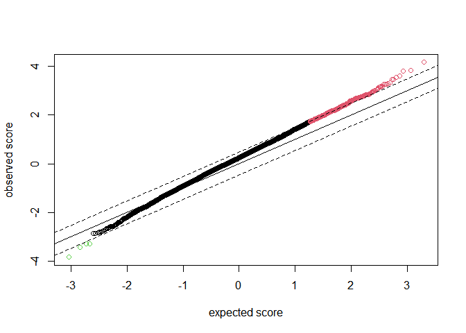

We can see that the default parameters of SAM returns. However based on
the plot, we can see that a large number of the up-regulated genes still
fall on our expected line. The following results which adjust the FDR to
0.1 and 0.05 display the change in results.

## SAM: FDR 0.1

    # Perform SAM fit
    samfit_stageivii_01 <- SAM(LIHC.rnaseq.stageivii, stageivii_samr_y , resp.type="Two class unpaired", fdr.output = 0.1)

    #Genes Up
    DT::datatable(samfit_stageivii_01$siggenes.table$genes.up)

<div class="datatables html-widget html-fill-item" id="htmlwidget-c2e3fede5c798441fdae" style="width:100%;height:auto;"></div>
<script type="application/json" data-for="htmlwidget-c2e3fede5c798441fdae">{"x":{"filter":"none","vertical":false,"data":[["g3646","g3738","g164","g5730","g820","g3783","g5799","g715","g6328","g4429","g1360","g3618","g2657","g3403","g335","g1991","g6588","g6475","g1653","g2796","g2986","g6762","g1918","g7909","g2030","g5780","g3190","g4895","g2198","g974","g8235","g3481","g973","g389","g920","g2172","g3242","g4854","g1768","g3538","g1646","g3217","g402","g9051","g9057","g2125","g3739","g6035","g3493","g4278","g681","g2787","g2060","g8358","g5386","g672","g2315","g3470","g5924","g2998","g2019","g6015","g4025","g1176","g5705","g2921","g5017","g2655","g2247","g3772","g4731","g4038","g1514","g7671","g3423","g5235","g4933","g6619","g2093","g3630","g7167","g6635","g3695","g1306","g1858","g2096","g4150","g2900","g3775","g5391","g2783","g656","g7482","g9394","g3226","g5972"],["3646","3738","164","5730","820","3783","5799","715","6328","4429","1360","3618","2657","3403","335","1991","6588","6475","1653","2796","2986","6762","1918","7909","2030","5780","3190","4895","2198","974","8235","3481","973","389","920","2172","3242","4854","1768","3538","1646","3217","402","9051","9057","2125","3739","6035","3493","4278","681","2787","2060","8358","5386","672","2315","3470","5924","2998","2019","6015","4025","1176","5705","2921","5017","2655","2247","3772","4731","4038","1514","7671","3423","5235","4933","6619","2093","3630","7167","6635","3695","1306","1858","2096","4150","2900","3775","5391","2783","656","7482","9394","3226","5972"],["4.158","3.827","3.802","3.612","3.556","3.46","3.454","3.32","3.282","3.259","3.259","3.249","3.18","3.164","3.16","3.141","3.13","3.068","3.031","3.017","3.012","2.985","2.981","2.956","2.935","2.924","2.909","2.902","2.874","2.869","2.85","2.847","2.838","2.836","2.835","2.834","2.829","2.829","2.819","2.798","2.797","2.777","2.776","2.775","2.768","2.763","2.76","2.756","2.75","2.746","2.743","2.742","2.729","2.727","2.727","2.723","2.723","2.721","2.695","2.695","2.692","2.691","2.69","2.685","2.683","2.682","2.682","2.672","2.67","2.663","2.66","2.652","2.652","2.64","2.638","2.637","2.624","2.613","2.611","2.609","2.607","2.605","2.605","2.601","2.598","2.598","2.588","2.585","2.584","2.583","2.582","2.578","2.57","2.568","2.56","2.551"],["404.26","267.918","9435.966","301.987","1071.073","381.253","187.225","1567.627","179.039","216.226","847.884","249.066","388.426","472.814","2867.915","479.725","159.526","164.87","574.925","516.922","337.9","568.453","531.9","215.794","504.144","160.343","422.778","202.379","470.383","727.875","122.69","265.162","1008.322","1751.001","1416.942","381.912","272.695","181.475","505.874","245.032","743.761","255.436","3211.451","1874.244","189.025","414.024","271.541","166.44","259.874","2973.232","1010.261","328.725","597.645","99.231","232.925","1361.105","391.492","261.48","170.673","279.787","397.311","157.928","189.631","638.338","171.324","699.058","340.903","436.336","586.532","228.056","264.337","248.842","535.383","120.492","270.364","197.586","154.084","129.014","339.162","250.534","137.407","164.712","282.089","529.43","512.194","412.858","632.523","339.217","250.656","162.974","231.089","1487.663","113.611","111.314","298.79","135.909"],["97.218","70.003","2481.956","83.601","301.193","110.201","54.208","472.147","54.56","66.342","260.193","76.655","122.159","149.45","907.573","152.715","50.966","53.743","189.652","171.353","112.17","190.434","178.414","72.994","171.764","54.834","145.355","69.742","163.653","253.696","43.056","93.136","355.28","617.315","499.77","134.762","96.378","64.14","179.48","87.568","265.869","91.971","1157.065","675.522","68.296","149.846","98.4","60.388","94.511","1082.616","368.367","119.892","218.997","36.39","85.425","499.831","143.779","96.104","63.328","103.818","147.574","58.693","70.482","237.71","63.861","260.611","127.105","163.324","219.65","85.624","99.382","93.837","201.909","45.634","102.494","74.933","58.718","49.369","129.885","96.045","52.701","63.223","108.301","203.535","197.121","158.907","244.404","131.241","97.019","63.103","89.49","577.168","44.202","43.353","116.725","53.278"],["1.207","1.236","1.446","2.009","1.19","1.214","1.244","1.235","1.694","1.244","1.339","1.125","1.129","1.616","1.274","1.343","1.726","1.279","1.17","1.543","1.179","2.313","1.362","1.787","1.149","1.163","1.39","1.264","1.535","1.161","1.52","1.169","1.469","1.193","1.507","1.135","1.439","1.281","1.139","1.178","1.313","1.173","1.35","2.496","1.941","1.139","1.218","1.398","1.355","2.259","1.119","1.486","1.261","1.688","1.636","1.206","1.189","1.177","1.626","1.148","1.107","1.183","1.144","1.144","1.19","1.78","1.745","1.526","1.359","1.138","1.218","1.151","1.14","1.631","1.165","1.545","1.146","1.578","1.13","1.316","1.65","1.455","1.161","1.185","1.361","1.185","1.735","1.443","1.427","1.514","1.102","1.238","1.206","1.35","1.188","1.193"],["0","0","0","0","0","0","0","0","4.842","4.842","4.842","4.842","4.842","4.842","4.842","4.842","4.842","4.842","4.842","4.842","4.842","4.842","4.842","4.842","4.842","4.842","4.842","4.842","4.842","4.842","4.842","4.842","12.638","12.638","12.638","12.638","12.638","12.638","12.638","12.638","12.638","12.638","12.638","12.638","12.638","12.638","12.638","12.638","12.638","12.638","12.638","12.638","12.638","12.638","12.638","12.638","12.638","12.638","12.638","12.638","12.638","12.638","12.638","12.638","12.638","12.638","12.638","12.638","12.638","12.638","12.638","12.638","12.638","12.638","12.638","12.638","12.638","12.638","12.638","12.638","12.638","12.638","12.638","12.638","12.638","12.638","12.638","12.638","12.638","12.638","12.638","12.638","12.638","12.638","12.638","12.638"]],"container":"<table class=\"display\">\n  <thead>\n    <tr>\n      <th>Gene ID<\/th>\n      <th>Gene Name<\/th>\n      <th>Score(d)<\/th>\n      <th>Numerator(r)<\/th>\n      <th>Denominator(s+s0)<\/th>\n      <th>Fold Change<\/th>\n      <th>q-value(%)<\/th>\n    <\/tr>\n  <\/thead>\n<\/table>","options":{"columnDefs":[{"name":"Gene ID","targets":0},{"name":"Gene Name","targets":1},{"name":"Score(d)","targets":2},{"name":"Numerator(r)","targets":3},{"name":"Denominator(s+s0)","targets":4},{"name":"Fold Change","targets":5},{"name":"q-value(%)","targets":6}],"order":[],"autoWidth":false,"orderClasses":false},"selection":{"mode":"multiple","selected":null,"target":"row","selectable":null}},"evals":[],"jsHooks":[]}</script>

    #Genes Down
    DT::datatable(samfit_stageivii_01$siggenes.table$genes.lo)

<div class="datatables html-widget html-fill-item" id="htmlwidget-a77ad32f6b82562872f5" style="width:100%;height:auto;"></div>
<script type="application/json" data-for="htmlwidget-a77ad32f6b82562872f5">{"x":{"filter":"none","vertical":false,"data":[["g46","g1118","g27","g4201"],["46","1118","27","4201"],["-3.828","-3.434","-3.287","-3.265"],["-19381.581","-925.956","-32433.502","-202.765"],["5062.485","269.673","9868.29","62.109"],["0.731","0.693","0.707","0.69"],["0","4.15","4.15","4.15"]],"container":"<table class=\"display\">\n  <thead>\n    <tr>\n      <th>Gene ID<\/th>\n      <th>Gene Name<\/th>\n      <th>Score(d)<\/th>\n      <th>Numerator(r)<\/th>\n      <th>Denominator(s+s0)<\/th>\n      <th>Fold Change<\/th>\n      <th>q-value(%)<\/th>\n    <\/tr>\n  <\/thead>\n<\/table>","options":{"columnDefs":[{"name":"Gene ID","targets":0},{"name":"Gene Name","targets":1},{"name":"Score(d)","targets":2},{"name":"Numerator(r)","targets":3},{"name":"Denominator(s+s0)","targets":4},{"name":"Fold Change","targets":5},{"name":"q-value(%)","targets":6}],"order":[],"autoWidth":false,"orderClasses":false},"selection":{"mode":"multiple","selected":null,"target":"row","selectable":null}},"evals":[],"jsHooks":[]}</script>

    #Plot
    plot(samfit_stageivii_01)

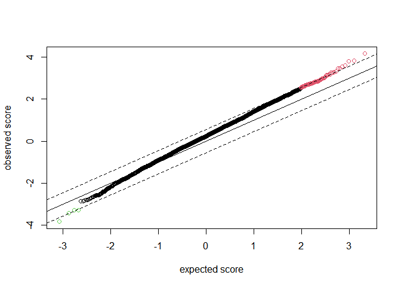

## SAM: FDR 0.05

    # Perform SAM fit
    samfit_stageivii_005 <- SAM(LIHC.rnaseq.stageivii, stageivii_samr_y , resp.type="Two class unpaired", fdr.output = 0.05)

    #Genes Up
    DT::datatable(samfit_stageivii_005$siggenes.table$genes.up)

<div class="datatables html-widget html-fill-item" id="htmlwidget-e3479f292a01744eb530" style="width:100%;height:auto;"></div>
<script type="application/json" data-for="htmlwidget-e3479f292a01744eb530">{"x":{"filter":"none","vertical":false,"data":[["g3646","g3738","g164","g5730","g820","g3783","g5799","g715","g6328","g4429","g1360","g3618","g2657","g3403","g335","g1991","g6588","g6475","g1653","g2796","g2986","g6762","g1918","g7909","g2030","g5780","g3190","g4895","g2198","g974","g8235","g3481","g973","g389","g920","g2172","g3242","g4854","g1768","g3538","g1646","g3217","g402","g9051","g9057","g2125","g3739","g6035","g3493","g4278","g681","g2787","g2060","g8358","g5386","g672","g2315","g3470","g5924","g2998","g2019","g6015","g4025","g1176","g5705","g2921","g5017"],["3646","3738","164","5730","820","3783","5799","715","6328","4429","1360","3618","2657","3403","335","1991","6588","6475","1653","2796","2986","6762","1918","7909","2030","5780","3190","4895","2198","974","8235","3481","973","389","920","2172","3242","4854","1768","3538","1646","3217","402","9051","9057","2125","3739","6035","3493","4278","681","2787","2060","8358","5386","672","2315","3470","5924","2998","2019","6015","4025","1176","5705","2921","5017"],["4.158","3.827","3.802","3.612","3.556","3.46","3.454","3.32","3.282","3.259","3.259","3.249","3.18","3.164","3.16","3.141","3.13","3.068","3.031","3.017","3.012","2.985","2.981","2.956","2.935","2.924","2.909","2.902","2.874","2.869","2.85","2.847","2.838","2.836","2.835","2.834","2.829","2.829","2.819","2.798","2.797","2.777","2.776","2.775","2.768","2.763","2.76","2.756","2.75","2.746","2.743","2.742","2.729","2.727","2.727","2.723","2.723","2.721","2.695","2.695","2.692","2.691","2.69","2.685","2.683","2.682","2.682"],["404.26","267.918","9435.966","301.987","1071.073","381.253","187.225","1567.627","179.039","216.226","847.884","249.066","388.426","472.814","2867.915","479.725","159.526","164.87","574.925","516.922","337.9","568.453","531.9","215.794","504.144","160.343","422.778","202.379","470.383","727.875","122.69","265.162","1008.322","1751.001","1416.942","381.912","272.695","181.475","505.874","245.032","743.761","255.436","3211.451","1874.244","189.025","414.024","271.541","166.44","259.874","2973.232","1010.261","328.725","597.645","99.231","232.925","1361.105","391.492","261.48","170.673","279.787","397.311","157.928","189.631","638.338","171.324","699.058","340.903"],["97.218","70.003","2481.956","83.601","301.193","110.201","54.208","472.147","54.56","66.342","260.193","76.655","122.159","149.45","907.573","152.715","50.966","53.743","189.652","171.353","112.17","190.434","178.414","72.994","171.764","54.834","145.355","69.742","163.653","253.696","43.056","93.136","355.28","617.315","499.77","134.762","96.378","64.14","179.48","87.568","265.869","91.971","1157.065","675.522","68.296","149.846","98.4","60.388","94.511","1082.616","368.367","119.892","218.997","36.39","85.425","499.831","143.779","96.104","63.328","103.818","147.574","58.693","70.482","237.71","63.861","260.611","127.105"],["1.207","1.236","1.446","2.009","1.19","1.214","1.244","1.235","1.694","1.244","1.339","1.125","1.129","1.616","1.274","1.343","1.726","1.279","1.17","1.543","1.179","2.313","1.362","1.787","1.149","1.163","1.39","1.264","1.535","1.161","1.52","1.169","1.469","1.193","1.507","1.135","1.439","1.281","1.139","1.178","1.313","1.173","1.35","2.496","1.941","1.139","1.218","1.398","1.355","2.259","1.119","1.486","1.261","1.688","1.636","1.206","1.189","1.177","1.626","1.148","1.107","1.183","1.144","1.144","1.19","1.78","1.745"],["0","0","0","0","0","0","0","0","0","0","0","0","4.597","4.597","4.597","4.597","4.597","4.597","4.597","4.597","4.597","4.597","4.597","4.597","4.597","4.597","4.597","9.841","9.841","9.841","9.841","9.841","9.841","9.841","9.841","9.841","9.841","9.841","9.841","9.841","9.841","9.841","9.841","9.841","9.841","9.841","9.841","9.841","9.841","9.841","9.841","9.841","9.841","9.841","9.841","9.841","9.841","9.841","9.841","9.841","9.841","9.841","9.841","9.841","9.841","9.841","9.841"]],"container":"<table class=\"display\">\n  <thead>\n    <tr>\n      <th>Gene ID<\/th>\n      <th>Gene Name<\/th>\n      <th>Score(d)<\/th>\n      <th>Numerator(r)<\/th>\n      <th>Denominator(s+s0)<\/th>\n      <th>Fold Change<\/th>\n      <th>q-value(%)<\/th>\n    <\/tr>\n  <\/thead>\n<\/table>","options":{"columnDefs":[{"name":"Gene ID","targets":0},{"name":"Gene Name","targets":1},{"name":"Score(d)","targets":2},{"name":"Numerator(r)","targets":3},{"name":"Denominator(s+s0)","targets":4},{"name":"Fold Change","targets":5},{"name":"q-value(%)","targets":6}],"order":[],"autoWidth":false,"orderClasses":false},"selection":{"mode":"multiple","selected":null,"target":"row","selectable":null}},"evals":[],"jsHooks":[]}</script>

    #Genes Down
    DT::datatable(samfit_stageivii_005$siggenes.table$genes.lo)

<div class="datatables html-widget html-fill-item" id="htmlwidget-65b7328530dcdf303887" style="width:100%;height:auto;"></div>
<script type="application/json" data-for="htmlwidget-65b7328530dcdf303887">{"x":{"filter":"none","vertical":false,"data":[["g46","g1118","g27","g4201"],["46","1118","27","4201"],["-3.828","-3.434","-3.287","-3.265"],["-19381.581","-925.956","-32433.502","-202.765"],["5062.485","269.673","9868.29","62.109"],["0.731","0.693","0.707","0.69"],["0","4.597","9.841","9.841"]],"container":"<table class=\"display\">\n  <thead>\n    <tr>\n      <th>Gene ID<\/th>\n      <th>Gene Name<\/th>\n      <th>Score(d)<\/th>\n      <th>Numerator(r)<\/th>\n      <th>Denominator(s+s0)<\/th>\n      <th>Fold Change<\/th>\n      <th>q-value(%)<\/th>\n    <\/tr>\n  <\/thead>\n<\/table>","options":{"columnDefs":[{"name":"Gene ID","targets":0},{"name":"Gene Name","targets":1},{"name":"Score(d)","targets":2},{"name":"Numerator(r)","targets":3},{"name":"Denominator(s+s0)","targets":4},{"name":"Fold Change","targets":5},{"name":"q-value(%)","targets":6}],"order":[],"autoWidth":false,"orderClasses":false},"selection":{"mode":"multiple","selected":null,"target":"row","selectable":null}},"evals":[],"jsHooks":[]}</script>

    #Plot
    plot(samfit_stageivii_005)

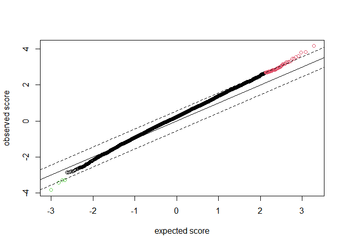

## Clustering

Although we have previously filtered for 10,000 most variant genes, it
would be difficult to determine any meaningful clusters with that many
genes. For this analysis, I will be clustering based on the 100 most
variant genes. The samples and genes are clustered based on the rnaseq
data as follows.

### Sample Clustering

    library(dendextend)

    ## Warning: package 'dendextend' was built under R version 4.4.2

    ## 
    ## ---------------------
    ## Welcome to dendextend version 1.19.0
    ## Type citation('dendextend') for how to cite the package.
    ## 
    ## Type browseVignettes(package = 'dendextend') for the package vignette.
    ## The github page is: https://github.com/talgalili/dendextend/
    ## 
    ## Suggestions and bug-reports can be submitted at: https://github.com/talgalili/dendextend/issues
    ## You may ask questions at stackoverflow, use the r and dendextend tags: 
    ##   https://stackoverflow.com/questions/tagged/dendextend
    ## 
    ##  To suppress this message use:  suppressPackageStartupMessages(library(dendextend))
    ## ---------------------

    ## 
    ## Attaching package: 'dendextend'

    ## The following object is masked from 'package:stats':
    ## 
    ##     cutree

    # Restrict to only 100 genes
    LIHC.rnaseq_100 <- LIHC.rnaseq[1:100,]

    # Sample Dendrogram
    lihc.sample.dend <- as.dendrogram(hclust(dist(t(LIHC.rnaseq_100))))
    # LIHC Stage Colors
    lihc.sample.color <- as.vector(LIHC.clinical.path_stage$stage)
    lihc.sample.color <- replace(lihc.sample.color, lihc.sample.color=='stage i', 1)
    lihc.sample.color<- replace(lihc.sample.color, lihc.sample.color=='stage ii', 2)
    lihc.sample.color<- replace(lihc.sample.color, lihc.sample.color=='stage iii', 3)
    lihc.sample.color<- replace(lihc.sample.color, lihc.sample.color=='stage iv', 4)
    lihc.sample.color <- as.numeric(lihc.sample.color)

    colorCodes <- c("1" = "red", "2" = "blue", "3" = "green", "4" = "black")
    labels_colors(lihc.sample.dend) <- colorCodes[lihc.sample.color][order.dendrogram(lihc.sample.dend)]
    plot(lihc.sample.dend)

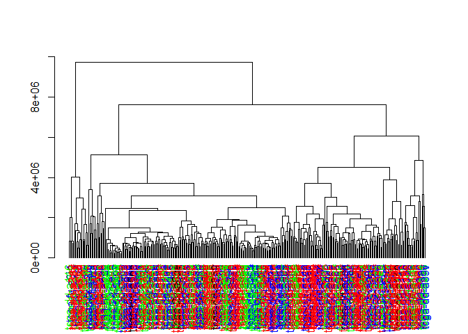

For the sample dendrogram, the colors represent the following Stages:
Stage I - Red, Stage II - Blue, Stage III - Green, Stage IV - Black.
Although it is hard to read the individual sample names, we can see that
there is no strong pattern of clusters for the types of stages as we see
the colors intermix.

### Gene Clustering

    plot(hclust(dist(LIHC.rnaseq_100)))
    rect.hclust(hclust(dist(LIHC.rnaseq_100)) , k = 5, border = 2:6)

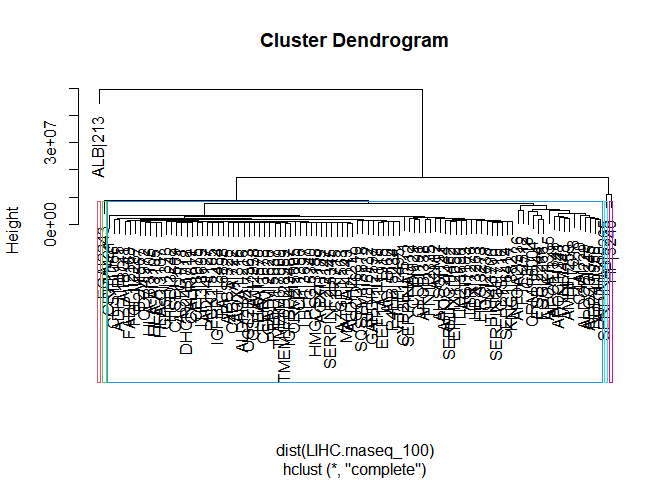

In this 100 gene clustering, we can see that there are some genes that
are clustered much further that are interfering with our visualization.
We can see that a large cluster in the dark blue contains the majority
of the genes, so we excluded the 4 genes outside of that cluster, which
are also the 4 most variant genes (ALB|213, FGA|2243, SERPINA1|5265,
HP|3240) to see what would change

    plot(hclust(dist(LIHC.rnaseq_100[-c(1:4),])))
    rect.hclust(hclust(dist(LIHC.rnaseq_100[-c(1:4),])) , k = 4, border = 2:6)

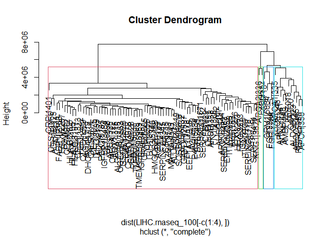

We can see there is still a large cluster in the red segment that
contains many genes, but we can begin to see more distinct clusters
begin to form

## K-means clustering

Based on the hierarchial clustering, I will be using the full 10,000
genes but excluding the 4 that are the most variable as they appear to
be outliers and skew the data

    library(cluster)
    library(fpc)

    ## Warning: package 'fpc' was built under R version 4.4.2

    set.seed(1234)
    k_means <- kmeans(LIHC.rnaseq[-c(1:4),], centers = 5)
    table(k_means$cluster)

    ## 
    ##    1    2    3    4    5 
    ##   20 9473   12  424   67

    clusplot(LIHC.rnaseq[-c(1:4),], k_means$cluster, color=TRUE, shade=TRUE)

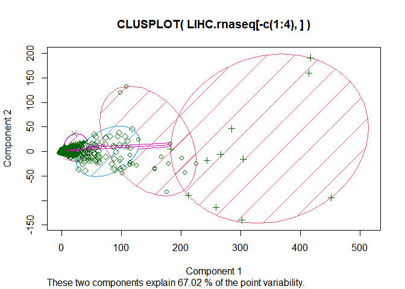

    plotcluster(LIHC.rnaseq[-c(1:4),], k_means$cluster)

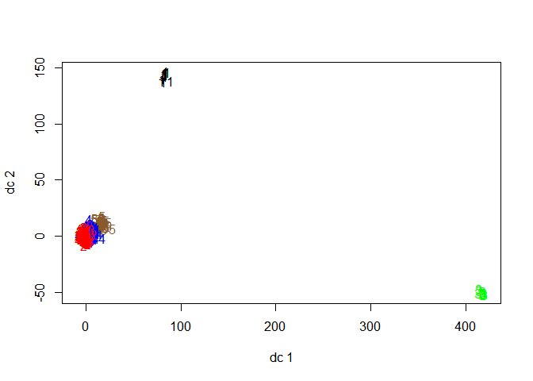

We can see that there is one cluster that comprises of the vast majority
of samples, but the most interesting result to me is the identification
of two very distinct clusters, Cluster 1 with 20 genes and Cluster 3
with 12 genes. In the plotcluster(), we can also see them distinctly
away from each other.

    #Get the genes in the distinct 2 clusters
    rownames(LIHC.rnaseq[-c(1:4),][k_means$cluster==1,])

    ##  [1] "RBP4|5950"    "C4A|720"      "ALDOB|229"    "APOC3|345"    "APOH|350"    
    ##  [6] "CFB|629"      "CLU|1191"     "SERPINA3|12"  "APOB|338"     "AHSG|197"    
    ## [11] "SERPINC1|462" "A2M|2"        "FN1|2335"     "HPX|3263"     "TTR|7276"    
    ## [16] "CYP2E1|1571"  "GC|2638"      "APOC2|344"    "H19|283120"   "IGF2|3481"

    rownames(LIHC.rnaseq[-c(1:4),][k_means$cluster==3,])

    ##  [1] "C3|718"    "APOA2|336" "APOA1|335" "FGB|2244"  "FTL|2512"  "FGG|2266" 
    ##  [7] "TF|7018"   "VTN|7448"  "AMBP|259"  "ORM1|5004" "APOE|348"  "APOC1|341"

To set up for future analyses, we also performed kmean clusters with the
top 500 variable genes (still excluding the top 4)

    # Analyse top 500 genes (exclude top 4)
    LIHC.rnaseq_500 <- LIHC.rnaseq[1:500,]
    set.seed(1234)
    k_means_500 <- kmeans(LIHC.rnaseq_500[-c(1:4),], centers = 4)
    table(k_means_500$cluster)

    ## 
    ##   1   2   3   4 
    ## 420  14  51  11

    clusplot(LIHC.rnaseq_500[-c(1:4),], k_means_500$cluster, color=TRUE, shade=TRUE)

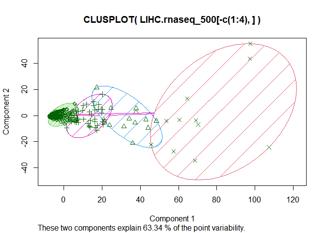

    plotcluster(LIHC.rnaseq_500[-c(1:4),], k_means_500$cluster)

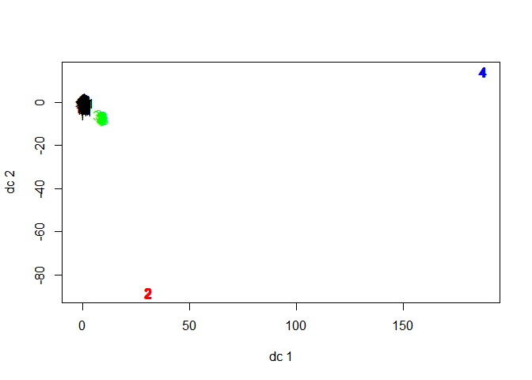

    #Get the genes in the distinct 2 clusters
    rownames(LIHC.rnaseq_500[-c(1:4),][k_means_500$cluster==2,])

    ##  [1] "RBP4|5950"   "C4A|720"     "ALDOB|229"   "APOC3|345"   "APOH|350"   
    ##  [6] "APOC1|341"   "CFB|629"     "CLU|1191"    "SERPINA3|12" "APOB|338"   
    ## [11] "AHSG|197"    "FN1|2335"    "CYP2E1|1571" "H19|283120"

    rownames(LIHC.rnaseq_500[-c(1:4),][k_means_500$cluster==4,])

    ##  [1] "C3|718"    "APOA2|336" "APOA1|335" "FGB|2244"  "FTL|2512"  "FGG|2266" 
    ##  [7] "TF|7018"   "VTN|7448"  "AMBP|259"  "ORM1|5004" "APOE|348"

We see that these list of genes are very similar to each other. When
highlighting them the previous dendrogram of the top 100 genes (using
the same color scheme from the plotcluster() results from the top 500
genes), we can see that the genes in cluster 4 are clustered together.
Cluster 2 is still distinct, but not as cohesive.

    # Get the genes in the defined clusters that are also in the top 100 genes
    rownames(LIHC.rnaseq_500[-c(1:4),][k_means_500$cluster==2,]) %in% rownames(LIHC.rnaseq_100)

    ##  [1]  TRUE  TRUE  TRUE  TRUE  TRUE  TRUE  TRUE  TRUE  TRUE  TRUE  TRUE  TRUE
    ## [13]  TRUE FALSE

    kmeans500_cluster2 <- rownames(LIHC.rnaseq_500[-c(1:4),][k_means_500$cluster==2,])[rownames(LIHC.rnaseq_500[-c(1:4),][k_means_500$cluster==2,]) %in% rownames(LIHC.rnaseq_100)]
    kmeans500_cluster2

    ##  [1] "RBP4|5950"   "C4A|720"     "ALDOB|229"   "APOC3|345"   "APOH|350"   
    ##  [6] "APOC1|341"   "CFB|629"     "CLU|1191"    "SERPINA3|12" "APOB|338"   
    ## [11] "AHSG|197"    "FN1|2335"    "CYP2E1|1571"

    rownames(LIHC.rnaseq_500[-c(1:4),][k_means_500$cluster==4,]) %in% rownames(LIHC.rnaseq_100)

    ##  [1] TRUE TRUE TRUE TRUE TRUE TRUE TRUE TRUE TRUE TRUE TRUE

    kmeans500_cluster4 <- rownames(LIHC.rnaseq_500[-c(1:4),][k_means_500$cluster==4,])[rownames(LIHC.rnaseq_500[-c(1:4),][k_means_500$cluster==4,]) %in% rownames(LIHC.rnaseq_100)]
    kmeans500_cluster4

    ##  [1] "C3|718"    "APOA2|336" "APOA1|335" "FGB|2244"  "FTL|2512"  "FGG|2266" 
    ##  [7] "TF|7018"   "VTN|7448"  "AMBP|259"  "ORM1|5004" "APOE|348"

    #Dendrogram of top 100 genes (exclude top 4)
    lihc.100genes.dend <- as.dendrogram(hclust(dist(LIHC.rnaseq_100[-c(1:4),])))
    #Color cluster labels
    lihc.cluster.color <- as.vector(rownames(LIHC.rnaseq_100[-c(1:4),]))
    lihc.cluster.color <- replace(lihc.cluster.color, lihc.cluster.color %in% kmeans500_cluster2, 2)
    lihc.cluster.color <- replace(lihc.cluster.color, lihc.cluster.color %in% kmeans500_cluster4, 4)
    lihc.cluster.color <- replace(lihc.cluster.color, lihc.cluster.color != "2"&lihc.cluster.color !="4", 0)

    colorCodes <- c("2" = "red", "4" = "blue", "0" = "white")
    labels_colors(lihc.100genes.dend) <- colorCodes[lihc.cluster.color][order.dendrogram(lihc.100genes.dend)]
    plot(lihc.100genes.dend)

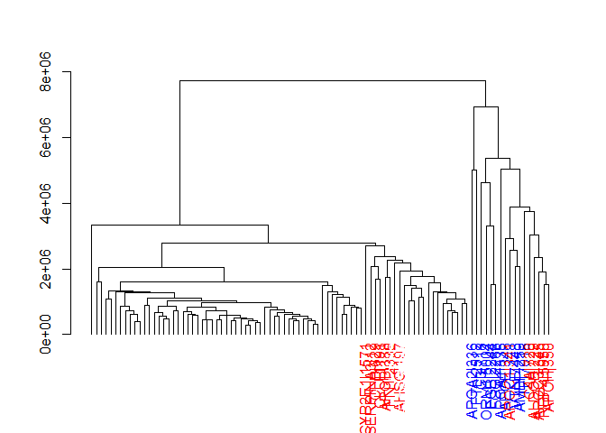

For reference, below is the dendrogram with the labels colored by
clusters, using the top 500 genes and 4 clusters.

    kmeans500_cluster1 <- rownames(LIHC.rnaseq_500[-c(1:4),][k_means_500$cluster==1,])[rownames(LIHC.rnaseq_500[-c(1:4),][k_means_500$cluster==1,]) %in% rownames(LIHC.rnaseq_100)]
    kmeans500_cluster3 <- rownames(LIHC.rnaseq_500[-c(1:4),][k_means_500$cluster==3,])[rownames(LIHC.rnaseq_500[-c(1:4),][k_means_500$cluster==3,]) %in% rownames(LIHC.rnaseq_100)]

    #Dendrogram of top 100 genes (exclude top 4)
    lihc.100genes.dend <- as.dendrogram(hclust(dist(LIHC.rnaseq_100[-c(1:4),])))
    #Color cluster labels
    lihc.cluster.color <- as.vector(rownames(LIHC.rnaseq_100[-c(1:4),]))
    lihc.cluster.color <- replace(lihc.cluster.color, lihc.cluster.color %in% kmeans500_cluster1, 1)
    lihc.cluster.color <- replace(lihc.cluster.color, lihc.cluster.color %in% kmeans500_cluster2, 2)
    lihc.cluster.color <- replace(lihc.cluster.color, lihc.cluster.color %in% kmeans500_cluster3, 3)
    lihc.cluster.color <- replace(lihc.cluster.color, lihc.cluster.color %in% kmeans500_cluster4, 4)

    colorCodes <- c("1" = "black", "2" = "red", "3" = "green", "4" = "blue")
    labels_colors(lihc.100genes.dend) <- colorCodes[lihc.cluster.color][order.dendrogram(lihc.100genes.dend)]
    plot(lihc.100genes.dend)

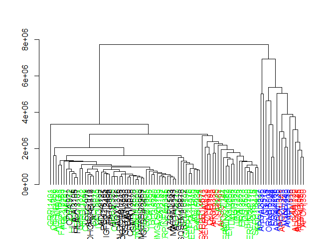

With these two clusters identified, is this truly an interesting result?
Comparing these clusters to their rank of variance, we can see that they
are roughly the most variant genes.

    # Compare two clusters on rank for variance
    LIHC.rnaseq.mad_df <- data.frame(LIHC.rnaseq.mad)
    LIHC.rnaseq.mad_df <- cbind(LIHC.rnaseq.mad, rank(-LIHC.rnaseq.mad))
    LIHC.rnaseq.mad_df[kmeans500_cluster2,2]

    ##   RBP4|5950     C4A|720   ALDOB|229   APOC3|345    APOH|350   APOC1|341 
    ##          14          16          17          19          20          21 
    ##     CFB|629    CLU|1191 SERPINA3|12    APOB|338    AHSG|197    FN1|2335 
    ##          22          24          25          26          27          30 
    ## CYP2E1|1571 
    ##          34

    LIHC.rnaseq.mad_df[kmeans500_cluster4,2]

    ##    C3|718 APOA2|336 APOA1|335  FGB|2244  FTL|2512  FGG|2266   TF|7018  VTN|7448 
    ##         5         6         7         8         9        10        11        12 
    ##  AMBP|259 ORM1|5004  APOE|348 
    ##        13        15        18

<!-- ## enrichR Annotation -->
<!-- Using cluster 2 and 4 that were identified previously, we will analyze the annotations using enrichR, using the GO 2023 databases for Molecular Function, Cellular Component, and Biological process -->
<!-- ```{r enrichr1} -->
<!-- #Get entrez ID of each gene -->
<!-- cluster2_entrez <- unlist(strsplit(kmeans500_cluster2, split = "\\|"))[c(TRUE, FALSE)] -->
<!-- cluster4_entrez <- unlist(strsplit(kmeans500_cluster4, split = "\\|"))[c(TRUE, FALSE)] -->
<!-- library(enrichR) -->
<!-- dbs <- c("GO_Molecular_Function_2023", "GO_Cellular_Component_2023", "GO_Biological_Process_2023") -->
<!-- ``` -->
<!-- ### Cluster 2 -->
<!-- ```{r enrichr2} -->
<!-- enriched_cluster2 <- enrichr(cluster2_entrez, dbs) -->
<!-- DT::datatable(enriched_cluster2[["GO_Molecular_Function_2023"]], options = list(pageLength = 5)) -->
<!-- DT::datatable(enriched_cluster2[["GO_Cellular_Component_2023"]], options = list(pageLength = 5)) -->
<!-- DT::datatable(enriched_cluster2[["GO_Biological_Process_2023"]], options = list(pageLength = 5)) -->
<!-- plotEnrich(enriched_cluster2[[3]], showTerms = 20, numChar = 40, y = "Count", orderBy = "P.value") -->
<!-- ``` -->
<!-- ### Cluster 4 -->
<!-- ```{r enrichr3} -->
<!-- enriched_cluster4 <- enrichr(cluster4_entrez, dbs) -->
<!-- DT::datatable(enriched_cluster4[["GO_Molecular_Function_2023"]], options = list(pageLength = 5)) -->
<!-- DT::datatable(enriched_cluster4[["GO_Cellular_Component_2023"]], options = list(pageLength = 5)) -->
<!-- DT::datatable(enriched_cluster4[["GO_Biological_Process_2023"]], options = list(pageLength = 5)) -->
<!-- plotEnrich(enriched_cluster4[[3]], showTerms = 20, numChar = 40, y = "Count", orderBy = "P.value") -->
<!-- ``` -->
<!-- We can see that the results of the annotation relates to the function of the liver, which is expected due to the Liver cancer dataset.  -->

## WGCNA

As a first exploration, I will be performing WGCNA on all 10,000 genes
that have been filtered based on the most variance

    library(WGCNA)

    ## Warning: package 'WGCNA' was built under R version 4.4.2

    ## Loading required package: dynamicTreeCut

    ## Loading required package: fastcluster

    ## 
    ## Attaching package: 'fastcluster'

    ## The following object is masked from 'package:stats':
    ## 
    ##     hclust

    ## 

    ## 
    ## Attaching package: 'WGCNA'

    ## The following object is masked from 'package:stats':
    ## 
    ##     cor

    #Transpose Expression matrix
    t.LIHC.rnaseq <- t(LIHC.rnaseq)

    net = blockwiseModules(t.LIHC.rnaseq, power = 7, 
                           TOMType = "signed", minModuleSize = 30, 
                           reassignThreshold =10, mergeCutHeight = 0.10, 
                           numericLabels = TRUE, pamRespectsDendro = FALSE, 
                           saveTOMs = TRUE, 
                           saveTOMFileBase="TOM", verbose=3, ds=3) 

    mergedColors = labels2colors(net$colors) 
    plotDendroAndColors(net$dendrograms[[1]], mergedColors[net$blockGenes[[1]]], 
                        "Module colors", 
                        dendroLabels = FALSE, hang = 0.03, 
                        addGuide = TRUE, guideHang = 0.05) 

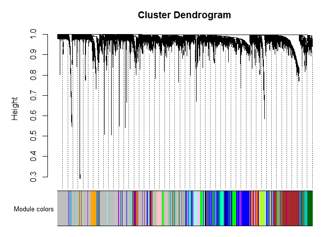

    table(labels2colors(net$colors))

    ## 
    ##           black            blue           brown            cyan       darkgreen 
    ##             219             538             495             143              95 
    ##        darkgrey     darkmagenta  darkolivegreen      darkorange         darkred 
    ##              88              61              66              84              97 
    ##   darkturquoise           green     greenyellow            grey          grey60 
    ##              94             379             156            3589             127 
    ##       lightcyan      lightcyan1      lightgreen lightsteelblue1     lightyellow 
    ##             138              39             116              40             109 
    ##         magenta   mediumpurple3    midnightblue          orange      orangered4 
    ##             186              43             139              85              49 
    ##   paleturquoise            pink           plum1          purple             red 
    ##              68             218              54             173             342 
    ##       royalblue     saddlebrown          salmon         sienna3         skyblue 
    ##             101              74             144              61              77 
    ##        skyblue3       steelblue             tan       turquoise          violet 
    ##              54              70             156             571              68 
    ##           white          yellow     yellowgreen 
    ##              83             453              58

We can see that we have over 40 modules identified, with some only
having around 50 genes. But based on our previous analyses, we can see
that cutting the data to 1,000 or even 500 genes demonstrates
interesting clustering. The following analysis is with the 1,000 genes
with the most variance (excluding the 4 outliers we identified
previously)

    LIHC.rnaseq_1000 <- LIHC.rnaseq[1:1000,]
    t.LIHC.rnaseq_1000 <- t(LIHC.rnaseq_1000[-c(1:4),])

    set.seed(1234)
    net_1000 = blockwiseModules(t.LIHC.rnaseq_1000, power = 7, 
                           TOMType = "signed", minModuleSize = 30, 
                           reassignThreshold =10, mergeCutHeight = 0.10, 
                           numericLabels = TRUE, pamRespectsDendro = FALSE, 
                           saveTOMs = TRUE, 
                           saveTOMFileBase="TOM", verbose=3, ds=3) 

    mergedColors_1000 = labels2colors(net_1000$colors) 
    plotDendroAndColors(net_1000$dendrograms[[1]], mergedColors_1000[net_1000$blockGenes[[1]]], 
                        "Module colors", 
                        dendroLabels = FALSE, hang = 0.03, 
                        addGuide = TRUE, guideHang = 0.05) 

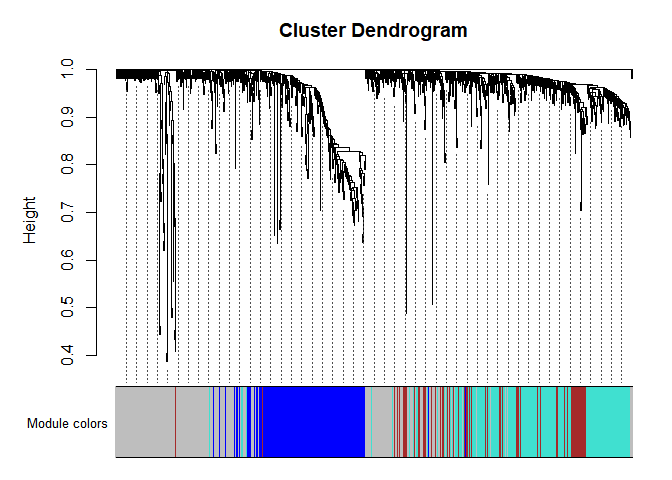

    table(labels2colors(net_1000$colors))

    ## 
    ##      blue     brown      grey turquoise 
    ##       226       118       369       283

We now see four distinct clusters. Interestingly, they seem to be a
different size compared to the clusters we identified in k-means.

    genes=colnames(t.LIHC.rnaseq_1000) 
    moduleColors=labels2colors(net_1000$colors) 
    mymodules=cbind(genes,moduleColors)
    DT::datatable(data.frame(mymodules))

<div class="datatables html-widget html-fill-item" id="htmlwidget-1990be7a07e95fee1522" style="width:100%;height:auto;"></div>
<script type="application/json" data-for="htmlwidget-1990be7a07e95fee1522">{"x":{"filter":"none","vertical":false,"data":[["1","2","3","4","5","6","7","8","9","10","11","12","13","14","15","16","17","18","19","20","21","22","23","24","25","26","27","28","29","30","31","32","33","34","35","36","37","38","39","40","41","42","43","44","45","46","47","48","49","50","51","52","53","54","55","56","57","58","59","60","61","62","63","64","65","66","67","68","69","70","71","72","73","74","75","76","77","78","79","80","81","82","83","84","85","86","87","88","89","90","91","92","93","94","95","96","97","98","99","100","101","102","103","104","105","106","107","108","109","110","111","112","113","114","115","116","117","118","119","120","121","122","123","124","125","126","127","128","129","130","131","132","133","134","135","136","137","138","139","140","141","142","143","144","145","146","147","148","149","150","151","152","153","154","155","156","157","158","159","160","161","162","163","164","165","166","167","168","169","170","171","172","173","174","175","176","177","178","179","180","181","182","183","184","185","186","187","188","189","190","191","192","193","194","195","196","197","198","199","200","201","202","203","204","205","206","207","208","209","210","211","212","213","214","215","216","217","218","219","220","221","222","223","224","225","226","227","228","229","230","231","232","233","234","235","236","237","238","239","240","241","242","243","244","245","246","247","248","249","250","251","252","253","254","255","256","257","258","259","260","261","262","263","264","265","266","267","268","269","270","271","272","273","274","275","276","277","278","279","280","281","282","283","284","285","286","287","288","289","290","291","292","293","294","295","296","297","298","299","300","301","302","303","304","305","306","307","308","309","310","311","312","313","314","315","316","317","318","319","320","321","322","323","324","325","326","327","328","329","330","331","332","333","334","335","336","337","338","339","340","341","342","343","344","345","346","347","348","349","350","351","352","353","354","355","356","357","358","359","360","361","362","363","364","365","366","367","368","369","370","371","372","373","374","375","376","377","378","379","380","381","382","383","384","385","386","387","388","389","390","391","392","393","394","395","396","397","398","399","400","401","402","403","404","405","406","407","408","409","410","411","412","413","414","415","416","417","418","419","420","421","422","423","424","425","426","427","428","429","430","431","432","433","434","435","436","437","438","439","440","441","442","443","444","445","446","447","448","449","450","451","452","453","454","455","456","457","458","459","460","461","462","463","464","465","466","467","468","469","470","471","472","473","474","475","476","477","478","479","480","481","482","483","484","485","486","487","488","489","490","491","492","493","494","495","496","497","498","499","500","501","502","503","504","505","506","507","508","509","510","511","512","513","514","515","516","517","518","519","520","521","522","523","524","525","526","527","528","529","530","531","532","533","534","535","536","537","538","539","540","541","542","543","544","545","546","547","548","549","550","551","552","553","554","555","556","557","558","559","560","561","562","563","564","565","566","567","568","569","570","571","572","573","574","575","576","577","578","579","580","581","582","583","584","585","586","587","588","589","590","591","592","593","594","595","596","597","598","599","600","601","602","603","604","605","606","607","608","609","610","611","612","613","614","615","616","617","618","619","620","621","622","623","624","625","626","627","628","629","630","631","632","633","634","635","636","637","638","639","640","641","642","643","644","645","646","647","648","649","650","651","652","653","654","655","656","657","658","659","660","661","662","663","664","665","666","667","668","669","670","671","672","673","674","675","676","677","678","679","680","681","682","683","684","685","686","687","688","689","690","691","692","693","694","695","696","697","698","699","700","701","702","703","704","705","706","707","708","709","710","711","712","713","714","715","716","717","718","719","720","721","722","723","724","725","726","727","728","729","730","731","732","733","734","735","736","737","738","739","740","741","742","743","744","745","746","747","748","749","750","751","752","753","754","755","756","757","758","759","760","761","762","763","764","765","766","767","768","769","770","771","772","773","774","775","776","777","778","779","780","781","782","783","784","785","786","787","788","789","790","791","792","793","794","795","796","797","798","799","800","801","802","803","804","805","806","807","808","809","810","811","812","813","814","815","816","817","818","819","820","821","822","823","824","825","826","827","828","829","830","831","832","833","834","835","836","837","838","839","840","841","842","843","844","845","846","847","848","849","850","851","852","853","854","855","856","857","858","859","860","861","862","863","864","865","866","867","868","869","870","871","872","873","874","875","876","877","878","879","880","881","882","883","884","885","886","887","888","889","890","891","892","893","894","895","896","897","898","899","900","901","902","903","904","905","906","907","908","909","910","911","912","913","914","915","916","917","918","919","920","921","922","923","924","925","926","927","928","929","930","931","932","933","934","935","936","937","938","939","940","941","942","943","944","945","946","947","948","949","950","951","952","953","954","955","956","957","958","959","960","961","962","963","964","965","966","967","968","969","970","971","972","973","974","975","976","977","978","979","980","981","982","983","984","985","986","987","988","989","990","991","992","993","994","995","996"],["C3|718","APOA2|336","APOA1|335","FGB|2244","FTL|2512","FGG|2266","TF|7018","VTN|7448","AMBP|259","RBP4|5950","ORM1|5004","C4A|720","ALDOB|229","APOE|348","APOC3|345","APOH|350","APOC1|341","CFB|629","HRG|3273","CLU|1191","SERPINA3|12","APOB|338","AHSG|197","SERPINC1|462","A2M|2","FN1|2335","HPX|3263","CES1|1066","TTR|7276","CYP2E1|1571","EPHX1|2052","ITIH4|3700","GC|2638","ADH1B|125","SERPING1|710","CPS1|1373","APOC2|344","SEPP1|6414","KNG1|3827","C1S|716","A1BG|1","ITIH2|3698","SCD|6319","AGT|183","ITIH1|3697","HPD|3242","AGXT|189","CP|1356","CFH|3075","FGL1|2267","B2M|567","ITIH3|3699","FABP1|2168","TPT1|7178","PLG|5340","GAPDH|2597","C4BPA|722","ORM2|5005","HMGCS2|3158","F2|2147","HLA-B|3106","C1R|715","P4HB|5034","SERPINF2|5345","EEF1A1|1915","APCS|325","FTH1|2495","CD74|972","CTSD|1509","ACTB|60","GSTA1|2938","ALDH1A1|216","GATM|2628","AZGP1|563","PEBP1|5037","PCK1|5105","MAT1A|4143","ALDH2|217","AOX1|316","RPL8|6132","TMEM176B|28959","ADH4|127","DHCR24|1718","ACTG1|71","HLA-A|3105","SQSTM1|8878","IGFBP4|3487","IGFBP1|3484","BAAT|570","CFHR1|3078","TAT|6898","CRP|1401","HLA-C|3107","UGT2B4|7363","CALR|811","TMBIM6|7009","ADH1C|126","SERPIND1|3053","IFITM3|10410","CTSB|1508","PAH|5053","AKR1C1|1645","TFR2|7036","COL18A1|80781","DCXR|51181","LBP|3929","EEF2|1938","CES2|8824","ADH1A|124","ATF5|22809","SULT2A1|6822","RPL3|6122","GPX3|2878","CYP27A1|1593","SERPINF1|5176","ALDH1L1|10840","GLUL|2752","SLC27A5|10998","HSP90AB1|3326","RARRES2|5919","UBC|7316","C2|717","UBB|7314","AQP9|366","HSD17B6|8630","SLC38A3|10991","ASS1|445","INSIG1|3638","HSP90B1|7184","MGST1|4257","CYP2C9|1559","ASGR2|433","RPLP0|6175","TMEM176A|55365","SOD2|6648","G6PC|2538","RPL30|6156","CYP2A6|1548","ST6GAL1|6480","FASN|2194","ANG|283","HSPA1A|3303","PRAP1|118471","RPLP1|6176","SERPINA5|5104","KRT8|3856","F12|2161","ACSL1|2180","CYP4A11|1579","SERPINA6|866","SOD1|6647","SDC1|6382","RPS18|6222","RPS6|6194","PCK2|5106","PSAP|5660","IL32|9235","ANPEP|290","PABPC1|26986","ENO1|2023","CPB2|1361","HSPA5|3309","LRG1|116844","RPS20|6224","HPR|3250","UGT1A6|54578","IGFBP2|3485","UBD|10537","LGALS3BP|3959","POR|5447","RHOB|388","CD14|929","UGT2B15|7366","ARG1|383","NNMT|4837","ECHS1|1892","SLC2A2|6514","FMO3|2328","TMSL3|7117","RPS4X|6191","HABP2|3026","CFHR2|3080","RPL13|6137","METTL7A|25840","CYB5A|1528","SCP2|6342","PTMS|5763","C5|727","GLUD1|2746","HSPB1|3315","TM4SF4|7104","CYP8B1|1582","KRT18|3875","ASGR1|432","ADI1|55256","HSPA8|3312","CD81|975","RPL4|6124","RPL19|6143","PPIB|5479","PON1|5444","CFI|3426","LASS2|29956","C8B|732","AKR1C2|1646","HGD|3081","ALDH4A1|8659","SLC22A7|10864","CYP2C8|1558","FURIN|5045","CYP2D6|1565","AKR1C3|8644","GNB2L1|10399","RPS11|6205","HSP90AA1|3320","FTCD|10841","ABAT|18","LDHA|3939","SLC13A5|284111","RPS19|6223","BHMT|635","GPC3|2719","ACSM2B|348158","RPL37|6167","MT2A|4502","RPL32|6161","PTP4A1|7803","F5|2153","LRP1|4035","CANX|821","C6|729","RPS24|6229","ACADVL|37","LGALS4|3960","PRDX6|9588","ACSM2A|123876","RPL28|6158","PIPOX|51268","GPX2|2877","RPS9|6203","MYH9|4627","PGRMC1|10857","UGT2B7|7364","REEP6|92840","RPL37A|6168","SAA4|6291","ANGPTL3|27329","RPS14|6208","GNAS|2778","RPS16|6217","CAT|847","APP|351","HRSP12|10247","HSD11B1|3290","RPS8|6202","GOT1|2805","APOM|55937","HPN|3249","TDO2|6999","TST|7263","ERRFI1|54206","TMSB10|9168","SLC38A4|55089","TIMP1|7076","FBP1|2203","DPYS|1807","RRBP1|6238","TUBB|203068","PRG4|10216","UGT2B10|7365","RPS12|6206","RPS17|6218","GRHPR|9380","F9|2158","EEF1D|1936","RPS3|6188","TSKU|25987","APLP2|334","ACAA2|10449","RPL18|6141","APOA5|116519","RPL13A|23521","SHMT1|6470","AKR1C4|1109","RPL5|6125","H19|283120","RPL10|6134","APOC4|346","SLC39A14|23516","ACAT1|38","XBP1|7494","CEBPA|1050","BGN|633","STOM|2040","ETFB|2109","RPL11|6135","PLIN2|123","SERPINA4|5267","SLC22A3|6581","AADAC|13","SERPINA7|6906","SDS|10993","PHYH|5264","SEPHS2|22928","PROC|5624","C8A|731","CD63|967","HLA-DRA|3122","GAMT|2593","EHHADH|1962","SERF2|10169","SDC4|6385","RPL31|6160","PDIA3|2923","BHMT2|23743","RPS23|6228","ALAS1|211","SPARC|6678","MST1|4485","PTGR1|22949","SAA1|6288","TAGLN2|8407","NUCB1|4924","ATP1A1|476","UGP2|7360","ACSL4|2182","KHK|3795","COL1A1|1277","RPL7A|6130","STARD10|10809","TUBA1B|10376","GJB1|2705","RPL41|6171","RPL23|9349","RPL15|6138","UGT1A1|54658","ADH6|130","RPS5|6193","CREB3L3|84699","AHNAK|79026","EEF1G|1937","RPL27|6155","MTHFD1|4522","CDHR5|53841","RPL27A|6157","PRDX1|5052","CPN2|1370","SORD|6652","ABHD2|11057","TGM2|7052","ANXA2|302","TXNIP|10628","CLDN1|9076","ECH1|1891","CBS|875","CYP3A4|1576","SPTBN1|6711","NEAT1|283131","RPLP2|6181","SLCO2B1|11309","ALDH3A2|224","ATP5B|506","EFNA1|1942","GRINA|2907","DUSP1|1843","CFL1|1072","CBR1|873","GOT2|2806","HSPD1|3329","ITM2B|9445","ACAA1|30","HAO1|54363","HSD17B4|3295","BSG|682","SDC2|6383","ACADSB|36","C20orf3|57136","RPL29|6159","FADS2|9415","PFN1|5216","CTSZ|1522","LAMP1|3916","GPT2|84706","LYZ|4069","CCT3|7203","EIF1|10209","YWHAZ|7534","C8G|733","PDIA4|9601","CHI3L1|1116","COL3A1|1281","AKR1B10|57016","C4BPB|725","NACA|4666","RDH16|8608","TMPRSS6|164656","MASP2|10747","ALDOA|226","GPAM|57678","IDH1|3417","SC4MOL|6307","IFITM2|10581","RPS2|6187","UGT1A4|54657","LMNA|4000","NUPR1|26471","CTSA|5476","OSGIN1|29948","PC|5091","MYL6|4637","UGT1A9|54600","HLA-E|3133","UPB1|51733","CST3|1471","RPL35|11224","ARF1|375","SELENBP1|8991","C9|735","SAT1|6303","CDO1|1036","SCARB1|949","MYO1B|4430","RPL26|6154","FMO5|2330","MPST|4357","SERPINA10|51156","ETNK2|55224","PTMA|5757","SEC14L2|23541","DGAT2|84649","GPX1|2876","IDH2|3418","FDPS|2224","LAMP2|3920","COX4I1|1327","DHRS3|9249","RPL14|9045","ASL|435","ATP5A1|498","HFE2|148738","TMEM123|114908","RNASE4|6038","MIF|4282","TXN|7295","EIF3CL|728689","SLC27A2|11001","PTPRF|5792","RPL24|6152","F10|2159","UBA52|7311","ADAM6|8755","PCSK6|5046","VIM|7431","TFPI|7035","AFM|173","GPI|2821","CREG1|8804","FCGRT|2217","HDLBP|3069","RPL10A|4736","BCAP31|10134","MLXIPL|51085","ACY1|95","EBP|10682","SLC10A1|6554","TKT|7086","OS9|10956","GSTO1|9446","HSPA9|3313","RPL12|6136","MTTP|4547","HMGCS1|3157","ITGB1|3688","MAOB|4129","SSR2|6746","BST2|684","SEC61A1|29927","CMBL|134147","SLCO1B1|10599","UQCRQ|27089","H1F0|3005","SLC7A2|6542","PGLYRP2|114770","MCL1|4170","OAZ1|4946","PKLR|5313","SLC38A2|54407","ACOX1|51","EIF4A1|1973","CDH1|999","SERPINA11|256394","APOL1|8542","RPS15A|6210","COL4A2|1284","RPL34|6164","RPS10|6204","GRN|2896","DDT|1652","ORMDL3|94103","NME2|4831","EIF4G2|1982","LEPR|3953","IGFBP3|3486","CFHR5|81494","SERINC2|347735","C5orf33|133686","BDH1|622","LPIN2|9663","C10orf10|11067","ATP1B1|481","DECR1|1666","GLYCTK|132158","RPS21|6227","RPL36|25873","VNN1|8876","PSMD4|5710","IGF2|3481","NAMPT|10135","PLXNB2|23654","OAF|220323","NCOA4|8031","PLGLB2|5342","SLC22A1|6580","PSMB4|5692","COL4A1|1282","ANXA6|309","ALAD|210","EIF5A|1984","PROS1|5627","CD151|977","ERGIC1|57222","TGFBI|7045","HINT1|3094","GPX4|2879","PDIA6|10130","SLC9A3R2|9351","NIPSNAP1|8508","RPL38|6169","H6PD|9563","HMGCL|3155","RGN|9104","FAU|2197","F11R|50848","SLC40A1|30061","HDGF|3068","GSTK1|373156","COL1A2|1278","CD59|966","TGOLN2|10618","MLEC|9761","TAPBP|6892","SLC39A5|283375","FAH|2184","HAGH|3029","ETS2|2114","SPON2|10417","DHCR7|1717","IGFBP7|3490","HULC|728655","NFE2L1|4779","RPS25|6230","RPL35A|6165","ABCB4|5244","RPS4Y1|6192","LY6E|4061","RPL6|6128","ARL6IP1|23204","DSP|1832","CYP3A5|1577","NDRG2|57447","EIF4G1|1981","CIDEB|27141","SREBF1|6720","METTL7B|196410","DIO1|1733","ZFAND5|7763","MYL12B|103910","ATF4|468","NDUFB9|4715","LSR|51599","LMAN2|10960","RPN2|6185","RPSAP58|388524","ID2|3398","MGAT4B|11282","HAAO|23498","OTC|5009","SLC37A4|2542","DHTKD1|55526","CALD1|800","ANGPTL4|51129","RPS27A|6233","HNRNPA2B1|3181","UQCRB|7381","CSDE1|7812","F7|2155","PLEC|5339","CYP4F2|8529","PCBP2|5094","PON3|5446","PRDX3|10935","SLC25A5|292","SERPINE1|5054","AKR1A1|10327","SURF4|6836","KIAA0664|23277","KDELR2|11014","ZFP36L1|677","TM7SF2|7108","EDF1|8721","SPP1|6696","UQCRC1|7384","STAT1|6772","PECI|10455","PDK4|5166","RTN4|57142","HNF4A|3172","PGM1|5236","CHP|11261","AHCY|191","COX6C|1345","CD24|100133941","SLC25A3|5250","NPM1|4869","SCCPDH|51097","CRYL1|51084","RXRA|6256","RPS7|6201","ALDH7A1|501","MSN|4478","H3F3B|3021","SDHA|6389","TPI1|7167","SULT1A1|6817","EIF3E|3646","MVP|9961","AGPAT2|10555","CYB5R3|1727","MAOA|4128","HYOU1|10525","MDK|4192","GHITM|27069","GPAA1|8733","GSN|2934","NUCKS1|64710","GANAB|23193","LASP1|3927","HADHA|3030","CYP51A1|1595","FETUB|26998","ECHDC2|55268","PLOD1|5351","CDKN1A|1026","ST3GAL1|6482","ACSL5|51703","TMED9|54732","TP53INP1|94241","IVD|3712","HSD17B2|3294","OGDHL|55753","GADD45B|4616","PRKCSH|5589","TM4SF5|9032","FH|2271","EPAS1|2034","BCAM|4059","SLPI|6590","PGK1|5230","STEAP3|55240","MGLL|11343","TTC38|55020","BLVRB|645","ADAR|103","COL6A2|1292","SLC43A3|29015","NDRG1|10397","CLTC|1213","LMAN1|3998","GABARAP|11337","BRP44|25874","SLC6A1|6529","SAA2|6289","AKR7A3|22977","IFI30|10437","ANXA5|308","RORC|6097","RPS13|6207","GSTT1|2952","TMEM66|51669","FGFR4|2264","LPGAT1|9926","BHLHE40|8553","SRRM2|23524","YWHAE|7531","ATP2A2|488","IQGAP2|10788","MYL12A|10627","DDX5|1655","SLC25A6|293","DBI|1622","ABCC2|1244","PIGR|5284","GLTSCR2|29997","SERINC1|57515","HTRA1|5654","RETSAT|54884","DAK|26007","PLS3|5358","ACTN4|81","ATP5E|514","SLC9A3R1|9368","SLC25A25|114789","MDH2|4191","CPT1A|1374","HSD17B11|51170","ABCC3|8714","BOK|666","COX6B1|1340","GSTA2|2939","QPRT|23475","PBLD|64081","ABHD14B|84836","TXNDC5|81567","PNPO|55163","TRAM1|23471","DCAF11|80344","PCBD1|5092","CLIC1|1192","NID1|4811","RPSA|3921","KLF9|687","RPS29|6235","ATP5G3|518","GPT|2875","HAL|3034","QDPR|5860","UGDH|7358","CRYZ|1429","CNDP2|55748","GLYATL1|92292","CYP4F3|4051","F13B|2165","PUF60|22827","EIF4EBP2|1979","EPHX2|2053","HNRNPU|3192","EIF4B|1975","NNT|23530","PQLC1|80148","SCARB2|950","S100A10|6281","TMEM59|9528","NCL|4691","ALDH8A1|64577","ALDH1B1|219","FLNA|2316","TUBB2C|10383","AES|166","C20orf56|140828","RPN1|6184","PVRL2|5819","LEAP2|116842","LAMB2|3913","CPD|1362","ACO1|48","ACSM5|54988","SIK1|150094","ETFA|2108","HADH|3033","LECT2|3950","C10orf58|84293","ALDH5A1|7915","LIPC|3990","CAPNS1|826","SC5DL|6309","HYAL1|3373","GALNT2|2590","SHMT2|6472","ATRN|8455","SUN2|25777","BTF3|689","ACOX2|8309","BTG1|694","RHOC|389","TALDO1|6888","PEPD|5184","SNTB1|6641","GGH|8836","NCRNA00188|125144","GUK1|2987","ARHGDIA|396","C1QA|712","CD164|8763","CTNNA1|1495","HLA-DPA1|3113","RNF213|57674","TUFM|7284","HADHB|3032","MAGED1|9500","TMEM56|148534","JUN|3725","TPP1|1200","HSPE1|3336","SAT2|112483","SLC38A10|124565","ARHGEF12|23365","C2orf72|257407","NONO|4841","FKBP8|23770","HLA-DRB1|3123","RBP5|83758","LDHD|197257","C1orf43|25912","ABCC6|368","COMT|1312","SEPT9|10801","ZFP36|7538","COL6A1|1291","FAT1|2195","SLC25A15|10166","ELF3|1999","DMGDH|29958","SPP2|6694","EGR1|1958","COX7C|1350","HSPG2|3339","ADH5|128","DIAPH1|1729","TOMM20|9804","TMED10|10972","TIMP3|7078","CNBP|7555","TPM3|7170","CD302|9936","ANXA4|307","NDUFA4|4697","PNKD|25953","SLC39A7|7922","CCND1|595","CYP4F11|57834","RPL17|6139","VKORC1|79001","ERP29|10961","GLYAT|10249","C1QB|713","PARK7|11315","CDC42EP1|11135","SRPR|6734","EEF1A1P9|441032","PERP|64065","STAT3|6774","CCL16|6360","SREBF2|6721","LAPTM4A|9741","IRF2BP2|359948","MBL2|4153","CUTA|51596","MLF2|8079","ASPH|444","SPTAN1|6709","RPS15|6209","C21orf33|8209","C22orf13|83606","ITPR2|3709","AGRN|375790","FKBP5|2289","C3P1|388503","INHBE|83729","LIME1|54923","SLC25A10|1468","HM13|81502","TMED2|10959","ATP5G2|517","C1RL|51279","CTSF|8722","KLF6|1316","ERBB3|2065","SLC25A1|6576","CYC1|1537","SUCLG2|8801","PPIA|5478","AMFR|267","CD46|4179","LAMC1|3915","JUND|3727","TMEM205|374882","YBX1|4904","TLN1|7094","VDAC1|7416","HLF|3131","OSTalpha|200931","TNIP1|10318","TTC39C|125488","NDUFV1|4723","SNRPB|6628","AMACR|23600","LAP3|51056","PCYT2|5833","CSRP1|1465","MT1X|4501","C6orf106|64771","PTGES3|10728","PRDX5|25824","PSME1|5720","FLNB|2317","SLC43A1|8501","PPDPF|79144","SLC35C1|55343","PYGL|5836","EIF3L|51386","SIGMAR1|10280","HPGD|3248","CTSL1|1514","SQLE|6713","C1orf85|112770","LAPTM4B|55353","ACADM|34","PSME2|5721","THBS1|7057","ACTA2|59","JUNB|3726","TOB1|10140","ALDH9A1|223","GTF2IP1|2970","PINK1|65018","B4GALT1|2683","KRTCAP2|200185","STBD1|8987","CYP2B6|1555","C1orf115|79762","PCBP1|5093","GAA|2548","APOL6|80830","CRAT|1384","CTSH|1512","SHC1|6464","TM9SF2|9375","CHCHD10|400916","PRDX2|7001","HNRNPA1|3178","HSD17B10|3028","ATP6V0E2|155066","CYP2C18|1562","EIF5|1983","ARSE|415","SARDH|1757","EIF4A2|1974","FADS1|3992","PHGDH|26227","IL13RA1|3597","APH1A|51107","HLA-F|3134","SORL1|6653","LRP5|4041","DDOST|1650","COPA|1314","HNRNPK|3190","PON2|5445","KLKB1|3818","TXNRD1|7296","IDI1|3422","SLC47A1|55244","GALK1|2584","ELOVL2|54898","SLC25A39|51629","PSAT1|29968","SMG5|23381","EIF3A|8661","GOLM1|51280","DNAJA1|3301","RGS5|8490","C14orf68|283600","BAT3|7917","PDLIM1|9124","SLC22A18|5002","DEFB1|1672","PRODH2|58510","CD68|968","NAPRT1|93100","EIF6|3692","POLD4|57804","H3F3A|3020","RHOA|387","CALM2|805","HIGD1A|25994","CALM3|808","CEBPD|1052","HNRNPC|3183","ATOX1|475","CMPK1|51727","PPAP2B|8613","HERPUD1|9709","PECR|55825","MAN1A1|4121","CD99|4267","EEF1B2|1933"],["brown","blue","turquoise","brown","blue","brown","turquoise","brown","turquoise","turquoise","brown","brown","turquoise","grey","turquoise","turquoise","blue","brown","turquoise","brown","brown","turquoise","grey","turquoise","grey","grey","brown","grey","turquoise","turquoise","grey","brown","brown","turquoise","brown","turquoise","blue","turquoise","turquoise","brown","brown","grey","grey","grey","turquoise","turquoise","turquoise","brown","brown","brown","grey","brown","blue","brown","turquoise","blue","brown","brown","turquoise","turquoise","grey","brown","grey","turquoise","blue","brown","blue","grey","grey","grey","turquoise","grey","turquoise","turquoise","turquoise","brown","turquoise","turquoise","turquoise","blue","turquoise","turquoise","grey","grey","grey","grey","brown","brown","turquoise","grey","turquoise","brown","grey","grey","grey","turquoise","turquoise","turquoise","blue","grey","turquoise","blue","turquoise","turquoise","turquoise","grey","grey","turquoise","turquoise","grey","turquoise","blue","grey","turquoise","turquoise","grey","grey","turquoise","brown","blue","grey","grey","turquoise","turquoise","turquoise","turquoise","turquoise","grey","grey","turquoise","turquoise","brown","blue","brown","grey","grey","blue","turquoise","brown","grey","turquoise","grey","blue","blue","grey","blue","turquoise","turquoise","turquoise","turquoise","turquoise","turquoise","blue","blue","turquoise","grey","grey","grey","blue","grey","turquoise","grey","brown","blue","turquoise","grey","grey","grey","grey","turquoise","turquoise","brown","turquoise","brown","brown","turquoise","turquoise","turquoise","grey","blue","brown","brown","blue","turquoise","turquoise","turquoise","turquoise","brown","grey","blue","grey","turquoise","blue","turquoise","turquoise","grey","turquoise","blue","blue","blue","turquoise","brown","grey","brown","grey","turquoise","turquoise","grey","turquoise","grey","grey","grey","blue","blue","grey","turquoise","turquoise","grey","brown","blue","turquoise","grey","turquoise","blue","brown","blue","brown","grey","grey","grey","brown","blue","brown","grey","blue","turquoise","blue","turquoise","blue","blue","grey","turquoise","turquoise","turquoise","blue","brown","turquoise","blue","grey","blue","turquoise","grey","turquoise","turquoise","blue","brown","blue","turquoise","brown","turquoise","turquoise","blue","brown","grey","brown","turquoise","grey","grey","brown","turquoise","blue","blue","turquoise","brown","blue","blue","turquoise","grey","turquoise","blue","turquoise","blue","turquoise","grey","blue","grey","blue","turquoise","brown","brown","brown","grey","grey","brown","blue","blue","grey","turquoise","turquoise","turquoise","grey","grey","turquoise","grey","turquoise","brown","blue","grey","blue","turquoise","blue","grey","blue","grey","turquoise","blue","turquoise","grey","brown","grey","brown","turquoise","grey","grey","turquoise","grey","turquoise","grey","blue","turquoise","turquoise","grey","blue","blue","blue","grey","turquoise","blue","brown","grey","blue","blue","turquoise","grey","blue","blue","turquoise","turquoise","turquoise","grey","turquoise","grey","grey","turquoise","turquoise","turquoise","blue","grey","blue","turquoise","grey","grey","grey","blue","brown","blue","grey","turquoise","blue","grey","turquoise","turquoise","turquoise","blue","grey","turquoise","brown","blue","grey","blue","grey","grey","turquoise","grey","blue","blue","turquoise","blue","grey","grey","grey","grey","grey","blue","turquoise","grey","turquoise","turquoise","grey","turquoise","turquoise","brown","blue","turquoise","blue","grey","grey","grey","brown","blue","grey","grey","turquoise","blue","blue","grey","turquoise","brown","brown","turquoise","grey","turquoise","blue","grey","blue","brown","turquoise","turquoise","turquoise","turquoise","blue","grey","grey","blue","blue","turquoise","blue","grey","grey","grey","grey","brown","blue","blue","blue","turquoise","grey","blue","grey","blue","grey","turquoise","grey","grey","turquoise","blue","grey","turquoise","grey","blue","blue","grey","turquoise","blue","turquoise","blue","grey","blue","grey","blue","turquoise","grey","grey","turquoise","blue","grey","grey","turquoise","turquoise","blue","grey","brown","turquoise","grey","blue","grey","brown","turquoise","blue","grey","brown","brown","blue","grey","blue","blue","grey","grey","grey","blue","blue","grey","grey","grey","grey","turquoise","turquoise","brown","grey","grey","turquoise","turquoise","blue","blue","grey","blue","grey","brown","grey","turquoise","blue","brown","turquoise","blue","grey","grey","turquoise","blue","brown","blue","grey","grey","blue","blue","grey","turquoise","turquoise","blue","grey","turquoise","turquoise","blue","grey","grey","blue","turquoise","grey","grey","blue","grey","grey","grey","turquoise","turquoise","brown","grey","grey","grey","grey","grey","blue","blue","turquoise","blue","grey","blue","grey","grey","grey","turquoise","blue","turquoise","grey","grey","grey","grey","blue","blue","blue","grey","blue","blue","blue","brown","grey","turquoise","turquoise","turquoise","turquoise","blue","grey","blue","grey","blue","grey","turquoise","grey","turquoise","grey","turquoise","turquoise","grey","grey","turquoise","grey","turquoise","grey","brown","grey","blue","grey","blue","grey","turquoise","grey","turquoise","turquoise","turquoise","turquoise","blue","blue","turquoise","blue","blue","grey","turquoise","grey","blue","turquoise","grey","grey","turquoise","blue","turquoise","blue","grey","blue","grey","turquoise","grey","blue","turquoise","blue","grey","grey","grey","turquoise","turquoise","grey","turquoise","turquoise","grey","grey","grey","turquoise","blue","grey","turquoise","grey","turquoise","brown","blue","blue","grey","brown","blue","grey","grey","brown","grey","turquoise","grey","grey","grey","grey","grey","grey","brown","blue","grey","turquoise","brown","turquoise","grey","grey","grey","blue","grey","brown","blue","grey","grey","blue","blue","blue","turquoise","grey","grey","blue","blue","grey","grey","blue","brown","grey","turquoise","turquoise","blue","grey","blue","grey","turquoise","blue","grey","grey","grey","turquoise","blue","grey","grey","turquoise","turquoise","grey","turquoise","grey","turquoise","turquoise","blue","grey","blue","turquoise","blue","blue","turquoise","grey","turquoise","grey","grey","brown","turquoise","turquoise","turquoise","blue","grey","turquoise","turquoise","grey","turquoise","turquoise","blue","grey","brown","grey","brown","turquoise","grey","blue","blue","turquoise","grey","blue","turquoise","grey","grey","turquoise","turquoise","brown","turquoise","turquoise","turquoise","grey","turquoise","grey","blue","turquoise","turquoise","grey","grey","grey","grey","blue","turquoise","grey","blue","blue","grey","grey","grey","blue","blue","grey","grey","grey","grey","grey","grey","blue","turquoise","grey","turquoise","grey","grey","blue","turquoise","grey","blue","grey","grey","blue","grey","turquoise","turquoise","grey","turquoise","grey","turquoise","brown","grey","grey","grey","grey","turquoise","turquoise","brown","blue","grey","turquoise","grey","grey","grey","grey","brown","turquoise","brown","grey","blue","grey","brown","grey","grey","blue","turquoise","blue","turquoise","grey","blue","grey","brown","blue","grey","brown","grey","grey","grey","grey","brown","blue","grey","grey","brown","blue","turquoise","grey","turquoise","grey","grey","brown","grey","turquoise","grey","blue","grey","blue","brown","turquoise","brown","grey","blue","blue","turquoise","blue","grey","grey","turquoise","blue","turquoise","blue","blue","grey","turquoise","grey","grey","grey","blue","blue","grey","brown","grey","grey","brown","grey","turquoise","blue","blue","grey","blue","grey","grey","turquoise","blue","grey","grey","grey","grey","grey","grey","turquoise","blue","grey","grey","brown","grey","turquoise","grey","turquoise","brown","blue","turquoise","turquoise","grey","grey","grey","brown","turquoise","grey","turquoise","blue","blue","blue","blue","turquoise","grey","brown","brown","grey","turquoise","grey","grey","grey","brown","grey","grey","turquoise","grey","grey","grey","grey","grey","turquoise","grey","grey","grey","blue","grey","blue","brown","turquoise","blue","grey","grey","grey","brown","grey","blue","grey","grey","turquoise","grey","blue","blue","blue","blue","grey","grey","brown","grey","grey","turquoise","blue","brown","brown","brown","turquoise","brown","grey","blue"]],"container":"<table class=\"display\">\n  <thead>\n    <tr>\n      <th> <\/th>\n      <th>genes<\/th>\n      <th>moduleColors<\/th>\n    <\/tr>\n  <\/thead>\n<\/table>","options":{"columnDefs":[{"orderable":false,"targets":0},{"name":" ","targets":0},{"name":"genes","targets":1},{"name":"moduleColors","targets":2}],"order":[],"autoWidth":false,"orderClasses":false},"selection":{"mode":"multiple","selected":null,"target":"row","selectable":null}},"evals":[],"jsHooks":[]}</script>

Comparing the modules with the two clusters that we identified earlier,
we can see that they are not all categorized into the same modules.

    # Compare to Clusters
    mymodulesdf <- data.frame(mymodules)
    mymodulesdf[mymodulesdf$genes%in%kmeans500_cluster2,]

    ##          genes moduleColors
    ## 10   RBP4|5950    turquoise
    ## 12     C4A|720        brown
    ## 13   ALDOB|229    turquoise
    ## 15   APOC3|345    turquoise
    ## 16    APOH|350    turquoise
    ## 17   APOC1|341         blue
    ## 18     CFB|629        brown
    ## 20    CLU|1191        brown
    ## 21 SERPINA3|12        brown
    ## 22    APOB|338    turquoise
    ## 23    AHSG|197         grey
    ## 26    FN1|2335         grey
    ## 30 CYP2E1|1571    turquoise

    mymodulesdf[mymodulesdf$genes%in%kmeans500_cluster4,]

    ##        genes moduleColors
    ## 1     C3|718        brown
    ## 2  APOA2|336         blue
    ## 3  APOA1|335    turquoise
    ## 4   FGB|2244        brown
    ## 5   FTL|2512         blue
    ## 6   FGG|2266        brown
    ## 7    TF|7018    turquoise
    ## 8   VTN|7448        brown
    ## 9   AMBP|259    turquoise
    ## 11 ORM1|5004        brown
    ## 14  APOE|348         grey

Correlate to phenotype

    #this uses the lihc.stage.color code from earlier, can repurpose that in the markdown
    phenotype <- as.vector(LIHC.clinical.path_stage$stage)
    phenotype <- replace(phenotype, phenotype=='stage i', 1)
    phenotype<- replace(phenotype, phenotype=='stage ii', 2)
    phenotype<- replace(phenotype, phenotype=='stage iii', 3)
    phenotype<- replace(phenotype, phenotype=='stage iv', 4)
    phenotype <- as.numeric(phenotype)

    #get Eigengenes 
    MEs0=moduleEigengenes(t.LIHC.rnaseq_1000, moduleColors)$eigengenes 
    MEs = orderMEs(MEs0) 
    moduleTraitCor = cor(MEs, phenotype, use = "p") 
    moduleTraitPvalue=corPvalueStudent(moduleTraitCor, 349) 
    moduleTraitPvalue 

    ##                    [,1]
    ## MEblue      0.618910494
    ## MEbrown     0.162044680
    ## MEturquoise 0.012438850
    ## MEgrey      0.001023806

Enrichment of Modules

    ### EnrichR annotation
    mod_blue_entrez <- unlist(strsplit(mymodulesdf[mymodulesdf$moduleColors=="blue",1], split = "\\|"))[c(TRUE, FALSE)]
    mod_turquoise_entrez <- unlist(strsplit(mymodulesdf[mymodulesdf$moduleColors=="turquoise",1], split = "\\|"))[c(TRUE, FALSE)]
    mod_brown_entrez <- unlist(strsplit(mymodulesdf[mymodulesdf$moduleColors=="brown",1], split = "\\|"))[c(TRUE, FALSE)]
    mod_grey_entrez <- unlist(strsplit(mymodulesdf[mymodulesdf$moduleColors=="grey",1], split = "\\|"))[c(TRUE, FALSE)]

    # library(enrichR)
    # dbs <- c("GO_Molecular_Function_2023", "GO_Cellular_Component_2023", "GO_Biological_Process_2023")
    # 
    # enriched_mod_blue <- enrichr(mod_blue_entrez, dbs)
    # enriched_mod_turquoise <- enrichr(mod_turquoise_entrez, dbs)
    # enriched_mod_brown <- enrichr(mod_brown_entrez, dbs)
    # enriched_mod_grey <- enrichr(mod_grey_entrez, dbs)

<!-- ### Blue Module Enrichment -->
<!-- ```{r wgcna10} -->
<!-- plotEnrich(enriched_mod_blue[[3]], showTerms = 20, numChar = 40, y = "Count", orderBy = "P.value") -->
<!-- ``` -->
<!-- ### Turquoise Module Enrichment -->
<!-- ```{r wgcna11} -->
<!-- plotEnrich(enriched_mod_turquoise[[3]], showTerms = 20, numChar = 40, y = "Count", orderBy = "P.value") -->
<!-- ``` -->
<!-- ### Brown Module Enrichment -->
<!-- ```{r wgcna12} -->
<!-- plotEnrich(enriched_mod_brown[[3]], showTerms = 20, numChar = 40, y = "Count", orderBy = "P.value") -->
<!-- ``` -->
<!-- ### Grey Module Enrichment -->
<!-- ```{r wgcna13} -->
<!-- plotEnrich(enriched_mod_grey[[3]], showTerms = 20, numChar = 40, y = "Count", orderBy = "P.value") -->
<!-- ``` -->
